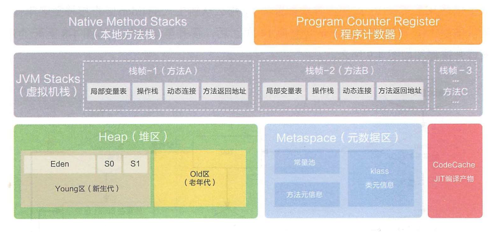

> # JVM第三版部分知识点回顾1-运行时数据区，GC, 记忆集，安全点，安全区域

## 运行时数据区

`先贴张个人觉得比较棒的网络图片,感谢作图人`



这张图是java8之后的运行时数据区，永久代被移除，由元空间替代。

堆和元数据区(以前方法区)是共享的，本地栈，虚拟机栈和程序计数器是线程私有的。

**程序计数器是所有区域中唯一一个不会发生OOM的区域**。

### OOM溢出

#### 堆溢出

相比其他溢出，堆溢出是最常见的，jvm堆内存不够时，即使Full GC之后也无法给新对象分配内存时，OOM.

#### 本地方法栈溢出

当线程方法调用链超过栈容量所能容纳的最大深度时，发生栈溢出异常SOF。

由于《JAVA虚拟机规范》没有明确规定是否允许栈内存动态扩展，但是HotSpot虚拟机采用的是不支持扩展的方式，所以针对于HotSpot虚拟机，栈溢出只有StackOverflow，没有OOM。也就是说栈容量一旦确定，就无法再扩张了。`-Xss`可以指定栈容量。

方法栈中的栈帧实际上是存放的方法调用的链路，最顶上的一帧为当前方法帧，任意时刻都只有最上面的一个方法是活跃的。每一帧都包含`局部变量表`，`操作数栈`，`动态链接`，`方法返回地址`等信息。由于每一个方法的这些信息不一定相同，所占用的大小也就不同，所以在发生栈溢出时，所能达到的深度也就不同。

#### 常量池溢出

JDK6之前，**运行时常量池是方法区的一部分**，`String::intern()`这个方法可以用来检验溢出。

```java
/**
* JDK6之前，设置永久到最大6M
* VM Args： -XX:PermSize=6M -XX:MaxPermSize=6M
* @author zzm
*/
public class RuntimeConstantPoolOOM {
    public static void main(String[] args) {
        // 使用Set保持着常量池引用， 避免Full GC回收常量池行为
        Set<String> set = new HashSet<String>();
        // 在short范围内足以让6MB的PermSize产生OOM了
        short i = 0;
        while (true) {
        set.add(String.valueOf(i++).intern());
        }
    }
}
// 溢出结果
Exception in thread "main" java.lang.OutOfMemoryError: PermGen space
	at java.lang.String.intern(Native Method)
	at org.fenixsoft.oom.RuntimeConstantPoolOOM.main(RuntimeConstantPoolOOM.java: 18)
```

以上代码在JDK6上是可以得到OOM溢出的，溢出结果显示永久代溢出。

在JDK6之后，JDK7,8等更高版本，此溢出不会出现，因为JDK6之后，常量池被移动到了堆上面。所以常量池的溢出和堆大小就息息相关了。

`关于常量池被移动到堆上的有趣小代码`.

```java
public class RuntimeConstantPoolOOM {
    public static void main(String[] args) {
        String str1 = new StringBuilder("计算机").append("软件").toString();
        System.out.println(str1.intern() == str1);
        String str2 = new StringBuilder("ja").append("va").toString();
        System.out.println(str2.intern() == str2);
    }
}
```

这段代码在JDK6上，输出均为false。然而在JDK7上面，结果是true和false.原因就在于常量池被移动到堆上面了。

```
str1和str2两个字符串都是new StringBuilder()创建的，这两个字符串无论在JDK6上还是在JDK7上，都会分配在堆上面.
关键点就在于intern().
由于JDK6时，常量池是在永久代，所以不管是哪个字符串，执行intern()之后，都会把这个字符串放到永久代的常量池，然后返回常量池的地址，所以在JDK6上面str.intern()的地址都是永久代的地址，而str1，和str2都是堆上的地址，所以两个都是false。
JDK7时，由于常量池被移动到了堆上，所以只需要在常量池里记录一下首次出现的实例引用即可， 因此intern()返回的引用和由StringBuilder创建的那个字符串实例就是同一个。而第二个字符串是false是因为java这个字符串并不是第一次出现(JVM启动时就会有这个字符串了)，所以，Stringbuilder new出来的新对象和常量池那个不是同一个对象了。
```

#### 方法区(元空间)溢出

元空间的主要职责是用于存放类型的相关信息， 如类名、 访问修饰符、 常量池、 字段描述、 方法信息等。元空间默认大小为-1，即不受限制，之受限于物理内存大小。

这部分的溢出是类信息过多时才会溢出，所以这部分的溢出一般情况下会出现在 动态代理使用不恰当的时候，比如频繁，大量创建动态类，导致元空间信息溢出。

#### 直接内存溢出

所谓直接内存，就是JVM运行时数据区之外的的内存。所以这部分如果反生内存溢出的一个明显特征，就是dump文件是看不出任何异常的！！！

直接内存（Direct Memory） 的容量大小可通过`-XX： MaxDirectMemorySize`参数来指定， 如果不去指定， 则默认与Java堆最大值（由-Xmx指定） 一致  

`越过了DirectByteBuffer类, 使用Unsafe分配直接内存`

```java
/**
* VM Args： -Xmx20M -XX:MaxDirectMemorySize=10M
* @author zzm
*/
public class DirectMemoryOOM {
    private static final int _1MB = 1024 * 1024;
        public static void main(String[] args) throws Exception {
            Field unsafeField = Unsafe.class.getDeclaredFields()[0];
            unsafeField.setAccessible(true);
            Unsafe unsafe = (Unsafe) unsafeField.get(null);
            while (true) {
            unsafe.allocateMemory(_1MB);
        }
    }
}
// 溢出
Exception in thread "main" java.lang.OutOfMemoryError
	at sun.misc.Unsafe.allocateMemory(Native Method)
	at org.fenixsoft.oom.DMOOM.main(DMOOM.java:20)
```

顺带提一下，DirectByteBuffer分配的直接内存的回收是出现在DirectByteBuffer这个对象会回收时，这个对象分配的所有直接内存都将被回收。

## GC

### 分代收集理论

> 弱分代假说: 绝大多数对象都是朝生夕灭的 
>
> 强分代假说: 熬过越多次垃圾收集过程的对象就越难以消亡 

这两个分代假说共同奠定了多款常用的垃圾收集器的一致的设计原则： 收集器应该将Java堆划分出不同的区域， 然后将回收对象依据其年龄（年龄即对象熬过垃圾收集过程的次数） 分配到不同的区域之中存储,  在Java堆划分出不同的区域之后， 垃圾收集器才可以每次只回收其中某一个或者某些部分的区域——因而才有了“Minor GC”“Major GC”“Full GC”这样的回收类型的划分。

由于分区域之后，会出现跨区的引用，也就是说会出现老年代引用新生代的情况，或者新生代引用老年代的情况.

假如要现在进行一次只局限于新生代区域内的收集（Minor GC） ， 但新生代中的对象是完全有可能被老年代所引用的， 为了找出该区域中的存活对象， 不得不在固定的GC Roots之外， 再额外遍历整个老年代中所有对象来确保可达性分析结果的正确性， 反过来也是一样[3]。 遍历整个老年代所有对象的方案虽然理论上可行， 但无疑会为内存回收带来很大的性能负担。 为了解决这个问题， 就需要对分代收集理论添加第三条经验法则 .

> 跨代引用假说：跨代引用相对于同代引用来说仅占极少数  

根据这条假说，我们就不应再为了少量的跨代引用去扫描整个老年代 ，只需在新生代上建立一个全局的数据结构（ 该结构被称为“记忆集”， Remembered Set） ， 这个结构把老年代划分成若干小块， 标识出老年代的哪一块内存会存在跨代引用 ，这样在进行GC时就可以 针对性的去遍历老年代对象，而不是整个老年代 。

### HotSpot细节

 这里就不讨论`引用计数法`了，直接开始`可达性分析`.

`可达性分析`算法需要从GC Roots集合找引用链 ，固定可作为GC Roots的节点主要在全局性的引用（例如常量或类静态属性） 与执行上下文(例如栈帧中的本地变量表).

尽管目标明确，但是架不住内存过大，扫描起来费时。由于所有收集器的根节点枚举这一步就像算法标记-整理这一步一样，都必须STW。所以当用户线程暂停之后，虚拟机应当是知道那些地方存放了对象引用的。**在HotSpot虚拟机当中，会存在OopMap这样一个数据结构，用来在特定的位置记录下栈里和寄存器里哪些位置是引用**，这样收集器扫描时就可以直接知道这些信息，并不需要一个不漏从GC Root开始扫描。

贴一个官方String::hashCode()代码：

```java
// 可以看到在0x026eb7a9处的call指令有OopMap记录， 
// 它指明了EBX寄存器和栈中偏移量为16的内存区域中各有一个
// 普通对象指针（Ordinary Object Pointer， OOP） 的引用
// 有效范围为从call指令开始直到0x026eb730（指令流的起始位置） +142（OopMap记录的偏移量） =0x026eb7be， 
// 即hlt指令为止
[Verified Entry Point]
0x026eb730: mov %eax,-0x8000(%esp)
…………
;; ImplicitNullCheckStub slow case
0x026eb7a9: call 0x026e83e0 ; OopMap{ebx=Oop [16]=Oop off=142}
                            ; *caload
                            ; - java.lang.String::hashCode@48 (line 1489)
                            ; {runtime_call}
0x026eb7ae: push $0x83c5c18 ; {external_word}
0x026eb7b3: call 0x026eb7b8
0x026eb7b8: pusha
0x026eb7b9: call 0x0822bec0 ; {runtime_call}
0x026eb7be: hlt
```

虽然能解决扫描的问题，但是总不能在每一条指令后面都记录上OopMap吧，如果都记录的话，内存估计也不够用了吧。所以又出现了`安全点`的概念.

### 安全点

在OopMap的协助下， HotSpot可以快速准确地完成GC Roots枚举， 但一个很现实的问题随之而来： 可能导致引用关系变化， 或者说导致OopMap内容变化的指令非常多， 如果为每一条指令都生成对应的OopMap， 那将会需要大量的额外存储空间， 这样垃圾收集伴随而来的空间成本就会变得无法忍受的高昂。

所以虚拟机需要在合适的位置生成OopMap.这些位置就被称之为`安全点`。 安全点的设定决定了用户程序必须在特定位置停下来(STW)，才能进行安全的垃圾回收。

安全点位置的选取基本上是以`是否具有让程序长时间执行的特征`为标准进行选定的， 因为每条指令执行的时间都非常短暂， 程序不太可能因为指令流长度太长这样的原因而长时间执行， “长时间执行”的最明显特征就是指令序列的复用， 例如方法调用、 循环跳转、 异常跳转等都属于指令序列复用， 所以只有具有这些功能的指令才会产生安全点。

####  可数循环

HotSpot虚拟机为了避免安全点过多带来过重的负担， 对循环还有一项优化措施， 认为循环次数较少的话， 执行时间应该也不会太长， 所以使用int类型或范围更小的数据类型作为索引值的循环默认是不会被放置安全点的。 这种循环被称为可数循环（CountedLoop） ， 相对应地， 使用long或者范围更大的数据类型作为索引值的循环就被称为不可数循环
（Uncounted Loop） ， 将会被放置安全点。 通常情况下这个优化措施是可行的， 但循环执行的时间不单单是由其次数决定， 如果循环体单次执行就特别慢， 那即使是可数循环也可能会耗费很多的时间.

#### 如何让用户线程在安全点停下

安全点有了， 现在需要考虑如何让用户线程都在安全点停下，以进行GC.

对于线程的中断有两种方式，`抢先式中断`和`主动式中断`.

`抢先试中断`不需要线程主动配合，直接暂停所有用户线程，然后挨个检查每个线程是否在安全点，如果没有，就放开执行，让他一会儿再重新中断，直到跑到安全点上。

对于抢先式中断，我们的安全点相对于整个指令集来讲，在安全点停下的概率太低了，而且频繁挂起和恢复运行也会消耗掉大量CPU.再着说必须是所有用户线程都停下时才会进行垃圾回收，所以要让所有线程都在安全点中断，所等待的时间(STW)可能会非常长，所以对于抢先式中断，可能不太适合JVM。

`主动式中断`思想是需要中断线程的时候，仅仅设置一个标志位，由线程主动去轮训检查这个标志位，一旦发现中断标志为真时，就在最近的安全点挂起。

**轮训标志的地方和安全点是重合的，也就是说有OopMap的地方一定有一个轮训标志位**

由于轮训操作会在代码运行过程中频繁出现，所以需要要求它非常高效。所以HotSpot虚拟机采用内存陷阱，自陷式异常中断, 看代码解真相。

```java
0x01b6d627: call 0x01b2b210 ; OopMap{[60]=Oop off=460}
                            ; *invokeinterface size
                            ; - Client1::main@113 (line 23)
                            ; {virtual_call}
0x01b6d62c: nop 		   ; OopMap{[60]=Oop off=461}
                            ; *if_icmplt
                            ; - Client1::main@118 (line 23)
0x01b6d62d: test %eax,0x160100 ; {poll}
0x01b6d633: mov 0x50(%esp),%esi		
0x01b6d637: cmp %eax,%esi
```

test指令就是HotSpot生成的轮询指令， 当需要暂停用户线程时， 虚拟机把0x160100的内存页设置为不可读， 那线程执行到test指令时就会产生一个自陷异常信号， 然后在预先注册的异常处理器中挂起线程实现等待， 这样仅通过一条汇编指令便完成安全点轮询和触发线程中断了.

到这里应该明白了为什么轮训标志的地方和安全点是重合的了吧，实际上就是当代码执行刚到安全点的时候，自陷异常如果发生了，就可以直接挂起，这个时刻刚好是在安全点是上。

那新的问题又来了，那如果在GC标志位设置后，某些线程一直在Sleep或者被阻塞等待情况下，无法执行到安全点停下，那怎么办？那这个时候就需要安全区域了。

#### 安全区域

如果用户线程处于Sleep状态或者Blocked状态， 这时候线程无法响应虚拟机的中断请求， 不能再走到安全的地方去中断挂起自己， 虚拟机也显然不可能持续等待线程重新被激活分配处理器时间。 对于这种情况， 就必须引入安全区域（Safe Region） 来解决。  

**安全区域是指能够确保在某一段代码片段之中， 引用关系不会发生变化， 因此， 在这个区域中任意地方开始垃圾收集都是安全的。 我们也可以把安全区域看作被扩展拉伸了的安全点** 。

当用户线程执行到安全区域里面的代码，或者进入sleep状态，block状态等时， 首先会标识自己已经进入了安全区域， 那样当这段时间里虚拟机要发起垃圾收集时就不必去管这些已声明自己在安全区域内的线程了。 当线程要离开安全区域时， 它要检查虚拟机是否已经完成了根节点枚举（或者垃圾收集过程中其他需要暂停用户线程的阶段） ， 如果完成了， 那线程就当作没事发生过， 继续执行； 否则它就必须一直等待， 直到收到可以离开安全区域的信号为止。  

### 记忆集与卡表，写屏障

记忆集是由卡表来实现的，对于卡表的结构就不过多解释了，这个自行网上查阅相关信息，你可以直接把他想象成map.

记忆集用来记录跨代引用的对象数据，那谁来更新这个卡表呢？那就是写屏障(Write Barrier)。

**写屏障可以看作在虚拟机层面对“引用类型字段赋值”这个动作的AOP切面， 在引用对象赋值时会产生一个环形（Around） 通知， 供程序执行额外的动作， 也就是说赋值的前后都在写屏障的覆盖范畴内。 在赋值前的部分的写屏障叫作写前屏障（Pre-Write Barrier） ， 在赋值后的则叫作写后屏障（Post-Write Barrier）**

HotSpot虚拟机的许多收集器中都有使用到写屏障， 但直至G1收集器出现之前， 其他收集器都只用到了写后屏障。

```c
// 写后屏障更新卡表简化逻辑
void oop_field_store(oop* field, oop new_value) {
    // 引用字段赋值操作
    *field = new_value;
    // 写后屏障， 在这里完成卡表状态更新
    post_write_barrier(field, new_value);
}
```

### 并发的可达性分析

可达性分析中，JVM使用OopMap来优化GC Root根对象的遍历。

GC“标记”阶段是所有追踪式垃圾收集算法的共同特征， 如果这个阶段会随着堆变大而等比例增加停顿时间， 其影响就会波及几乎所有的垃圾收集器， 同理可知， 如果能够削减这部分停顿时间的话， 那收益也将会是系统性的 。想解决或者降低用户线程的停顿， 就要先搞清楚为什么必须在一个能保障一致性的快照上才能进行对象图的遍历,为了解释这个问题，需要引入三色标记。

具体细节请看下一章，这章太多了。。。下一章将继续介绍三色标记，以及CMS和G1对于三色标记处理的区别，java的三色标记和golang的三色标记的区别。、

## 总结

以上介绍了记忆集和OopMap,这两者都是为了避免直接扫描GCRoot而做的优化措施。相信很多朋友对这两个已经云里雾里了。这里总结一下这两者的区别。

```
记忆集: 用卡表实现，存储的是跨代引用的对象信息，用于分代回收时确定哪些对象存在跨代引用。
OopMap: 用在特定位置记录栈，寄存器上面哪些地方是对象引用；同时也用来标识当前是安全点，并紧跟test自陷指令，在GC时暂停用户线程
```


over~~