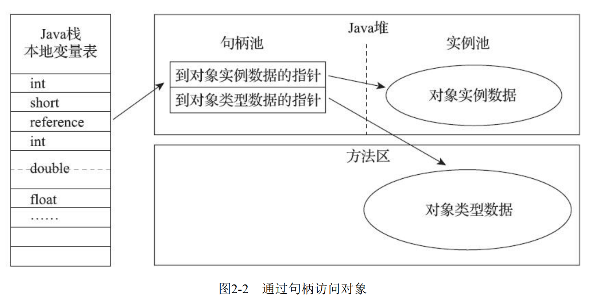
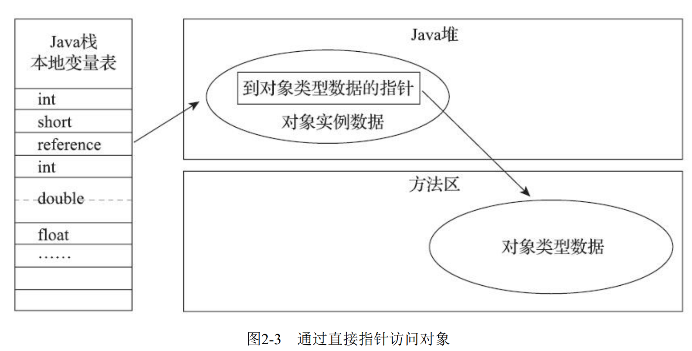
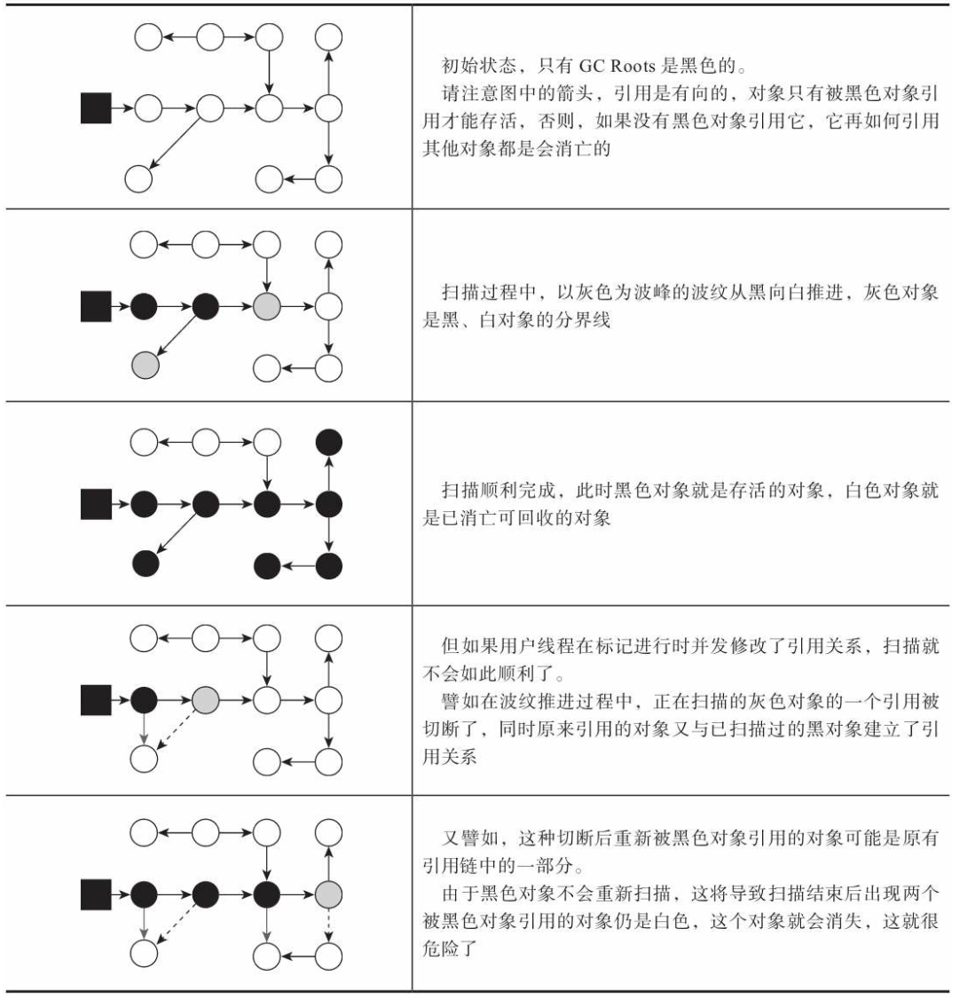

> # JVM第三版部分知识点回顾2-内存分配，三色标记

## 内存分配与访问

开始之前先补充一下上一节漏掉的内存分配。

java对象所需内存的大小在类加载完成后便可完全确定 ，为对象分配空间的任务实际上便等同于把一块确定大小的内存块从Java堆中划分出来 。

> 指针碰撞

假设Java堆中内存是绝对规整的， 所有被使用过的内存都被放在一边， 空闲的内存被放在另一边， 中间放着一个指针作为分界点的指示器， 那所分配内存就仅仅是把那个指针向空闲空间方向挪动一段与对象大小相等的距离， 这种分配方式称为`指针碰撞`（Bump ThePointer）

>  空闲列表

但如果Java堆中的内存并不是规整的， 已被使用的内存和空闲的内存相互交错在一起， 那就没有办法简单地进行指针碰撞了， 虚拟机就必须维护一个列表， 记录上哪些内存块是可用的， 在分配的时候从列表中找到一块足够大的空间划分给对象实例， 并更新列表上的记录， 这种分配方式称为`空闲列表`（Free List）   

所以选择哪种分配方式由Java堆是否规整决定， 而Java堆是否规整又由所采用的垃圾收集器是否带有空间压缩整理（Compact） 的能力决定。 因此， 当使用Serial、 ParNew等带压缩整理过程的收集器时， 系统采用的分配算法是指针碰撞， 既简单又高效； 而当使用CMS这种基于清除（Sweep） 算法的收集器时， 理论上就只能采用较为复杂的空闲列表来分配内存 。

### TLAB(本地线程分配缓冲区)

对象创建在虚拟机中是非常频繁的行为， 即使仅仅修改一个指针所指向的位置， 在并发情况下也并不是线程安全的 。比如说A线程和B线程都在同时分配，那么并发时A和B拿到的是相同的地址，这样AB线程分配就会出现问题。所以在分配时就需要进行同步锁定。

JVM解决这个问题用了两种方案，一种是CAS，一种是TLAB。

虚拟采用CAS方法加上失败重试，保证操作原子性，但是每个对象的分配都需要加锁，会很耗时，所以在CAS的基础上又使用了TLAB。**哪个线程要分配内存，就预先分配一小部分内存，称为本地线程TLAB(分配缓冲区)**，只有TLAB用完时，分配新的缓冲区时才进行同步锁定。虚拟机是否使用TLAB， 可以通过-XX： +/-UseTLAB参数来设定。  

>  TIPS: 
>
> 其实TLAB这种方式有点类似于伙伴算法中的分配方式哦

### 访问定位

对象被分配了， 如何定位呢？

对于对象的定位，主流有两种方式，一种是对象句柄，一种是直接指针。

#### 对象句柄

如果使用句柄访问的话， Java堆中将可能会划分出一块内存来作为句柄池， reference中存储的就是对象的句柄地址， 而句柄中包含了对象实例数据与类型数据各自具体的地址信息 。

`有图有真相`



使用句柄来访问的最大好处就是reference中存储的是稳定句柄地址， 在对象被移动（垃圾收集时移动对象是非常普遍的行为） 时只会改变句柄中的实例数据指针， 而reference本身不需要被修改  

#### 直接指针

使用直接指针访问的话， Java堆中对象的内存布局就必须考虑如何放置访问类型数据的相关信息， reference中存储的直接就是对象地址， 如果只是访问对象本身的话， 就不需要多一次间接访问的开销  

`有图有真相`



使用直接指针来访问最大的好处就是速度更快， 它节省了一次指针定位的时间开销， 由于对象访问在Java中非常频繁， 因此这类开销积少成多也是一项极为可观的执行成本，在HotSpot虚拟机中，就是采用的指针访问的方式。

## 三色标记

正片开始,先贴个图。



### 概念

上面的图其实已经很明显了，说的简单点就是，一直递归遍历灰色对象(只会遍历灰色，黑色不会遍历)，把灰色对象置黑，把灰色对象引用到的白色对象置灰, 如此循环往复，直到没有灰色对象可遍历，此时剩下的白色对象就是垃圾。

由于CMS和G1在进行并行标记的时候，是和用户线程同时进行的,这样的话就会出现引用变化，对象新建的情况。收集器在对象图上标记颜色， 同时用户线程在修改引用关系——即修改对象图的结构， 这样可能出现两种后果。 一种是把原本消亡的对象错误标记为存活，这不是好事， 但其实是可以容忍的， 只不过产生了一点逃过本次收集的`浮动垃圾`而已， 下次收集清理掉就好。 另一种是把原本存活的对象错误标记为已消亡， 这就是非常致命的后果了  

这种问题产生的条件，java原话如下：

```
赋值器插入了一条或多条从黑色对象到白色对象的新引用;
赋值器删除了全部从灰色对象到该白色对象的直接或间接引用;
```

于是，Java中要解决并发扫描时的对象消失问题， 只需破坏这两个条件的任意一个即可。 由此分别产生了两种解决方案： 增量更新（Incremental Update） 和原始快照（Snapshot At The Beginning，SATB）  

### CMS+增量更新

CMS收集器使用的就是增量更新。

增量更新要破坏的是第一个条件， 当黑色对象插入新的指向白色对象的引用关系时， 就将这个新插入的引用记录下来， 等并发扫描结束之后， 再将这些记录过的引用关系中的黑色对象为根， 重新扫描一次。 这可以简化理解为， **黑色对象一旦新插入了指向白色对象的引用之后， 它就变回灰色对象了 **。

**增量更新是不会产生`由于引用改变而产生的浮动垃圾`，但是速度慢**。

为什么这里要强调是由于引用改变而产生的浮动垃圾，因为浮动垃圾并不止这一点。

在CMS的并发标记和并发清理阶段， 用户线程是还在继续运行的， 程序在运行自然就还会伴随有新的垃圾对象不断产生， 但这一部分垃圾对象是出现在标记过程结束以后， CMS无法在当次收集中处理掉它们， 只好留待下一次垃圾收集时再清理掉。 这一部分垃圾就称为“浮动垃圾”  

CMS是没办法处理这部分浮动垃圾的，所以才会出现，如果在收集过程当中，产生的新对象把整个堆占完时，出现“Con-current Mode Failure”失败进而导致另一次完全“Stop The World”的Full GC的产生。    

### G1+SATB

G1收集器使用的就是SATB。

原始快照要破坏的是第二个条件， 当灰色对象要删除指向白色对象的引用关系时， 就将这个要删除的引用记录下来， 在并发扫描结束之后， 再将这些记录过的引用关系中的灰色对象为根， 重新扫描一次。 这也可以简化理解为， **无论引用关系删除与否， 都会按照刚刚开始扫描那一刻的对象图快照来进行搜索**

如果某个白色对象在GC标记过程中已经失去了所有对它的引用链，那么这个白色对象应该当成垃圾回收，但是由于使用的是STAB，所有在STAB中如果存在灰色对象对它的引用， 它都将不会被回收，这也是STAB和增量更新的区别。

**STAB会产生`由于引用改变而产生的浮动垃圾`，但是速度快**。

### golang三色标记

**golang与java的三色标记第一个区别是: golang初始状态所有节点都是白色，而java的GC Root是黑色**。

在golang中，把原本存活的对象错误标记为已消亡的条件：

```
条件1: 黑色对象引用了白色对象
条件2: 该白色对象没有被其他灰色对象引用，或者其他灰色对象与该白色对象的可达关系遭到破坏
```

熟悉吧，只是描述变了，他其实和java中的两个条件是一模一样的意思。

在golang中针对此问题处理两种术语来解释和解决这个问题。

```
强三色不变性: 黑色节点不允许引用白色节点,破坏了条件1
弱三色不变性: 黑色节点允许引用白色节点，但是该白色节点必须有其他灰色节点到它的引用或间接引用,破坏了条件2
```

熟悉吧。

其实增量更新就是和强三色不变性一样的意思，只不过java里面是将原黑色对象变为灰色，gloang里面是将白色对象变成灰色。**这是golang和java三色标记的第二个区别**。

STAB就类似于弱三色不变性，即主要目的就是保留一条到灰色节点到白色节点的引用。

### 三色标记思考进阶版

此想法仅限于个人思考，针对于java和golang的三色标记的研究之后，得出的一个最终结论。

**白色节点会被当成垃圾的情况只有当这个白色节点失去所有灰色引用，并且被挂到一个黑色引用上时，才会被误标记为垃圾对象，因为有灰色引用到白色时，白色对象必不可能成为垃圾对象**。

所以我先给出一个定义`孤儿节点`: 就是失去了所有引用的老对象，或者新建对象这两者在没有建立起有效的引用链之前，我称其为孤儿节点。

通过java和golang对三色标记的分析，以及产生条件，解决方式来深入分析，以及上面黑体字的表述，我们可以把所有条件都归结于一种情况，那就是产生孤儿节点的处理情况，因为只有产生孤儿节点，才有可能出现被标记为垃圾对象的可能。

对于老对象而言，我们来看一下java和golang用来破坏第二个条件所使用的方法，首先在java中，当引用链发生变化时，使用原始快照，实际上就是保留了一条灰色引用，这种情况下，白色节点不会被当成垃圾。golang中使用弱三色不变性，也就是说这个白色节点必须有其他的灰色引用直接或间接的指向它。说的直接点，对于这两种方式，目的都很明确，白色节点必须有灰色对象引用它，这种情况下本身就会被扫描，白色对象不会别标记成垃圾，因为白色对象不是`孤儿节点`，始终都默认有至少一条灰色引用链指向它。

如果老对象白色节点直接丢失了所有连接，变成了`孤儿节点`，那么实际情况就和条件一相符合了，所以总体来讲，任何条件都可以当成是条件1,或者变成条件1.

所以在整个标记过程中，我们只需要处理黑色节点关联孤儿节点的情况，因为只有黑色节点关联孤儿节点才会导致孤儿节点误标记为垃圾对象。

所以问题就直接回到了破坏条件1，要么把黑色节点置灰(java)，要么把白色节点置灰(golang)。


over~~