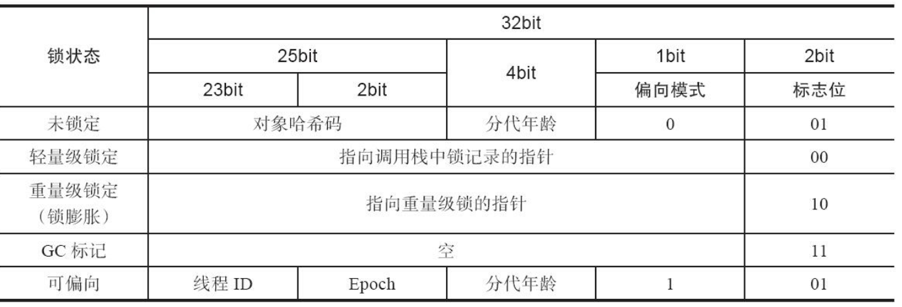
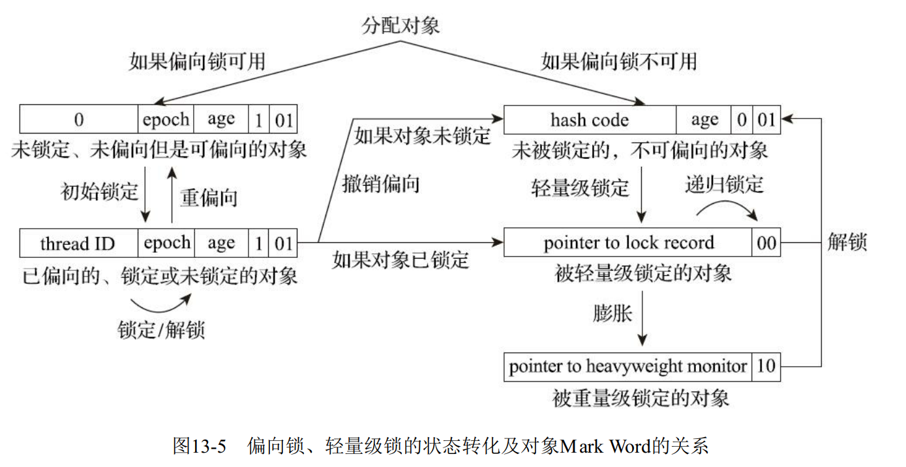
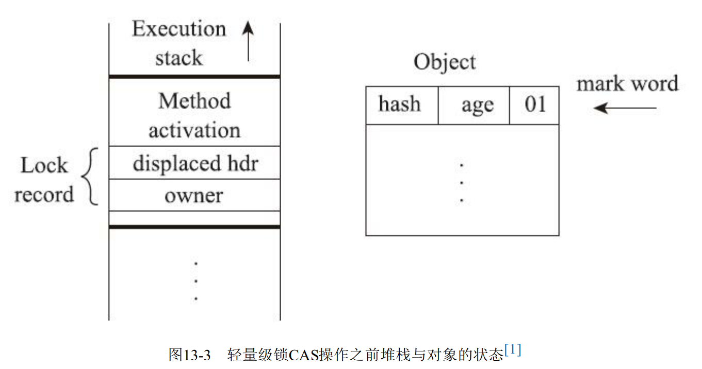

> # JVM第三版部分知识点回顾3-(TCCL)线程上下文加载器，锁升级，锁降级

## TCCL

TCCL(Threadlocal Context ClassLoader )线程上下文加载器.

TCCL实际上是由于java双亲委派模型存在缺陷，而诞生的破坏双亲委派机制的产物。为什么会有这玩意儿？

我们都知道java里面类加载器的双亲委派机制逻辑是优先父类加载，如果父类加载不了，才由子类加载，这样是为了保证一个类在这个应用程序中只被加载一次，防止多次加载而造成的类不一致(类相同的条件必须是类加载器相同且类全限定类名相同).

在java中，越基础的类，就由越上层的类加载器来加载，并且，通常来讲当前类引用的其他类都将由当前类的类加载器来进行加载。但是这样会出现一个问题，当出现反向调用的时候怎么办？也就是说当java的基础类调用到用户类的时候怎么办？因为java的基础类都是java上层类加载器加载的，到那时用户类是由系统加载器（AppClassLoader）来加载的，但是上层类加载器无法加载用户类，所以为了解决这个问题，就出现了TCCL.

反向调用比如说java的SPI，Java中涉及SPI的加载基本上都采用这种方式来完成， 例如JNDI、JDBC、 JCE、 JAXB和JBI等 。

SPI:JDK6提供了java.util.ServiceLoader类， 以META-INF/services中的配置信息， 辅以责任链模式加载对应类。

> TIPS
>
> 针对于JDBC的加载来分析TCCL，建议大家参考以下博客，只能说很细，我甚是喜欢，所以推荐给大家看一看:https://blog.csdn.net/yangcheng33/article/details/52631940 

## 锁升级

锁升级其实是基于sychronized的一种优化，锁升级指的是偏向锁，轻量级锁，重量级锁的膨胀过程。

### 对象头(Mark Word)

java的每个对象都有一个对象头，这也是为什么每一个java对象都能成为一把锁的原因。对象头里面包含很多信息，包括对象类型地址指针，分代年龄，锁标志位等信息。

`先来一张图压压惊`



### 偏向锁

它的意思是这个锁会偏向于第一个获得它的线程， 如果在接下来的执行过程中， 该锁一直没有被其他的线程获取， 则持有偏向锁的线程将永远不需要再进行同步 。

偏向锁请看对象头图最后一行。

当虚拟机启用了偏向锁，那么当锁对象第一次被线程获取的时候， 虚拟机将会把对象头中的标志位设置为“01”、 把偏向模式设置为“1”， 表示进入偏向模式。 同时使用CAS操作把获取到这个锁的线程的ID记录在对象的Mark Word之中。 如果CAS操作成功， 持有偏向锁的线程以后每次进入这个锁相关的同步块时， 虚拟机都可以不再进行任何同步操作 。

一旦出现另外一个线程去尝试获取这个锁的情况， 偏向模式就马上宣告结束。 根据锁对象目前是否处于被锁定的状态决定是否撤销偏向（偏向模式设置为“0”） ， 撤销后标志位恢复到未锁定（标志位为“01”） 或轻量级锁定（标志位为“00”） 的状态。竞争存在，锁升级为轻量级锁。



当对象进入偏向状态的时候， Mark Word大部分的空间（23个比特） 都用于存储持有锁的线程ID了， 这部分空间占用了原有存储对象哈希码的位置， 那原来对象的哈希码怎么办呢 ?这个地方就贴上专业的话术吧。

```
在Java语言里面一个对象如果计算过哈希码， 就应该一直保持该值不变（强烈推荐但不强制， 因
为用户可以重载hashCode()方法按自己的意愿返回哈希码） ， 否则很多依赖对象哈希码的API都可能存
在出错风险。 而作为绝大多数对象哈希码来源的Object::hashCode()方法，返回的是对象的一致性哈希
码（Identity Hash Code） ， 这个值是能强制保证不变的， 它通过在对象头中存储计算结果来保证第一
次计算之后， 再次调用该方法取到的哈希码值永远不会再发生改变。 因此， 当一个对象已经计算过一
致性哈希码后，它就再也无法进入偏向锁状态了； 而当一个对象当前正处于偏向锁状态， 又收到需要
计算其一致性哈希码请求[注意]时， 它的偏向状态会被立即撤销， 并且锁会膨胀为重量级锁。 在重量级锁
的实现中， 对象头指向了重量级锁的位置， 代表重量级锁的ObjectMonitor类里有字段可以记录非加锁
状态（标志位为“01”） 下的Mark Word， 其中自然可以存储原来的哈希码.

注意: 这里说的计算请求应来自于对Object::hashCode()或者System::identityHashCode(Object)方法的
调用， 如果重写了对象的hashCode()方法， 计算哈希码时并不会产生这里所说的请求。
```

### 轻量级锁

在代码即将进入同步块的时候， 如果此同步对象没有被锁定（锁标志位为“01”状态） ， 虚拟机首先将在当前线程的栈
帧中建立一个名为锁记录（Lock Record） 的空间， 用于存储锁对象目前的Mark Word的拷贝（官方为这份拷贝加了一个Displaced前缀， 即Displaced Mark Word）。



然后， 虚拟机将使用CAS操作尝试把对象的Mark Word更新为指向Lock Record的指针。 如果这个
更新动作成功了， 即代表该线程拥有了这个对象的锁， 并且对象Mark Word的锁标志位（Mark Word的
最后两个比特） 将转变为“00”， 表示此对象处于轻量级锁定状态 。这个时候Lock record和Displased Mark Word互相指向对方。

解锁过程：如果对象的Mark Word仍然指向线程的锁记录， 那就用CAS操作把对象当前的Mark Word和线程中复制的DisplacedMark Word替换回来。 假如能够成功替换， 那整个同步过程就顺利完成了； 如果替换失败， 则说明有其他线程尝试过获取该锁， 就要在释放锁的同时， 唤醒被挂起的线程 。

**在上锁的过程当中，如果上锁失败，会产生自旋(挣扎一下，毕竟锁升级不可逆)，然后重试CAS，如果自旋一定次数都失败之后，就会膨胀成重量级锁**。

### 重量级锁

当锁升级到重量级锁时，对象头中的指针指向Monitor对象，重入次数由`monitor`对象中的`_recursions`字段来记录。

在重量级锁中，也会存在自旋操作，这个自旋操作也是尝试获取锁，如果自旋多次也没有获取到锁，就会将当前线程挂起。

### 自旋锁

自旋锁也是java对sychronized的一个优化，自旋存在于两个地方：

```
1. 轻量级锁膨胀到重量级锁的时候
2. 重量级锁再挂起线程的时候
```

第一个，因为锁升级是不可逆的，而重量级锁的消耗是很大的，所以jvm在进行锁升级的时候，其实是也是能不升级到重量级就不升级到重量级，所以在轻量级锁到重量级锁的膨胀过程中，会自旋一定的次数，来挣扎一下，然后重新尝试CAS，如果超过最大自旋次数都无法获取锁，才升级到重量级锁。

第二个，因为线程的挂起和恢复是非常消耗CPU的，所以重量级锁在需要挂起线程时，会尝试进行中自旋，等待一定时间，然后再获取锁，如果这个时候获取到了锁，就减少了CPU挂起和恢复线程的开销。

自旋虽然能在某种情况下减小CPU的开销，那如果一直自旋，一直都拿不到锁，那这个开销可能就得不偿失了，还不如直接挂起线程。

所以针对这个问题，在JDK某个版本之后，JVM就变聪明了，自旋次数是由JVM自适应的(之前是手动指定)。**比如说某个线程在自旋后能够成功拿到锁，那么JVM会认为在下次执行的时候，获得锁的概率会比较大，会适应性增加这个线程的自旋次数。那相对的，如果某个线程在自旋很多次之后都没有获得锁，那么JVM会认为这个线程获取锁的概率较小，会适应性减少这个线程下次的自旋次数**。

> TIPS
>
> 针对锁升级，对象头，monitor的相关知识，建议大家参考以下博客，只能说很细，我甚是喜欢，所以推荐给大家看一看:https://blog.csdn.net/zwjyyy1203/article/details/106217887

## 锁降级

前面说了锁升级，也说了锁升级不可逆，这里又来谈锁降级，这是个什么操作？

实际上只是针对性来和之前你的锁升级来进行一个区分，加深一下理解，避免混淆这两个概念。

锁降级实际上指的是读写锁的锁降级，和JVM的sychronized没有一点关系了。

**锁降级：是指获取到当前的写锁，再获取读锁，随后释放写锁的过程。为了保证获取到读锁时读取的数据不会被其他线程篡改**。

**锁降级顺序必须是: 获取写锁 --> 获取读锁 --> 释放写锁**。

为什么要这样子？先来看下读写锁的特性。

```
写锁: 独占，其他线程不能获取读锁，也不能获取写锁
读锁: 其他线程可获取读锁，不能获取写锁
```

**也就是说当前线程无论拥有那个锁，其他线程都不能获取读锁**。那为什么还需要锁降级呢？来看非锁降级时的读锁获取流程。


获取写锁 --> 释放写锁 --> 获取读锁

此种情况可以理解为竞争了，在写锁释放之后，读锁获取之前存在一个无锁空档期，无法保证这个空档期没有其他线程优先获取到写锁对数据进行了修改，那这个时候当前线程再获取到读锁是，使用的数据就是其他线程篡改过后的值了;而锁降级就是为了保证当前线程读取的值不会被其他线程篡改。

>  现在再来理解一下锁降级的顺序: 

先获取写锁，独占;再获取读锁，再释放写锁，整个过程中，当前线程都持有锁, 其他线程就无法获取写锁，也就无法篡改数据。所以说直白点就是整过过程中当前线程都持有锁，没有一个空档期留给其他线程获取写锁来篡改数据。

## HelpGC是否还有意义？

我们在java代码中，会看到`// help gc`的注释。这个注释出现的行通常是将某个对象赋值为null。

为什么以前会有这种操作？我们来看一下以下代码。

```java
// 代码片段1
public static void main(String[] args)() {
    {
    	byte[] placeholder = new byte[64 * 1024 * 1024];
        // placeholder = null; //注释1
    }
    // int a=0; // 注释2
    System.gc();
}
```

placeholder的作用域被限制在花括号以内， 从代码逻辑上讲， 在执行System.gc()的时候， placeholder已经不可能再被访问了， 但执行这段程序，你可能会发现placeholder使用的内存并没有被回收。

如果我们放开注释1或者注释2，placeholder占用的内存会被正常回收。placeholder能否被回收的根本原因就是： 局部变量表中的变量槽是否还存有关于placeholder数组对象的引用 。如果不放开注释，那么代码虽然已经离开了placeholder的作用域， 但在此之后， 再没有发生过任何对局部变量表的读写操作， placeholder原本所占用的变量槽还没有被其他变量
所复用， 所以作为GC Roots一部分的局部变量表仍然保持着对它的关联，所以不会被回收。

我们使用`a=0`复用变量槽或者使用`placeholder = null`来切断GC Root中一部分变量对它的引用，就会导致它被正常回收。

那实际上这种赋值为null的操作有实际意义吗？只能说在某些极端情况下还是有存在的意义的，但是不建议作为一个编码规范来要求自己。

说道这里就需要跟大家普及一下Java到底是编译型语言还是解释型语言了。对于这个问题，需要站在不通的角度来考虑，首先对于java文件来讲，java文件是被编译成class文件，在这个阶段我们可以认为java是编译型的。然后是JVM执行阶段，我们知道JVM实际上是读取class文件内容，一行一行解释执行的，所以在JVM这个层面，java又是解释型语言。最后如果代码执行评率太高，被JIT编译成机器码，那这部分代码的执行又回到了编译性语言。

好了，在理解了java的运行特征以及解释型，编译型混合运行之后，我们再来看待上面这个问题。

当虚拟机使用解释器执行时， 通常与概念模型还会比较接近， 但经过即时编译器施加了各种编译优化措施以后， 两者的差异就会非常大， 只保证程序执行的结果与概念一致。 在实际情况中，**即时编译才是虚拟机执行代码的主要方式， 赋null值的操作在经过即时编译优化后几乎是一定会被当作无效操作消除掉的**， 这时候将变量设置为null就是毫无意义的行为，也就是说写了等于没写。所以说，JIT使得`变量=null`赋值操作来`help gc`变得毫无意义。
经过即时编译后，上面代码即使没有放开注释，System.gc()执行时也可以正确地回收内存。

> TIPS
>
> 此节参考JVM第三版 8.2.1章节


over~~
