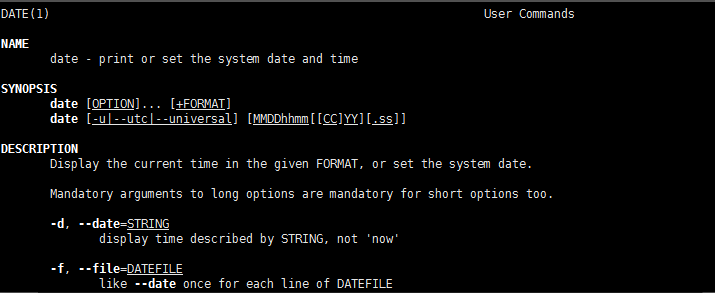
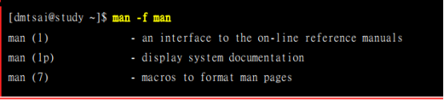

> # Linux(一)

> 参考书：鸟哥Linux私房菜-第四版
>
> 4.3 Linux的在线求助man page与info page

## man

man: manual(操作说明)的简写。作用是查看某个文件或者指令的文档，操作手册，q退出

> eg:man date



`上图中的DATE(1),date指的是date指令，后边的1指“一般用户可使用指令”，还有其他如下`：

```properties
[1]:用户在shell环境中可以操作的指令或可执行文件;
[2]:系统核心可呼叫的函数与工具等;
[3]:一些常用的函数（function）与函数库（library），大部分为c的函数库（libc）;
[4]:装置文件说明，通常在/dev下的文件;
[5]:配置文件或是某些文件的格式;
[6]:游戏（games）;
[7]:惯例与协议等，例如Linux文件系统、网络协议、ASCII code等等的说明;
[8]:系统管理员可用的管理指令;
[9]:跟kernel有关的文件。
```

> Man page主要分为以下几个部分

```properties
name: 简短的指令、数据名称说明;
SYNOPSIS: 简短的指令下达语法syntax简介;
DECRIPTION: 较为完整的说明，这部分最好仔细看看;
OPTIONS: 针对SYNOPSIS部分中，有列举的所有可用的选项说明;
COMMANDS: 当这个程序（软件）在执行的时候，可以在此程序（软件）中下达的指令;
FILES: 这个程序或数据所使用或参考或连结到的某些文件;
SEE ALSO: 可以参考的，跟这个指令或数据有关的其他说明;
EXAMPLE: 一些可以参考的范例。
```

> 常用基本操作

```properties
space:向下翻一页
[page down]: 向下翻一页
[page up]: 向上翻一页
[home]: 去到第一页
[end]: 去最后一页
/string: 向下搜索string
?string: 向上搜索string
n,N: 搜索字符串时用来继续下一个搜索，n与N互为反向
q: 退出
```

man page的数据通产放在/usr/share/man这个牡蛎里，可以通过修改man page搜索路径来修改这个目录，修改/etc/man_db.conf(有的版本为man.conf或manpath.conf或man.config)即可

-f 参数用来查找可用的指令或文件说明手册，并可用数字查看指定文档，如图所示。不加任何参数时默认查找第一个，搜寻的顺序记录在在配置文件/etc/man_db.conf中。




-k 指令或文件模糊搜索


相关指令：


## Info

Linux提供了在线求助的方法，就是info。基本上info与man的用途其实差不多，都是用来查询指令的用法或者文件的格式。但是与man page一口气输出一堆信息不同的是，info page则是将问价拿数据拆成一个一个的段落，每个段落用自己的页面离职钻屑，并且在各个页面中海油类似网页的“超链接”来跳到各不同的页面中，每个独立的页面也被称为一个节点(node)。info指令的文件时默认放在/usr/share/info/目录当中的。

```properties
File: 代表这个info page的资料是来自info.info文件所提供的的;
Node: 代表目前的这个页面时属于TOP节点。意思是info.info内含有很多信息，而Top仅是info.info文件内的一个节点内容而已；
Next: 下一个节点的名称为Getting Started，按“N”进入下个节点；
Up: 回到上一层的节点总览画面，按“U”回到上一层；
Prev: 前一个节点，按“P”进入上一个节点
```

`图解命令如下`


> 常用基本操作

```properties
space:向下翻一页
[page down]: 向下翻一页
[page up]: 向上翻一页
[tab]: 在node之间移动，有node的地方，通常会以*显示
[enter]: 当光标在node上面时，按下enter可以进入该node
b: 移动光标到该info画面当中的第一个node处
e: 移动光标到该info画面当中的最后一个node处
n: 前往下一个node处
p: 前往上一个node处
u: 向上移动一层
s(/): 在info当中进行搜索
h,?: 显示求助菜单
q: 退出
```

## 其他有用的文档(documents)

并不是每个东西都需要做成联机帮助文件，还有相当多的说明需要额外的文件，某些软件还会有一些相关的原理说明。这些说明文件就是documents

存放位置/usr/share/doc/

over~~

