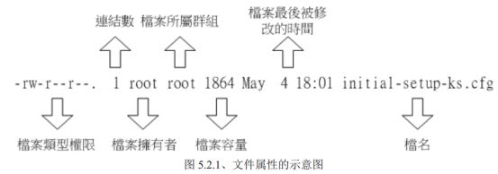
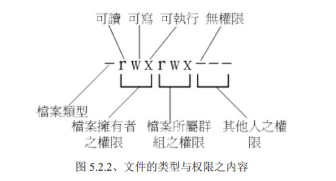
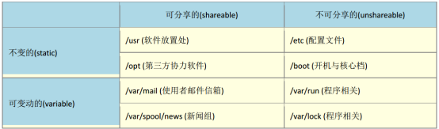
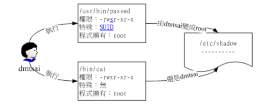

> # Linux(二)

> 参考书：鸟哥Linux私房菜-第四版
>
> 5.2  Linux文件权限概念
>
> 6. Linux文件与目录管理

# Linux文件权限概念

> 列出文件

```shell
[root@node1 ~]# ls -al
total 48
dr-xr-x---.  4 root root      4096 5月  18 06:45 .
dr-xr-xr-x. 17 root root      4096 12月  5 2020 ..
-rw-------.  1 root root      1138 12月  5 2020 anaconda-ks.cfg
-rw-------.  1 root root      2582 3月  21 01:53 .bash_history
-rw-r--r--.  1 root root        18 12月 29 2013 .bash_logout
-rw-r--r--.  1 root root       176 12月 29 2013 .bash_profile
-rw-r--r--.  1 root root       303 5月  18 06:45 .bashrc
-rw-r--r--.  1 root root       100 12月 29 2013 .cshrc
[root@node1 ~]#
```

```properties
## 以上其中最后一行解释
-rw-r--r--: 权限
1: 连接数
root: 拥有者
root: 群组
100: 文件大小
12月 29 2013: 修改日期
.cshrc: 文件名
```

## 文件权限





> 第一个字符代表这个文件是“目录、文件或链接问价你等等”:

```
[d]: 目录
[-]: 文件
[l]: 链接档(link file)
[b]: 表示为装置文件里面的可供存储的接口设备(可随机存取装置)
[c]: 表示装置文件里面的串行端口设备，例如键盘、鼠标(一次性读取装置)
```

## 修改文件的属性和权限

```properties
chgrp: 改变文件所属群组
chown: 改变文件拥有者
chmod: 概念文件的权限，SUID，SGID，SBIT等等的特效
[-R]参数: 递归执行，当前目录及其子目录、文件
```

> 数字改变文件权限

`直接把每种身份的权限rwx看成二进制，rwx=111=7`

```
每种身份(owner/group/others)各自的三个权限(r/w/x)分数是需要累加的，例如当权限为：【-rwxrwx---】分数则是：
owner = rwx = 4+2+1 = 7
group = rwx = 4+2+1 = 7
others = --- = 0+0+0 = 0
所以权限为770，chmod 770 [filename].
```

> 符号改变文件权限

```properties
## 身份
[u]: user
[g]: group
[o]: others
[a]: all(user&group&others),默认是a，此参数可以省略，chmod +x aa.txt
## 操作符
+: 增加权限
-: 移除权限
=: 设置权限
## 权限
r: 读
w: 写
x: 可执行
```

```shell
[root@node1 text]# ll
总用量 0
-rw-r--r--. 1 root root 0 7月   5 01:22 aa.txt
[root@node1 text]# chmod u=rwx,g=r,o=rw aa.txt 
[root@node1 text]# ll
总用量 0
-rwxr--rw-. 1 root root 0 7月   5 01:22 aa.txt
[root@node1 text]# 
```

```
[w]: 该权限对文件夹来讲如下：
建立新的文件与目录
删除已经存在的文件与目录(不论文件的权限为何)
将已经存在的文件或目录进行更名
搬移该目录内的文件、目录位置
```

**注意：如果用户对某个文件夹具有w权限，那么该用户是可以删除该文件夹下的文件的，即使没有文件的rwx权限！**

`演示: 在没有文件夹内的文件权限的情况下，直接删除文件`

```shell
[wangtao@node1 ~]$ ll
总用量 0
drwxrwxr-x. 2 wangtao wangtao 19 7月   5 01:27 abc  
[wangtao@node1 ~]$ cd abc/
[wangtao@node1 abc]$ ll
总用量 0
----------. 1 root root 0 7月   5 01:27 11.txt
[wangtao@node1 abc]$ cat 11.txt 
cat: 11.txt: 权限不够
[wangtao@node1 abc]$ rm -rf 11.txt
[wangtao@node1 abc]$ ll
总用量 0
[wangtao@node1 abc]$ 
```

## Linux目录配置

FHS(Filesystem Hierarchy Standard)依据文件系统使用的频繁与否与是否允许使用者随意变动，而降目录定义撑死中交互作用的形态，有点像下边这样：



```properties
可分享的: 可以分享给其他系统挂载使用的目录，所以包括执行文件与用户的邮件等数据，是能够分享给网络上其他主机挂载用的目录；
不可分享的: 自己机器上面运作的装置文件或者是与程序有关的socket文件等，由于仅与自身机器有关，所以当然就不适合分享给其他主机了。
不变的: 有些数据是不会经常变动的，跟随者distribution儿不变动。例如函数库，文件说明文件，系统管理员所管理的主机配置服务文件等等；
可变动的: 经常改变的数据，例如登录文件，一般用户可自行收受的新闻组等
```

`事实上，FHS针对目录树架构仅定义出三层目录底下应该放置什么数据而已，分别是如下三个目录定义`

```properties
/(root,根目录): 与开机系统有关;
/usr(unix sorftware resource): 与软件安装/执行有关;
/var(variable): 与系统运作过程有关
```

越大的分区槽会放入越多的数据，如此一来目录所在分区槽就可能会有较多发生错误的机会，因此根目录(/)所在分区槽应该越小越好，且应用程序所安装的软件最好不要与根目录放在同一个分区槽内，保持根目录越小越好，如此不但效能较佳，根目录所在的文件系统也较不容易发生问题。

因此FHS定义出根目录(/)底下应该要有底下这些次目录的存在才好，即使没有实体目录，FHS也希望至少有链接档存在才好：

图片太长，请查阅鸟哥Linux私房菜-第四版 5.3.1章节 Linux目录配置的依据-FHS

# Linux文件与目录管理

## ls

> 结构: `ls [-aAdfFhilnrRSt]文件名或目录名称`

```
ls [--color=never,auto,always] 文件名或目录名称
ls [--full-time] 文件名或目录名称
```

> 选项参数

```properties
-a: 全部的文档，连同隐藏档（开头为.的文件）一起列出来（常用）;
-A: 全部的文档，连同隐藏档，但不包含 . 与 .. 这俩目录;
-d: 仅列出目录本身，而不是列出目录内的文件数据（常用）;
-f: 直接列出结果，而不进行排序（ls预设会以档名排序）;
-F: 根据文件、目录等信息，给与附加数据结构，例如：*代表可执行文件，/代表目录，
=代表socket文件，I代表FIFO文件
-h: 将文件容量以人类较易读（例如Gb,Mb,Kb等等）的方式列出来;
-i: 列出index号码;
-l: 长数据串行出，包含文件的属性与权限等数据（常用）;
-n: 列出UID与GID而非使用者与群组的名称;
-r: 将排序结果反向输出，例如原文档名有小到大，反向由大到小;
-R: 连同子目录内容一起列出来，等同于该目录下的所有文件都会显示出来;
-S: 以文件容量大小排序，而不是用档名排序;
-t: 以时间排序，而不是用档名;
--color={never,always,auto}: never表示不要依据文件特性给予颜色显示,always表示显示 颜色，auto表示让系统自行依据设定来判断是否给予颜色;
--full-time: 以完整的时间模式（包含年月日时分）输出;
--time={atime,ctime}: 输出access时间或者改变权限属性时间（ctime）而非内容变更时 间（modification time）
## 解释: atime=access time，ctime=status time
```

## cp

> 结构： `cp [-adfilprsu] 来源文件(source) 目标文件(destination)`

```
cp [options] source1 source2 source3 ... directory
```

> 选项参数

```properties
-a: 相当于-dr --preserve=all,dr请参考下列说明（常用）;
-d: 若来源文件为链接文件的属性（link file），则复制链接文件而非文件本身;
-f: 强制复制，若目标文件已经存在且无法开启，则移除后在尝试一次;
-i: 若目标文件已经存在是，在覆盖时会先询问动作的进行（常用）;
-l: 进行硬试连接的链接档建立，而非复制文件本身;
-p: 连同文件的属性（权限、用户、时间）一起复制，而非使用默认属性（备份常用）;
-r: 递归持续复制，用于目录的复制行为（常用）;
-s: 复制成为符号链接文件（symbolic link），即“快捷方式”文件;
-u: destination比source旧或者不存在的情况下才复制;
--preserve=all: 除了-p的权限相关参数外，还加入SELinux的属性，links,xattr等也 复制了。
## 注意：如果来源档有两个以上，则destination必须是目录。
```

## rm

> 结构：`rm [-fir] 文件或目录结构`

> 选项参数

```properties
-f: 就是force的意思，忽略不存在的文件，不会出现警告信息;
-i: 互动模式，在删除前询问;
-d: 移除目录（空的）;
-r: 递归删除（危险）.
```

## 常用文件内容查阅

> 命令的更多更细操作自行--help,man,info

```properties
cat: 由第一行开始显示文件内容;
tac: 从最后一行开始显示，（cat倒着写）;
nl: 显示的时候顺道输出行号;
more: 一页一页的显示文件内容;
less: 与more类似，但是比more更好的是他可以往前翻页;
head: 只看头几行;
tail: 只看尾巴几行;
od: 以二进制的方式读取文件内容.
```

### cat

> 结构：`cat [-AbEnTv] 文档名`

> 选项参数：

```properties
-A: 相当于-vET的整合选项，可列出一些特殊字符而不是空白而已;
-b: 列出行号，仅针对非空白行做行号显示，空白行不标行号;
-E: 将结尾的断行字符$显示出来;
-n: 打印出行号，连同空白行也会有行号，与-b的选项不同;
-T: 将tab按键以 ^I 显示出来;
-v: 列出一些看不出来的特殊字符。
```

### more

> 常用操作

```properties
space: 向下翻一页;
Enter: 向下翻一行;
/字符串: 在现实的内容文档中，向下搜索，回车进入搜索，可以按n往下搜索，关键字没有特殊颜色;
:f : 立即显示出文件名以及目前显示的行数，直接按，光标不会显示这货;
q: 退出;
b或ctrl+b: 往回翻页，只对文件有用，对管线无用。
```

### less

> 常用操作

```properties
space: 向下翻动一页;
[pagedown]: 向下翻动一页;
[pageup]: 向上翻动一页;
/字符串: 向下搜索（关键字有特殊颜色标记）;
?字符串: 向上搜索（关键字有特殊颜色标记）;
n: 重复前一个搜寻（与/或?有关）;
N: 反向的重复前一个搜索（与/或？有关）;
g: 前进到这个资料第一行去;
G: 前进到这个数据最后一行去;
q: 退出。
```

## touch

> 结构：`touch [-acdmt] 文件名`

> 选项参数

```properties
-a: 仅修订access time;
-c: 仅修改文件的时间，若文件不存，不做操任何操作;
-d: 后边可以接欲修订的日期而不用目前的日期，也可以使用--date="日期或时间";
-m: 仅修改mtime;
-t: 后面可以接欲修订的时间而不用目前的时间，格式为[YYYYMMDDhhmm]
```

`操作演示`

```shell
## 拷贝文件，包括属性，时间等信息
[root@node1 ~]# cp -a ./.bashrc bashrc  

## 查看文件的mtime(修订时间，默认), atime(访问时间), ctime(状态时间)
[root@node1 ~]# date; ll bashrc; ll --time=atime bashrc; ll --time=ctime bashrc
2021年 07月 05日 星期一 01:50:46 CST
-rw-r--r--. 1 root root 303 5月  18 06:45 bashrc
-rw-r--r--. 1 root root 303 7月   5 01:01 bashrc
-rw-r--r--. 1 root root 303 7月   5 01:49 bashrc

## 修改文件访问时间为两天前(atime)
[root@node1 ~]# touch -d "2 days ago" bashrc 
[root@node1 ~]# date; ll bashrc; ll --time=atime bashrc; ll --time=ctime bashrc
2021年 07月 05日 星期一 01:54:28 CST
-rw-r--r--. 1 root root 303 7月   3 01:54 bashrc
-rw-r--r--. 1 root root 303 7月   3 01:54 bashrc
-rw-r--r--. 1 root root 303 7月   5 01:54 bashrc

## 修改文件时间(mtime,atime)
[root@node1 ~]# touch -t 202107041808 bashrc 
[root@node1 ~]# date; ll bashrc; ll --time=atime bashrc; ll --time=ctime bashrc
2021年 07月 05日 星期一 01:58:58 CST
-rw-r--r--. 1 root root 303 7月   4 18:08 bashrc
-rw-r--r--. 1 root root 303 7月   4 18:08 bashrc
-rw-r--r--. 1 root root 303 7月   5 01:58 bashrc
```

touch最常用的还是: 新建一个空的文件，将文件的日期修订为当前日期（atime和ctime）

## umask

查看当前系统在建立文件夹或者文件时使用的默认权限值。

查看系统umask直接使用该指令即可，系统默认的umask一般为0002,

4个数字权限依次为:特殊权限，user权限，group权限，others权限。

修改值直接使用类似umask 0022即可。

**注意：umask的权限代表的建立的文件默认会被拿掉的权限，看以下操作解释**

```shell
[wangtao@node1 ~]$ umask
0002
[wangtao@node1 ~]$ touch a.txt
[wangtao@node1 ~]$ mkdir a
## umask=0002的情况下others的[w]权限被拿掉
[wangtao@node1 ~]$ ll
总用量 0
drwxrwxr-x. 2 wangtao wangtao 6 7月   5 02:05 a
-rw-rw-r--. 1 wangtao wangtao 0 7月   5 02:04 a.txt
[wangtao@node1 ~]$ umask 0023
[wangtao@node1 ~]$ touch b.txt
[wangtao@node1 ~]$ mkdir b
## umask=0023的情况下group的w权限被拿掉, others的[wx]权限被拿掉
[wangtao@node1 ~]$ ll
总用量 0
drwxrwxr-x. 2 wangtao wangtao 6 7月   5 02:05 a
-rw-rw-r--. 1 wangtao wangtao 0 7月   5 02:04 a.txt
drwxr-xr--. 2 wangtao wangtao 6 7月   5 02:06 b
-rw-r--r--. 1 wangtao wangtao 0 7月   5 02:06 b.txt
[wangtao@node1 ~]$
```

## chattr和lsattr 文件隐藏属性

> 结构: `chattr [-+=aAcCdDeijsStTu] 文件或目录名称`

> 选项参数

```properties
+: 增加某一个特殊参数，其他原本存在的参数不动;
-: 移除某一个特殊参数，其他原本存在的参数不动;
=: 设定一定，且仅有后面接的参数;
A: 当设定了A这个属性时，若你有存取此文件（或目录）时，他的访问时间atime将不会被修改，可避免I/O较慢的机器过度的存取磁盘。（目前建议使用文件系统挂载参数处理这个项目）;
S: 一般文件是异步写入磁盘的，如果加上S这个属性时，当你进行任何文件的修改，改更动会同步写入磁盘中;
a: 当设定a之后，这个文件将只能增加数据，而不能删除也不能修改数据，只有root才能设定这属性;
c: 这个属性设定之后，将会自动的将此文件“压缩”，在读取的时候将会自动解压缩;
d: 当dump程序被执行的时候，设定d属性将可使改文件（或目录）不会被dump备份;
i: 很厉害的属性，他可以让一个文件“不能被删除，改名，设定连结也无法写入或新增数据”，对于系统安全性很有帮助，只有root能设定;
s: 当文件设定了s属性时，如果这个文件被删除，他讲会被完全移除这个硬盘空间，如果误删，完全无法挽救;
u: 与s相反，如果文件被删除了，则数据内容其实还在磁盘中，可以救援该文件;
## 注意1: 属性设定常见的是 a 与 i 的设定值，而且很多设定值必须要root才能设定;
## 注意2: xfs未按系统仅支持Aadis.
```

### 查看文件隐藏属性

> 结构: lsattr [-adr] 文件名或目录

```properties
选项参数：
-a: 将隐藏问价你的属性也秀出来;
-d: 如果接的是目录，仅列出目录本身的属性而非目录内的文件名;
-R: 递归，连同子目录的数据一并列出来.
```

> demo

```shell
## 查看文件隐藏属性
[wangtao@node1 ~]$ lsattr
---------------- ./a.txt
## 为文件添加隐藏属性-i
[wangtao@node1 ~]$ sudo chattr +i ./a.txt
[wangtao@node1 ~]$ lsattr
----i----------- ./a.txt
## 切换成root用户,即使是root用户也无法删除改文件
[root@node1 wangtao]# su root
[root@node1 wangtao]# rm -rf a.txt 
rm: 无法删除"a.txt": 不允许的操作
[root@node1 wangtao]# 
```

**注意：如果将/etc/shadow文件加上-i，那就不能新增用户了哦！**

## 文件特殊权限

SUID，SGID，SBIT：提一下，后续解释。



```
文件具有SUID的特殊权限时，代表当用户执行此binary程序时，在执行过程中用户会暂时具有程序拥有者的权限；
目录具有SGID的特殊权限时，代表用户在这个目录底下新建的文件之群组都会与该目录的组名相同；
目录具有SBIT的特殊权限时，代表在该目录下用户建立的文件只有自己与root能够删除；
```


over~~待续

