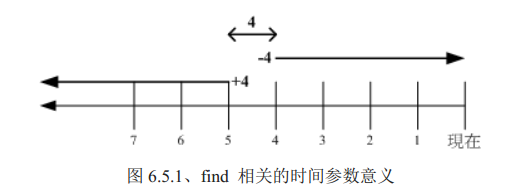
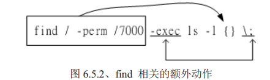

> # Linux(三)

> 参考书：鸟哥Linux私房菜-第四版
> 6. Linux文件与目录管理（续上一篇）

#  Linux文件与目录管理

## file 查看文件类型

> 结构`file 文件名`

```properties
[root@node1 ~]$ file b.txt
b.txt: ASCII text
[root@node1 ~]$
```

## 文件搜索

### which($PATH查询执行档)

> 结构: `which [-a] command`

> 选项参数

```properties
-a: 将所有PATH目录中可以找到的指令均列出，而不止第一个被找到的指令名称
```

注意：这个指令是根据PATH环境变量所规范的路径去搜索“执行档”的档名，所以重点是找出执行档而已。**history是内建指令，但是which预设是找PATH内所规范的目录，所以可能出现执行history缺找不到history指令的情况**

```shell
[wangtao@node1 ~]$ which cd
/usr/bin/cd
[wangtao@node1 ~]$ which history
/usr/bin/which: no history in (/usr/local/app/mongodb4.4.4/bin:/usr/local/sbin:/usr/local/bin:/usr/sbin:/usr/bin:/root/bin)
[wangtao@node1 ~]$
```

### whereis(特定路径中查询文件名)

> 结构：`whereis [-lbmsu] 文件或目录名`

> 选项参数

```properties
-l: 可以列出whereis会去查询的几个主要目录而已;
-b: 只找出binary格式的文件;
-m: 只找在说明文件manual路径下的文件;
-s: 只找source来源文件;
-u: 搜寻不在上诉三个项目当中的其他特殊文件.
## 注意：该指令只会在特定的目录中查询，如果想知道whereis到的查询了那些目录，可以使用whereis -l查看
```

### Locate/updatedb(文档名)

> 结构: `locate[-ir] keeword`

> 选项参数

```properties
-i: 忽略大小写的差异;
-c: 不输出档名，经计算找到的文件数量;
-l: 仅输出几行的意思，例如输出5行，-l 5;
-S: 输出locate所使用的数据库文件的相关信息，包括该数据库记录的文件/目录数量等;
-r: 后面可接正规表示法的显示方式。
```

### find(强大的查找指令)

> 结构: `find [PATH] [option] [action]`

#### 选项参数

> 与时间有关的选项：共有-atime,-ctime,-mtime,以-mtime说明

```properties
-mtime n: n为数字，表示在n天之前的（一天之内）被更懂过内容的文件;
-mtime +n: 列出在n天之前（不含n天本身）被更动过内容的文件档名;
-mtime -n: 列出在n天之内（含n天本身）被更动过内容的文件档名;
-newer file: file为一个存在的文件，列出比file还要新的文件档名.
```

`图示[-4,4,+4]时间线`



> 与使用者或组名有关的参数

```properties
-uid n: n为数字，这个数字是用户的账号ID，即UID，这个UID是记录在/etc/passwd里面与账号名称对应的数字;
-gid n: n为数字，这个数字是组名的ID，即GID，这个GID记录在/etc/group;
-user name: name为使用者账号名称，列如wangtao;
-group name: name为组名;
-nouser: 寻找文件的拥有者不存在/etc/passwd的人;
-nogroup: 寻找拥有群组不存在于/etc/group的文件，当自行安装软件时，很可能该软件的属性当中并没有文件拥有者，这是可能的，在这个时候，就可以用-nouser与-nogroup搜寻;
```

> 与文件权限及名称有关的参数

```properties
-name filename: 搜索文件名为filename的文件;
-size [+-]SIZE: 搜寻比SIZE还要大（+）或小（-）的文件。SIZE规格有：c-->byte,k-->Kb,M-->Mb;
-type TYPE: 搜寻文件的类型为TYPE的，类型主要有：一般正规文件（f），装置文件（b，c），目录（d），连结档（l），socket（s），FIFO（p）等属性;
-perm mode: 搜索文件权限“刚好等于”mode的文件，这个莫得为类似chmod的属性值，例如-rwsr-xr-x的属性为4755;
-perm -mode: 搜寻文件权限“至少拥有mode权限”的文件;
-perm /mode: 搜寻文件权限“包含任一mode权限”的文件。
```

`操作演示`

```shell
[root@node1 ~]# find /usr/bin/ -name passwd
/usr/bin/passwd
[root@node1 ~]# find /usr/share/awk/ -name *passwd*
/usr/share/awk/passwd.awk
[root@node1 ~]# find /run/udev -type s
/run/udev/control
[root@node1 ~]# find /usr/libexec/ -perm /7000
/usr/libexec/utempter/utempter
/usr/libexec/openssh/ssh-keysign
[root@node1 ~]# find /usr/bin/ /usr/sbin/ -perm /6000
/usr/bin/wall
/usr/bin/chfn
...
[root@node1 ~]# 
```

> 额外可进行的动作

```properties
或与非操作符: -a表示and的意思，-o表示or，!表示反向选择(非)
-exec command: command为其他指令，-exec后面可以再接额外的指令来处理搜寻的结果;
-print: 将结果打印到屏幕上，这个动作是预设动作
```

`操作演示（查找/etc目录下50k-60k之间的文件，列出文件容量大于50k且文件所属人不是root的档名）:`

```shell
[root@node1 ~]# find /etc -size +50k -a -size -60k -exec ls -lh {} \;
-rw-r--r--. 1 root root 58K 11月 21 2015 /etc/selinux/targeted/modules/active/base.pp
[root@node1 ~]# find /etc -size +50k -a ! -user root -type f -exec ls -lh {} \;
[root@node1 ~]# 
```

示例中{},\;,-exec这些东西意义如下



```
{} 代表的是“由find找到的内容”，如上图所示，find的结果会被放置到{}位置中;
-exec 一直到 \; 是关键词，代表find额外动作的开始（-exec）到结束（\;），在这中间的就是find指令内的额外动作，当前示例是"ls -l {}";
因为;在bash环境下是由特殊意义的，因此利用反斜杠转义。
```


over~~