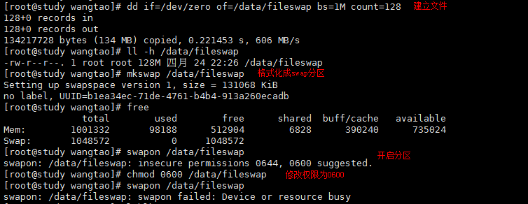

### 7. Linux磁盘与文件系统管理
>  文件系统通常会将数据放在不同的区块，权限与属性放置到inode中，至于实际数据则放到datab lock区块中，另外，还有一个超级区块（superblock）会记录整个文件系统的信息，包括inode与block的总量、使用量、剩余量等。
+ superblock: 记录此filesystem的整体信息，包括inode/block的总量、使用量、剩余量，一级文件系统的格式与相关信息;
+ inode: 记录文件的属性，一个文件占用一个inode，同事记录此文件的数据所在的block号码;
+ block: 实际记录文件的内容，若文件太大时，会占用多个block。

#### 7.2 文件系统的简单操作
> ##### **df:列出文件系统的真题磁盘使用量**
> 结构：df [-ahikHTm] [目录或文件名]
选项参数：
* -a: 列出所有的文件系统，包括系统特有的/proc等文件系统;
* -k，-m: 以Kb，Mb的容量显各文件系统;
* <u>**-h: 以人们较易阅读的Gb,Mb,Kb等格式自行显示**</u>
* -H: 以M=1000k取代M=1024K的进位方式;
* -T: 连同该partition的filesystem名称（例如xfs）也列出;
* <u>**-i: 不用磁盘容量，而以inode的数量来显示.**</u> 


`字段解释`:
```
    Filesystem: 代表文件系统是在哪个partition，所以列出装置名称;
    lk-blocks: 说明底下的数字单位是1kb，可以用-h或者-m来改变;
    Used: 磁盘使用掉的空间;
    Available: 磁盘可用空间（剩下的空间）;
    Used%: 使用率（Used/total）
    Mounted on: 磁盘挂载的目录所在，也就是挂载点.
```
> ##### **du:评估文件系统的磁盘使用量（常用在推估目录所占容量）**
> 结构：du [-ahsSkm] 文件或目录名称
选项参数：
* -a: 列出所有的文件与目录容量，默认仅统计目录底下的目录容量，不含文件;
* -k，-m: 以Kb，Mb的容量显各文件系统;
* <u>**-h: 以人们较易阅读的Gb,Mb,Kb等格式自行显示**</u>
* <u>**-s: 列出总量而已，而不列出每个个别的目录占用容量;**</u>
* -S: 不包括子目录下的总计，与-s有点差别.

> ##### **ln:实体连接与符号连接**
> hard link与symbolic link图示


> 结构：ln [-sf] source destination
选项参数：
* <u>**-s: 如果不加任何参数就是hard_link,-s就是symbolic_link**</u>;
* -f: 强制建立，如果destination存在，就删除后再建立;


`图示解释`
```
    hard link会增加文件的连接数图中标红的;
    符号连接（快捷方式）不会增加连接数，符号连接占用大小跟文件名大小有关，理论上讲上图中文件名(a_symbolic_link)只有15b，应该占用15b的，但是占用的是19。
    hard link指向的inode都是相同的（黄线标出，俩都是138）,因此即使将a.txt删除，文件也不会消失，仅仅是连接数变成了1而已，但是可以看到符号连接变成了红色，表示已不可用。
    其实可以把源文件名a.txt也看成是一个指向实际文件数据的hard link.
```
> ##### **目录的link数（连接数）**


```
    目录的link数其实就是它的子目录数(与它目录下的文件无关);
    从图中可以看出新建目录的link数为2，而上层目录的link数会增加。
```

#### 7.3 磁盘的分区、格式化、校验与挂载
#### lsblk:列出系统上的所有磁盘列表（list block）
> hard link与symbolic link图示
> 结构：lsblk [-dfimpt] [device]
选项参数：
* -d: 仅列出磁盘本身，并不会列出该磁盘的分区数据;
* -f: 同时列出该磁盘内的文件系统名称;
* -i: 使用 ASCII 的线段输出，不要使用复杂的编码;
* -m: 同时输出该装置在 /dev 底下的权限数据(rwx 的数据);
* -p: 列出该装置的完整文件名，而不是仅列出最后的名字而已;
* -t: 列出该磁盘装置的详细数据，包括磁盘队列机制、预读写的数据量大小等.


`图示字段解释`
```
NAME: 装置的文件名，会省略 /dev 等前导目录;
MAJ:MIN： 核心认识的装置都是透过这两个代码来熟悉的，分别是主要:次要装置代码;
RM: 是否为可卸除装置(removable device)，如光盘，USB等;
SIZE: 容量大小;
RO: 是否为制度装置;
TYPE: 是磁盘(disk)、分区槽（partition）还是只读存储器（rom）等输出;
MOUNTPOINT: 挂载点.
```

#### blkid: 列出装置的UUID,文件类型TYPE等参数


#### gdisk/fdisk: 磁盘分区

> MBR分区表使用fdisk
> GPT分区表使用gdisk
> 可以使用lsblk或blkid先找到磁盘
> 可以使用parted /dev/xxx print来查看磁盘分区表类型
> 这俩货用法几乎一样


```
图中指令gdisk /dev/sda 
使用的装置名 sda 后边不能跟数字哦，因为是对整个装置进行的分区，而不是对某个分区槽(例如/dev/sda1)进行的分区！
d: 删除一个分区
n: 添加一个新的分区
p: 打印出分区表（常用）
q: 退出
其他不列举了
可以随便玩儿哦，只要离开的时候是「q」，就不会生效，要 「w」 才会生效!
```
> p打印分区表

```
Number: 分区槽编号，1指 /dev/sda1 
Start(sector): 每一个分区槽开始扇区号码
End(sector): 每个分区槽的结束扇区位置
Size: 分区槽容量
Code: 在分区槽内的可能的文件类型，Linux为8300，swap为8200，不过这个只是一个提示，不见得真的代表此分区槽内的文件系统哦
Name: 文件系统的名称等等
可以看到最大扇区为83886080，但是只使用到65026047而已，意思是还可以进行分区。
分区完成之后可以通过reboot或者使用partprobe -s来更新核心分区表信息，cat /etc/partitions可以查看分区信息哦
```
> ***注意：切记不要在MBR分区上使用gdisk，也不要在GPT分区上使用fdisk，否则一旦指令按错，分区记录可能会死光光哦。***

#### 磁盘格式化（建置文件系统）

> 格式化指令 XFS文件系统：mkfs(make filesystem)+.[文件系统名称]

> xfs文件系统mkfs.xfs；EXT4文件系统: mkfs.ext4;查看支持的文件系统直接查询有哪些mkfs指令即可，输入mkfs，然后按tab自动补全自己看咯。

> 选项参数自行man page


```
全都使用默认值，格式化如上图，可以看到agcount（存储群组）=4，这个值通常跟cpu个数有关，通常设置成cpu个数。grep 'prosessor' /etc/cpuinfo 指令可以查看cpu个数，输出的cpu序号由0开始。

```


```
上图，可以看到cpu只有一个，因为我们之前已经格式化过一次（建立了文件系统），所以这里加的-f是强制格式化的意思，-d agcount=2表示设置存储群组为2（我这里没有跟cpu设置成一样，仅仅是说明这个值如何设置）。
```

> #### 文件系统修复指令

> ##### xfs_repair 处理xfs文件系统
>
> 结构：xfs_repair [-dnf] 装置名称

选项参数：
* -d: 通常在单人维护模式底下，针对根目录（/）进行检查与修复，很危险！！！不要随便使用
* -f: 后面的装置其实是个文件而不是实体装置
* -n: 单纯检查并不修改文件系统任何数据（检查而已）
* 其他参数自行man page

> ##### fsck.ext4 处理ext4文件系统

> 自行man page

> 注意：修复文件系统是个大任务，因此，修复该文件系统时，文件系统不能被挂载，需要先卸除。如果根目录有问题，那么只能进入单人模式，加-d解决，因为根目录不能被卸除。

#### 文件系统挂载与卸除

> ##### mount 指令挂载

常用参数:

* -a: 依照配置文件/etc/fstab的数据将所有未挂载的磁盘都挂载上来
* -l: 不加任何参数会显示目前挂载信息，加上 -l 可以增列Label名称
* -n: 默认情况下，系统会将实际挂载的情况实时写入/etc/mtab中，以便其他程序的运作。但在某些情况下（列如单人维护模式）为了避免问题会可以不写入，此时就要使用 -n 选项
* 其他参数自行man page

```
CentOS7系统后自动分析最恰当的文件系统来挂载你需要的装置，它会通过superblok，搭配自己的驱动去测试挂载，如果成功挂载，就立即使用该类型的文件系统将装置挂在起来，指定系统哪些类型的filesystem才需要进行上述的挂在测试主要参考以下俩文件：
/etc/filesystem: 系统指定的测试挂载文件系统类型的优先级;
/proc/filesystem: 系统已经加载的文件系统类型
Linux的驱动程序在如下目录中：/lib/modules/$(uname -r)/kernel/fs/
```


> 注意：如果挂载了光盘啥的，必须要卸除之后才能拿出光盘，否则光驱是打不开的哦！如果你正在使用该装置（比如你正在需要卸载的装置文件夹内），是不可以卸除的哦！

> ##### umount 指令卸除
>
> 结构：umount [-fln] 装置文件名或挂载点

选项参数：

* -f: 强制卸除！可用在类似网络文件系统（NFS）无法读取到的情况下；
* -l: 立即卸除文件系统，比 -f 还牛逼
* -n: 不更新 /etc/mtab 情况下卸除


#### 7.4.1 开机挂载 /etc/fstab 及 /etc/mtab

> 查看/etc/fstab内容：
>
> 

输出解释

| 栏位   | 描述        | 解释                           | 示例（以图为例） |
| ------ | ----------- | ------------------------------ | ---- |
| 第一栏 | 装置/UUID等 | 磁盘装置文件名/UUID/LABLE name|UUID=xxx,/dev/mapper/centos-root|
| 第二栏 | 挂载点 | 文件系统挂载点 | /，/home |
| 第三栏 | 文件系统 | 磁盘分区槽文件系统 | xfs |
| 第四栏 | 文件系统参数 | 使用mount挂在是 -o 的参数 | 使用的默认参数，default |
| 第五栏 | dump | 能否被dump作用，目前备份系统已经很多，用不住这个了 | 直接填0 就好 |
| 第六栏 | fsck | 是否以fsck检查扇区，fsck是检查ext4系统类型的，我们当前是xfs | 直接填0就好 |

> 所以要开机挂载，直接将需要载的文件系统像以上格式填入/etc/fstab即可，如图所示：


> reboot后可以看到，sda4是正常挂载了的


> 骚操作之映像文件挂载和挂载装置文件（file）

> mount -o loop可以挂载iso映像文件，而不用刻录到光盘就可以直接读取，这个就不说了，下面来点骚的

> 当分区不良的情况下，比如只分区出一个目录，而已经没有多余的容量进行额外的分区，但是偏偏根目录又很大，这个时候我们就可以制作出一个大文件，然后将这个文件挂载，如此一来感觉上就多了一个分区槽哦！这个操作用途很广哦！

首先建立一个大文件（用dd指令，后续有这个指令的讲解，这里只演示）

`dd if=/dev/zero of=/srv/loopdev bs=1M count=512`

```
if就是input file。那个/dev/zero是会一直输出0的装置！
of就是output file。将一堆0写入到后面接的文件中。
bs就是每个block大小，就像文件系统那样的block意义。
count就是总共几个bs的意思。所有bs*count就是这个文件的容量了！
```

> mkfs指令-f参数key格式化文件
>
> mkfs -f /srv/loopdev


> 使用开机挂载时，由文件系统建立的filesystem，装置名称最好还是使用原文档名类为好，这样不容易出现错误信息，毕竟大多数系统仅查询block device去找UUID而已，而不会去查file的UUID；参数loop为挂载时加的参数；如图所示：


##### 建立swap交换分区


```
如上图所示：
因为我们之前已经使用gdisk攻击建立了分区swap分区/dev/sda6,所有我们直接使用了。
mkswap /dev/sda6: 将sda6格式化成swap分区，自己man page该指令；
swapon /dev/sda6: 启用sda6这个swap分区，自己man page该指令；
可以看到第一次free和开启sda6这个swap分区后，swap分区的容量值有增加；
```

> 使用file形式的filesystem同样也可以建立swap分区哦！



```
如果所示，需要注意的就是我们开启分区的时候要求权限为0600，
swapon开启的时候报错设备忙，所以我设置了开机自动启用（自己去补充/etc/fstab哦），
重启后看下图操作：swapoff 用来关闭swap的启用状态
```


>  parted指令可以同时处理GPT和MBR分区表格式，而且可以一条指令直接完成分区哦，自行man page吧！


over...