# 10. BASH

## type 查询指令是否为Bash shell的内建指令

> 结构：type [-tpa] name

常用参数：
* -t: 不加任何参数，type会显示出name是外部指令还是bash内建指令;加-t时，type会将name以底下这些字眼显示出它的意义：file（外部指令），alias（别名设置的名称），builtin（bash内建指令）
* -P: 如果后面接的name为外部指令时，才会显示完整文件名;
* -a: 会有PATH变量定义的路径中，将所含有name的指令都列出来，包含alias

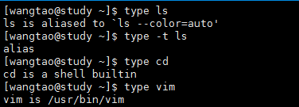

## echo，unset 变量的取用与设定

> 设置变量: key=value
>
> 取值: echo $key，key可以使用{}括起来，建议采用这种方式
>
> 删除变量: unset key

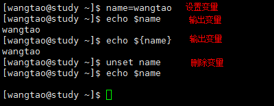

> 变量设定规则

```
1. 变量与变量内容以一个等号来连接，等号两边不能直接接空格符，如『key = value』；
2. 变量只能是英文字母与数字，但是不能以数字开头；
3. 变量名中有空格或其他字符时可以使用『\』转义或使用『"』,『'』将变量内容结合起来，这俩的区别是：
	『var="lang is $LANG"』==>『echo $var』 ==>『lang is zh_TW.UTF-8』
	『var='lang is $LANG'』==>『echo $var』 ==>『lang is $LANG』
4. 指令执行中，如果需要其他额外的指令提供信息时，可以使用反单引号『`指令`』或者『$(指令)』，列如：
	『ls /lib/modules/$(uname -r)/kernel』
5. export key指令可以将key设置成环境变量；

```

## env，export，set 

>env 查看当前环境变量；
>
>export不加任何参数，跟env一样
>
>set 查看所有变量，包含自定义的

特殊变量：

```
$: 关于本shell的PID
?: 上个指令的回传值
OSTYPE,HOSTTYPE,MACHTYPE: 主机硬件与核心等级
如下图：
```

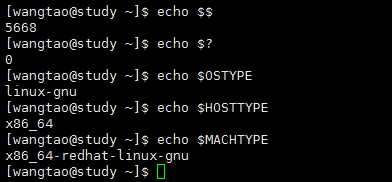

> export将自定义变量转成是环境变量，环境变量与普通变量差别在于『该变量是否会被“子程序”继续使用』。

```
当登录Linux并取得一个bash之后，你的bash就是一个独立的程序，这个程序的识别使用程序标识符，就是PID(echo $$)，这个时候我们在这个bash底下执行另一个bash，这个时候的界面就是新的bash，这个就是子程序，这个时候原bash就sleep了，需要exit或者logout才行，如图：
```
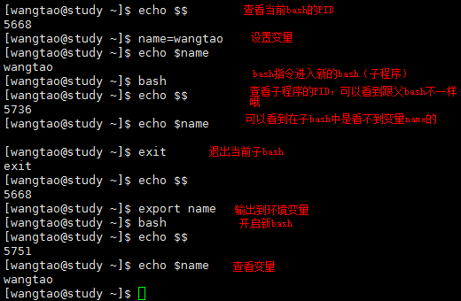

`原理`

```
1. 当启动一个shell，操作系统会分配一记忆区块给shell使用，此内存内的变量可以让子程序取用；
2. 若在父程序利用export功能，可以让自定义变量的内容写到上述的记忆区块当中(环境变量)；
3. 当加载另一个shell时（启动子程序），只shell可以将父shell的环境变量所在的记忆区块导入自己的环境变量区块当中。
```

## read，array，declare/typeset

> read 

```
read [-pt] key
-p: 后边可以接提示字符；
-t: 后边接等待的秒数，时间到后会自动退出等待。
直接看图：
```

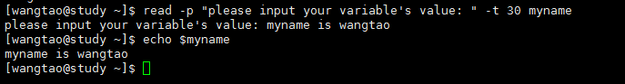

> declare / typeset
>
> 这俩指令是一样的，都是宣告变量类型，如果declare后不接任何参数，效果相当于set。

```
declare [-aixrp] key
-a: 将后边名为key的变量定义成为数组(array)类型 
-i: 将后面名为key的变量定义成为数字(integer)类型
-x: 用法与export一样，就是将后边的变量key变成环境变量,改成+x可以取消设置哦！
-r: 将变量设定成为 readonly 类型，该变量不可被更改，不能unset
-p: 单独列出变量key，相当于『export | grep key』
默认定义变量为字符串类型，比如:
	『declare sum=1+2+3』==>『sum=1+2+3』
	『declare -i sum=1+2+3』==>『sum=6』
注意：bash环境中的数值运算，最多仅能达到整数形态，1/3=0！
```

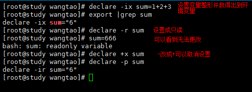

> 数组设定方式

```
用法：var[index]=content
var[1]=name
var[2]=age
var[3]=sex
『echo "${var[1]},${var[2]},${var[3]}"』==>『name,age,sex』
如图：
```

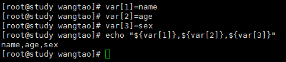

## 变量内容的删除、取代与替换

>  删除与取代

```
#:『从头开始』，删除符合取代文字的『最短的』那一个
##：『从头开始』，删除符合取代文字的『最长的』那一个
%:『从尾开始』，删除符合取代文字的『最短的』那一个
%%:『从尾开始』，删除符合取代文字的『最长的』那一个
/oldStr/newStr: 把找到的『第一个』oldStr替换成newStr
//oldStr/newStr: 把找到的『所有』oldStr替换成newStr
```

| 变量设定方式             | 示例                      | 操作           | 结果                    |
| ------------------------ | ------------------------- | -------------- | ----------------------- |
| ${变量#关键字}           | m=/var/spool/mail/wangtao | echo ${m#/*/}  | spool/mail/wangtao      |
| ${变量##关键字}          | m=/var/spool/mail/wangtao | echo ${m##/*/} | wangtao                 |
| ${变量%关键字}           | m=/var/spool/mail/wangtao | echo ${m%/*}   | /var/spool/mail         |
| ${变量%%关键字}          | m=/var/spool/mail/wangtao | echo ${m%%/*}  | 空                      |
| ${变量/oldchar/newchar}  | m=/var/spool/mail/wangtao | echo ${m/o/R}  | /var/spRol/mail/wangtao |
| ${变量//oldchar/newchar} | m=/var/spool/mail/wangtao | echo ${m//o/R} | /var/spRRl/mail/wangtaR |

`操作演示`

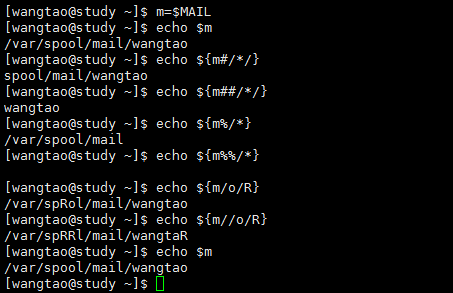

> 变量设定与替换（跟上面替换有区别哦！stderr=standard error output）

| 变量设定方式     | str没有设定       | str为空字符串     | str已设定且非空  |
| ---------------- | ----------------- | ----------------- | ---------------- |
| var=${str-expr}  | var=expr          | var=              | var=$str         |
| var=${str:-expr} | var=expr          | var=expr          | var=$str         |
| var=${str+expr}  | var=              | var=expr          | var=expr         |
| var=${str:+expr} | var               | var=              | var=expr         |
| var=${str=expr}  | str=expr;var=expr | str不变;var=      | str不变;var=$str |
| var=${str:=expr} | str=expr;var=expr | str=expr;var=expr | str不变;var=$str |
| var=${str?expr}  | expr输出至stderr  | var=              | var=$str         |
| var=${str:?expr} | expr输出至stderr  | expr输出至stderr  | var=$str         |

## alias，unalias，history别名的设定和历史指令

> alias和unalias

```
别名的使用很简单，就是把一些指令加上一些参数，取个别名，以后就用别名来执行这个指令；
通过alias指令不加任何参数就可以看到已经设置的哪些别名。
unalias当然就是取消别名的设置;
alias lm='ls -lh'
unalisa lm
如图所示：
```

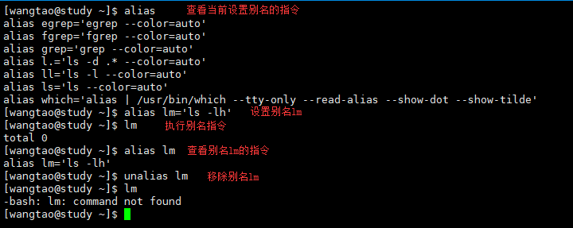

> history

```
历史指令可以查询当前登录用户执行指令的历史记录，默认最大记录为1000条，可用过环境变量$HISTSIZE查看或更改。
history [n]
history [-nc]
history [-raw] [histfiles]
n: n为数字，意思是列出最近n条历史记录；
-c: 将目前shell中的历史记录全部清除；
-a: 将目前新增的history指令新增入histfiles当中；
-r: 将histfiles的内容读到当前这个shell的history记忆中；
-w: 将目前shell的history写入到histfiles中，注销时也会自动写入histfiles中；
注意: 若没有histfiles，则都会读取或写入预设~/.bash_history中，环境变量$HISTFILE;
```

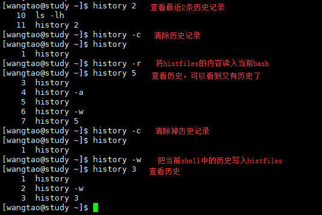

> !!，!number，!command

```
!!: 执行上一条历史指令；
!number: 执行第number条历史记录指令，number在history指令的输出中有每一行的最前面；
!command: 执行历史记录中开头为command的指令；
有图有真相：
```

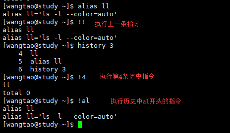

## Bash shell的操作环境

> 命令下达时指令的查找顺序

```
1. 以相对/绝对路径执行指令，列如 /bin/ls 或 ./ls;
2. 由 alias 找到该指令来执行；
3. 由bash内建的(builtin)指令来执行；
4. 透过 $PATH 这个变量的顺序搜寻到的第一个指令来执行。
```

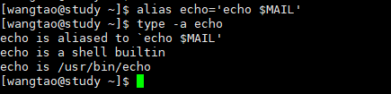

```
如上图所示：
我们给『echo $MAIL』这条指令取了个别名『echo』；
接下来我们执行『type -a echo』来查看执行结果；
可以看到指令先通过alias找到了指令『echo $MAIL』;
然后再到内建指令builtin；
最后找到『/usr/bin/echo』。
```

> login shell 和 non-login shell

```
login shell: 取得bash时需要完整的登录流程的；
non-login shell: 不需要输入用户名密码就取得的shell，比如我等使用；
比如：我们输入用户名密码登陆后取得的shell，就是login shell，然后我们再在这个shell中使用bash指令，这个时候这个子程序的bash是没有输入用户名密码进入的，这个子程序的bash就叫non-login shell。
```

> 读取的配置文件

```
login shell：
1. /etc/profile: 该文件会去调用并读取其他目录下的文件（/etc/profile.d/*），具体看后边的读取流程图；
2. ~/.bash_profile,~/bash_login,~/.profile:这三个文件只会读取其中的一个，优先级顺序就是写的顺序，先遇到谁就读谁；
non-login shell，centos7.x还会呼叫/etc/bashrc哦；
1. 也会读取/etc/profile,但是此时/etc/profile中会根据权限确定是否读取/etc/profile.d/*中的某些内容;
2. 读取~/.bashrc
```


> source（.）

```
source指令为读入环境配置文件的指令，可以用一个小数点『.』来代替该指令。
source /etc/profile <==> . /etc/profile
```

>终端机的环境设定stty，set

```
主要是设置中昂端机tty1-6的一些环境参数，不演示了，用到的时候自行man page或者百度。
```

## 数据流重导向<,<<,>,>>

>数据传输情况如图

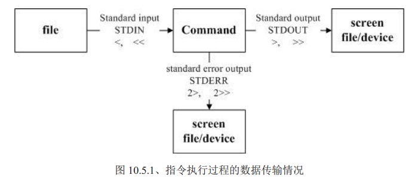

```
1. 标准输入 stdin: 代码为 0 ，使用 < 或 << ；
2. 标准输出 stdout: 代码为 1 ，使用 > 或 >> 或 1> 或 1>> ；
3. 标准错误输出 stderr: 代码为 2 ，使用 2> 或 2>> 。
```

> 指令 > 和  >> 

```
1>: 以『覆盖』的方式将『正确的数据』输出到指定的文件或装置上；
1>>: 以『累加』的方式将『正确的数据』输出到指定的文件或装置上；
2>: 以『覆盖』的方式将『错误的数据』输出到指定的文件或装置上；
2>>: 以『累加』的方式将『错误的数据』输出到指定的文件或装置上；
```

> find /home /root -name .bashrc > list_right 2>list_error
>
> 查询/home,/root目录下名字是.bashrc的文件，并输出到list_right文件中，错误信息输出到list_error文件中

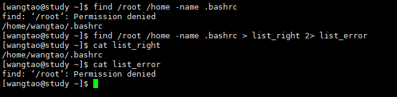

> /dev/null 垃圾桶黑洞，能把所有输入到这里头的东西吃掉
>
> 我们现在只要正确信息，错误信息丢弃，直接输出到垃圾黑洞，如图：

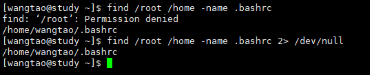

```
我们知道 > 是将stdout重导向到一个地方，那么我们怎么把错误信息也导向同样的地方呢？这个时候就需要使用 & 了；以下三种写法都对，很简单吧，一看就明白了吧！
find /name /root -name .bashrc > list_right 2>&1
find /name /root -name .bashrc 2> list_right 1>&2
find /name /root -name .bashrc &> list_right
```

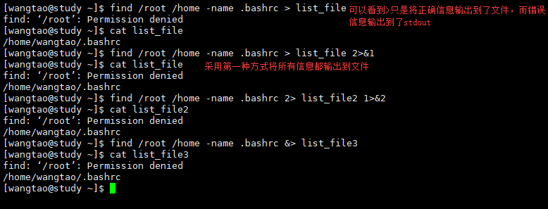

> 如果我们不想让文件内容被覆盖怎么办？那当然是使用 >> 追加到文件末尾咯

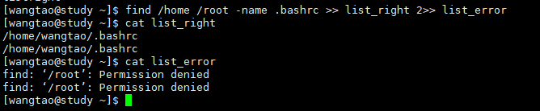

> 指令 < 和 <<

采用cat创建新文件，手动输入，ctrl+d结束，文件存在时会直接覆盖掉！

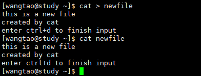

> 手动输入也很麻烦，可以使用stdin，就是 < 咯，文件存在时会直接覆盖掉！
>
> 将刚创建的list_right文件的内容输出到newfile当中

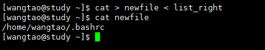

> 手动输入，并以 "eof" 字符结束，不使用ctrl+d，从下图中可以看到最后的结束符eof是不会写入文件的，当然 << 的用法远不止这个。

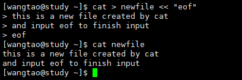

## 指令执行的判断依据『$?』,『;』,『&&』,『||』

> 连续执行多条指令『;』
>
> 比如同时想打开/root和/home俩文件夹，ls /root ; ls /home

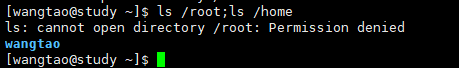

> $?，&&，||
>
> && 和 || 会依靠指令的回传值$0

| 指令下达情况 | 说明                                                        |
| ------------ | ----------------------------------------------------------- |
| cmd1&&cmd2   | 若cmd1执行完毕且正确执行（$?=0）,则执行cmd2；否则不执行cmd2 |
| cmd1\|\|cmd2 | 若cmd1执行完毕且正确执行，则不执行cmd2，否则执行cmd2        |

`简单示例，查阅目录~/test是否存在，如果存在就建立文件~/test/hehe`

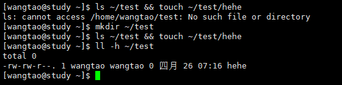

```
从图中可以看到第一次文件夹不存在直接输出了异常，后边指令不执行；
当我们新建了文件夹test之后，前面指令执行成功，于是建立了新文件；
```

`判断文件夹~/tt是否存在，如果不存在就新建该文件夹`

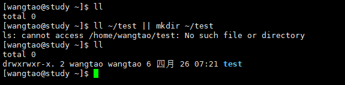

```
可于看到我们前面的指令执行报错了，文件夹不存在，于是执行了后面的指令，建立了新文件夹。
```

> 仔细观察下面这俩例子
```
无论~/test是否存在，都要建立~/test/hehe这个文件咋办？
如果~/aaa存在就输出exsit，如果不存在就输出not exsit；
ls ~/test || mkdir ~/test && touch ~/test/hehe
ls ~/aaa && echo "exsit" || echo "not exsit"
```
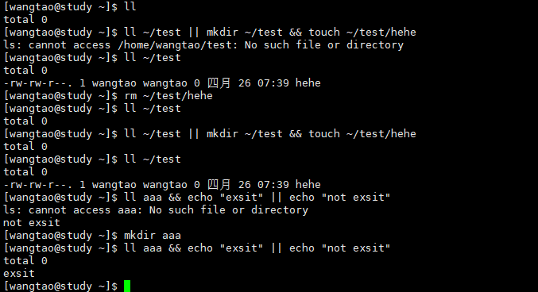

`最后附上指令依序执行的关系示意图`

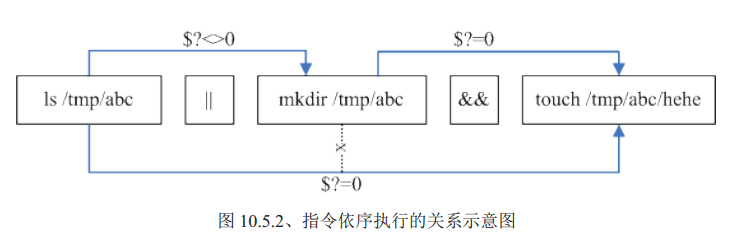

## 管线命令(pipe)|

```
管线命令仅会处理stdout，对于stderr会忽略(可以通过2>&1来吧stderr转成stdout哦！)
管线命令必须要能够接受来自前一个指令的数据成为stdin继续处理才行。
```

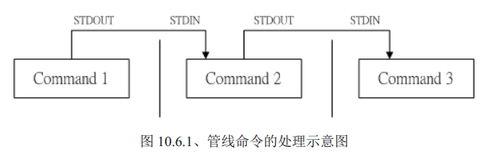

`经典示例`

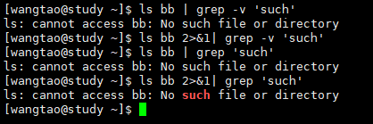

```
仔细观察图中的四条指令，我们ll bb指令会产生stderr。
1. 第一次执行的时候我们看到屏幕上输出了含有such字样的行(理论上不应该出来，对吧，因为我们grep -v查找的是不含such的行，继续看后面)；
2. 第二条指令我们也查询不含such的行，我们使用 2>&1 把stderr输出到stdout,这个时候我们看到屏幕上并没有任何输出（看样子这条指令应该是对了，继续往下看）；
3. 第三条指令我们查询含有such字样的行，我们发现屏幕上输出了一行含有such的行(咋一看好像对了，但是好像跟pipe只接受stdout有点冲突，继续看后面)；
4. 第四条指令将stderr输出到stdout，然后我们依然查询含有such字样的行，看到了吧，屏幕同样输出了含有such的行，但是这个时候such是高亮的！！！；
明白了吧！！！
第一条指令执行的时候，由于pipe只接受stdout，所以stderr会输出到屏幕，它并没有进入管道，就像『find /root /home ./bash > list_right』错误输出会输出到屏幕，而不会进入文件list_right一样；
第二条指令因为将stderr转成了stdout，所以他进入了管道，而我们查找的是不含such的行，所以没有任何输出；
第三条指令跟第一条指令一样，同样是没有进入管到，只是输出了stderr在屏幕而已；
第四条指令因为将stderr转成了stdout，进入了管道，所以在查询憨厚such字样的时候，该行被查到了，所以屏幕上输出来了，并且带有高亮显示！
```

## cut，grep截取命令

> cut

```
cut -d '分割字符' -f 分割后字符序号
cut -c 字符区间
-d: 后边跟分割字符，与-f一起使用；
-f: 依据-d分割出来的字段，用-f取出那几段；
-c: 义字符的单位取出固定的字符区间，12-表示取出第12个字符后的所有字符，12-20表示取出第12-20个字符；
```

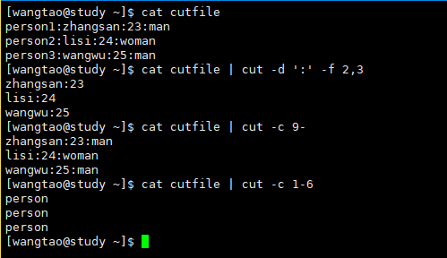

> grep

```
grep [-acinvABC] [--color=auto] 'keyword' filename
-a: 将binary文件以text文件的方式搜索数据；
-c: 计算找到'keyword'的次数；
-i: 忽略大小写；
-n: 输出行号；
-v: 反向选择，即输出没有'keyword'的行；
-[ABC] number: number是数字，表示将keword所在行的后（[A]fter）number行也输出 ，前（[B]efore）number行也输出，前后（[C]）number行也输出；
--colr=auto: 将找到的关键字加上颜色显示。
```

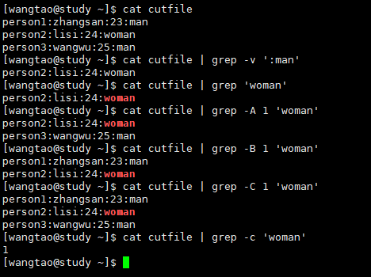

## sort，wc，uniq排序统计去重指令

> sort

```
sort [-fbmnrtuk] [file or stdin]
-f: 忽略大小写；
-b: 回了最前面的空格；
-M: 一月份的名字来排序,JAN,DEC等排序方法；
-n: 使用村数字来排序；
-r: 反向排序；
-u: 就是uniq，相同的数据中，仅出现一行；
-t: 分隔符，预设使用[tab]来分割；
-k: 以那个区间（field）来排序；
如图：
```

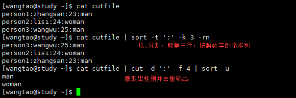

> uniq

```
uniq [-ic]
-i: 忽略大小写；
-c: 进行统计，统计的数量会在每一行最前面，注意这个不是行号；
注意：这个去重是指将重复的东西减少，所有必须要配合排序使用咯，看图吧
```

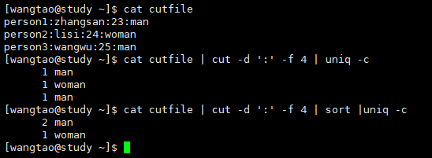

> wc

```
wc [-lwm]
-l: 仅统计行数；
-w: 仅统计单词数（英文单词）；
-m: 仅统计所有字符；
不加任何参数时三个一起统计，有图有真相：
```

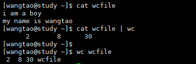

## tee 双重重导向

> 由于 > 会将数据流整个传送给文件或装置，因此除非我们去读取文件或装置，否则就无法继续利用这个数据流；tee的作用就是将处理过程中的某段讯息存下来，并且让数据流继续往后流动。

`tee数据流示意图`

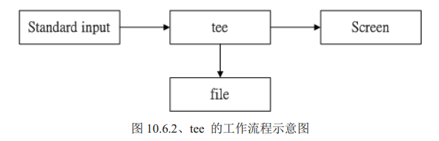

```
tee [-a] file
-a: 以累加的方式，将数据写入file当中
```

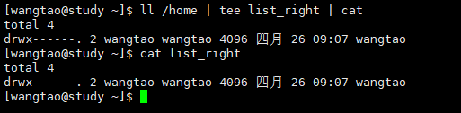

## tr,col,join,paste,expand字符转换命令

> tr 可以用来删除一段讯息当中的文字，或者是进行文字讯息的替换

```
tr [-ds] SET1 ...
-d: 删除讯息当中的SET1这个字符串，tr [0-9]删除所有数字；
-s: 取代掉重复的字符，-s可以省略，tr [a-z] [A-Z]，把字符全部换成大写.
有图有真相：
col,join,paste,extend就自己man page吧！
```

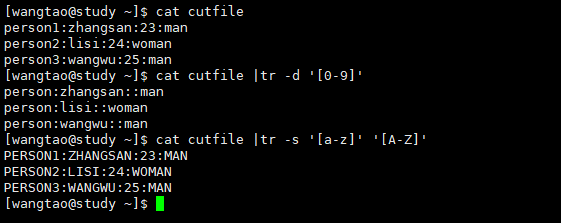

## split 文件分割命令

> 当文件很大时，可以根据问价你大小或行数来将其分割成小文件。

```
split [-bl] file PREFIX
-b: 后边可以接欲分割成的文件大小，可加单位b，k，m等；
-l: 以行数来进行分区；
PREFIX: 作为分区文件的前缀；
有图有真相：
```

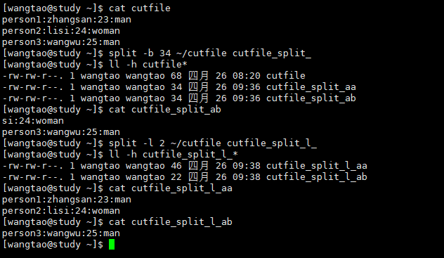

## xargs 参数代换

> x 加减乘除的乘号，args就是argumens(参数)的意思；这货的作用就是产生某个指令的参数的意思；它可以读入stdin的数据，并且以空格符或断行字符作为分辨，将stdin分割成aguments；因为是以空格作为分割，所以当一些档名或者其他意义的名词含有空格符的时候，就会造成误判哦。

```
xargs [-0epn] command
-0: 如果stdin含有特殊字符，这个参数可以将其还原成一般字符，这个参数可以用于特殊状态；
-e: EOF（end of file）的意思，后边可以接一个字符串，当xargs分析到这个字符串时，就停止；
-p: 再执行每个指令的argument时，都会询问使用者；
-n: 后面接次数，每次command指令执行时使用几个参数。
```

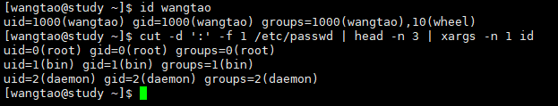

```
如图所示：『cut -d ':' -f 1 /etc/passwd | head -n 3 |xargs -n 1 id』；
id指令每次只能接受一个参数，用来查询用户的uid，gid等信息；我们查询/etc/passwd里面的前三条数据，取出名字，通过xargs一个一个传给id进行处理；
注意: 很多指令不支持管线管道命令，我们也可以通过xargs来提供这些指令引用stdin哦！
```

## - 减号的用途

> 在管道命令中，常常会使用到前一个指令的stdout来作为这次的stdin，某些命令需要用到文件名（例如tar）来进行处理是，改stdin与stdout可以用减号拉代替：

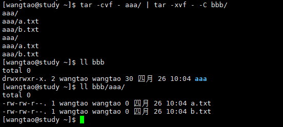

```
如图所示：『tar -cvf - aaa/ | tar -xvf - -C bbb/』;
这条指令的意思是：将aaa文件夹打包，但是打包的数据不是记录到文件(tar的-f后边跟的是文件名哦，忘记了吗？)，而是传送到stdout；经过管道后，将tar -cvf aaa/传送给后面的tar -xvf;
后面这个 - 则是取用前一个指令的stdout，因此我们就不需要filename了！很骚哦~
```

over...