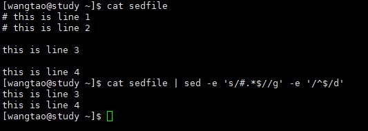

# sed,awk,printf强大的文件处理、格式化工具

> sed

```
sed [-nefr] [动作]
参数说明
-n: 使用安静（silent）模式。在一般sed的用法中，所有来自stdin的数据一般都会被烈出道屏幕上，加上-n后，则只有经过sed处理的那一行（或者动作才会被列出来）；
-e: 直接在指令列模式上进行sed的动作编辑；
-f: 直接将sed的动作写在一个文件内，-f filename则可以执行filename内的sed动作；
-r: sed的动作支持的是延伸型正规表示法（预设是基础正规表示法语法）；
-i: 直接修改读取问价你的内容，而不是由屏幕输出。、
动作说明: [n1[,n2]]function
n1,n2: 不见得会存在，一般代表选择『进行动作的行数』，比如我的动作是在10-20行之间进行,$可以表示最后一行，则『10,20[function]』
function：
[a]: 新增，a的后边可以直接接字符串，而这些字符串会在新的一行出现(目前的下一行);
[i]: 插入，i的后面可以接字符串，而这些字符串会在新的一样出现（目前行的上一行）；
[c]: 取代，c的后边可以接字符串，这些字符串可以取代 n1,n2 之间的行；
[d]: 删除，因为是删除，所以d后面通常不接任何东西；
[p]: 打印，即将某个选项的数据印出，通常会与参数 sed -n 一起使用；
[s]: 取代，可以直接进行取代工作，通常这个s的动作可以搭配正规表示法，例如 『1,20s/old/new/g』。
```

`使用演示`

```
1. 标记行号取出/etc/passwd的前6行内容，并将第2行之后全部删除
2. 标记行号取出/etc/passwd前3行，并在第二行之后添加'after line 2',之前添加'before line 2',多个动作，需要用到-e参数
3. 标记行号取出/etc/passwd前5行，并将第第2-4行替换为'Number two to five is replaced'
4. 标记行号取出/etc/passed，并只打印第2,3行
```


`演示2`

```
删除文本内容中的注释行（开头为 # 的行），删除空白行。
思路: 将注释行替换成空白行，然后再将空白行删除。
```



```
-i 可以直接修改文件内容，慎用哦，不演示了！
```

> printf

```
printf '打印格式' 实际内容(这个内容通常是$(指令)或者`指令`的形式)
将文件内容格式化输出，执行man page，只做个演示。
prinf '\x45' 可以输出16进制45代表的ASCII码字符哦，很帅吧~~
解释一下图中的打印格式,内容中的分隔符是tab，当然也可以用空格；
printf中: \t是tab分隔符，%s表示string，%i表示integer，%f表示float
s,i,f之前跟的数字表示占用多长，%8.2f表示保留两位小数，很好理解。
```


> awk

`awk的处理流程`

```
1. 读入第一行，并将第一行的资料填入$0,$1,$2....；
2. 依据“条件类型”，判断是否需要进行后边的“动作”；
3. 做完所有的动作与条件类型；
4. 若还有后续行，则重复上面1-3，直到处理完所有数据。
```

```
awk '条件类型1{动作1} 条件类型2{动作2}...' filename
相比较于sed尝尝作用于一整个行的处理，awk则比较倾向于将一行分成数个『字段』来处理，分隔后的每一个字段用$1,$2...表示，$0表示一整行，默认分隔符是空格，可以使用-F '分隔符' 来指定或者'{FS="分隔符"}'。
awk的内建变量NF,NR,FS
NF: 每一行被分成的字段总数；
NR: 目前awk所处理的是『第几行』数据；
FS: 目前使用的分隔符； 
条件类型使用的判断符：『>,<,>=,<=,==,!=』六种。
```

`操作演示`

`1. 取出最近登录过的2条账号记录的登陆者和ip，将登陆者名字和ip用\t隔开;`


`2. 列出文档awkfile当中每一行（使用：分隔）的名字（$1），目前处理的行数（NR），当前行总共的字段数（NF）；`


```
注意示例中使用$2<26的情况，当使用'{FS=":"}'的时候，第一行数据还没有处理就输出了，但是使用-F ":"的时候就没有这种情况；这是因为虽然我们定义了分隔符FS，但是要从第二行开始才生效，这就需要我们预设FS，怎么预设？使用BEGIN，'BEGIN FS=":"'；
注意：上述情况只有在使用小于符号的才会出现从第二行生效的情况，其他条件不会有这种情情况；原因未知。
```

`3. 使用之前的printffile，计算总分数，并使用printf格式化输出`


```
上图中，awk的变量total不用加$,可以直接使用哦！
```

## diff，cmp文件比对

> diff 以『行』为单位比对

```
diff [-bBi] fromfile tofile
fromfile: 档名，作为对比的原始文档或文件夹；
tofile: 档名，作为对比的目标文档或文件夹；
注意：fromfile和tofile都可以用 - 代表 stdin之意；
-b: 忽略一行中仅有的多个空白差异（about me=about     me）；
-B: 忽略空白行差异；
-i: 忽略大小写。
```


```
上图：
使用sed命令，对/etc/passwd文件删除第四行，将第6行替换成“no six line”，并输出到新文件mypasswd；
对比/etc/passwd和mypasswd，输出结束如下：
3d2                  ##左边文件第3行被删除（d），基准是右边第2行
< three              ##列出左边（<）文件被删除的那一行内容
5c4                  ##左边文件第5行被被取代（c）成右边文件的第4行
< five               ##列出左边（<）文件被删除的那一行
---
>no five line        ##右边文件第4行
```

> cmp 以『字节』为单位去比对

```
并不是很常用，可以比对binary file。
cmp [-l] file1 file2
-l: 将所有的不同直接都列出来。默认只会输出第一个发现的不同点。
如图：
可以看到第一个不同点是在第四行，而且在第106个字节处。
```


# Shell Scripts

> 变量，运算方式

```
1. scripts里面的运算方式，可以使用declare，也可以使用var=$((运算内容))这种方式（注意，这里是两层括号）；
declare -i total=${num1}*${num2}  <===> total=$((${num1}*${num2}))；
2.如果有小数点的话，可以借助bc（Linux计算器）指令来实现；
var=$(echo "scale=4;4*a(1)" | bc -lq)
scale=4表示保留4位小时，a(1)是计算π的一个库函数，bc其他操作指令自己man page。
3. 『..』两个小数点表示连续的意思，比如{a..g}表示(a,b,c,d,e,f,g),{1..100}表示(1,2,3....100),相当于『seq 1 100』。
```

`简单演示`

```shell
read -p 'please input first Num: ' num1
read -p 'please input second Num: ' num2
echo "you input two nums are '$num1,$num2'"
declare -i total_declare=$num1+$num2
total=$(($num1+$num2))
pi=$(echo "scale=4;4*a(1)" | bc -lq)
npi=$(echo "scale=4;$total*$pi" | bc)
echo "total_delcare=$total_declare, total=$total,pi=$pi, (num1+num2)*pi=$npi"
```


## test,[]判断式

> test

```
test 指令用来检测系统上面某些文件或者相关属性很方便
1. 关于某个档名的『文件类型』判断 test [-efdbcSpL] filename:
	-e: 该档名是否存在(常用)；
	-fdbcSpL: 该档名是否存在,且为[f]文件(file常用）,[d]目录(directory常用),[b](block device装置)，[c](character device装置)，[S](Socket文件)，[p](FIFO文件)，[L](连结档)；
2. 关于文件权限的侦测 test [-rwxugks] filename:
	侦测该档名是否存在且具有(r)可读权限，(w)可写权限，(x)可执行权限，(u)SUID属性，(g)SGID属性，(k)Sticky bit属性，(s)非空白文件。
3. 连个文件之间的比较，如test file1 -nt file2:
	-nt: 判断file1是否(newer than)比file2新；
	-ot: 判断file1是否(older than)比file2旧；
	-ef: 判断file1和file2是否为同一文件，判断的是两文件是否指向同一个inode。
4. 关于两个整数之间的判定，如 test n1 eq n2:
	-eq: =
	-ne: !=
	-gt: >
	-lt: <
	-ge: >=
	-le: <=
5. 判断字符串
	test -z string: 判断string是否为0？若string为空字符串，返回true；
	test -n string: 判断string是否非0？若string为空字符串，返回false；
	test str1 == str2: 判定str1是否等于str2；
	test str1 != str2: 判定str1是否不等于str2；
6. 多重条件判定，如test -r filename -a -x filename:
	-a: and，如test -r file -a -x file，当file同时具有rx权限才返回true；
	-o: or,如test -r file -a -x file，当file任意具有r或x权限就返回true；
	!: 非，如test ! -x file，当file不具有x权限时，返回true。
```

```shell
echo -e "Please input a filename,I will check the file."
read -p "Input a filename: " filename
test -z $filename && echo "You MUST input a filename." && exit 0
#判断文件是否存在，如果不存在则显示讯息并结束脚本
test ! -e $filename && echo "The file '$filename' DO NOT exsit" && exit 0
#开始判断文件类型与属性
test -f $filename && filetype="regular file"
test -d $filename && filetype="directory"
test -r $filename && perm="readable"
test -w $filename && perm="$perm,writable"
test -x $filename && perm="$perm,executable"
#开始输出信息
echo "The file:'$filename' is a $filetype"
echo "And the permissions foryou are:$perm"
```


> 牛逼版[  ]

> 可以替代上面的test，比较常用在条件判断式if...then...fi的情况中，例如[ "$USER" == "true" ]，
>
> 需要注意的就是中括号两端必须有空格，如果空格用『 · 』表示，就是[ · 表达式 · ]

```shell
echo -e "Please input a filename,I will check the file."
read -p "Input a filename: " filename
[ -z $filename ] && echo "You MUST input a filename." && exit 0
#判断文件是否存在，如果不存在则显示讯息并结束脚本
[ ! -e $filename ] && echo "The file '$filename' DO NOT exsit" && exit 0
#开始判断文件类型与属性
[ -f $filename ] && filetype="regular file"
[ -d $filename ] && filetype="directory"
[ -r $filename ] && perm="readable"
[ -w $filename ] && perm="$perm,writable"
[ -x $filename ] && perm="$perm,executable"
#开始输出信息
echo "The file:'$filename' is a $filetype"
echo "And the permissions foryou are:$perm"
```

## shell 参数

```
shell参数：sh /path/filename param1 param2 param3...:
它的参数情况为：$0=filename,$1=param1,$2=param2,$3=param3...;
$#: 代表后面接的参数的『个数』，
$@: 代表所有参数；
$*: 代表所有参数
```

```shell
echo "this script name is: $0"
#如果参数小于两个，结束
[ "$#" -lt 2 ] && echo "parameter must be more than 2!" && exit 0
#开始输出参数信息
echo "Total parameter numberis: $#"
echo "your whole parameter are:'$*'"
echo "your whole parameter are:'$@'"
echo "the 1st parameter is: ${1}"
echo "the 2nd parameter is: $2"
```


> shift

> 参数变量号码偏移

```shell
echo "this script name is: $0"
#如果参数不够6个，结束
[ "$#" -lt 2 ] && echo "parameter must be more than 6!" && exit 0
echo "Total parameter numberis: $#"
#偏移一位
shift
echo "shift --> Total parameter numberis: $#"
#偏移3位
shift 3
echo "shift 3 --> Total parameter numberis: $#"
echo "whole parameter is: '$@'"
```


## if...then...fi

> 单层，简单判断

```
if [ 条件判断式 ]; then
	当条件成立时执行
fi
```

```shell
read -p "input (Y/N): " yn
if [ "$yn" == "Y" ];then
	echo "Yes"
	exit 0
fi
if [ "$yn" == "N" ];then
	echo "No"
	exit 0
fi
echo "ERROR Input"
```

> 多重，复杂判断

```
#一个条件判断，分成功与失败(else)
if [ 条件判断式 ]; then
	条件成立时执行
else
	条件不成立时执行
fi

#多个条件判断(if...elif...elif...else)
if [ 条件1 ]; then
	条件1成立时
elif [ 条件2 ]; then
	条件2成立时
else
	其他情况
fi
```

`if...else...fi`

```shell
if [ "$y" == "Y" ];then
	echo "Yes"
	exit 0
else
	echo "Not Y"
	exit 0
fi
```

`if...elif...else...fi`

```shell
read -p "input number 1-3: " num
if [ "$num" == "1" ]; then
        echo "one"
        exit 0
elif [ "$num" == "2" ]; then
        echo "two"
        exit 0
elif [ "$num" == "3" ]; then
        echo "three"
        exit 0
else
        echo "ERROR"
        exit 0
fi
```

## case...esac

```
类似于java中的swith case；
case $变量 in 
	"变量1")
	程序段1
	;; ##这里必须双冒号
	"变量2")
	程序段2
	*)  ##最后一个变量都会用*来代表其他值，相当于java的default
	exit 1
	;;
esac
###这里没有demo，在后边function那里会有demo
```

## function

```
function fname(){
    程序段
}
function 也是拥有内建变量的，跟shell script类似，函数名为$0(实测函数体中$0依然是文件名，看后面的demo有红框标出的)，之后的变量也是$1,$2,$3...；
变量传递方式：fname param1 param2 param3
```

```shell
function printit(){
	echo -n "This is funtion $0, params are '$@', the 1st param is: $1, Your chioce is: "
}
echo "This program will print your selection!"
case $1 in
  "one")
	printit 1;echo $1 | tr 'a-z' 'A-Z'
	;;
  "two")
	printit 1 2;echo $1 | tr 'a-z' 'A-Z'
	;;
  "three")
	printit;echo $1 | tr 'a-z' 'A-Z'
	;;
  *)
	echo "Usege $0 {one|two|three}"
esac
```


## while do done,until do done（不定循环）

> 这俩货刚好 相反，while时当条件成立时执行，until是当条件不成立时执行

```
while [ condition ]
do
	程序段落
done
```

```
until [ condition ]
do
	程序段
done
```

`分别用while和until计算1+2+3+...+100的值`

```shell
s=0
i=0
# use while
while [ "$i" != "100" ]
do
	i=$(($i+1))
	s=$(($s+$i))
done
echo "Use while: 1+2+...+100 = $s"
# use until
s=0
i=0
until [ "$i" == "100" ]
do
	# declare和上面的$(())是一样的
	declare -i i=$i+1
	declare -i s=$s+$i
done
echo "Use until: 1+2+...+100 = $s"
```


## for...do...done（固定循环）

```
类似于java的foreach；
for var in con1 con2 con3...
do
	程序段
done
```

`1. 截取/etc/passwd文件中的用户名，并用id指令输出该用户信息`

```shell
users=$(head -n 3 /etc/passwd | cut -d ':' -f 1)
for username in $users
do
	echo "$username: $(id $username)"
done
```


`2.使用for循环计算1-100的和。`

```shell
s=0
for num in $(seq 1 100)
do
	s=$(($s+num))
done
echo "Use seq: 1+2+3+...+100=$s"

s=0
for num in {1..100}
do
        s=$(($s+num))
done
echo "Use {1..100}: 1+2+3+...+100=$s"
```


> 数值处理，类似java的for(;;)

```
for((初始值;限制值;执行步阶))
do
	程序段
done
```

`输入一个大于0的整数，输出1+2+3+...+n和`

```shell
read -p "Input num > 0: " n
s=0
#这里用i=i+1也是可以的
for ((i=1;i<=${n};i++))
do
	s=$(($s+$i))
done
echo "1+2+3+...+$n=$s"
```


## sh debug

```
sh [-nvx] scripts
-n: 不要执行script，仅查询语法问题，若语法没有问题，不会显示任何信息的哦；
-v: 再执行script前，先将script的内容输出到屏幕上；
-x: 将使用到的script内容显示到屏幕上，很有用哦这个！
这里只演示-x了，他会把一步一步执行的步骤给你打印出来，我们用for循环来看：
```


over...