# 例行工作安排（定时任务）at，cron

## at

> 由atd服务提供，at指令所产生的的要运作的工作都以文本文件的方式写入 /var/spool/at/目录内，该工作便能等待at的这个服务取用与执行了。

```
权限限制相关文件执行流程：
1. /etc/at.allow, 写入改文件的使用者才能使用该命令;
2. /etc/at.deny, 如果/etc/at.allow不存在时才查找该文件，写在该文件的使用者不能使用at，其他都可以使用;
3. 如果俩文件都不存在，则只有root可以使用。
```

```
at [-mldv] TIME
at -c 工作号码
选项参数：
-m: 当at的工作完成后，即使没有输出信息，也会email通知使用者工作已完成；
-l: 相当于atq，列出目前系统上所有该用户的at排程；
-d: 相当于atrm，可以取消一个在at排程中的工作；
-v: 可以使用较明显的时间格式栏列出排程任务表；
-c: 可以列出后面接的该项工作的实际指令内容。
TIME: 时间格式。
	HH:MM [YYYY-MM-DD]: 指定实际时间执行；
	HH:MM[am|pm] [Month] [Date]: 例如04pm July 30;
	+number [minutes|hours|days|weeks]: 在某个时间点『再加几个时间后』执行，例如now + 5minutes。
其他找man吧，比较简单。
```

`简单测试`

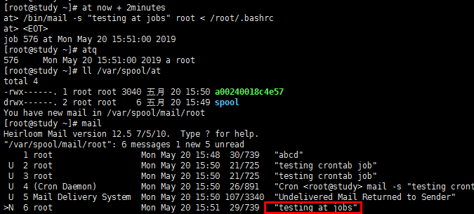

```
在图/var/spool/at中可以看到生成的文件，这个就是我们的工作排程，可以打开文件看，里面的内容最下部其实就是我们输入的可执行命令.
```


# cron

> 由crond服务提供，crontab指令所产生的的要运作的工作都以文本文件的方式写入 /var/spool/cron/目录内，每个用户独立一个文件。

```
权限限制相关文件执行流程：
1. /etc/cron.allow, 写入改文件的使用者才能使用该命令;
2. /etc/cron.deny, 如果/etc/cron.allow不存在时才查找该文件，写在该文件的使用者不能使用at，其他都可以使用;
```

```
crontab [-u username] [-ler]
选项参数：
-u: 只有root可以使用该参数，作用是帮其他使用者建立crontab工作排程；
-e: 编辑crontab的工作内容；
-l: 查阅crontab的工作内容；
-r: 移除所有的crontab工作内容，若仅要移除一项，请用-e。
内容结构: cron表达式 指令
```

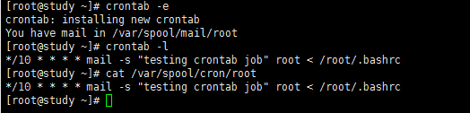

```
crontab保存的工作排程实际上就是 /var/spool/cron/ 目录中以用户名为文件名的文件，我们执行的-e实际上就是调用vim编辑这个文件而已，但是使用-e时crontab会检查我们的语法是否有误，图中表示每隔10分钟给root发一封邮件，邮件这里就不查看了。
```

### 系统的配置文件/etc/crontab, /etc/cron.d/*

```
cron服务的最低侦测限制是『分钟』，每隔1分钟cron就回去读取一次/etc/crontab和、var/spool/cron里面的数据内容。
```

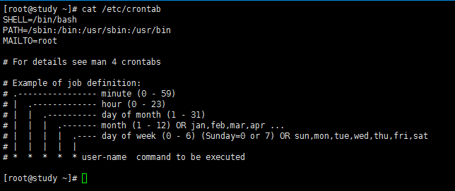

```
crontab -e是针对使用者设计的，一般系统性的任务，该怎么搞呢？这个时候就需要配置文件 /etc/crontab(这个是配置文件哦，可执行文件也是这个名字，但是实在/bin/crontab)，从图中可以看出，其实这个文件跟/var/spool/cron/中的文件没什么太大区别，只是中间多了个user-name而已。
上面的PATH指搜索可执行文件的位置，MAILTO指当该文件中的例行工作指令发生错误时，将stdout和stderr发送给root用户。
```
```
cron服务读取配置文件有以下三个
/etc/crontab, /etc/cron.d/*, /var/spool/cron/*
/etc/cron.d/中的文件格式个/etc/crontab格式一样，这个文件中的是cron的可执行脚本，
也就是说，自行开发的软件，写个脚本放在该目录下，就可以定时执行了。
```

总结：

1. 个人化的行为使用crontab -e，建立属于自己的例行工作，文件位置/var/spool/cron/${username};
2. 系统维护管理使用配置文件/etc/corntab，直接写入；
3. 自己开发软件，需要执行的脚本使用 vim /etc/cron.d/newfile;

# 进程管理

```
常驻在内存当中的进程通常都是负责一些系统所提供的的功能以服务用户各项任务，这些常驻程序就会被我们称为: 服务（daemon）。例如crond，atd等，服务这种一般以d结尾表示daemon。
```

## &，job control

>指令后面加上&，可以让该条指令在后台运行。

```
概念：
可以出现提示字符让我们操作的环境称为前景(foreground)，其他工作可以让我们让如背景(background)去暂停或运作，放入背景的工作是不可以使用ctrl+c来终止的。
job control注意：
这些工作所触发的进程必须来自你shell的子进程（只管理自己的bash）；
前景：你可以控制与下达指令的环境称为前景的工作（foreground）；
背景：可以自行运作的工作，你无法使用ctrl+c终止他，可以使用bg/fg呼叫该工作到前景；
背景中执行的程序不能等待terminal/shell的输入（input）。
```

`图中使用&将指令放入背景执行，jobs可以看到有job正在运行，前面的[1]代表工作号码。`

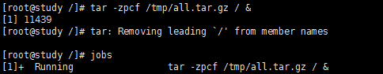

`将目前的工作丢到背景中『暂停』:ctrl+z`

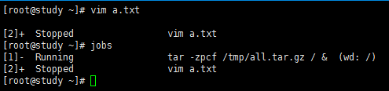

## jobs, fg, bg

```
jobs [-lrs]
选项参数：
-l: 除了列出job number与指令串之外，同时列出PID号码；
-r: 仅列出正在背景run的工作；
-s: 仅列出正在背景中暂停（stop）的工作。
```

```
fg %jobnumber
%jobnumber: jobnumber为工作号码，%可省略。
```

```
bg %jobnumber:
我们把前景的工作放到背景的时候用的是ctrl+z,这个时候该工作时stop的，我们使用bg指令让其在背景变成running，如下图。
```

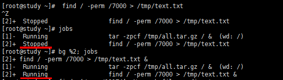


## netstat:追踪网络或插槽文件

```
nestat -[atunlp]
-a: 将目前系统上所有的联机、监听、socket数据都列出来；
-t: 列出tcp网络封包数据；
-u: 列出udp网络封包数据；
-n: 不以进程的服务名称，以端口号来显示；
-l: 列出目前正在网络监听（listener）的服务；
-p: 列出该网络服务的进程PID。
```

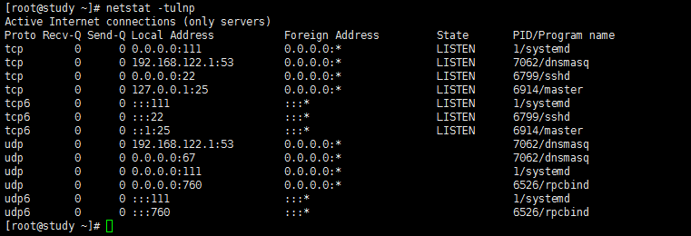

## dmesg：分析核心产生的信息

```
系统在开机的时候，核心回去侦测系统的硬件，你的某些硬件有没有被捕捉到，就与侦测有关。dmesg可以捉出来这些侦测信息。
```

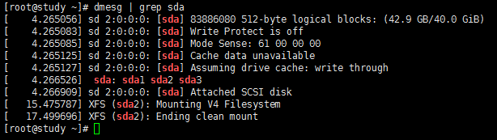

## 查询已开启文件或已执行进程开启的文件

```
fuser [-umv] [-k [-i] [-signal]] file/dir
选项参数：
-u: 除了进程的PID之外，同时列出该进程的拥有者；
-m: 后面接的档名会主动的上提到该文件系统的最顶层，对unmout不成功很有效；
-v: 可以列出每个文件与进程还有指令的完整相关性；
-k: 找出使用该文件/目录的PID，并试图以sigkill这个讯号给与PID；
-i: 必须与-k配合，在删除PID之前会先询问使用者的意愿；
-signal: 列如-1，-15等等，不加默认为SIGKILL（-9）哦！查看有哪些signal用man signal
```

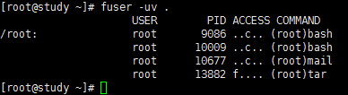

```
如上图：上图说当前目录(.)下有4个PID，9086,10009,10677,13882的进程，该进程属于root且指令分别为bash,bash,mail,tar; 
access代表的意思如下:
c: 此进程在当前目录下（非次目录）；
e: 可被出发为执行状态；
f: 是一个被开启的文件；
r: 代表顶层目录；
F: 文件被开启，在等待回应；
m: 可能为分享的动态函数库。
```

## lsof

> 列出被进程所开启的文件档名

```
lsof [-aUu] [+d]
选项与参数：
-a: 多项数据需要同时成立才显示出结果；
-U: 仅列出Unix like系统的socket文件类型；
-u: 后面接username，列出该使用者相关进程所开启的文件；
+d: 后面接目录，即找出某个目录底下已经被开启的文件。
```

`查找root的bash这只程序所开启的文件`

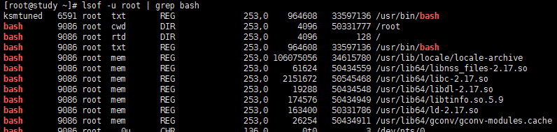

## pidof

> 找出某只正在执行的程序的PID

```
pidof [-sx] program_name
选项参数：
-s: 仅列出一个PID而不列出所有PID；
-x: 同时列出该program name可能的PPID那个进程的PID。
```

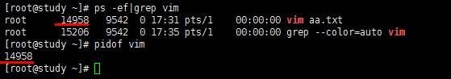


over...