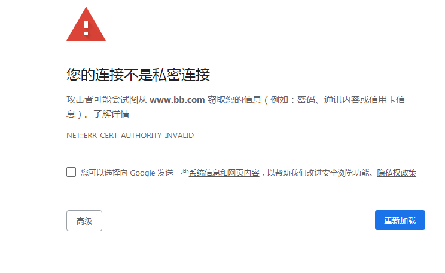
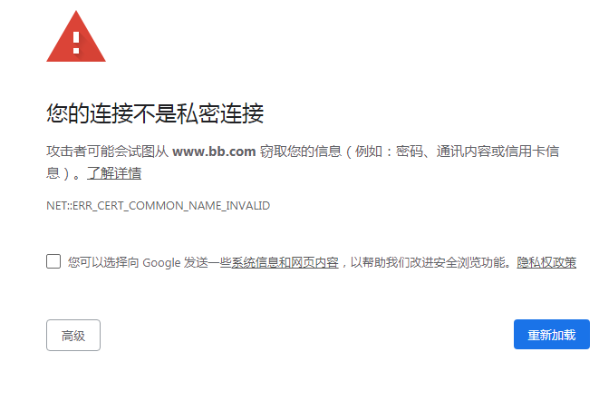
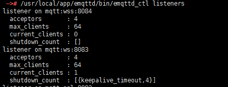
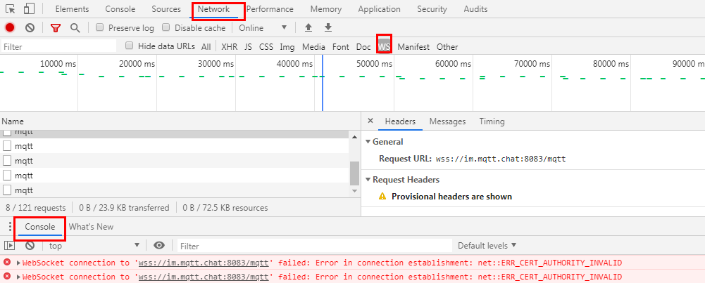
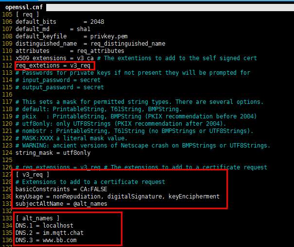
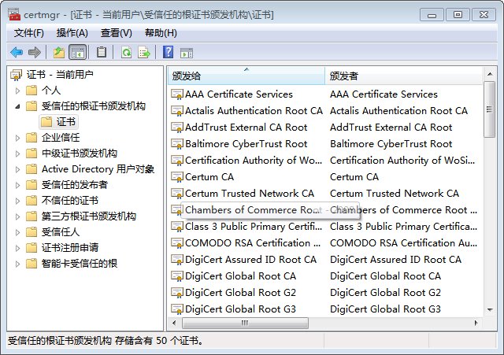
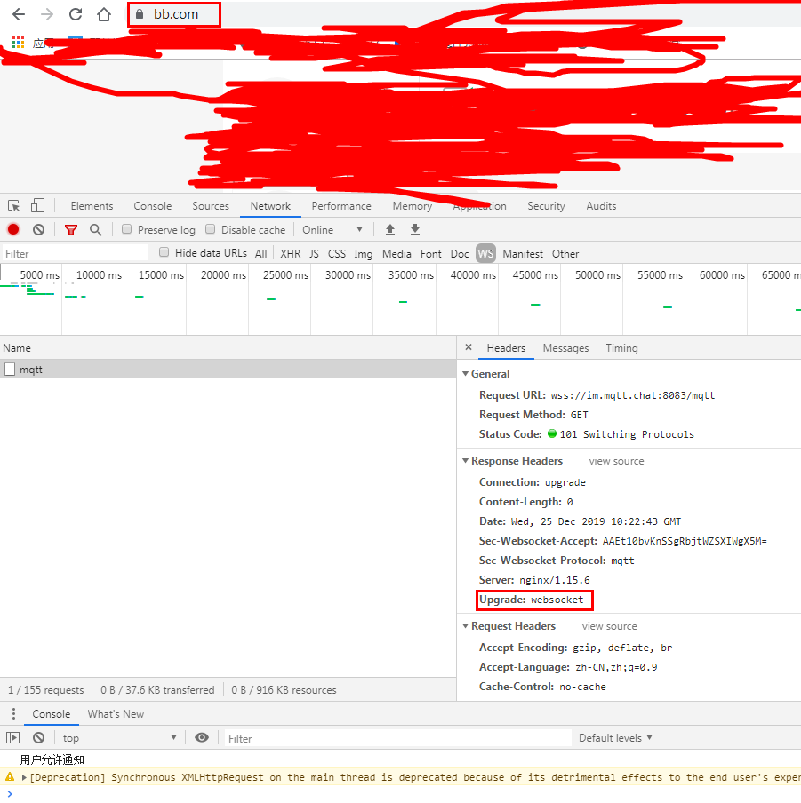

> # 记一篇http，ws通过nginx加壳打造https和wss

# 产生背景

我们通常开发的应用都是基于http的，但是在使用h5的notification功能的时候，要求必须是https才行，所以在这种类似的情况下不得不使用https，但是我们又不想改动原来的应用。这个时候我们就需要通过nginx做反向代理，在nginx这层加个ssl的壳。相当于是用户访问nginx时是https，nginx转发到目的服务器的时候就已经变成http了。**我们的ssl的壳只是加在nginx这层**。

ws加壳变成wss的原因是因为我们的应用在web端使用了websocket（连接mqtt），但是因为原应用变成https之后，ws会被浏览器broken，意思就是我们使用https，那么就必须使用wss。当然wss也是使用nginx反向代理，加个壳。

好了背景了解了，我们现在来开始处理这个转变过程中会出现的一些问题和解决办法。

# 第一步http转https

这一步，我们使用openssl可以生成自签名的证书，证书是.pem或者cer都可以，这个不影响。

生成的时候会让我们填一些信息，注意一下common_name，**填这个信息的时候需要填成域名**！后续会有其他方式生成，那个时候就不用填域名了，但是这里我们需要填成域名。

命令：

```properties
生成秘钥: openssl genrsa -out privkey.pem 1024/2038
生成key: openssl req -new -x509 -key privkey.pem -out server.pem -days 365
```

生成之后在nginx端配置上相应的证书，我为了方便，将证书放在和nginx.conf同样的位置了，后续也一样，我就不提了。

```properties
http {
...
 server {
        listen       443 ssl;
        server_name www.bb.com;
        
        ssl_certificate server.pem;
        ssl_certificate_key privkey.key;
        error_log   logs/error.log;
        client_max_body_size 60M;
        client_body_buffer_size 512k;
        location ~/.* {
            proxy_pass   http://127.0.0.1:7080;
        }
    }
...
}
```

**配置完成之后，在host配置www.bb.com的本地DNS**。

配置完之后，我们使用这个域名打开应用页面。这个时候会出现如下的界面，不安全的链接。当然，在这种情况下我们可以直接点高级，继续前往也能正确访问。



我们从图中可以看到是ERR_AUTHORITY_INVALID错误，这种是认证错误，说明证书不被信任。这种情况我们可以通过chrome导入受信任证书，或者通过windows的运行，输入certmgr.msc指令，导入我们生成的server.pem证书。

导入过后，我们再次重启浏览器，会发现依然是这个界面，只是错误变成了ERR_CERT_COMMON_NAME_INVALID，这个是错误的common_name，这个是啥东西，这个就是我们的域名不匹配证书导致的。



> **不管是上面的哪种错误，如果只是https，那么整个就算是完了，没有任何其他的问题，这种错误可以不用管它，但是如果有wss在的话这种情况就就必须要处理了**。

# wss

我们先来试试不处理上诉问题时wss会怎样。

首先我们必须明确的是，不管是ws还是wss，我们都得走nginx转。那么我们先来配一下wss的nginx转发的配置(**和上面使用的是同一个nginx，只是加了个配置**)。这里我们mqtt加了新的域名，im.mqtt.chat，并且我们使用8083为ssl端口。

```properties
http{
...
server {
        listen 8083 ssl;
        server_name im.mqtt.chat;
    
        ssl_certificate server.pem;
        ssl_certificate_key privkey.key;
        ssl_protocols SSLv3 SSLv2 TLSv1 TLSv1.1 TLSv1.2;
        ssl_session_cache shared:SSL:1m;
        ssl_session_timeout  10m;
        # ssl_prefer_server_ciphers on;
    

        location /mqtt{
            #反向代理到mqtt的ws端口8083，同时协议转换为http，这样服务器端代码就不需要做修改
            proxy_pass http://192.168.55.111:8083;
            proxy_http_version 1.1;
            proxy_set_header Upgrade $http_upgrade;
            #由于服务器端源码(建议大家做好大小写匹配)只匹配了"Upgrade"字符串,所以如果这里填"upgrade"服务器端会将这条http请求当成普通的请求,导致websocket握手失败
            proxy_set_header Connection "Upgrade";
            proxy_set_header Remote_addr $remote_addr;
            proxy_set_header X-Forwarded-For $proxy_add_x_forwarded_for;
            proxy_read_timeout 600s;
        }
    }
...
}
```

从上面的配置中，我们可以看到，我们使用和https一样的证书，我们在转发的过程中把/mqtt的wss请求转发到mqtt的地址，也就是proxy_pass的值，可以看到协议也是转成http了，8083是192.168.55.111这台机器上mqtt的ws监听端口。贴个图吧。



这里简单介绍一下为什么是ws会转给http吧。

## HTTP/1.1 Upgrade

详细的请查询：[HTTP升级机制](https://developer.mozilla.org/zh-CN/docs/Web/HTTP/Protocol_upgrade_mechanism)

http/1.1提供了一个升级的机制，协议的升级请求总是由端发起的；暂时没有服务端请求协议更改的机制。当客户端试图升级到一个新的协议时，可以先发送一个普通的请求（GET，POST等），不过这个请求需要进行特殊配置以包含升级请求。

特别这个请求需要添加两项额外的header：

```properties
# 设置Connection头的值为“Upgrade”来指示这是一个升级请求
Connection: Upgrade
# Upgrade头指定一项或多想协议名，按照有衔接排序，以逗号分隔
Upgrade: protocols
```

如果服务器决定升级这次连接，就会返回一个 `101 Switching Protocols`响应状态码，和一个要切换到的协议的头部字段Upgrade。 如果服务器没有（或者不能）升级这次连接，它会忽略客户端发送的 `"Upgrade` 头部字段，返回一个常规的响应：例如一个`200 OK`).

服务在发送 `101` 状态码之后，就可以使用新的协议，并可以根据需要执行任何其他协议指定的握手。实际上，一旦这次升级完成了，连接就变成了双向管道。并且可以通过新协议完成启动升级的请求。

所以，再来看我们的nginx配置当中多出来的其中两项：

```properties
proxy_set_header Upgrade $http_upgrade;
proxy_set_header Connection "Upgrade";
```

## 测试

配置好之后，我们来看看页面链接mqtt的情况。



我们打开控制台，可以咋netwrk下的ws标签下看到ws的请求，在console页可以看大ws证书出现的问题是ERR_CERT_AUTHORITY_INVALID，当然也有可能是和之前https一样的COMMON_NAME_ERR.这个就不演示了。反正这种错误就说明证书是不受信任的。

但是可能我们会想，我们不是已经把证书导入了吗，而且导入的还是受信任的根证书，为什么还会使不受信任呢。其实我们https连接的时候就可以看出来，路径上https是被叉掉了的，这就说证书是不信任的，那是什么情况呢。

## chrome解决自签名证书无效

chrome验证证书很严格，必须带有Subject Alternative Name.

签发csr(Certificate Signing Request 证书签名请求文件)时，也就是我们生成证书的时候，我们需要修改openssl的配置。

linux下找一下openssl.cnf文件。cp一份到当前open文件夹下面。

```
cp /etc/pki/tls/openssl.cnf ~/open/
```

第一步，在[ req ]节添加：

```
req_extetions = v3_req
```

第二步，添加v3_req节的配置

```
[ v3_req ] # Extensions to add to a certificate request 
basicConstraints = CA:FALSE 
keyUsage = nonRepudiation, digitalSignature, keyEncipherment 
subjectAltName = @alt_names
```

第三步，在alt_names添加受信任域名,这个受信任的域名用处就是，我们生成的证书只能是以下域名使用才行，否则会报COMMON_NAME_INVALID错误。

```
[ alt_names ]
134 DNS.1 = localhost
135 DNS.2 = im.mqtt.chat
136 DNS.3 = www.bb.com
```

改完之后是这样：



贴下代码：

```
[ req ]
...
req_extetions = v3_req
...
[ v3_req ]
basicConstraints = CA:FALSE
keyUsage = nonRepudiation, digitalSignature, keyEncipherment
subjectAltName = @alt_names

[ alt_names ]
DNS.1 = localhost
DNS.2 = im.mqtt.chat
DNS.3 = www.bb.com
```

为了我们生成一份儿证书，两个域名都可以使用，我这里就直接把两个域名都配置上了，方便而已，如果不嫌麻烦的可以分开。

**配置好之后我们使用我们的修改好的配置文件来生成我们的证书，以下命令会一次性生成crt证书和key，生成的时候会让填一些杂七杂八的信息，都可以乱填，因为我们配置这次我们修改了配置文件，证书信任的域名已经配置了，所以在这步当中让我们填的common_name也可以不用像之前那样填域名，随便填个值都行**。

```
openssl req -sha256 -newkey rsa:2048 -nodes -keyout  mssl.key -x509 -days 3650 -out  mssl.crt -config ./openssl.cnf -extensions v3_req
```

生成之后，我们也是需要将证书导入到受信任的证书。我这里就直接使用certmgr.msc来安装了，当然我们这次生成的是crt证书，这个可以直接双击安装。我这里贴一个cermgr.msc的图吧,在“操作->所有任务->导入”可以导入我们的证书。



导入证书之后，修改一下nginx的https和wss的证书配置。

```properties
http {
	server {
        listen       443 ssl;
        server_name www.bb.com;
        
        ssl_certificate mssl.crt;
        ssl_certificate_key mssl.key;
        error_log   logs/error.log;
        client_max_body_size 60M;
        client_body_buffer_size 512k;
        location ~/.* {
            proxy_pass   http://127.0.0.1:7080;
        }
    }
    
    server {
        listen 8083 ssl;
        server_name im.mqtt.chat;
    
        ssl_certificate mssl.crt;
        ssl_certificate_key mssl.key;
        ssl_protocols SSLv3 SSLv2 TLSv1 TLSv1.1 TLSv1.2;
        ssl_session_cache shared:SSL:1m;
        ssl_session_timeout  10m;
        # ssl_prefer_server_ciphers on;
    

        location /mqtt{
             #反向代理到mqtt的ws端口8083，同时协议转换为http，这样服务器端代码就不需要做修改
            proxy_pass http://192.168.55.111:8083;
            proxy_http_version 1.1;
            proxy_set_header Upgrade $http_upgrade;
            #由于服务器端源码(建议大家做好大小写匹配)只匹配了"Upgrade"字符串,所以如果这里填"upgrade"服务器端会将这条http请求当成普通的请求,

导致websocket握手失败
            proxy_set_header Connection "Upgrade";
            proxy_set_header Remote_addr $remote_addr;
            proxy_set_header X-Forwarded-For $proxy_add_x_forwarded_for;
            proxy_read_timeout 600s;
        }
    }   
}
```

可以看到我们两个地方都是改成了mssl.crt和mssl.key。reload一下nginx(nginx -s reload).

## 可以庆祝了

重启浏览器，我们可以看到，我们的链接变成安全的链接了。

mqtt也正常链接，没有报错了，查看mqtt的链接，也可以正常看到返回的是101，协议升级，header中Upgrade字段也返回了本次升级的协议是websocket。

测试通过，h5的Notification功能也正常使用。到此为止，ws和http加壳就算完成了。




over~~~