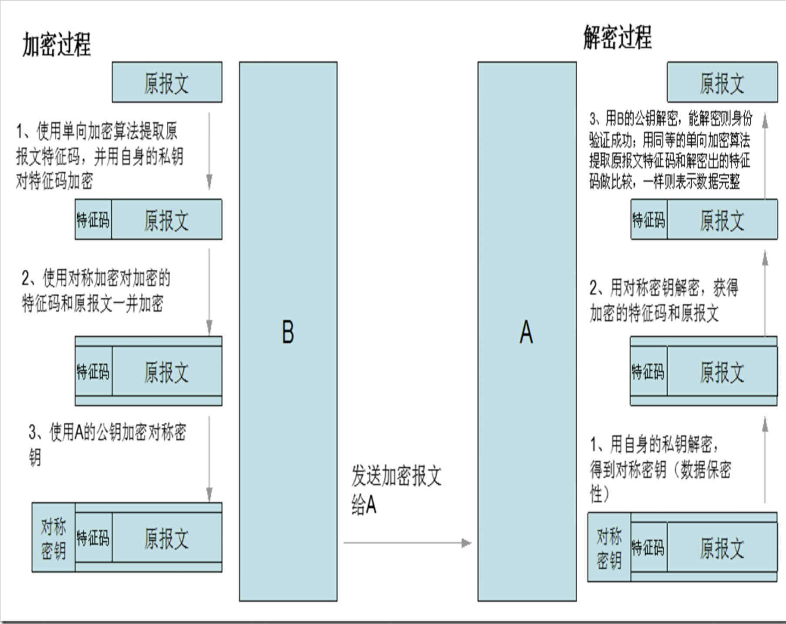
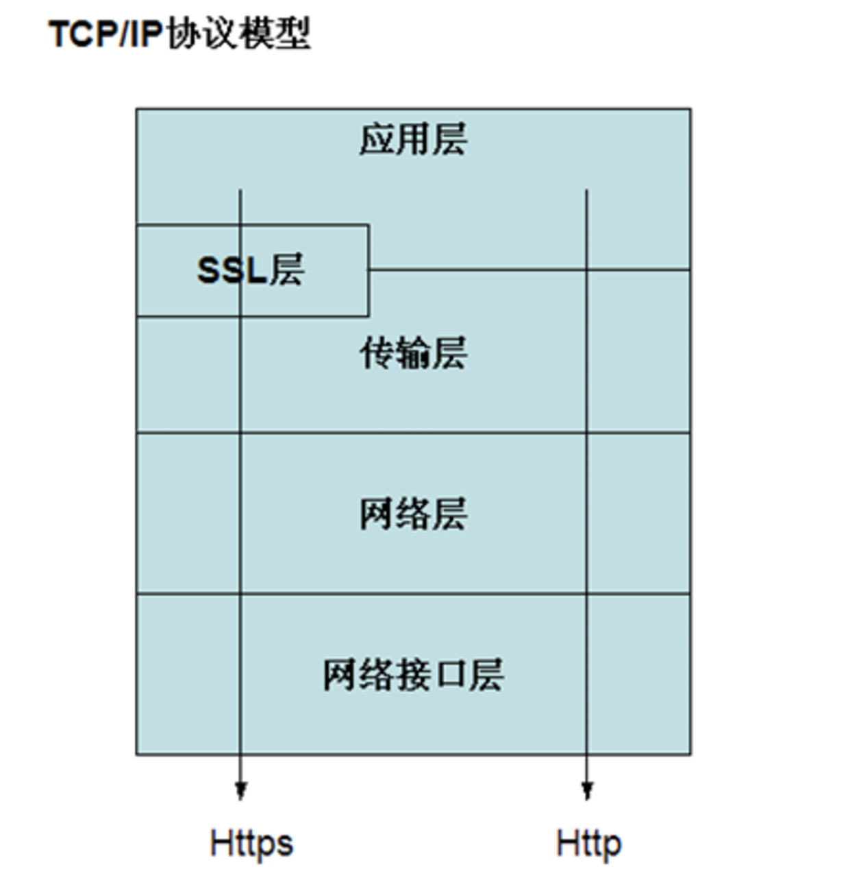
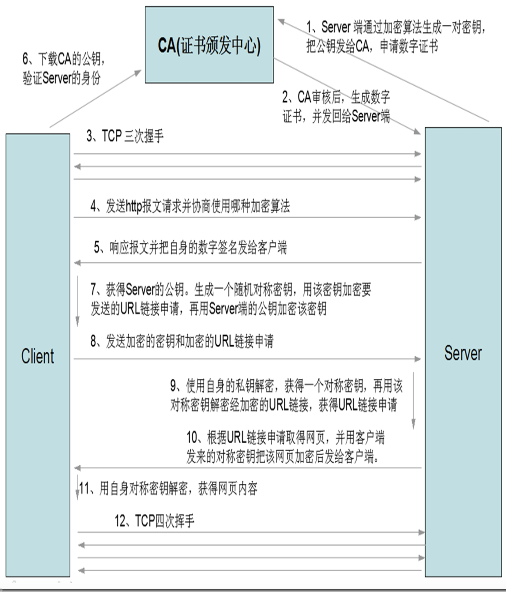

> # 加解密相关知识

## 信息安全标准

NIST（National Institute of Standards and Technology）美国国家标准与技术研究院，制定了网络信息安全与保密的三个要素：（这三大要素被简称为：CIA）

- 保密性(confidentiality): 信息不泄露给非授权用户、实体或过程，或供其利用的特性。（一般包括数据保密性、隐私性。）

- 完整性(Integrity): 数据未经授权不能进行改变的特性。即信息在存储或传输过程中保持不被修改、不被破坏和丢失的特性。（一般包括数据完整性、系统完整性。）

- 可用性(Availability): 可被授权实体访问并按需求使用的特性。即当需要时能否存取所需的信息。例如网络环境下拒绝服务、破坏网络和有关系统的正常运行等都属于对可用性的攻击；

尽管三要素能保证网络信息安全和保密，但从很多从事网络安全的研究人员的反馈发现，除了CIA外，还有另外两个标准也被经常提醒：

> - 真实性：一个实体是真实的，是可被验证的。要确保数据发送方的确是它所声称的那个人。

> - 可追溯性：一旦受到攻击，能追溯攻击发生的原处在什么地方。

## 加密方式和算法

### 单向加密

```
单向加密: 不可逆的加密
一般有以下这些加密算法:
MD5（128位）、SHA1、SHA256、SHA384、SHA512
```

> 特性

```
1. 定长输出: 无论原始数据是多大，结果大小都相同的
2. 雪崩效应: 输入的微小改变，将会引起结果的巨大改变
3. 不可逆(无法根据密文还原出原信息)
4. 速度快
5. 可用于校验数据完整性(雪崩效应)
```

### 对称加密

```
对称加密：采用单钥密码系统的加密方法，同一个密钥可以同时用作信息的加密和解密。
```

对称加密算法有以下这些: 

```objectivec
DES : 数据加密标准（56位密钥）
3DES
AES ：高级加密标准（128，192，256，384，512）
Blowfish
Twofish
IDEA
RC6
CAST5
```

> 特性

```
1. 加密、解密使用同一口令
2. 将明文分隔成固定大小的块，逐个进行加密
3. 加密速度相对较快
4. 可逆(能解密)
```

> 缺陷

```
1. 秘钥过多
2. 秘钥传输是问题
3. 秘钥交换，身份验证，数据完整性是问题
```

### 非对称加密

```
非对称加密: 由对应的一对唯一性密钥（即公开密钥和私有密钥）组成的加密方法。
常用加密算法: 
RSA
DSA:只能用于身份验证
EIGamal
```

> 特性

```
1. 密钥：public key, secret key （p/s）
2. 公钥是从私钥中提取出来的。
3. 公钥加密，只能私钥解密。私钥加密，也只能公钥解密。
4. 可逆
5. 加密速度慢
```

## 加密和解密的过程和原理

有没有想过这样一个问题，假设B与A通信，B向A发送报文，怎么才能保证B的报文安全、可靠地被A接收到，并且保证报文数据的完整性？

### 原理图



### 详细说明

#### 发送端B

- 为保证安全，要对报文加密。加密方法有三类：对称加密、公钥加密和单向加密。对称加密不安全，单向加密是不可逆的，因而使用公钥加密。

  > 问题：公钥加密安全（一般为2048位），但是加密过程太慢了，不适用当前网络需求，该怎么办？

- 为了解决上述问题，B可以用单向加密提取出报文的特征码（特征码能保证报文的数据完整性），再使用自身的私钥对特征码进行公钥加密（特征码数据小，对其进行公钥加密速度快），并把加密后的特征码附加到报文后。（使用私钥加密是为了验证身份）

  > 问题：这种方式能实现数据完整性和身份验证的检验，但是却缺失了报文的数据保密性，又该怎么办？

- 为了解决上述问题，B在把加密的特征码附加到报文后，把特征码和报文当做一个数据（假设为data），使用对称加密算法对该数据(data)加密得出一个密码，再把密码附加到该数据(data)后。为了使得在传输过程中密码不被其他人获取或篡改，使用A的公钥对密码进行加密（只有A的私钥能对其解密），把加密的密码附加到数据data后，再这些数据一并发送给A。

#### 接收端A

- A接收到B传来的报文，利用自身的私钥对其解密，获得密码。因为只有A的私钥能对B传来的报文（使用A的公钥加密密码）解密，所以能防止其他人对该传输的报文进行解密而获得其中的信息，保证了数据的保密性。
- A利用获得的密码解密其中对称加密的数据，获得经过加密的特征码和原报文。
- A使用B的公钥对该特征码解密，能解密则说明该报文是B发送过来的，实现了身份验证。（假设解密后的特征码是abcd）
- A使用同等单向加密算法对接收到的原报文提取其特征码。使用该特征码和解密后获得的特征码(abcd)做比较，如果一样，则说明原报文的数据完整。

> 问题：以上这种方式能保证数据完整性、身份验证和数据的保密性，在加密和解密的过程中都要用到对方的公钥，如何在传输过程中安全可靠地获得对方的公钥就成了关键的一环，那该如何做呢？
>  答：安全可靠地获取对方的公钥靠CA(Certificate Authority )证书授权中心来实现。

因而接下来，我们来说说CA。

## CA(证书授权中心)

### 证书标准X509

`x.509`: 定义了证书结构和认证协议标准；（基于公钥和数字签名）
用于：IP安全、`TLS/SSL`（传输层安全）和`S/MIME`（安全电子邮件通信）

`x.509`证书标准详细说明：

```undefined
1. 版本号（默认为1，如果有多个扩展，可能为3）
2. 证书序列号（是一个整数，在CA中唯一标识，表明发行了多少个证书）
3. 算法参数 （标志用了那种算法）
4. 发行者的名称（CA自己的名字）
5. 有效期限
6. 主体名称（证书拥有者名称）(很关键！！！)（个人用户使用的是个人用户名，主机使用的必须是主机名而不是ip地址）
7. 公钥（最重要）（公钥由证书拥有者提供）
8. 发行者的ID（CA的唯一编号）
9. 主体的ID（CA生成的证书拥有者唯一编号）
10. 扩展
11. CA的签名（用于验证CA的来源合法性）
```

CA是相对于发送方B和接收方A的第三方，是具有公信力的机构。

### 验证数字证书的过程

### 数字证书原理

以服务器A为例，A的数字签名步骤如下:

```
1. 获得A的公钥Pa
2. 提取Pa的特征码(单向加密)codeA
3. 用CA的私钥对codeA加密得到数字证书
```

所以数字证书的验证过成

```
1. 获得A的数字证书和公钥Pa
2. 用CA解密数字证书得到特征码codeA(CA是公正的机构)
3. 提取Pa的特征码codeA
4. 比对这两个特征码
```

当然还包括其他的一些验证，比如证书是否过期，公钥是否属于A所有等校验。

### 数字证书验证过程举例

B在发送之前获得A的数字证书或A在接收之前获得B的数字证书，都会去验证该数字证书的真伪。
以B在发送之前获得A的数字证书为例，说明验证数字证书的过程：

> 1. 要用对应给A发数字证书的那个CA的公钥去解密CA的签名，如果能解密，则说明A的数字证书确实是那个信任的CA所颁发的证书。

1. 解密出一段特征码，B再使用同样的单向加密算法提取A的数字证书的特征码，比较这两个特征码是否一样，如果一样，则表示获得的A的数字证书是完整的。
2. 此后，还要去验证该数字证书中的持有者是不是A，如果验证通过，才可以确定该数字证书确实是A的数字证书。
3. 确认该数字证书的拥有者是A后，还要去查看该数字证书是否在有效期限内和是否在CA的数字证书吊销列表中。

## SSL

安全套接层`SSL(Secure Sockets Layer)`, 及其继任者传输层安全TLS(Transport Layer Security)是为网络通信提供安全及数据完整性的一种安全协议。
**版本：sslv1, sslv2, sslv3**

> ssl是介于应用层和传输层之间的半层，一般被制作成公共共享库，要想使用ssl就要调用ssl共享库。

SSL层介于`应用层`和`传输层`之间，协议模型如下



### HTTPS通信过程

`HTTPS(Hyper Text Transfer Protocol over Secure Socket Layer)`，是以安全为目标的HTTP通道，简单讲是HTTP的安全版。即HTTP下加入SSL层，HTTPS的安全基础是SSL。

以https为例，进一步说明如何依靠CA来可靠的获得通信对方的公钥



https的主要实现过程说明：(以客户端向服务器发起一个网页请求为例)

```
1. 在通信之前，服务器端通过加密算法生成一对密钥，并把其公钥发给CA申请数字证书
2. CA审核后，结合服务端发来的相关信息生成数字证书，并把该数字证书发回给服务器端。
3. 客户端和服务器端经tcp三次握手，建立初步连接。
4. 客户端发送http报文请求并协商使用哪种加密算法。
5. 服务端响应报文并把自身的数字签名发给服务端。
6. 客服端下载CA的公钥，验证其数字证书的拥有者是否是服务器端（这个过程可以得到服务器端的公钥）。（一般是客户端验证服务端的身份，服务端不用验证客户端的身份。）
7. 如果验证通过，客户端生成一个随机对称密钥，用该密钥加密要发送的URL链接申请，再用服务器端的公钥加密该密钥
8. 客户端把加密的密钥和加密的URL链接申请一起发送到服务器。
9. 服务器端使用自身的私钥解密，获得一个对称密钥，再用该对称密钥解密加密后的URL链接申请，获得URL链接申请。
10. 服务器端根据获得的URL链接取得该链接的网页内容，并用客户端发来的对称密钥把该网页内容加密后发给客户端。
11. 客户端收到加密的网页内容，用自身的对称密钥解密，就能获得网页的内容了。
12. TCP四次挥手，通信结束。
```

以上是一个客户端在发起一个向服务器的数据请求(请求一个网页)的全部传输过程。

**注意: https在每一次新建连接的时候，都会生成随机的对称秘钥(第7步)**

over~~~
