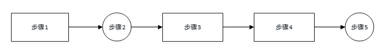

> # Amhadl和Gustafson定律和一些概念

> 参考资料《实战JAVA高并发程序设计》

## 必须知道的概念

> 同步(Synchronous)与异步(Asynchronous)

```
同步和异步通常用来形容一次方法的调用。
同步方法调用一旦开始，调用者必须等到方法调用返回后才能继续后边的行为。
异步方法调用更像是一个消息传递，一旦开始，方法调用就会立即返回，调用者可要继续后续操作。
```

> 并发(Concurrency)和并行(Parallelism)

```
都可以表示多个任务一起执行。
并发偏重于多个任务交替执行，而这多个任务可能还是串行的，例如单核CPU执行多个进程，进程之间交替执行。
并行则是多核cPU同时执行多个程序，这几个程序不会交替执行他们同时在各自的CPU上同时被执行。
```

> 临界区

```
临界区用来表示一种公共资源或者说共享数据，可以被多个线程使用，但是每一次只能有一个线程使用它。
一旦临界区资源被占用，其他线程想要使用这个资源，就必须等待。
例如：多人共用打印机
```

> 阻塞(Blocking)和非阻塞(Non-Blocking)

```
阻塞和非阻塞通常用来形容多线程间的影响。
比如一个线程占用了临界区资源，那么其他需要该资源的线程就必须等待，等待就会导致线程挂起，这种情况就称为阻塞。
非阻塞强调没有一个线程可以妨碍其他县城执行，所有线程都会尝试不断向前执行。
```

> 死锁(Deadlock)、饥饿(Starvation)和活锁(Livelock)

```
死锁饥饿活锁都属于多线程的活跃性问题。
死锁通常情况下指两个或多个线程同时占用彼此需要的资源，大家都不愿意释放自己的资源而继续等待对方释放资源，导致所有线程都无法继续运行下去。
饥饿指某一个或多个线程因为种种原因无法获得所需要的资源，导致一直赴法执行，比如优先级太低，高优先级进程不断抢占它需要的资源。
活锁是指线程1可以使用资源，但它很礼貌，让其他线程先使用资源，线程2也可以使用资源，但它很绅士，也让其他线程先使用资源。这样互相礼让，导致两个线程都无法使用资源。
```

## 并发级别

> 阻塞(Blocking)

```
线程阻塞后，在当前线程未得到其他线程释放自己所需资源之前，当前线程无法继续执行，syncronized和重入锁都会阻塞线程。
```

> 无饥饿(Starvation-Free)

```
如果线程有优先级，调度就会倾向于满足高优先级的进程，对资源的分配就会不公平。
对于非公平的锁来讲，系统允许高优先级的线程插队，这样就会导致低优先级线程产生饥饿。
如果不区分优先级，满足先来后到，就不会产生饥饿。
```

> 无障碍(Obstruction-Free)

```
无障碍是一种最弱的非阻塞调度。
线程不会因为临界区的问题导致其他线程被挂起，大家都可以进入临界区，
但是大家修改数据时，如果线程检测到数据被改坏了，为了确保数据安全，线程会回滚本次操作，
如果没有数据竞争发生，那么闲层就顺利完成自己的工作，走出临界区。
当临界区中存在严重的冲突时，所有县城都可能会不断回滚自己的操作，而导致没有一个线程可以走出临界区。
CAS是一种可能的无障碍实现。
阻塞可以相当于是悲观策略，无障碍相当于是乐观策略，类比数据库的悲观锁和乐观锁。
```

> 无锁(Lock-Free)

```
无锁的并行都是无障碍的。在无锁的状态下，所有的线程都能尝试对临界区进行访问。
但是不同的是无锁的并发保证必然有一个线程能够在有限步内万层操作离开临界区（对比无障碍）。
在无锁的调用中，一个典型的特点是可能会包含一个无穷循环，线程不断尝试修改共享变量，如果修改成功，name退出，否则继续尝试。
如果某个线程霉，总是尝试不成功，则会出现类似饥饿的情况。
原子类的CompareAndSet就是无锁的一种。
```

> 无等待(Wait-Free)

```
无所只要求一个线程可以在有限步内完成操作，而无等待则在无锁的基础上更进一步。
他要求所有的线程都必须在有限步内完成，这样就不会引饥饿问题。
如果限制步骤上限，还可以进一步分解为有界无等待和线程数无关的无等待几种，它们之间的区别只是对循环次数的限制不通。
一种典型的无等待结构就是RCU(Read-Copy-Update)。
RCU基本思想是读可以不加控制，但是在写的时候先取副本-->修改副本-->找机会回写。
```

## Amdahl与Gustafson定律

```
加速比定义：加速比 = 优化前系统耗时 / 优化后系统耗时。
开始讨论这俩货之前，我们先来定义一下，每个线程有很多个执行步骤，这些步骤包含可并行的和只能串行的。
```

> Amdahl

```
角度: 只有有限个相同的线程需要执行。
对执行单个线程而言: 串行执行时间a，并行执行时间b，对每个线程而言串行率 F = a / (a + b).
推导: n表示处理器个数，Tn表示使用n个处理器优化后的耗时，T1表示优化前耗时，为了便于分析我们假设有与核心处理器个数相同的n个线程在同时执行,Sn为加速比。
```

$$
Tn = na + b\\
T1 = n(a + b)\\
Sn = T1 / Tn=\frac{n(a + b)}{(na + b)} = \frac{(a + b)}{(a + \frac{b}{n})} \\
= \frac{1}{\frac{a}{(a + b)} +  \frac{b}{n(a + b)}} = \frac{1}{\frac{a}{(a + b)} +  \frac{a + b - a}{n (a + b)}}\\ 
=  \frac{1}{\frac{a}{(a + b)} + \frac{1}{n}  (1-\frac{a}{a + b})}\\
=\frac{1}{F + \frac{1}{n} (1 - F)}
$$

`根据以上公式，我们假定每个线程执行分为步骤1-5，每个步骤耗时100个时间单位，其中步骤2,5可以并行，1,3,4只能串行。`



```
串行比F = 300 / 500 = 0.6, 假设有两个核心，加速比Sn = 1 / (F + 1/2(1-F)) = 1.25.
当n->∞时，Sn = 1 / F = 1 / 0.6 = 1.67.
由此可见，为了提高系统速度，仅增加CPU的数量并不一定能起到有效的作用。
根据Amhadl定律，使用多核CPU对系统进行优化，效果取决于俄CPU的数量以及系统中串行化程序的比重，CPU越多，串行比重越小，则优化效果越佳。
```

> Gustafson

```
角度: 有无限个相同线程需要执行。
对执行和核心数n相同数量的线程而言: 串行时间a, 并行时间为b， F = a / (a + b).
如果单个CPU执行这个多线程需要时间: T1 = a + nb
```

$$
Sn = \frac{a+nb}{a+b} = \frac{a}{a+b} + \frac {nb}{a+b} = F + n(\frac{a + b - a}{a + b}) = F + n(1 - F) = n - F(n - 1)
$$

```
可以看到由于Gustafson定律与Amdahl定律的切入角度不通，这俩货的公式截然不同，我们更容易发现在Gustafson定律中，只要不断的累加处理器，就能获得更快的速度。
```

> 是否矛盾？

```
由于这两货结论不通，会不会是其中有一个结论是错的呢？
其实不是的，他们只是切入角度不通而已，偏重点不同而已。
Amhadl: 
总路程只有60km（类比有限的线程需要执行）
假设前30km已经行驶了1个小时，那么无论速度如何快(类比无限增加CPU个数)，平均速度都不可能超过60km/h.
Gustafson: 
路程无限长(类比有无限个线程需要执行)
假设前30km已经行驶了1个小时，那么只要我在后面的以更快的速度行驶（类比增加CPU个数），那么我总有一个时刻能够把平均速度提高到超过60km/h甚至90km/h.
```

```
从极端角度来说，假如系统中没有可被并行化的代码，即F=1，那么对于这两个定律，其加速比都是1.
反之如果全是可并行的代码，即F=0，那么对于这两个定律，其加速比都是n。
```

## JMM

> 原子性

> 可见性

> 有序性

> Happens-Before

