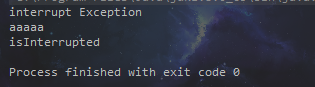
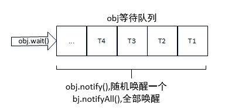
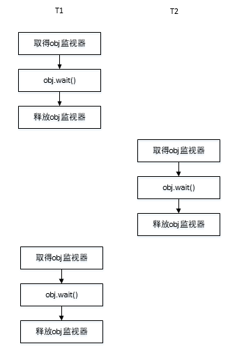
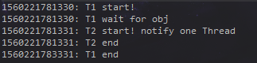
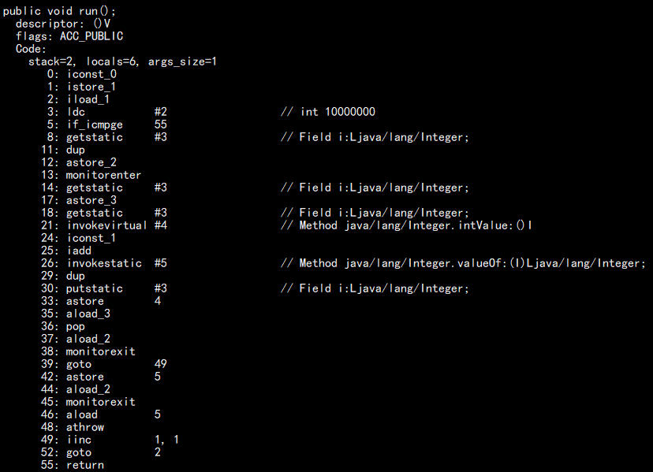

> # 线程基础

## 线程状态

```java
// Thread.State
public enum State {
    // 新建状态;
	NEW, 
    // NEW状态调用start()执行会进入该状态，表示线程所需要的资源都已经准备好;
	RUNNABLE,
    // 如果在执行过程中遇到了synchronized同步块，就会进入BLOCK阻塞状态，这个时候线程会暂停执行，直到获得锁;
	BLOCKED,
    //WAITING和TIMED_WAITING都表示等待，区别是WAITING会进入一个无时间限制的等待，TIMED_WAITING会进行有时限的等待
    // WAITING的线程 通常是等待一些特殊的事件，比如通过wait()方法的线程正在等待notify()方法，通过join()方法等待的线程则会等待目标线程终止。
    //等到了期望的时间线程就会再次执行
	WAITING,
	TIMED_WAITING,
    // 线程执行完毕后，则进入TERMINATED状态，表示结束。
	TERMINATED;
}
//线程从NEW状态出发后，不能再回到NEW状态，同理，处于TERMINATED的线程也不能再回到RUNNABLE状态。
```

## 线程sleep中断

```java
public void interrupt()  //中断线程
public boolean isInterrupted()  //判断是否被中断
public static boolean interrupted()  //判断是否被中断，并清除当前中断状态
```

***Thread.sleep()由于中断而抛出异常，此时，会清除中断状态。***

```java
// Thread
public static void main(String[] args) throws InterruptedException {
        Thread t1 = new Thread(){
            @Override
            public void run() {
                while (true){
                    if(Thread.currentThread().isInterrupted()){
                        System.out.println("isInterrupted");
                        break;
                    }
                    try {
                        Thread.sleep(2000);
                    } catch (InterruptedException e) {
                        System.out.println("interrupt Exception");
                        // 重新设置中断状态，sleep由于终端而抛出异常，此时他会清除中断状态，
                        // 如果不加处理，在下次循环开始的时候就会无法捕捉这个中断，故在异常处理中，再次设置中断状态
                        Thread.currentThread().interrupt();
                    }
                    System.out.println("aaaaa");
                    Thread.yield();
                }
            }
        };
        t1.start();
        Thread.sleep(1000);
        t1.interrupt();
    }
```

以上代码执行结果：



如果注释掉异常处理的代码Thread.currentThread().interrupt()，即不重新设置中断状态：


```
从以上两个结果中可以知道，如果在sleep的时候被中断，没有重新设置过中断状态，程序式不会终止执行的，
因为他的中断状态已经被清除，在新的循环开始的时候，无法捕捉到这个中断。
所以严格来讲，线程中断并不会使线程立即退出，而是给线程发出一个通知；
因此我们可以在线程接收到通知后，执行我们想要的操作，然后安全的退出线程，
而不是使用stop()来强制退出，因为强制退出可能会造成数据异常(这个就不举例了)。
```

## wait()和notify()

**这两个方法属于Object类，任何对象都可以调用，也就是说任何对象都可以作为线程的*监视器*。**

当在一个对象实例(obj)上调用wait方法后，当前线程就会在**当前对象(obj)**上等待，他会进入**当前对象(obj)**的等待队列。当obj.notify被调用时，会从obj的等待队列中随机选择一个线程并将其唤醒，notifyAll唤醒所有。

***因为wait和notify必须要先获得一个对象作为线程监视器，所以它必须包含在synchronzied语句中。***



`T1,T2获取监视器执行线程流程`




`wait，notify示例`

```java
final static Object obj = new Object();

public static void main(String[] args) {
    new T1().start();
    new T2().start();
}

static class T1 extends Thread {
    @Override
    public void run() {
        synchronized (obj) {
            System.out.println(System.currentTimeMillis() + ": T1 start!");
            try {                  
                System.out.println(System.currentTimeMillis() + ": T1 wait for obj");
                obj.wait();
            } catch (InterruptedException e) {
            }
        }
        System.out.println(System.currentTimeMillis() + ": T1 end");
    }
}
static class T2 extends Thread {
    @Override
    public void run() {
        synchronized (obj) {
            System.out.println(System.currentTimeMillis() + ": T2 start! notify one Thread");
            try {
                obj.notify();
                System.out.println(System.currentTimeMillis() + ": T2 end");
                Thread.sleep(2000);
            } catch (InterruptedException e) {
            }
        }
    }
}
```

结果



```
从图中时间戳可以看出，T1在输出"T1 end"的时候，是在T2sleep结束之后，也就是说，T2调用notify之后，还没有释放监视器obj。
```

***obj.wait和Thread.sleep都可以让线程等待，除了wait可以被唤醒外，还有个区别就是wait方法回什邡目标对象的锁，而sleep不会释放任何资源。***

## 等待线程结束(join)和谦让(yield)

> join

```java
public final void join()  //一直阻塞当前线程，直到join的目标线程执行完毕
public final synchronized void join(long millis) //当前线程最多等待millis就会继续执行
```

demo

```java
public volatile static int i=0;
public static class AddThread extends Thread{
    @Override
    public void run() {
        for(;i<10000;i++){}
    }
}
public static void main(String[] args) throws InterruptedException {
    AddThread t=new AddThread();
    t.start();
    t.join();
    System.out.println(i);
}
```

如上代码，如果没有使用t.join,那么主线程可能就直接输出0了，但是使用t.join之后，主线程会等待t的加入并执行完成，此时输出总是10000。

**join的本质是让调用线程(示例代码中的main线程)wait在当前线程对象实例上(示例代码中main方法所在的类)，被等待的线程(示例中t,main在等待t完成，t是被等待的)会在退出前调用notifyAll通知所有等待的线程继续执行。因此，我们需要注意的是不要再thread对象实例上使用类似的wait或notify等方法，可能会影响系统API或者被系统API影响。**

> yield

**这个方法一旦调用，他会是当前线程让出CPU；但是注意，让出CPU并不表示当前线程不执行。当前线程让出CPU后，还会进行CPU资源争夺，所以让出CPU后有可能又被当前线程抢到资源。**

## 守护线程(Daemon)

**守护线程是一种特殊的线程，它主要负责一些系统性的服务，比如垃圾回收线程，JIT线程都可以理解为守护线程。当一个程序用户线程已经全部结束时，也就意味着这个程序已经无事可做了，因此当程序只剩下守护线程时，java虚拟机就会自然退出了。**

```java
public static class TDaemon extends Thread {
    @Override
    public void run() {
        while (true) {
            try {
                System.out.println("aaaaa");
                Thread.sleep(1000);
            } catch (InterruptedException e) {
                e.printStackTrace();
            }
        }
    }
}
public static void main(String[] args) throws InterruptedException {
    TDaemon t = new TDaemon();
    // 如果不设置成守护线程，则t线程就是用户线程，不会随mian线程的结束而结束，会永远循环下去
    // 设置成守护线程后，当主线程结束后，该线程就自动退出了
    t.setDaemon(true);
    t.start();
    Thread.sleep(3000);
}
```

## synchronized

**指定加锁对象:** 对给定对象加锁，进入同步代码前要获得**给定对象**的锁。

**直接作用于*实例*方法:** 相当于对**当前实例**加锁，进入同步代码前要获得**当前实例**的锁。

**直接作用于静态方法:**相当于对**当前类**加锁(静态方法属于类级别调用)，进入同步代码前要获得**当前类**的锁

```
注意: 使用该关键字时特别注意，如果要对某部分加锁，一定要注意这些线程使用的锁对象obj是同一个对象哦！！！
```

`注意以下示例`

```java
	static int i = 0;

    public synchronized void incr() {
        i++;
    }

    @Override
    public void run() {
        for (int j = 0; j < 10000000; j++) {
            incr();
        }
    }

    public static void main(String[] args) throws InterruptedException {
        Thread t1=new Thread(new ThreadSynchronizedBad());
        Thread t2=new Thread(new ThreadSynchronizedBad());
        t1.start();
        t2.start();
        t1.join();
        t2.join();
        System.out.println(i);
    }
```

```
咋一看没啥问题，但是注意main方法中，两个thread的入参是两个不同的对象，也就是说两个线程都持有自己不同对象的锁，就不会存在竞争，各自运行自己的，最终i的值肯定也就不会是20000000.
修改建议: 
1. 把incr()设置成静态方法，对象监视器为当前类。
2. 两个Thread的参数传入同一个new ThreadSynchronizedBad()对象。
```

## 神奇的加锁对象Integer

```java
	static Integer i = 0;

    @Override
    public void run() {
        for (int j = 0; j < 10000000; j++) {
            synchronized (i) {
                i++;
            }
        }
    }

    public static void main(String[] args) throws InterruptedException {
        ThreadIntegerLockBad target = new ThreadIntegerLockBad();
        Thread t1=new Thread(target);
        Thread t2=new Thread(target);
        t1.start();
        t2.start();
        t1.join();
        t2.join();
        System.out.println(i);
    }
```

从上面代码中我们可以看到，我们加锁对象直接是一个Integer类型的对象，怎么看这段代码都毫无问题，这段代码是肯定能够输出20000000这个正确答案的。但是很不幸，结果不会如我们所愿，我们知道任何对象都是可以作为加锁对象的，但是为什么Integer不行，从上述代码中来看我们至始至终都是使用 i 这个对象，我们并没有修改过个对象，为什么不行呢？我们来看一下run()方法反编译的结果。



```
注意看21~37行，第21行首先调用Integer的intValue得到值，然后执行加一操作，继续在26行上调用了Integer的valueOf方法，实际执行的操作编程了i = Integer.valueOf(i.intVlaue()+1), 而这个方法会返回一个new Integer。
这下子问题清楚了，说明i这个对象其实一直在变，每次加一之后都会返回一个新的对象，这就会导致每次加锁都是一个新的对象，这个锁也就没什么意义了。
当然: 最简单的方式直接把加锁对象换成this就可以解决问题了。
```


over ...