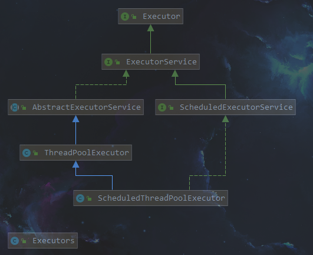
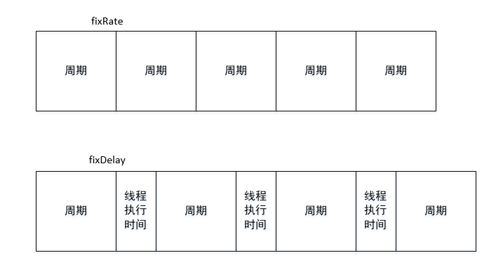
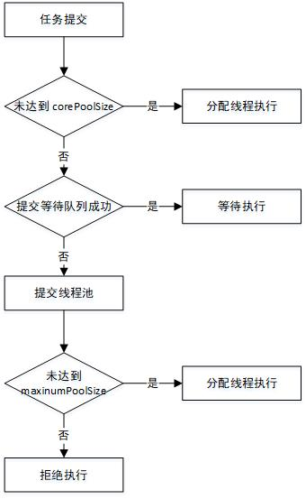
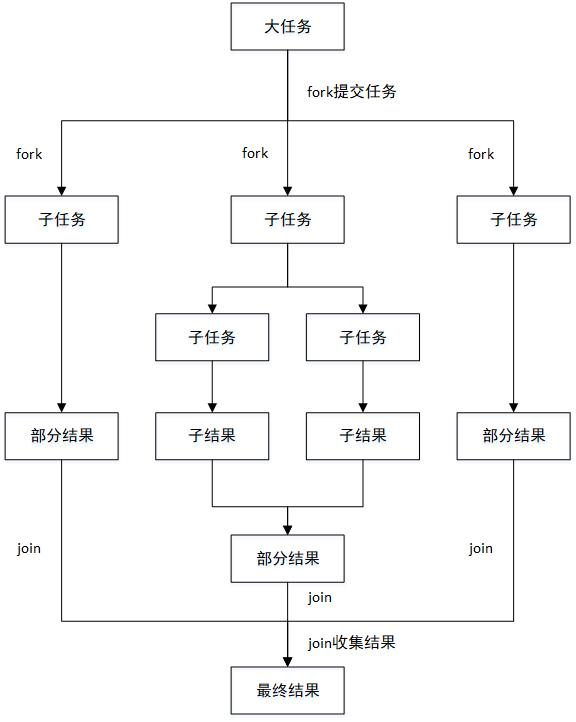
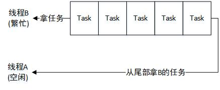

> # JDK线程池

> 类继承关系，方法太多就不列出来了。



## Executors

Executors扮演线程池工厂的角色，ThreadPoolExecutor就代表一个线程池。Executors提供了各种类型的线程池，主要有以下这些方法：

```
public static ExecutorService newFixedThreadPool(int nThreads);
public static ExecutorService newSingleThreadExecutor();
public static ExecutorService newCachedThreadPool();
public static ScheduledExecutorService newSingleThreadScheduledExecutor();
public static ScheduledExecutorService newScheduledThreadPool(int corePoolSize);
```

> newFixedThreadPool(int nThreads)

返回**固定线程数量**的线程池。该线程池中的**线程数量始终不变**，当有新任务提交时，若有空闲线程，则立即执行，否则存进任务队列，待有线程空闲时再执行。

> newSingleThreadExecutor()

返回一个**只有一个线程**的线程池，若多余一个任务被提交到该线程池，保存到任务队列，按FIFO的顺序执行。

> newCachedThreadPool()

返回一个可**根据实际情况调整线程数量**的线程池，线程池线程数量不确定，如果新任务没有空闲线程，则会**创建新的线程**处理任务，所有线程执行完之后，会丢回线程池复用。

> newSingleThreadScheduledExecutor()

返回一个ScheduledExecutorService对象，**线程池大小为1**。具有scheduled调度功能，如在入定的延迟或者周期性的执行某个任务。

> newScheduledThreadPool(int corePoolSize)

返回一个ScheduledExecutorService对象，**线程数量可以指定**。

## ScheduledExecutorService

ScheduledExecutorService的scheduleAtFiexRate()和scheduleWithFixedDelay()都可以周期性的调度任务，**如果任务遇到异常，会停止调度**，他们的调度区别如下：



```
对于fixRate而言，如果任务执行的时间大于等待的周期，那么会在任务执行完之后马上再次调度，不会出现任务重叠的情况！
```

```java
public static void main(String[] args) {
        ScheduledExecutorService exec = Executors.newScheduledThreadPool(10);
        Runnable runnable = () -> {
            try {
                Thread.sleep(1000);
            } catch (InterruptedException e) {
                e.printStackTrace();
            }
            System.out.println(System.currentTimeMillis() / 1000);
        };
   		//两秒输出一次，调度周期为2秒
        //exec.scheduleAtFixedRate(runnable,0,2, TimeUnit.SECONDS);
    	//三秒输出一次，调度周期为2秒，线程执行1秒
        exec.scheduleWithFixedDelay(runnable,0,2, TimeUnit.SECONDS);
    }
```

## ThreadPoolExecutor

Executors工厂对与ThreadPoolExecutor的创建都是基于其构造方法，来看一下核心的构造方法。

```java
public ThreadPoolExecutor(int corePoolSize,
                              int maximumPoolSize,
                              long keepAliveTime,
                              TimeUnit unit,
                              BlockingQueue<Runnable> workQueue,
                              ThreadFactory threadFactory,
                              RejectedExecutionHandler handler)
```

```
corePoolSize: 指定线程池中的线程数量;
maxinumPoolSize: 指定线程池中的最大线程数量;
keepAliveTime: 当线程池线程数量超过corePoolSize时，多余的线程的存活时间;
unit: keepaliveTime的时间单位;
workQueue: 任务队列，被提交单尚未被执行的任务;
threadFactory: 线程工厂，用于创建线程，一般用默认的就行;
handler: 拒绝策略，当任务太多来不及处理时，如何拒绝任务;
```

### workqueue

workQueue是一个BlockingQueue接口的对象，在ThreadPoolExecutor的构造函数中可使用一下几种：

**直接提交的队列**: 该功能由SynchronousQueue对象提供。SynchronousQueue是一种特殊的BlockingQueue，**没有容量**，每一次插入操作都要等待一个相应的删除操作，同理每一次删除操作都要等待相应插入操作。如果使用SynchronousQueue，**提交的任务不会被真实的保存，而总是将新任务提交给线程执行。如果没有空闲的线程，则尝试创建**，如果线程数量已达最大值，则执行拒绝策略，因此使用SynchronousQueue，通常要设置很大的maxinumPoolsize值，否则很容易执行拒绝策略。

**有界任务队列**(FIFO): 游街任务队列可以用ArrayBlockQueue实现，看到array很容易知道，这是个定值的，因此我们使用这个队列的时候需要**指定最大容量**，有了最大容量，才有界。有新的任务执行时，如果线程池的实际线程数小于corePoolSize，则会优先创建新的线程，若大于corePoolSize，则添加到等待队列。如果队列已满，则在总线程数不大于maxinumPoolSize的前提下创建新的线程执行任务。若大于maxinumPoolSize，则执行拒绝策略。**可见有界队列仅在任务队列满时，才可能将线程数提升到corePoolSize以上，除非系统非常繁忙，否则可以确核心线程数维持在corPoolSize**

**无界任务队列(FIFO)**:  无界任务队列可以通过LinckedBlockingQueue类实现。与有界队列相比，**除非系统资源耗尽，否则无界的队列村存在任务如对失败的情况**。

**优先任务队列**: 优先任务队列是带有优先级的队列，它通过PriorityBlockingQueue实现，可以指定任务执行的先后顺序。

看看ThreadPoolExecutor线程池的核心调度代码：

```java
public void execute(Runnable command) {
	if (command == null)
            throw new NullPointerException();
    /*
     * Proceed in 3 steps:
     *
     * 1. If fewer than corePoolSize threads are running, try to
     * start a new thread with the given command as its first
     * task.  The call to addWorker atomically checks runState and
     * workerCount, and so prevents false alarms that would add
     * threads when it shouldn't, by returning false.
     *
     * 2. If a task can be successfully queued, then we still need
     * to double-check whether we should have added a thread
     * (because existing ones died since last checking) or that
     * the pool shut down since entry into this method. So we
     * recheck state and if necessary roll back the enqueuing if
     * stopped, or start a new thread if there are none.
     *
     * 3. If we cannot queue task, then we try to add a new
     * thread.  If it fails, we know we are shut down or saturated
     * and so reject the task.
     */
    int c = ctl.get();
    if (workerCountOf(c) < corePoolSize) {
        if (addWorker(command, true))
            return;
        c = ctl.get();
    }
    if (isRunning(c) && workQueue.offer(command)) {
        int recheck = ctl.get();
        if (! isRunning(recheck) && remove(command))
            reject(command);
        else if (workerCountOf(recheck) == 0)
            addWorker(null, false);
    }
    else if (!addWorker(command, false))
        reject(command);
}
```

可以直接从代码和注释中看出执行逻辑。

workerCountOf获取当前线程池的线程总数。当总数小于corePoolsize时，会将任务通过addWorker直接将任务提交给线程池的方式直接调度执行。否则通过workerQueue.offer进入等待队列，如果进入等待队列失败，则再次尝试(可能在之前的检查中又有线程退出了，存在空闲线程)将任务直接提交给线程池，如果当前线程数已经达到maxinumPoolSize，则执行拒绝策略。



### 拒绝策略

当任务数量超过系统实际承载能力时，我们需要根据某种策略来拒绝新来的任务。JDK提供了四种拒绝策略：

**AbortPolicy**: 直接抛出异常，阻止系统正常工作;

**CallerRunsPolicy**: 只要线程池未关闭，该策略直接在调用者线程中，运行当前被丢弃的任务。显然这样不会真的丢弃任务，但是任务提交线程的性能极有可能会急剧下降;

**DiscardOldestPolicy**: 丢弃最老的一个请求，也就是即将被执行的一个任务(FIFO)，并尝试再次提交当前任务。

**DiscardPolicy**: 默认丢弃无法处理的任务，不予任何处理。如果允许任务丢失，这可能是很好的策略。

```java
public static void main(String[] args) throws InterruptedException {
        Runnable task = () -> {
            try {
                Thread.sleep(1000);
                System.out.println("thread-" + Thread.currentThread().getId() + ":" + System.currentTimeMillis());
            } catch (InterruptedException e) {
                e.printStackTrace();
            }
        };
        RejectedExecutionHandler reject = (r, executor) -> System.out.println(r.toString() + ": discard");
        ExecutorService exec = new ThreadPoolExecutor(5, 5, 0, TimeUnit.SECONDS, new ArrayBlockingQueue<>(5), Executors.defaultThreadFactory(), reject);
        for (int i = 0; i < Integer.MAX_VALUE; i++) {
            exec.execute(task);
            Thread.sleep(10);
        }
    }
```

```
从上面的demo中，程序很快就会执行拒绝策略，可以自行测试。自定义的拒绝策略，什么事都没有做，只是输出了一段xx:discard的信息。
```

### ThreadFactory

该接口只有一个方法，用来创建线程。当线程池需要新建线程的时候，就会调用这个方法。

```java
Thread newThread(Runnable r);
```

自定义线程可以帮助我们实现很多功能，例如可以跟中线程池在核实创建了多少线程，也可以自定义线程的名称，组，以及优先级等信息。

```java
public static void main(String[] args) throws InterruptedException {
    Runnable task = () -> {
        try {
            Thread.sleep(1000);
            System.out.println("thread-" + Thread.currentThread().getId() + ":" + System.currentTimeMillis());
        } catch (InterruptedException e) {
            e.printStackTrace();
        }
    };
    ThreadFactory fac = (runnable) -> {
        Thread t = new Thread(runnable);
        //打印出创建线程信息，设置成守护线程，当主线程退出时强制销毁
        System.out.println("create Thread...");
        t.setDaemon(true);
        return t;
    };
    ExecutorService exec = new ThreadPoolExecutor(5, 5, 0, TimeUnit.SECONDS, new ArrayBlockingQueue<>(5), fac);
    for (int i = 0; i < 10; i++) {
        exec.execute(task);
    }
    Thread.sleep(2000);
}
```

### 线程池ThreadPoolExecutor的扩展

ThreadPoolExecutor是一个可以扩展的线程池。它提供了beforeExecute()、afterExecute()和terminated()三个接口对线程池进行控制。这三个方法的调用在ThreadPoolExecutor.Worker.runWorker()方法中。

```java
final void runWorker(Worker w) {
    ...
    try {
        while (task != null || (task = getTask()) != null) {
          	...
            try {
                beforeExecute(wt, task);
                Throwable thrown = null;
                try {
                    task.run();
                }
                ...
                finally {
                    afterExecute(task, thrown);
                }
            } 
            ...
    } finally {
        //对terminated()的调用是从这里进入的
        processWorkerExit(w, completedAbruptly);
    }
}
```

线程池的扩展demo

```java
public static class MyTask implements Runnable {

    String name;

    public MyTask(String name) {
        this.name = name;
    }

    @Override
    public void run() {
        System.out.println("正在执行：ThreadID = " + Thread.currentThread().getId() + ": Task name = " + name);
        try {
            Thread.sleep(1000);
        } catch (InterruptedException e) {
            e.printStackTrace();
        }
    }
}

public static void main(String[] args) throws InterruptedException {
    ExecutorService exec = new ThreadPoolExecutor(5, 5, 0, TimeUnit.SECONDS, new ArrayBlockingQueue<>(5)) {
        @Override
        protected void beforeExecute(Thread t, Runnable r) {
            System.out.println("准备执行：ThreadID = " + Thread.currentThread().getId() + ": Task name = " + ((MyTask) r).name);
        }

        @Override
        protected void afterExecute(Runnable r, Throwable t) {
            System.out.println("执行完成：ThreadID = " + Thread.currentThread().getId() + ": Task name = " + ((MyTask) r).name);
        }

        @Override
        protected void terminated() {
            System.out.println("线程池退出");
        }
    };

    for (int i = 0; i < 5; i++) {
        exec.execute(new MyTask("MyTask-" + i));
        Thread.sleep(10);
    }
    exec.shutdown();
}
```

任务提交完成后，调用shutdown关闭线程池。这是个比较安全的方法，**如果当前有线程正在执行，该方法并不会暴力的终止所有任务，它会等待所有任务执行完成后再关闭线程池，但它并不会等待所有线程执行完成后再返回**。因此可以简单地理解成只是发送了一个关闭信号而已。再执行shutdown方法后，这个线程池就**不能在接受**其他新的任务了。

## ForkJoinPool

采用“分而治之”的思想，将大的任务分解成小的任务，分阶段处理，再将这些结果进行合成。在JDK中，给出了一个ForkJoinPool线程池，**对于fork()方法并不急着开启线程，而是提交给ForkJoinPool线程池进行处理**。绝大多数情况下一个线程是需要处理多个逻辑任务的，因此每个线程必然拥有一个任务队列。当线程A已经把自己的任务执行完成之后，而线程B还有一大堆任务等着处理，此时线程A就会帮助线程B，从线程B的任务队列中拿任务过来处理。**当线程试图帮助别人时，总是从任务队列的底部开始拿数据，而线程执行自己的任务是则是从顶部开始拿，这种行为有利于避免数据竞争**。使用fork()后系统多了一个执行分支(线程)，所以需要等到这个分支执行完毕，才有可能得到最终结果，因此join()就表示等待。**这个join()和普通线程的join()不一样哦**。





```java
// ForkJoin求和demo
public class ForkJoinCountTask extends RecursiveTask<Long> {

    private static final int THRESHOLD = 10000;
    private long start;
    private long end;

    public ForkJoinCountTask(long start, long end) {
        this.start = start;
        this.end = end;
    }

    protected Long compute() {
        long sum = 0;
        // 如果计算的个数没有超过阈值，直接开始计算
        if ((end - start) <= THRESHOLD) {
            for (long i = start; i <= end; i++) {
                sum += i;
            }
        } else {
            // 超过了阈值，则分成100个小任务
            long forkCount = (end - start) / THRESHOLD;
            if (THRESHOLD * forkCount < end) {
                forkCount++;
            }
            ArrayList<ForkJoinCountTask> tasks = new ArrayList<ForkJoinCountTask>();
            long pos = start;
            for (int i = 0; i < forkCount; i++) {
                long lastOne = pos + THRESHOLD;
                lastOne = lastOne > end ? end : lastOne;
                ForkJoinCountTask task = new ForkJoinCountTask(pos, lastOne);
                pos += THRESHOLD + 1;
                tasks.add(task);
                task.fork();
            }
            // 对小任务的结果进行求和
            for (ForkJoinCountTask t : tasks) {
                sum += t.join();
            }
        }
        // 返回部分结果
        return sum;
    }

    public static void main(String[] args) {
        ForkJoinPool pool = new ForkJoinPool();
        ForkJoinCountTask t = new ForkJoinCountTask(0, 20000);
        ForkJoinTask<Long> fjt = pool.submit(t);
        try {
            long res = fjt.get();
            System.out.println(res);
        } catch (InterruptedException e) {
            e.printStackTrace();
        } catch (ExecutionException e) {
            e.printStackTrace();
        }
    }
}
```

over ...