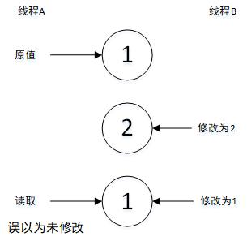

###### # 锁优化，无锁，ThreadLocal

#锁优化建议

## 代码层面上对锁进行优化

> 减小锁持有时间

在锁的竞争过程中，单个线程对锁的持有时间与系统性能有着很大关系。如果线程持有锁的时间很长，那么锁得竞争程度就会很大，这个很容易理解，就不解释了，贴个减小锁粒度的代码吧。

```java
//优化前
public synchronized void syncMethod(){
    //比较耗时但没必要同步的耗时操作
    otherOperate1();
    //只有这部分需要同步
    metextMethod();
    //比较耗时但没必要同步的耗时操作
    otherOperate2();
}

//优化后
public void syncMethod(){
    otherOperate1();
    synchronized(this){
    	metextMethod();
    }
    otherOperate2();
}
```

> 减小锁粒度

对于hashmap来讲，它本身是非线程安全的，我们当然可以直接对整个hashmap加锁，这样做的话加锁粒度就太大。hashmap本身属于数组+链表(或红黑树)来实现的，如果我们对于hashmap的操作仅限于每个数组位的链表来加锁，那假定默认数组长度为16，我们理论上可以同时支持16个线程的并发访问这个hashmap(假定每个线程都修改不通的链表)，这样的话加锁粒度就变小了，可以参考ConcurrentHashMap的实现。

> 读写分离锁来替换独占锁

在读多写少的场合，读与读之间的锁等待显然是没有必要的，那么读读操作不等待的情况下使用读写锁来替换独占锁显然是能够提高系统性能的。

> 锁分离

读写锁也是其中一种锁分离的思想。当然可以根据程序功能的特点，使用类似的分离思想，比如当两种操作互不影响，锁就可以分离，比如LinckBlockingQueue的take和put，take从头部取，put从尾部放入。

> 锁粗化

线程获取锁操作和释放锁操作都会耗时的，当某个线程连续对同一锁进行请求和释放的操作时，我们就可以整合成对一次锁的请求。比如以下demo，在for循环中频繁获得锁。

```java
public void demoMethod(){
    for(int i=0;i<COUNT;i++){
        synchronized(lock){
            //do sth
            //这种情况我们就可以把加锁放到for循环外边
        }
    }
}
```

## JVM层面上对锁的优化

代码层面上的锁优化是coder可控的，但是JVM层面是我们不可控的，但是一样不能阻止我们了解一下几种在JVM层面上对锁的优化。

> 锁偏向

锁偏向是一种对价锁操作的优化手段。**它的核心思想是：如果一个线程获得了锁，那么锁就进入偏向模式。当这个线程再次请求锁时，无需再做任何同步操作，这样就节省了大量有关锁申请的操作，从而提高程序性能**。当然，如果竞争比较激烈的场合，最有可能的情况就是每次都是不同的线程来请求相同的锁，这样偏向模式就失效了，这种情况下还不如不启用偏向锁。JVM参数-XX:+UseBiasedLocking开启偏向锁。

偏向锁理解：比方有个富翁有2个儿子，有个儿子(A)在外边不经常回来，有个儿子(B)频繁在家出入。但是房子钥匙只有富翁才有，这种情况下，B要进屋每次都要去问富翁拿钥匙(获取锁)，然后出房子的时候又要交回给富翁钥匙(释放锁)。偏向锁就是当B拿到锁之后，以后是B来获取锁的情况很大，那么富翁就将钥匙偏向B，即给B钥匙之后，B就不用给富翁钥匙了，这样每次B进出都不用再向富翁请求钥匙和归还钥匙。直到有一天A回来了，A去找富翁拿钥匙的时候(产生了锁竞争，偏向锁失败)，这个时候富翁就会消除偏向锁，将B的锁膨胀为轻量级锁。

> 轻量级锁

偏向锁失败后，虚拟机并不为立即挂起线程。它还会使用一种成为轻量级锁的优化手段。它只是简单地将对象头部作为指针，指向持有锁的线程堆栈内部，来判断一个线程是否持有对象锁。如果获得轻量级锁成功，则顺利进入临界区，否则表示其他县城先抢到了锁，当前线程的锁请求膨胀为重量级锁。

> 自旋锁

锁膨胀后，虚拟机为了避免线程真是IDE在操作系统层面挂起，虚拟机还会做最后的努力，自旋。由于当前线程暂时无法获得所，但是什么时候可以获得锁是一个未知数，CPU挂起线程和恢复线程是需要消耗时间片的，所以假定我们在极少时钟周期后就可以得到锁，那么CPU挂起线程可能是一种得不偿失的操作。因此，**系统会进行一次赌注：它假设在不久的将来，线程可以得到这把锁，因此虚拟机会让当前线程做有限个空循环。在若干次的循环后，如果可以得到锁，那就进入临界区，否则，将线程挂起**（毕竟自旋过多还是没法得到锁的话还不如挂起），自旋的次数有算法来确定，如果当前线程在自旋后获得了锁，那么系统会认为在下次的自选中它也会获得锁，就会增大自旋的次数。

> 锁消除

锁消除是一种更彻底的锁优化。JIT编译的时候，通过对上下文的扫描，去除不可能存在共享资源竞争的锁。比如我们在使用内置API的时候，如StringBuffer等。如下代码所示：

```
public String createString(){
    StringBuffer sb = new StringBuffer();
    sb.append("xxx");
    return sb.toString();
}
```

在如上的方法中，由于sb是局部变量，局部变量是在线程栈上分配的，属于线程私有的。因此不可能被其他线程访问。在这种情况下，JVM就会将这些无用的所操作去除。

锁消除会涉及逃逸分析。以上方法中变量sb显然没有逃逸出当前作用域，以此为基础才能将加锁操作去除。

逃逸分析必须在-server模式下进行，-XX:+DoEscapeAnalysis参数打开逃逸分析。使用-XX:+EliminateLocks参数打开锁消除。

# ThreadLocal

ThreadLocal是另一种解决线程安全的方式。它旨在让每个线程都拥有一份属于自己的对象，解决多个线程共享一个变量带来的问题。它为每个线程分配不同的对象，仅仅是起到了容器的作用，接下来看一下JDK具体的实现方式。

```java
// ThreadLocal.java
public void set(T value) {
    Thread t = Thread.currentThread();
    ThreadLocalMap map = getMap(t);
    if (map != null)
        map.set(this, value);
    else
        createMap(t, value);
}

ThreadLocalMap getMap(Thread t) {
    return t.threadLocals;
}

public T get() {
    Thread t = Thread.currentThread();
    ThreadLocalMap map = getMap(t);
    if (map != null) {
        ThreadLocalMap.Entry e = map.getEntry(this);
        if (e != null) {
            T result = (T)e.value;
            return result;
        }
    }
    return setInitialValue();
}

void createMap(Thread t, T firstValue) {
    t.threadLocals = new ThreadLocalMap(this, firstValue);
}

static class ThreadLocalMap {
    private void set(ThreadLocal<?> key, Object value) {
        ....
    }
}
```

```java
//Thread.java
//Thread类中有个ThreadLocalMap的对象
ThreadLocal.ThreadLocalMap threadLocals = null;
```

我们来看set方法，set的时候首先会获得当前线程 t ，然后以当前线程 t 为key获得当前线程的ThreadLocalMap，说白了就是Thread类中的全局变量threadLocals，可以看getMap方法，里面直接就返回了t.threadLocals。这是一个ThreadLocalMap对象，如果这个值为null，那表示还未初始化，会通过createMap()创建一个ThreadLocalMap对象。如果已经存在，那么会直接将value设置进去。其中key为ThreadLocal本身(this)。

继续来看get方法，get方法跟set方法获取threadLocalMap对象的逻辑是一样的。如果获取到的对象为null，那说明还未初始化，通过setInitialValue方法初始化，并返回一个默认值（默认值是在该方法中通过initalValue方法初始化的，可以通过子类覆盖该方法，返回自定义的默认值）。如果返回的ThreadLocalMap对象不为null，说明已经存在值了， 因此直接以ThreadLocal对象作为key，获取该对象中的值（set方法存入的时候也是以ThreadLocal作为key的），然后强转为合适的类型返回给当前线程。

***这里有个疑问：ThreadLocal在操作线程变量ThreaLocalMap对象set值的时候每次都是以自身this(ThreadLocla)为key。我们知道这个ThreadLocal一般全局只有一个，多个线程共享，在这种情况下，每个线程的中的ThreadLocalMap对象始终都只会存在一个k-v，k=threadLocal，v为泛型对象（可以通过以下代码进行调试，会发现每次set的key都是同一个，当然也很好理解，并不用调试）。既然这样，那Thread为什么要用一个ThreadLocalMap对象呢，直接用Object不是更好么（每一次的方法调用都会消耗CPU时间片，如果是Object的话直接返回会快些）？反正在get的时候都会涉及到强转。资料解释的是：我们在使用线程池的时候，每个线程是可能不会被销毁，这样ThreadLocalMap就可能导致内存泄漏，ThreadLocalMap内的Entry是弱引用，当外部强引用ThreadLocal对象被回收时，ThreadLocalMap的key就为null了，value也就会被回收，防止了内存泄漏。但是应用一般情况只有一个ThreadLocal，这个对象在应用启动过程中就不可能会被回收（手动除外，设置threadLocal=null或者重新对其赋值，就会回收掉原来那个），那这么做的意义在哪？或者说这么做的优点在哪？***

```java
static ThreadLocal<Integer> threadLocal = new ThreadLocal<>();

public static void threadLocal() {
    Runnable r = () -> {
        threadLocal.set(1);
        threadLocal.set(2);
        threadLocal.set(3);
    };
    new Thread(r).start();
}
```

# 无锁(CAS)

用CAS(Compare and Swap)比较交换来实现无锁，**它对死锁天生免疫**，它没有锁竞争带来的开销，比基于锁的方式拥有更优越的性能。但是对于应用来讲，如果业务逻辑很复杂，会极大的增加无锁的编程难度。

CAS有点类似于数据库的乐观锁，只不过CAS会在失败后再次尝试，直到尝试成功。具体的细节就不讲了比较好理解。

无锁的线程安全类有AtomicInteger,AtomicIntegerArray等等，他们都在java.util.concurrent.atomic包下。这种原子类存在ABA问题。不解释，直接看图。



这种情况在过程不重要的时候不算是什么大问题，比如计算操作，这种操作不会引起结果的改变，但是会在其他一些和对象变化过程有关的场景，这些普通版的小兵就无能为力了。这个时候就要使用带时间戳的AtomicStampedReference类了，不解释咯。

对无锁（CAS）的解释比较少，但是了解数据库的乐观锁的，都能够很好的理解这个东西，也比较好理解，Good Luck!。

over ...