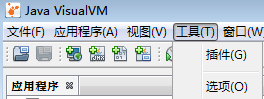
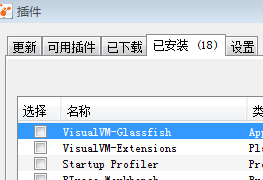
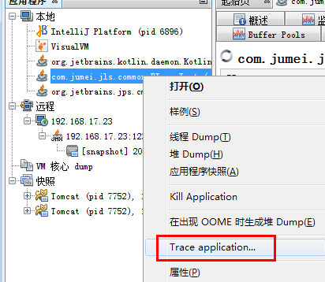
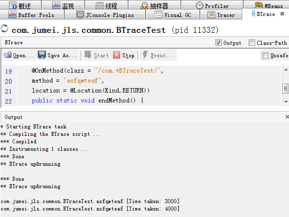
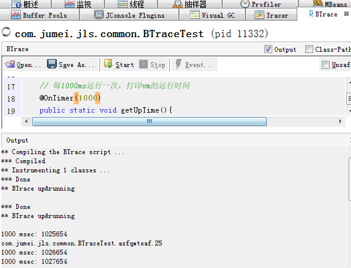
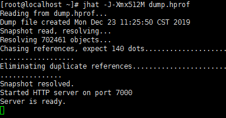
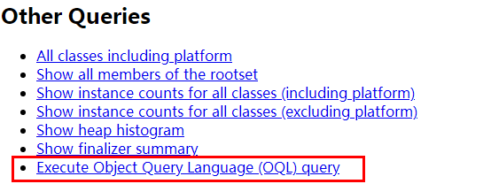
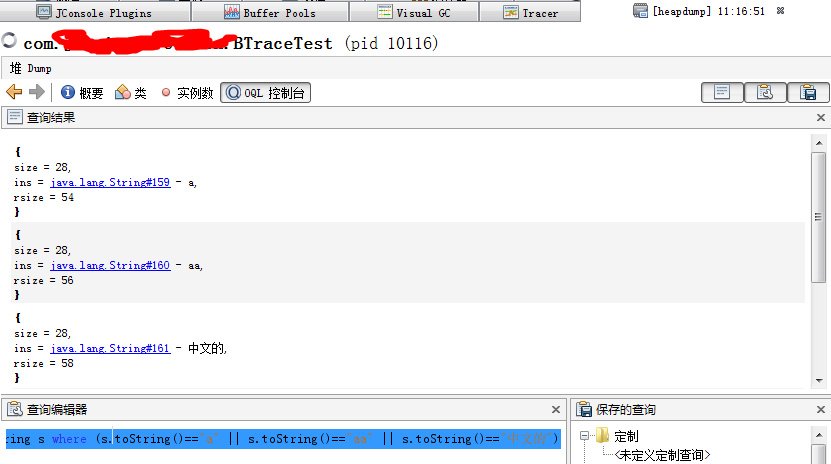

> # Btrace探索&OQL测试char占用大小

# 准备工作

> 以下都在jvisualvm上运行，windows上可能会装插件，如图所示，在工具-插件中，可以在线装，把可用插件中能装的都装上吧！





# Btrace

被测试的java代码

```java
public class BTraceTest {

   public static void main(String[] args) {
      while (true) {
         asfqwteaf(1);
      }
   }

   public static void asfqwteaf(int v) {
      System.out.println(System.currentTimeMillis());
      try {
         Thread.sleep(new Random().nextInt(5) * 1000);
      } catch (InterruptedException e) {
         e.printStackTrace();
      }
   }
}
```

## 测试1：监控方法执行用时

Btrace.java

```java
/* BTrace Script Template */
import com.sun.btrace.annotations.*;
import static com.sun.btrace.BTraceUtils.*;

@BTrace
public class TracingScript {
	/* put your code here */
     @TLS
    private static long startTime = 0;
    
    // class参数或者method参数用/exp/包裹到内容的采用正则表达式
    @OnMethod(clazz = "/com.+BTraceTest/",
    method = "asfqwteaf")
    public static void startMethod() {
        startTime = timeMillis();
    }
    
    @SuppressWarnings("deprecation")
    @OnMethod(clazz = "/com.+BTraceTest/",
    method = "asfqwteaf",
    location = @Location(Kind.RETURN))
    public static void endMethod() {
        print(strcat(strcat(name(probeClass()), "."),probeMethod()));
        print(" [");
        print(strcat("Time taken: ", str(timeMillis() - startTime)));
        println("]");
    }
}
```

windows上直接在jvisualvm上运行就好，如图所示，点击后会出现代码输入框，输入以上代码执行就好。



运行结果



**linux机器上可以装btrace插件**，执行以下命令，这个我就不演示了。

```
btrace 9284 Btrace.java
```

## 测试2：定时执行&在代码运行某一行时执行

Btrace.java

```java
/* BTrace Script Template */
import com.sun.btrace.annotations.*;
import static com.sun.btrace.BTraceUtils.*;

@BTrace
public class TracingScript {
	/* put your code here */
    // class参数或者method参数用/exp/包裹到内容的采用正则表达式
 	@OnMethod(clazz = "/com.+BTraceTest/",
    location = @Location(value=Kind.LINE, line=25))
    public static void online(@ProbeClassName String pcn ,@ProbeMethodName String pmn, int line){
        print(Strings.strcat(pcn,"."));
        print(Strings.strcat(pmn,"."));
        println(line);
    }

    // 每1000ms运行一次，打印vm的运行时间
    @OnTimer(1000)
    public static void getUpTime(){
        println(Strings.strcat("1000 msec: ", Strings.str(Sys.VM.vmUptime())));    
    }
}
```

运行结果



关于Btrace的还有其他一部分东西，总体来讲不是太多，网上也有一些博客。

详细可以去github上学习：[点这里进入github的Btrace](https://github.com/btraceio/btrace "萨芬的")

在以上github上samples文件夹下包含了所有的 demo，这里列举的demo只是点点而已。但是在本人的测试下，有一部分确实不能够正常执行（我的环境jdk1.8），难道是该技术太老了？搜了一下，网上也没有太多关于Btrace的博客。喜欢的朋友自行搞一下吧，还是有一定乐趣所在的。

# OQL（Object Query Language）

说到OQL，这他娘的可真是个好东西，不要以为现在有了jprofile,MAT等等一系列内存分析工具，这东西感觉好像没啥用处了哦。当然，jvisualvm用这个还会挺顺溜的。

我们在分析dump文件的时候就可以使用这家伙。

### jhat

第一个使用的地方就是jhat生成的html文件，不过这个不掩饰了，给下命令。

```properties
# 第一步，dump堆快照,当然，懒的也可以直接jvisualvm里头dump，点点点就可以
jmap -dump:live,file=dump.hprof <pid>
# 第二步，jhat生成html,-JXmx512M指定对大小，当然也可以不指定
jhat -J-Xmx512M dump.hprof
```

jhat指令会解析dump.hprof文件，并启动一个web server，端口是7000.

来嘛，给大佬上个图：



打开页面，拉到页面最底部，看吧：



找到用的地方就行了，我不在这儿玩儿，我去jvisualVM玩儿。

### jvisualVM

在界面上直接dump一个快照我就不说了，直接打开这个快照，然后点击OQL控制台，这个地方就是执行OQL的。至于OQL的详细介绍就烦请各位大佬自己去相关文档吧，跟sql有点相同语法，还是挺容易懂的，只是比较难记住而已（百度就当是手册吧，挺不错的，哈哈），小弟就不在此班门弄斧了。这里的重点是利用OQL来看一下char究竟是占用的多少字节。

检验方式: String底层是char，因此我们就采用查询String类型字符的深堆大小来看。每增长一个字符，查看深堆（rsizeof）占用的增长。由于浅堆（sizeof）不包含内容，所以同一个类型的浅堆大小都是一样的，我们就不看浅堆了，但是我会把浅堆大小给打出来，仅供欣赏。

sizeof 浅堆，rsizeof 深堆，具体可以查看OQL的相关资料。

先看一下类，其中a，aa和aaa字符串分别是一个字符，两个字符和三个中文字符。这里英文采用ISO8859-1编码是因为网上看了很多说采用这个编码的话char是占用一个字节，这里顺便验证一下是否是对的。

```java
public class Aaa {

   private String a;
   private String aa;
   private String aaa;

   public Aaa() {
      try {
         this.a = new String("a".getBytes("ISO8859-1"),"ISO-8859-1");
         this.aa = new String("aa".getBytes("ISO8859-1"),"ISO-8859-1");
      } catch (UnsupportedEncodingException e) {
         e.printStackTrace();
      }
      this.aaa = "中文的";
   }
}
```

启动类，不要误会，类名和上面Btrace测试时相同的，改了main方法而已，将就着看吧。

```java
public class BTraceTest {
   private static Aaa a = new Aaa();
   private static Aaa b = new Aaa();
   public static void main(String[] args) throws Exception{
      while (true) {
          Thread.sleep(10000);
      }
   }
}
```

通过visualvm中堆dump后，打开dump文件，执行OQL查询结果。

贴一下OQL：

```sql
select {ins:s,size:sizeof(s),rsize:rsizeof(s)} from java.lang.String s where (s.toString()=="a" || s.toString()=="aa" || s.toString()=="中文的")
稍微提一下，select后面的json串是规定结果输出的格式而已，sizeof(obj)打印obj的浅堆，rsizeof(obj)打印obj的深堆，s就是查询的字符串的值。看输出结果吧，，很容易懂的。
```

执行结果：



结果json:

```
{
    size = 28,
    ins = java.lang.String#159 - a,
    rsize = 54
}
{
    size = 28,
    ins = java.lang.String#160 - aa,
    rsize = 56
}
{
    size = 28,
    ins = java.lang.String#161 - 中文的,
    rsize = 58
}
```

从结果中课看到size都是28字节，这个是浅堆。

rsize大小分别为54，56，58字节，也就是说“a”->“aa”,增加了2个字节，“aa”->“中文的”增加了2个字节。除掉char占用的字节之外，离引用28字节还差不少，这个部分是String对象其他的内容占用的。

**因此可以看出ISO8859-1编码并没有什么卵用。每增加一个字符，占用的一个char都是2个字节。**

最后，我们来看一下这个Aaa对象的信息。

```
select {ins:s,size:sizeof(s),rsize:rsizeof(s)} from com.xxx.Aaa s where (s.a.toString()=="a")
```

看输出(这里就不贴图了，直接复制了输出)，浅堆为40，这个大小会根据它所持有的属性多少动态改变，可以自测。

```
{
    size = 40,
    ins = com.jumei.jls.common.Aaa#1,
    rsize = 150
}
```

> 来个一整个的吧，输出格式json有点长，怕让各位大佬受惊没有一下子给出来，这里贴出来了。

```
select {ins:s,size:sizeof(s),rsize:rsizeof(s),filed:{a:{value: s.a.toString(),size:sizeof(s.a),rsize:rsizeof(s.a)},aa:{value: s.aa.toString(),size:sizeof(s.aa),rsize:rsizeof(s.aa)},aaa:{value: s.aaa.toString(),size:sizeof(s.aaa),rsize:rsizeof(s.aaa)}}} 
from com.jumei.jls.common.Aaa s
```

select中的json部分，格式化过后的：

```
{
    ins:s,
    size:sizeof(s),
    rsize:rsizeof(s),
    filed:{
        a:{
            value: s.a.toString(),
            size:sizeof(s.a),
            rsize:rsizeof(s.a)
       },
       aa:{
            value: s.aa.toString(),
            size:sizeof(s.aa),
            rsize:rsizeof(s.aa)
       },
       aaa:{
           value: s.aaa.toString(),
           size:sizeof(s.aaa),
           rsize:rsizeof(s.aaa)
       }
   }
}
```

输出结果：

```
{
    size = 40,
    filed = {
        a = {
            value = a,
            size = 28,
            rsize = 54
        },
        aa = {
            value = aa,
            size = 28,
            rsize = 56
        },
        aaa = {
            value = 中文的,
            size = 28,
            rsize = 58
        }
    },
    ins = com.jumei.jls.common.Aaa#1,
    rsize = 150
}
```


over~~~