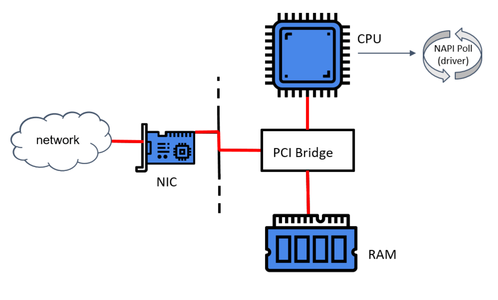

> # 各种概念及其他外部知识

其他地方包括官方文档上了解到的一些资源和一些相关技术的知识，不关心的可以略过。

# 概念

```
目前 Kubernetes 中的业务主要可以分为
长期型（long-running）、批处理型（batch）、节点后台支撑型（node-daemon）和有状态应用型（stateful application）；分别对应的小机器人控制器为 Deployment、Job、DaemonSet 和 StatefulSet
```

```
Kubernetes 重要设计理念之一，即所有的操作都是声明式（Declarative）的而不是命令式（Imperative）的。声明式操作在分布式系统中的好处是稳定，不怕丢操作或运行多次，例如设置副本数为 3 的操作运行多次也还是一个结果，而给副本数加 1 的操作就不是声明式的，运行多次结果就错了
```

## 名词

```properties
SLA: 服务等级协议 
SLO: 服务等级目标
SLI: 服务等级指标
## 定义一个可执行的SLA，好的SLO和SLI是必不可少的
## https://blog.csdn.net/belalds/article/details/92833720
CNCF(Cloud Native Computing Foundation): 云原生计算基础
SMI(Service Mesh Interface): 服务网格接口
OAM(Open Application Model): 开放应用模型
CRI(Container Runtime Interface): 容器运行时接口，提供计算资源
CNI(Container Network Interface): 容器网络接口，提供网络资源
CSI(Container Storage Interface): 容器存储接口，提供存储资源
```

> CRI-O是云原生计算基金会（CNCF）的Kubernetes孵化器的一个开源项目–不是OCI项目。它基于Docker架构的早期版本，而containerd是一个直接的CNCF项目，它是一个更大的容器运行时，该运行时包含runc的参考实现。containerd负责镜像传输和存储，容器执行和监督，以及支持存储和网络插件的底层功能。Docker在五个最大的云提供商（阿里云，AWS，Google Cloud Platform，IBM Softlayer和Microsoft Azure）的支持下，将containerd捐赠给了CNCF，其协议是作为多个容器平台和容器编排系统的核心容器运行时。

# 康威定律

百度吧兄弟

```
第一定律 组织沟通方式会通过系统设计表达出来。

第二定律 时间再多一件事情也不可能做的完美，但总有时间做完一件事情。

第三定律 线型系统和线型组织架构间有潜在的异质同态特性。

第四定律 大的系统组织总是比小系统更倾向于分解。
```

# 了解Cilium相关

> https://blog.csdn.net/flynetcn/article/details/115768287

## 什么是NAPI

NAPI 是 Linux 上采用的一种提高网络处理效率的技术，它的核心概念就是不采用中断的方式读取数据，而代之以首先采用中断唤醒数据接收的服务程序，然后 POLL 的方法来轮询数据。

## 为什么使用NAPI

1. 中断缓和 (Interrupt mitigation)。在日常使用中，网卡产生的中断可能达到每秒几千次，而如果每次中断都需要系统来处理，是一个很大的压力，而 NAPI 使用轮询时是禁止了网卡的接收中断的，这样会减小系统处理中断的压力；
2. 数据包节流 (Packet throttling)，NAPI 之前的 Linux NIC 驱动总在接收到数据包之后产生一个 IRQ，接着在中断服务例程里将这个 skb 加入本地的 softnet，然后触发本地 NET_RX_SOFTIRQ 软中断后续处理。如果包速过高，因为 IRQ 的优先级高于 SoftIRQ，导致系统的大部分资源都在响应中断，但 softnet 的队列大小有限，接收到的超额数据包也只能丢掉，所以这时这个模型是在用宝贵的系统资源做无用功。而 NAPI 则在这样的情况下，直接把包丢掉，不会继续将需要丢掉的数据包扔给内核去处理，这样，网卡将需要丢掉的数据包尽可能的早丢弃掉，内核将不可见需要丢掉的数据包，这样也减少了内核的压力。

## NAPI的缺点

1. 对于上层的应用程序而言，系统不能在每个数据包接收到的时候都可以及时地去处理它，而且随着传输速度增加，累计的数据包将会耗费大量的内存，经过实验表明在 Linux 平台上这个问题会比在 FreeBSD 上要严重一些；
2. 另外一个问题是对于大的数据包处理比较困难，原因是大的数据包传送到网络层上的时候耗费的时间比短数据包长很多（即使是采用 DMA 方式）。所以，NAPI 技术适用于对高速率的短长度数据包的处理。

## 网卡收包简要流程



```
1. 网卡驱动初始化。
   1. 网卡获得一块物理内存，作用收发包的缓冲区（ring-buffer）。这种方式称为 DMA（直接内存访问）。
   2. 驱动向内核 NAPI（New API）注册一个轮询（poll ）方法。
2. 网卡从云上收到一个包，将包放到 ring-buffer。
3. 如果此时 NAPI 没有在执行，网卡就会触发一个硬件中断（HW IRQ），告诉处理器 DMA 区域中有包等待处理。
4. 收到硬中断信号后，处理器开始执行 NAPI。
5. NAPI 执行网卡注册的 poll 方法开始收包。
```

关于 NAPI poll 机制：

- 这是 Linux 内核中的一种通用抽象，任何等待不可抢占状态发生（wait for a preemptible state to occur）的模块，都可以使用这种注册回调函数的方式。
- 驱动注册的这个 poll 是一个主动式 poll（active poll），一旦执行就会持续处理 ，直到没有数据可供处理，然后进入 idle 状态。
- 在这里，执行 poll 方法的是运行在某个或者所有 CPU 上的内核线程（kernel thread）。虽然这个线程没有数据可处理时会进入 idle 状态，但如前面讨论的，在当前大部分分布 式系统中，这个线程大部分时间内都是在运行的，不断从驱动的 DMA 区域内接收数据包。
- poll 会告诉网卡不要再触发硬件中断，使用软件中断（softirq）就行了。此后这些 内核线程会轮询网卡的 DMA 区域来收包。之所以会有这种机制，是因为硬件中断代价太 高了，因为它们比系统上几乎所有东西的优先级都要高。

NAPI 驱动的 poll 机制将数据从 DMA 区域读取出来，对数据做一些准备工作，然后交给比 它更上一层的内核协议栈。