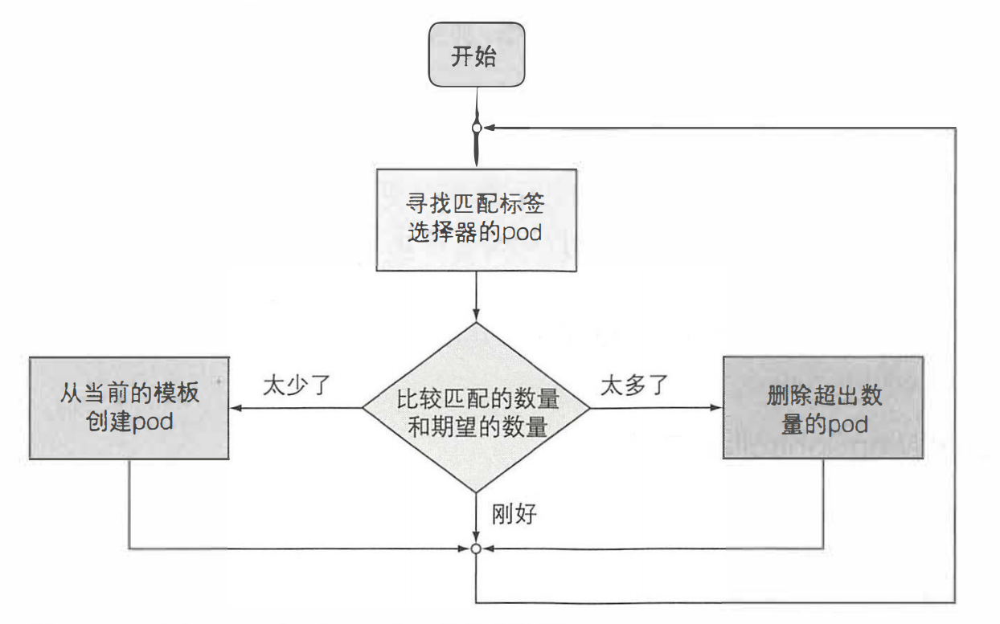
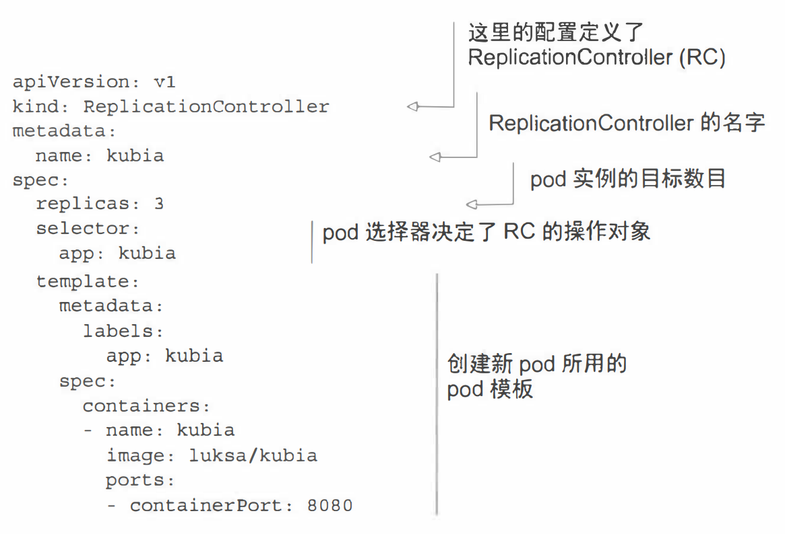

> # k8s各种yaml资源(二)

## explain的使用-查看yaml属性

yaml文件配置属性很多，可以通过kubectl explain  xxx这种方式来查看某个节点下都可以配置哪些属性。**输出会包含我们需要写的yaml文件kind，version，field等信息**

**后续yaml文件都是测试版，不包含所有字段，详细字段请参阅kubectl explain自行发掘**

`查看job类型的yaml能配哪些属性`

```
[root@master1 kubeyaml]# kubectl explain job
KIND:     Job
VERSION:  batch/v1

DESCRIPTION:
     Job represents the configuration of a single job.

FIELDS:
   apiVersion	<string>
     APIVersion defines the versioned schema of this representation of an
     object. Servers should convert recognized schemas to the latest internal
     value, and may reject unrecognized values. More info:
     https://git.k8s.io/community/contributors/devel/sig-architecture/api-conventions.md#resources

   kind	<string>
     Kind is a string value representing the REST resource this object
     represents. Servers may infer this from the endpoint the client submits
     requests to. Cannot be updated. In CamelCase. More info:
     https://git.k8s.io/community/contributors/devel/sig-architecture/api-conventions.md#types-kinds

   metadata	<Object>
     Standard object's metadata. More info:
     https://git.k8s.io/community/contributors/devel/sig-architecture/api-conventions.md#metadata

   spec	<Object>
     Specification of the desired behavior of a job. More infod
     https://git.k8s.io/community/contributors/devel/sig-architecture/api-conventions.md
  
  status	<Object>
     Current status of a job. More info:
     https://git.k8s.io/community/contributors/devel/sig-architecture/api-conventions.md
```

除不需要关系的status之外，可以看到支持的field有kind,version,metadata,spec。

`查看job的spec属性都能配哪些`

```
[root@master1 kubeyaml]# kubectl explain job.spec
KIND:     Job
VERSION:  batch/v1

RESOURCE: spec <Object>

...

FIELDS:
   activeDeadlineSeconds	<integer>
     Specifies the duration in seconds relative to the startTime that the job
     may be active before the system tries to terminate it; value must be
     positive integer

   backoffLimit	<integer>
     Specifies the number of retries before marking this job failed. Defaults to
     6

   completions	<integer>
     Specifies the desired number of successfully finished pods the job should
     be run with. Setting to nil mean
   ...
```

## Pod

是否需要在pod中使用多个容器？

```
1. 它们需要一起运行还是说可以在不同的主机上运行？
2. 它们是一个独立的整体还是相互独立的组件？
3. 它们必须一起进行扩缩容还是可以分别进行？
```

## ReplicationController

### 介绍

> 构成

```properties
label selector (标签选择器): 用于确定ReplicationController作用域中有哪些pod
replica count (副本个数): 指定应运行的pod 数量
pod template (pod模板): 用于创建新的pod 副本
```

> ReplicationController的协调流程



> 优点

```
1. 确保一个pod(或多个pod副本)持续运行,方法是在现有pod丢失时启动一个新pod
2. 集群节点发生故障时,它将为故障节点上运行的所有pod(即受ReplicationController控制的节点上的那些pod创建替代副本
3. 它能轻松实现pod的水平伸缩,手动和自动都可以
```
**注意: pod 实例永远不会重新安置到另一个节点。 相反， ReplicationController 会
创建一个全新的 pod 实例， 它与正在替换的实例无关**

### yaml定义



```
Kubemetes会创建一个名为kubia的新ReplicationController,
它确保符合标签选择器app=kubia的pod实例始终是3个,
当没有足够的pod时，根据提供的pod模板创建新的pod
```

> TIPS

```
模板中的pod标签显然必须和ReplicationController的标签选择器匹配，否则控
制器将无休止地创建新的容器。因为启动新 pod不会使实际的副本数量接近期望的
副本数量。为了防止出现这种情况，API服务会校验ReplicationController的定义，
不会接收错误配置。
根本不指定选择器也是一种选择。在这种情况下，它会自动根据pod模板中的
标签自动配置。
```

### 删除rc保留pod

```shell
## 删除kubia空间下kubia-err这个rc,指定--cascade=false来保留pod
$ kubectl delete rc kubia-err -n kubia --cascade=false

## 再次apply名称为kubia-err的rc的yaml，又可以重新管理之前保留的pod
$ kubectl apply -f kubia-err.yaml -n kubia
```

## ReplicaSet

### yaml定义

> ReplicaSet的行为和ReplicationController完全相同，但是标签功能会更强大。注意`spec.selector`下的配置

```yaml
apiVersion: apps/v1
kind: ReplicaSet
metadata:
  name: kubia
spec:
  replicas: 2
  selector:
    matchLabels:
      app: kubia          ### 类似ReplicationController 
  template:
    metadata:
      name: kubia
      labels:
        app: kubia
    spec:
      containers:
      - name: kubia
        image: kubia:latest
        imagePullPolicy: Never
        ports:
        - containerPort: 8080
```

> `spec.selector`匹配规则
>
> 可以通过`kubectl explain replicaSet.spec.selector`进一步查看哦。

```properties
matchLabels: 和ReplicationController的标签选择器类似，匹配相同标签相同值，比如上面yaml中匹配app=kubia.
matchExpressions: 更强大的匹配规则。
matchExpressions.key: 需要匹配的label名
matchExpressions.operator: 操作符, In, NotIn, Exists, DoesNotExists
matchExpressions.values: 一组值，数组类型
```

> matchExpressions.operator

```properties
In: Label的值必须与其中一个指定的values匹配
NotIn: Label的值与任何指定的values不匹配
Exists: pod 必须包含一个指定名称的标签（值不重要）。使用此运算符时，不应指定 values字段
DoesNotExists: pod不得包含有指定名称的标签。values属性不得指定
```

## DaemonSet

使用 DaemonSet在每个节点上运行一个pod，DaemonSet不同于ReplicationController和ReplicaSet。

当你希望你的pod在每个节点上都运行时，比如说你想执行系统级别的与基础结构相关的操作，例如你想在每个节点上运行日志收集器和资源监控器。

**DaemonSet 并没有期望的副本数的概念。 它不需要， 因为它的工作是确保一 个pod匹配它的选择器并在每个节点上运行，如果节点下线， DaemonSet不会在其他地方重新创建pod。 但是， 当将 一个 新节点添加到集群中时， DaemonSet会立刻部署一个新的pod实例，如果有人无意中删除了这个pod，那么它也会重新创建一个。**

### yaml定义

```yaml
apiVersion: apps/v1
kind: DaemonSet
metadata:
  name: kubia-ds
spec:
  selector:
    matchLabels: 
      app: kubia-ds
  template:
    metadata:
      labels:
        app: kubia-ds
    spec:
      nodeSelector:
        disk: ssd             ## 在具有标签disk=ssd的node上运行此pod
      containers:
      - name: kubia-ds
        image: kubia:latest
        imagePullPolicy: Never
        ports:
        - containerPort: 8080
```

> `kubectl apply`之后，你会看到没有任何节点在运行此pod，因为没有一个node包含标签disk=ssd

```shell
[root@master1 kubeyaml]# kubectl get ds
NAME       DESIRED   CURRENT   READY   UP-TO-DATE   AVAILABLE   NODE SELECTOR   AGE
kubia-ds   0         0         0       0            0           disk=ssd        102s
[root@master1 kubeyaml]# 
```

> 给node添加标签disk=ssd，我这里是写这个文档前就存在disk这个标签，所以加了--overwrite覆盖

```shell
[root@master1 kubeyaml]# kubectl label node node1.wt.com disk=ssd --overwrite
node/node1.wt.com labeled
[root@master1 kubeyaml]# kubectl get node -L disk
NAME             STATUS   ROLES    AGE   VERSION   DISK
master1.wt.com   Ready    master   26d   v1.19.0   
node1.wt.com     Ready    <none>   26d   v1.19.0   ssd
[root@master1 kubeyaml]# 
```

> 再来看daemonSet运行情况

```shell
[root@master1 kubeyaml]# kubectl get ds
NAME       DESIRED   CURRENT   READY   UP-TO-DATE   AVAILABLE   NODE SELECTOR   AGE
kubia-ds   1         1         1       1            1           disk=ssd        5m30s
[root@master1 kubeyaml]# kubectl get po -o wide
NAME             READY   STATUS      RESTARTS   AGE    NODE        
kubia-ds-jqgct   1/1     Running     0          2m28s  node1.wt.com      
[root@master1 kubeyaml]#
```

 `-o wide`的其他属性我忽略了，只显示了NODE，可以看到，这个kubia-ds已经在节点`node1.wt.com`节点上运行起来了。

> 我们现在修改node的标签

```shell
[root@master1 kubeyaml]# kubectl label node node1.wt.com disk=hdd --overwrite
node/node1.wt.com labeled
[root@master1 kubeyaml]# kubectl get po
NAME             READY   STATUS        RESTARTS   AGE
kubia-ds-jqgct   1/1     Terminating   0          4m
[root@master1 kubeyaml]# kubectl get ds
NAME       DESIRED   CURRENT   READY   UP-TO-DATE   AVAILABLE   NODE SELECTOR   AGE
kubia-ds   0         0         0       0            0           disk=ssd        35m
[root@master1 kubeyaml]# 
```

可以看到修改标签之后，node节点就不符合`disk=ssd`了，pod正在被终止。

## Job

### activeDeadlineSeconds

开始之前，先提一下这个属性

```properties
template.spec.activeDeadlineSeconds: 这个值表示容器最多执行多长时间，yaml中70表示任务最多执行70秒，超时会被系统终止。
spec.activeDeadlineSeconds: 表示这个pod最多执行多长时间，当用在Job类型的yaml文件中时，如果超过了这个时间，剩下的任务也不会跑，比如任务一共需要执行5次，每次并行1个，每次需要执行60秒，如果试着这个值时70秒，也就是说第一个job的pod执行完之后时间就还剩10秒了，那么剩下的4次都将不会执行。
```

`spec.activeDeadlineSeconds`针对的是pod

`template.spec.activeDeadlineSeconds`针对的是容器

### yaml定义

```yaml
apiVersion: batch/v1
kind: Job
metadata:
  name: test-job
spec:
  completions: 5     ### 任务总数
  parallelism: 2     ### 每次最多几个任务并行数
  backoffLimit: 3    ### 配置任务失败重试次数，默认是6
  template:
    metadata:
      labels:
        app: test-job
    spec:
      restartPolicy: OnFailure       ### 重启策略，失败才重启，job是执行完就退出的，不需要一直重启
      activeDeadlineSeconds: 70     
      containers:
      - name: test-job
        image: test-job:latest
        imagePullPolicy: Never
```

test-job:latest这个镜像只是一个普通的jar包，代码内容就是sleep 60秒，然后退出。

> apply之后你会先看到启动2个容器在执行(parallelism=2)。

```shell
[root@master1 ~]# kubectl get po
NAME             READY   STATUS      RESTARTS   AGE
test-job-4fjhb   1/1     running   0          10s
test-job-mcwdh   1/1     running   0          10s
```

> 这两个容器运行完之后，又会起两个，直到5次(completions=5)全部运行完。`kubectl get job`可以看到当前任务执行情况。

```shell
[root@master1 ~]# kubectl get po
NAME             READY   STATUS      RESTARTS   AGE
test-job-4fjhb   0/1     Completed   0          5m
test-job-mcwdh   0/1     Completed   0          5m
test-job-psltb   0/1     Completed   0          5m
test-job-q7jgk   0/1     Completed   0          5m
test-job-zq2ll   0/1     Completed   0          5m

[root@master1 kubeyaml]# kubectl get job
NAME       COMPLETIONS   DURATION   AGE
test-job   5/5           3m7s       5m
[root@master1 kubeyaml]# 
```

> 运行结束之后，pod还在，是为了让你能够看到日志。

```shell
[root@master1 ~]# kubectl logs test-job-4fjhb
job start...
job sleep 60s
job finished...
[root@master1 ~]# 
```

## CronJob

根据cron表达式来指定什么时候或者周期性的执行job任务。

在计划的时间内CronJob资源会创建Job资源，然后Job创建Pod.

### yaml定义

```yaml
apiVersion: batch/v1beta1
kind: CronJob
metadata:
  name: test-cron-job
spec:
  schedule: "0/5 * * * *"         ### cron表达式，只支持5位，[分，时，每月的第几天，月，周几]
  startingDeadlineSeconds: 10     ### 指明Pod最迟必须在预定时间后10秒开始运行
  jobTemplate:
    spec:
      template:
        metadata:
          labels:
            app: test-cron-job
        spec:
          restartPolicy: OnFailure   ### 和job的重启策略一样，不需要Always，只需要OnFailure或者Never
          containers:
          - name: test-cron-job
            image: test-job:latest
            imagePullPolicy: Never
```

> startingDeadlineSeconds

```
指明Pod最迟必须在预定时间后10秒开始运行，比如yaml中任务调度时间为每5分钟执行一次，假设下次执行时间是00:05:00,如果因为任何原因导致00:05:10不启动，那么任务将不会运行，并将显示为Failed.
```

> 运行CronJob

```shell
[root@master1 kubeyaml]# kubectl apply -f test-cron-job.yaml
cronjob.batch/test-cron-job created
[root@master1 kubeyaml]# kubectl get cronjob
NAME            SCHEDULE      SUSPEND   ACTIVE   LAST SCHEDULE   AGE
test-cron-job   0/5 * * * *   False     0        2m29s           12m
[root@master1 kubeyaml]# kubectl get job
NAME                       COMPLETIONS   DURATION   AGE
test-cron-job-1624588200   1/1           62s        12m
test-cron-job-1624588500   1/1           61s        7m34s
test-cron-job-1624588800   1/1           62s        2m34s
[root@master1 kubeyaml]# kubectl get po
NAME                             READY   STATUS      RESTARTS   AGE
test-cron-job-1624588200-xbd5x   0/1     Completed   0          12m
test-cron-job-1624588500-76p5m   0/1     Completed   0          7m37s
test-cron-job-1624588800-9qh7l   0/1     Completed   0          2m37s
[root@master1 kubeyaml]# 
```

可以看到，执行之后，CronJob已经运行12m，它创建了3个Job资源，三个job创建的Pod都已经正常结束。

> Job的执行记录查看

再过一段时间，你依然只会看到三个job和3个pod，别担心，仔细看一下，是新的job和pod。默认只看得到历史3个job，想看更多的需要指定特定值来查看的历史数量。

```properties
failedJobsHistoryLimit: 默认值1
successfulJobsHistoryLimit: 默认值3
```


