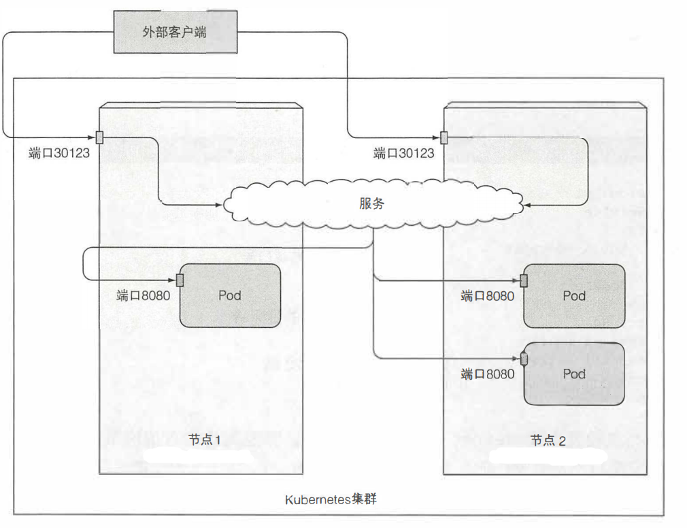
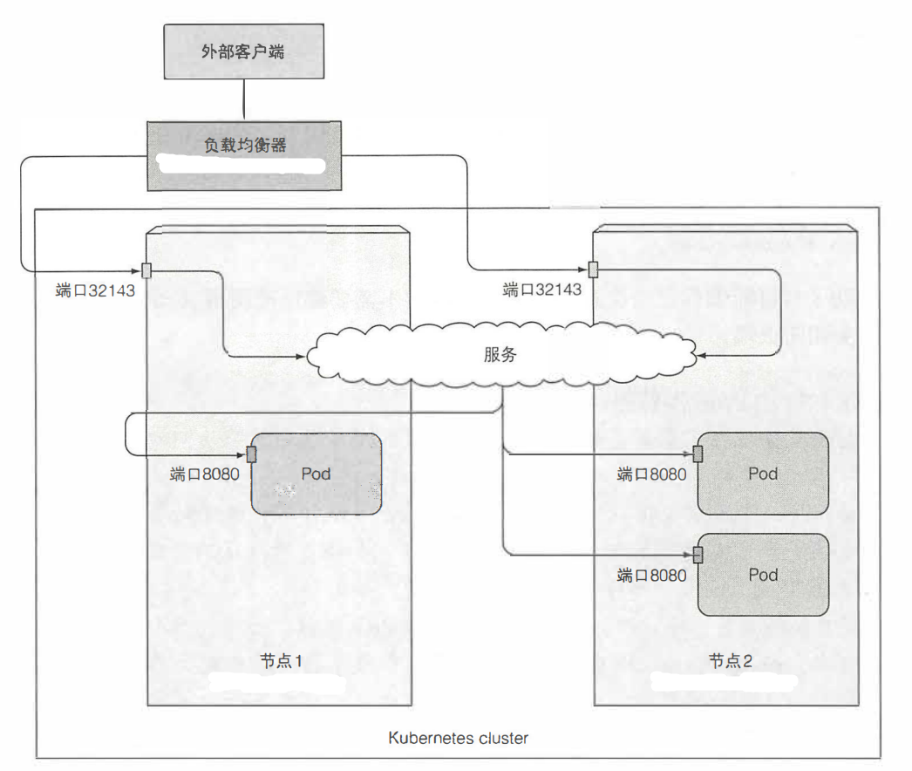
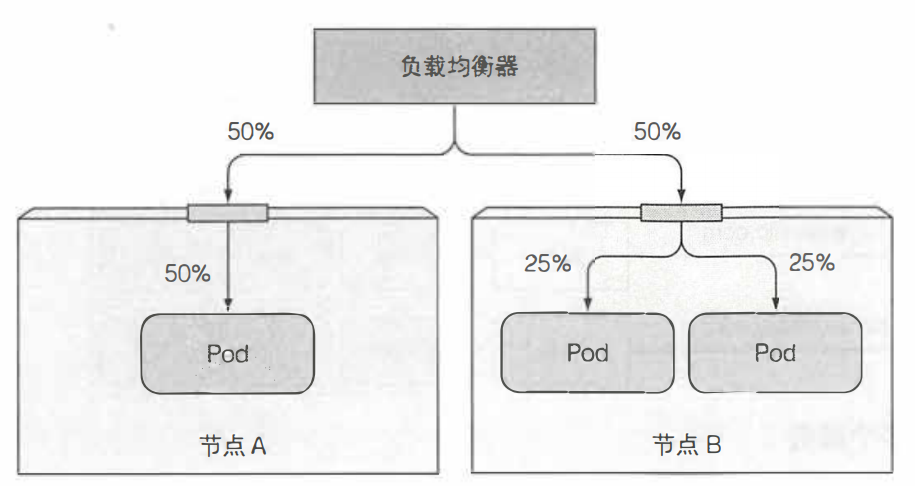
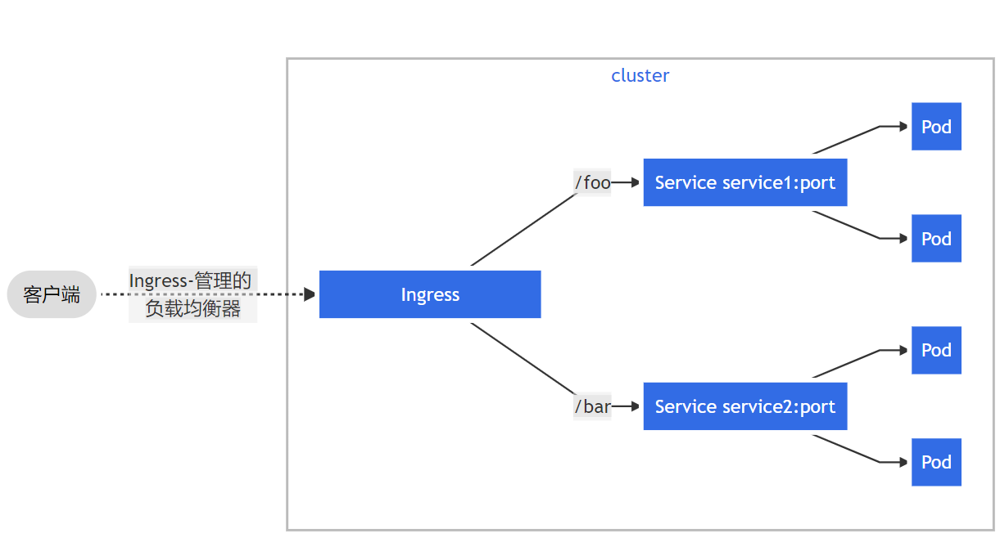

> # k8s-Service(三)

# 端口转发暴露

```shell
kubectl port-forward <command>
## 把pod或者其他资源的端口映射到宿主机端口,宿主机端口在前
## pod
kubectl port-forward kubia-bb-44b69 8888:8080 
kubectl port-forward pods/kubia-bb-44b69 8888:8080
# deployment
kubectl port-forward deployment/xxxxx 8888:8080 
# rs
kubectl port-forward rs/kubia-bb 8888:8080 
# rc
kubectl port-forward rc/kubia-bb 8888:8080
# svc
kubectl port-forward svc/kubia-bb 8888:8080
```

eg：`master节点`

```shell
[root@master1 ~]# kubectl get po
NAME                 READY   STATUS    RESTARTS   AGE
gateway-test-rmkb2   1/1     Running   1          4h35m
kubia-bb-44b69       1/1     Running   0          14m
kubia-bb-lldsx       1/1     Running   0          14m
kubia-bb-lmhtc       1/1     Running   0          14m
[root@master1 ~]# kubectl get svc
NAME           TYPE        CLUSTER-IP      EXTERNAL-IP   PORT(S)    AGE
gateway-test   ClusterIP   10.99.255.190   <none>        8080/TCP   4h33m
kubernetes     ClusterIP   10.96.0.1       <none>        443/TCP    18d
kubia-bb       ClusterIP   10.108.42.73    <none>        8080/TCP   13m
[root@master1 ~]# kubectl port-forward svc/kubia-bb 8888:8080
Forwarding from 127.0.0.1:8888 -> 8080
Forwarding from [::1]:8888 -> 8080

```

`从新开个shell访问`

```
[root@master1 ~]# curl localhost:8888
You've hit kubia-bb-44b69
[root@master1 ~]# 
```

## ERROR-socat

访问时，如果控制台出现以下错误(执行kubectl port-forward命令后会hold住，访问时会有输出)

```
[root@master1 ~]# kubectl port-forward kubia-bb-lldsx 8888:8080
Forwarding from 127.0.0.1:8888 -> 8080
Forwarding from [::1]:8888 -> 8080
E0617 15:56:10.760510   15379 portforward.go:400] an error occurred forwarding 8888 -> 8080: error forwarding port 8080 to pod 2e7f0d46cd611de497a3aa179d689e51852392e1e7c279c179adbe675b1d979c, uid : unable to do port forwarding: socat not found
```

此种情况是socat这个命令没有安装。在master和slave节点都装上就ojbk了。

```shell
$ yum install -y socat
```

# Service暴露

## yaml资源定义及演示

### yaml定义

```yaml
apiVersion: v1
kind: Service
metadata:
  name: kubia
spec:
  ports:
  - port: 80
    targetPort: 8080
  selector:
    app: kubia
```

> apply两个pod，用来测试service

```shell
[root@master1 kubeyaml]# kubectl apply -f kubia-rs.yaml
replicaset.apps/kubia created
[root@master1 kubeyaml]# kubectl get rs
NAME    DESIRED   CURRENT   READY   AGE
kubia   2         2         2       59m
[root@master1 kubeyaml]# kubectl get po
NAME          READY   STATUS    RESTARTS   AGE
kubia-gc4ds   1/1     Running   0          16s
kubia-llv9w   1/1     Running   0          16s
[root@master1 kubeyaml]#
```

> 通过这节的yaml定义，创建service，并在master节点通过curl访问

```shell
[root@master1 kubeyaml]# kubectl apply -f kubia-service.yaml
service/kubia created
[root@master1 kubeyaml]# kubectl get service
NAME         TYPE        CLUSTER-IP      EXTERNAL-IP   PORT(S)   AGE
kubernetes   ClusterIP   10.96.0.1       <none>        443/TCP   4d
kubia        ClusterIP   10.106.29.201   <none>        80/TCP    29s
[root@master1 kubeyaml]# curl 10.106.29.201
You've hit kubia-llv9w
[root@master1 kubeyaml]# curl 10.106.29.201
You've hit kubia-gc4ds
[root@master1 kubeyaml]# 
```

### 亲和性

普通的方式，请求来之后，即使是同一个客户端的请求，也可能会打到不同的Pod节点上，通常来讲这是没有问题的。但是如果你的服务很特殊，你希望来自某个客户端的请求每次都打到同一个Pod。你可以设置服务的**亲和性**，`service.spec.sessionAffinity`设置为ClientIp，而不是None，None是默认值。

```yaml
apiVersion: v1
kind: Service
spec:
 sessionAffinity: ClientIp
 ...
```

这种方式将会使服务代理将来自同 一个 client IP 的所有请求转发至同 一个 pod 上。

**Kubernetes 仅仅支持两种形式的会话亲和性服务： None 和 ClientIP。你或许惊讶竞然不支持基于 cookie 的会话亲和性的选项，但是你要了解Kubernetes 服务不是在 HTTP 层面上工作。服务处理 TCP 和 UDP 包，并不关心其中的载荷内容。 因为 cookie 是 HTTP 协议中的一部分，服务并不知道它们，这就是为什么会话 亲和性不能基于cookie**。

### 同一个服务暴露多个端口

`service.spec.ports`是个数组，暴露多个端口直接写就好

```yaml
apiVersion: v1
kind: Service
spec:
  ports:
  - name: http
    port: 80
    targetPort: 8080
  - name: https
    port: 443
    targetPort: 8443
```

### 基于端口命名暴露

> 比如你有个命名的端口Pod

```yaml
## 其他配置和kubia-rs.yaml一样，只改了ports部分
spec:
  template:
    spec:
      containers:
        ports:
        - name: http              ## 端口名为http
          containerPort: 8080
```

> service也改为基于端口命名的

```yaml
apiVersion: v1
kind: Service
metadata:
  name: kubia
spec:
  ports:
  - name: http              
    port: 80
    targetPort: http        ### 暴露80端口，指向目标名称为http的端口，也就是上面的8080
  selector:
    app: kubia
```

> 删除已有svc，rs，测试基于端口命名的service

```shell
[root@master1 kubeyaml]# kubectl delete rs kubia
replicaset.apps "kubia" deleted
[root@master1 kubeyaml]# kubectl delete svc kubia
service "kubia" deleted
[root@master1 kubeyaml]# kubectl apply -f kubia-rs-port-name.yaml
replicaset.apps/kubia created
[root@master1 kubeyaml]# kubectl get po
NAME          READY   STATUS    RESTARTS   AGE
kubia-n6sgn   1/1     Running   0          50s
kubia-sx7wp   1/1     Running   0          50s
[root@master1 kubeyaml]# kubectl apply -f kubia-service-port-name.yaml 
service/kubia created
[root@master1 kubeyaml]# kubectl get svc
NAME         TYPE        CLUSTER-IP       EXTERNAL-IP   PORT(S)   AGE
kubernetes   ClusterIP   10.96.0.1        <none>        443/TCP   4d1h
kubia        ClusterIP   10.110.168.137   <none>        80/TCP    4s
[root@master1 kubeyaml]# curl 10.110.168.137
You've hit kubia-sx7wp
[root@master1 kubeyaml]# curl 10.110.168.137
You've hit kubia-n6sgn
[root@master1 kubeyaml]#
```

基于端口命名的最大好处就是即使更换端口号也无须更改服务的spec.

## Endpoints

### 介绍

> 查看Service

```shell
[root@master1 ~]# kubectl describe svc kubia
Name:              kubia
Namespace:         default
Labels:            <none>
Annotations:       <none>
Selector:          app=kubia         
Type:              ClusterIP
IP:                10.110.168.137
Port:              http  80/TCP
TargetPort:        http/TCP
Endpoints:         100.109.35.205:8080,100.109.35.216:8080,100.109.35.222:8080
Session Affinity:  None
Events:            <none>
[root@master1 ~]# 
```

其中`selector`是用于创建endpoint列表的服务Pod选择器，Endpoints代表服务endpoint的Pod的IP和端口列表。

**Endpoints资源就是暴露一个服务的IP地址和端口列表**。

> 查看之前的服务自动生成的Endpoints

```shell
[root@master1 ~]# kubectl get svc kubia
NAME         TYPE        CLUSTER-IP       EXTERNAL-IP   PORT(S)   AGE
kubia        ClusterIP   10.110.168.137   <none>        80/TCP    4h23m
[root@master1 ~]# kubectl get endpoints kubia
NAME         ENDPOINTS                                                     AGE
kubia        100.109.35.205:8080,100.109.35.216:8080,100.109.35.222:8080   4h24m
[root@master1 ~]# kubectl get po -o wide
NAME                 READY   STATUS    RESTARTS   AGE     IP     
kubia-m982c          1/1     Running   0          158m    100.109.35.205  
kubia-n6sgn          1/1     Running   0          4h28m   100.109.35.216 
kubia-sx7wp          1/1     Running   0          4h28m   100.109.35.222 
[root@master1 ~]# 
```

可以看到Service kubia有一个同名的Endpoints，Endpoints的三个ip指向了三个Pod.

**选择器用于构建 IP 和端口列表，然后存储在 Endpoint 资源中。当客户端连 接到服务时，服务代理选择这些 IP 和端口对(保存在Endpoints)中的一个，并将传入连接重定向到监听的服务器。**

### 手动配置值Endpoints资源

你可能已经意识到这一点，Service与 Endpoint 解耦后，可以分别手动配置和 更新它们。 如果创建了不包含 pod选择器的服务，Kubemetes 将不会创建 Endpoint 资源（毕 竟，缺少选择器，将不会知道服务中包含哪些 pod)。这样就需要创建 Endpoint 资源 来指定该服务的 endpoint 列表。 要使用手动配置 endpoint 的方式创建服务，需要创建服务和 Endpoint 资源

#### 创建没有Pod选择器的Service

```yaml
apiVersion: v1
kind: Service
metadata:
  name: kubia-svc       ### 服务名字必须和Endpoints名字匹配
spec:
  ports:
  - port: 80
```

```yaml
[root@master1 kubeyaml]# kubectl apply -f kubia-endpoints-service.yaml 
service/kubia-svc created
[root@master1 kubeyaml]# kubectl get svc 
NAME         TYPE        CLUSTER-IP       EXTERNAL-IP   PORT(S)   AGE
kubernetes   ClusterIP   10.96.0.1        <none>        443/TCP   4d6h
kubia        ClusterIP   10.110.168.137   <none>        80/TCP    5h20m
kubia-svc    ClusterIP   10.104.51.11     <none>        80/TCP    11s
[root@master1 kubeyaml]#
```

#### yaml定义

> 创建Endpoints(使用之前存在的几个Pod的ip)

```shell
[root@master1 kubeyaml]# kubectl get po -o wide
NAME                 READY   STATUS    RESTARTS   AGE     IP      
kubia-m982c          1/1     Running   0          3h38m   100.109.35.205 
kubia-n6sgn          1/1     Running   0          5h28m   100.109.35.216 
kubia-sx7wp          1/1     Running   0          5h28m   100.109.35.222 
[root@master1 kubeyaml]# 
```

```yaml
apiVersion: v1
kind: Endpoints
metadata:
  name: kubia-svc         ### Endpoints名字必须和Service名字匹配
subsets:
  - addresses:            ### Pod的IP列表
    - ip: 100.109.35.205   
    - ip: 100.109.35.216
    ports:
    - port: 8080           ### Pod的端口
```

> apply这个Endpoint资源

```shell
[root@master1 kubeyaml]# kubectl apply -f kubia-endpoints.yaml
endpoints/kubia-svc created
[root@master1 kubeyaml]# kubectl get endpoints kubia-svc
NAME         ENDPOINTS                                                     AGE
kubia-svc    100.109.35.205:8080,100.109.35.216:8080                       1m44s
[root@master1 kubeyaml]#
```

> 访问服务试试

```shell
[root@master1 kubeyaml]# kubectl get po -o wide
NAME                 READY   STATUS    RESTARTS   AGE     IP      
kubia-m982c          1/1     Running   0          3h38m   100.109.35.205 
kubia-n6sgn          1/1     Running   0          5h28m   100.109.35.216 
kubia-sx7wp          1/1     Running   0          5h28m   100.109.35.222
[root@master1 kubeyaml]# kubectl get svc kubia-svc
NAME        TYPE        CLUSTER-IP     EXTERNAL-IP   PORT(S)   AGE
kubia-svc   ClusterIP   10.104.51.11   <none>        80/TCP    12m
[root@master1 kubeyaml]# curl 10.104.51.11
You've hit kubia-n6sgn
[root@master1 kubeyaml]# curl 10.104.51.11
You've hit kubia-m982c
[root@master1 kubeyaml]#
```

因为我们的Endpoints只给了两个节点，所以无论我们curl多少次，都只会打到100.109.35.205和100.109.35.216这两个Pod.

## NodePort暴露服务

将一组pod公开给外部客户端的第一种方法是创建一个服务并将其类型设置为 NodePort。 通过创建NodePort服务， 可以让k8s在其所有节点上保留一 个端口（所有节点上都使用相同的端口号）， 并将传入的连接转发给作为服务部分的 pod。

这与常规服务类似（它们的实际类型是ClusterIP), **但是不仅可以通过服务 的内部集群IP访问NodePort服务， 还可以通过任何节点的IP和预留节点端口访问NodePort服务**.

### yaml定义

```yaml
apiVersion: v1
kind: Service
metadata:
  name: kubia-nodeport
spec:
  type: NodePort           ### 设置服务类型为NodePort
  ports:
  - port: 80               ### 服务集群IP的端口号
    targetPort: 8080       ### 背后Pod的目标端口号
    nodePort: 30123        ### 通过集群节点Node的30123端口可以访问该服务
  selector:
    app: kubia
```

> apply NodePort服务

```shell
[root@master1 kubeyaml]# kubectl apply -f kubia-service-nodeport.yaml
service/kubia-nodeport created
[root@master1 kubeyaml]# kubectl get svc kubia-nodeport
NAME             TYPE       CLUSTER-IP      EXTERNAL-IP   PORT(S)        AGE
kubia-nodeport   NodePort   10.110.69.140   <none>        80:30123/TCP   11s
[root@master1 kubeyaml]# 
```

> 查看集群节点Node的IP(只保留了重要输出)

```shell
[root@master1 kubeyaml]# kubectl get node -o wide
NAME             STATUS   ROLES    AGE   VERSION   INTERNAL-IP
master1.wt.com   Ready    master   27d   v1.19.0   192.168.2.14 
node1.wt.com     Ready    <none>   27d   v1.19.0   192.168.2.15
[root@master1 kubeyaml]# 
```

好了，从上面两段输出中，可以得到服务集群IP`10.110.69.140`和集群节点Node的IP`192.168.2.15`.我这里k8s是虚拟机节点安装的，Node节点的IP实际上就是虚拟机的IP.

> 通过两种方式访问服务

```shell
[root@master1 kubeyaml]# curl 10.110.69.140
You've hit kubia-sx7wp
[root@master1 kubeyaml]# curl 192.168.2.15:30123
You've hit kubia-sx7wp
[root@master1 kubeyaml]# curl 192.168.2.14:30123
You've hit kubia-sx7wp
[root@master1 kubeyaml]#
```

可以看到，从服务集群IP，和所有节点`IP:30123`访问都能正确打到对应的Pod.通过节点Node访问时，直接在宿主机(也就是外部)就可以直接访问了。

### 通过Node节点访问流程



## LoadBalance暴露服务

**LoadBalancer，该服务将从k8s集群的基础架构获取负载均衡平衡器，如果k8s在不支持Load Badancer服务的环境中运行时，不会调配负载平衡器，但该服务仍将表现得像一 个NodePort服务。 这是因为Load Badancer服务是NodePort服务的扩展**

### yaml定义

```yaml
apiVersion: v1
kind: Service
metadata:
  name: kubia-lb
spec:
  type: LoadBalancer            ### Service类型指定为LB
  ports:
  - port: 80
    targetPort: 8080
    nodePort: 32143              ### LB是nodePort的扩展，所以也是由这个值指定端口，如果不指定，会随机给
  selector:
    app: kubia
```

> apply这个LB

```shell
[root@master1 kubeyaml]# kubectl apply -f kubia-service-lb.yaml
service/kubia-lb created
[root@master1 kubeyaml]# kubectl get svc kubia-lb
NAME       TYPE           CLUSTER-IP       EXTERNAL-IP   PORT(S)        AGE
kubia-lb   LoadBalancer   10.100.161.153   <pending>     80:32143/TCP   2m16s
```

我这个可能是不支持LB服务吧，这个`EXTERNAL-IP`一直是pending状态。除开这个，其他都跟NodePort模式一样，服务集群IP可以访问Pod，集群Node节点IP也可以访问Pod。

### 亲和性失效？

```
浏览器访问过程中，你可能会发现每次浏览器都会碰到同一个pod(NodePort也会这样), 我们不是有三个Pod吗,我们使用curl的时候都是轮询的，为什么到浏览器就不行了？
你会发现你如果重新开一个窗口，就会碰到另一个Pod.但是也是一直碰到这个.

解答: 浏览器使用keep-alive连接， 并通过单个连接发送所有请求，而curl每次都会打开一个新连接。
服务在连接级别工作， 所以当首次打开与服务的连接时， 会选择一个随机集群，
然后将属于该连接的所有网络数据包全部发送到单个集群。 
即使会话亲和性设置为None, 用户也会始终使用相同的 pod (直到连接关闭）
```

### 访问流程

访问流程和NodePort很像，只是外部套了一个负载均衡器。

这个负载均衡器的IP就是上面一直pending的那个`EXTERNAL-IP`.我这个没法演示了，贴个图。



### 外部连接的网络跳数

当外部客户端通过节点端口连接到服务时（这也包括先通过负载均衡器时的情 况）， 随机选择的pod并不一定在接收连接的同 一节点上运行，对照上面流程图，比如说通过节点1访问Pod，由于会经过服务，所以可能会打到节点2上的Pod。所以可能需要额外的网络跳转才能到达Pod。

如果想避免这种跳数，可以设置`Service.spec.externalTrafficPolicy=Local`来使用本地Pod，保证哪个节点接收的请求，就由哪台节点的Pod处理。

**如果没有本地pod存在， 则连接将挂起, 它不会将其转发到随机的全局pod**.

**对负载均衡不友好，如下图**



### 客户端IP

```
通常，当集群内的客户端连接到服务时，支持服务的pod可以获取客户端的IP地址。但是,当通过节点端口接收到连接时,由于对数据包执行了源网络地址转换(SNAT), 因此数据包的源IP将发生更改。后端的pod无法看到实际的客户端IP, 
这对于某些需要了解客户端IP的应用程序来说可能是个问题。例如,对于Web服务器,这意味着访问日志无法显示浏览器的IP。
刚刚描述的local外部流量策略会有客户端IP的保留，因为在接收连接的节点和托管目标pod的节点之间没有额外的跳跃（不执行SNAT)。
```

## Ingress暴露服务

Ingress 在网络栈 (HTTP) 的应用层(第7层)工作，并且可以提供一些服务不能实现的功能，诸如基于 cookie 的会话亲和性 (session affinity) 等功能

为什么需要Ingress，一个重要的原因是每个 LoadBalancer 服务都需要自己的负载均衡器， 以及 独有的公有 IP 地址， 而 Ingress 只需要一个公网 IP 就能为许多服务提供访问。 当客 户端向 Ingress 发送 HTTP 请求时， Ingress 会根据请求的主机名和路径决定请求转 发到的服务.



### Ingress控制器

使用Ingress必须要安装Ingress控制器，具体的安装方式可以在【k8安装】这篇笔记里面看到。

### yaml定义

```yaml
apiVersion: networking.k8s.io/v1
kind: Ingress
metadata:
  name: kubia-ingress
spec :
  rules:
  - host: kubia.example.com      ### Ingress将域名映射到你的服务
    http:
      paths:
      - path: /kubia             ### 所有/kubia的请求，全部发送到kubia-nodeport服务的80端
        pathType: Prefix
        backend:
          service:
            name: kubia-nodeport   ### Nodeport那节创建的Service
            port: 
              number: 80
```

### TLS

ingress部署之后有点问题，没有Address

```shell
[root@master1 ~]# kubectl get ingress
NAME             CLASS          HOSTS          ADDRESS   PORTS   AGE
kubia-ingress    <none>    kubia.example.com              80     99m
[root@master1 ~]# 
```

好了，TLS就暂且略过了，后续有空再来搞它。

## Headless Service

通过设置`service.spec.clusterIp=None`来使服务成为Headless Service，k8s不会为其分配集群IP。

#### yaml定义

```yaml
apiVersion: v1
kind: Service
metadata:
  name: kubia-headless
spec:
  clusterIP: None        ## 设置为Headless Service 
  ports:
  - port: 80
    targetPort: 8080
  selector:
    app: kubia
```

#### 演示

```shell
[root@master1 kubeyaml]# vi kubia-service-headless.yaml 
[root@master1 kubeyaml]# kubectl apply -f kubia-service-headless.yaml
service/kubia-headless created
[root@master1 kubeyaml]# kubectl get svc
NAME                      TYPE        CLUSTER-IP       EXTERNAL-IP   PORT(S)        AGE
kubernetes                ClusterIP   10.96.0.1        <none>        443/TCP        14d
kubia-headless            ClusterIP   None             <none>        80/TCP         4s
[root@master1 kubeyaml]# kubectl describe svc kubia-headless
Name:              kubia-headless
Namespace:         default
Labels:            <none>
Annotations:       <none>
Selector:          app=kubia
Type:              ClusterIP
IP:                None
Port:              <unset>  80/TCP
TargetPort:        8080/TCP
Endpoints:         100.109.35.233:8080,100.109.35.240:8080,100.109.35.241:8080
Session Affinity:  None
Events:            <none>
[root@master1 kubeyaml]# kubectl get endpoints
NAME                      ENDPOINTS                                                     AGE
kubernetes                192.168.2.14:6443                                             14d
kubia-headless            100.109.35.233:8080,100.109.35.240:8080,100.109.35.241:8080   35s
[root@master1 kubeyaml]#
```

## 故障排查TIPS

```
• 首先， 确保从集群内连接到服务的集群IP,而不是从外部。
• 不要通过ping服务IP 来判断服务是否可访问（请记住，服务的集群IP是虚拟IP, 是无法ping通的）。
• 如果已经定义了就绪探针， 请确保 它返回成功；否则该pod不会成为服务的一部分 。
• 要确认某个容器是服务的一部分，请使用kubectl ge七 endpoints来检查相应的端点对象。
• 如果尝试通过FQDN或其中一部分来访问服务（例如，myservice.mynamespace.svc.cluster.local或
  myservice.mynamespace), 但并不起作用，请查看是否可以使用其集群IP而不是FQDN来访问服务 。
• 检查是否连接到服务公开的端口，而不是目标端口 。
• 尝试直接连接到podIP以确认pod正在接收正确端口上的连接。
• 如果甚至无法通过pod的IP 访问应用，请确保应用不是仅绑定 到本地主机
```

