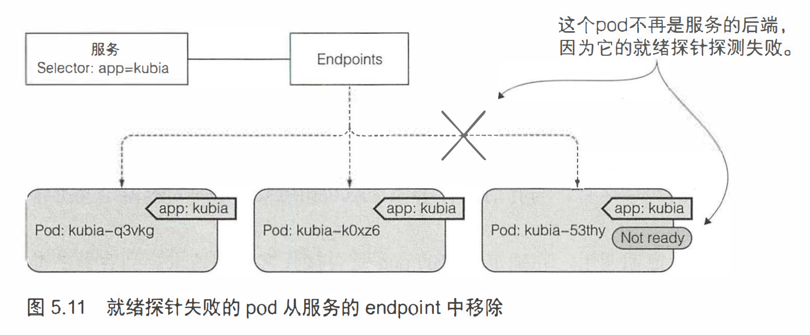

> # k8s-探针(四)

## 存活探针 (liveness probe)

k8s 可以通过存活探针 (liveness probe) 检查容器是否还在运行。 可以为 pod 中的每个容器单独指定存活探针。如果探测失败， k8s 将定期执行探针并重新启动容器。

### 三种探测容器的机制

> HTTPGET探针对容器的 IP 地址（你指定的端口和路径）执行 HTTP GET 请求。
> 如果探测器收到响应，并且响应状态码不代表错误（换句话说，如果HTTP响应状态码是2xx或3xx), 则认为探测成功。
> 如果服务器返回错误响应状态码或者根本没有响应，那么探测就被认为是失败的，容器将被重新启动。

> TCP套接字探针尝试与容器指定端口建立TCP连接。如果连接成功建立，则探测成功。否则，容器重新启动。
>

> Exec探针在容器内执行任意命令，并检查命令的退出状态码。如果状态码是0, 则探测成功。所有其他状态码都被认为失败

### HTTPGET探针

#### 准备工作

> 修改app.js程序，让其可以产生连续3次的错误响应

```javascript
// app.js
const http = require('http');
const os = require('os');

console.log("Kubia server starting...");
var x = 0;
var tmp = 0;
var handler = function(request, response) {
	console.log("Received request from " + request.connection.remoteAddress);
	response.writeHead(200);
        x++;
        tmp = x % 10;
        if (tmp % 7 == 0 || tmp % 8 ==0 || tmp % 9 == 0) {
          response.writeHead(400);
          console.log("error 400");
          response.end();
        } else {
          response.end("You've hit " + os.hostname() + "\n");
        }
};
var www = http.createServer(handler);
www.listen(8080);
```

使用这个app.js构建出对应的镜像.

```shell
[root@node1 kubia-err]# docker images
REPOSITORY                 TAG                 IMAGE ID            CREATED             SIZE
kubia-err400               latest              f6427314b863        2 weeks ago         64.6MB
[root@node1 kubia-err]# 
```

#### yaml定义

```yaml
apiVersion: v1
kind: Pod
metadata:
  name: kubia-err400
spec:
  containers:
  - name: kubia-err400
    image: kubia-err400:latest
    imagePullPolicy: Never
    ports:
    - containerPort: 8080
    livenessProbe:                ## 存活探针
      httpGet:
        path: /                   ## 路径
        port: 8080                ## 端口
      initialDelaySeconds: 15     ## 探测延时，容器在启动initialDelaySeconds时长后，开始探测
```

探针是针对Pod的，所以只需要在Pod上, template.pec处配置，这里测试使用ReplicaSet来测试，用下面的yaml.

```yaml
apiVersion: apps/v1
kind: ReplicaSet
metadata:
  name: kubia-err400
spec:
  replicas: 1
  selector:
    matchLabels:
      app: kubia-err400
  template:
    metadata:
      name: kubia-err400
      labels:
        app: kubia-err400
    spec:
      containers:
      - name: kubia-err400
        image: kubia-err400:latest
        imagePullPolicy: Never
        ports:
        - containerPort: 8080
        livenessProbe:               
          httpGet:
            path: /
            port: 8080
          initialDelaySeconds: 15
```

`演示`

```shell
[root@master1 kubeyaml]# vi kubia-err-liveness.yaml 
[root@master1 kubeyaml]# kubectl apply -f kubia-err-liveness.yaml
replicaset.apps/kubia-err400 created
[root@master1 kubeyaml]# kubectl get rs kubia-err400
NAME           DESIRED   CURRENT   READY   AGE
kubia-err400   1         1         1       21m
[root@master1 kubeyaml]#
```

`查看rs的状态`

```shell
[root@master1 kubeyaml]# kubectl get rs kubia-err400
NAME           DESIRED   CURRENT   READY   AGE
kubia-err400   1         1         0       21m
[root@master1 kubeyaml]# kubectl describe rs kubia-err400
Name:         kubia-err400
Namespace:    default
Selector:     app=kubia-err400
Labels:       <none>
Annotations:  <none>
Replicas:     1 current / 1 desired
Pods Status:  1 Running / 0 Waiting / 0 Succeeded / 0 Failed
Pod Template:
  Labels:  app=kubia-err400
  Containers:
   kubia-err400:
    Image:        kubia-err400:latest
    Port:         8080/TCP
    Host Port:    0/TCP
    Liveness:     http-get http://:8080/ delay=15s timeout=1s period=10s #success=1 #failure=3
...
```

除了明确指定的存活探针选项，还可以看到其他属性，例如delay(延迟）、 timeout(超时）、period(周期）等。delay=15s显示在容器启动15s后开始探测。timeout仅设置为1秒，因此容器必须在1秒内进行响应， 不然这次 探测记作失败。每10秒探测一次容器(period=10s), 并在探测连续三次失败 (#failure= 3)后重启容器。

`过段时间后再去查看pod`

```shell
## 容器已经重启了8次，因为我们的app.js有个连续三次失败的逻辑
[root@master1 kubeyaml]# kubectl get po
NAME                 READY   STATUS    RESTARTS   AGE
kubia-err400-q4sr9   1/1     Running   8          26m
[root@master1 kubeyaml]#
```

> 查看容器失败原因

```shell
[root@master1 kubeyaml]# kubectl describe po kubia-err400-q4sr9
Name:         kubia-err400-q4sr9
Namespace:    default
Priority:     0
Node:         node1.wt.com/192.168.2.15
Start Time:   Mon, 05 Jul 2021 13:59:20 +0800
Labels:       app=kubia-err400
Annotations:  cni.projectcalico.org/podIP: 100.109.35.224/32
Status:       Running
IP:           100.109.35.224
IPs:
  IP:           100.109.35.224
Controlled By:  ReplicaSet/kubia-err400
Containers:
  kubia-err400:
    Container ID:   docker://ee51eba377b5d55f3e060526385c5cdd6f40645f3b68444ad9af384d8ea54480
    Image:          kubia-err400:latest
    Image ID:       docker://sha256:f6427314b863d764356d554660b6fcd0febc9de608b2498cd7e547cff9c90777
    Port:           8080/TCP
    Host Port:      0/TCP
    State:          Running
      Started:      Mon, 05 Jul 2021 14:26:41 +0800
    Last State:     Terminated
      Reason:       Error
      Exit Code:    137
      Started:      Mon, 05 Jul 2021 14:24:27 +0800
      Finished:     Mon, 05 Jul 2021 14:26:41 +0800
    Ready:          True
    Restart Count:  9
    Liveness:       http-get http://:8080/ delay=15s timeout=1s period=10s #success=1 #failure=3
...
Conditions:
  Type              Status
  Initialized       True 
  Ready             True 
  ContainersReady   True 
  PodScheduled      True 
...
[root@master1 kubeyaml]# 
```

`Last State`这一栏及后面信息，可以看到，上次终止，`Reason=Error`,`Exit Code=137`.这个退出码128+x, 137=128+9(SIGKILL).9的原因是因为我们容器是好的，但是探针探测到之后，需要重启容器，所以直接杀死进程(kill -9)

## 就绪探针(readiness probe)

Pod可能需要时间来加载配置或数据，或者可能需要执行预热过程以防止第一个用户请求时间太长影响了用户体验。在这种情况下，不希望该Pod立即开始接收请求，尤其是在运行的示例可以正确快速的处理请求的情况下。不要讲请求转发到正在启动的Pod中，直到完全准备就绪。

这个准备就绪的概念显然是每个容器特有的东西。k8s只能检查咋容器中运行的应用程序是否响应一个简单的GET请求，或者他可以响应特定的URL路径(该URL导致应用程序执行一系列检查已确定它是否准备就绪)。

### 就绪探针类型

像存活探针一样，就绪探针也有三种类型

> Exec 探针，执行进程的地方。容器的状态由进程的退出状态代码确定。

> HTTP GET 探针，向容器发送 HTTP GET 请求，通过响应的 HTTP 状态代码判断容器是否准备好

> TCP socket 探针，它打开一个TCP连接到容器的指定端口。如果连接已建立，则认为容器已准备就绪

 

### 介绍

启动容器时，可以为k8s配置一个等待时间，经过等待时间后才可以执行第一次准备就绪检查。之后，它会周期性的调用探针，并根据就绪探针的结果采取行动。如果某个Pod报告它尚未准备就绪，则会从该服务中删除该Pod。如果Pod再次准备就绪，则重新添加Pod。

与存活探针不同，如果容器未通过准备检查，则不会 被终止或重新启动。这是存活探针与就绪探针之间的重要区别。存活探针通过杀死异常的容器，并用新的正常容器替代他们来保持Pod正常工作，而就绪探针确保只有准备好处理请求的Pod才可以接收请求。

> 如果一个容器的就绪探测失败，则将该Pod从endpoints中移除



### Exec探针

#### yaml定义

```yaml
apiVersion: v1
kind: Pod
metadata:
  name: kubia-err400
spec:
  containers:
  - name: kubia-err400
    image: kubia-err400:latest
    imagePullPolicy: Never
    ports:
    - containerPort: 8080
    readinessProbe:           ## 每个容器都会有一个就绪探针
      exec:
        command:              ## 通过执行命令来检查容器是否正常，便于测试
        - ls
        - /var/ready
```

就绪探针将定期在容器内执行`ls /var/ready`命令。如果文件存在， 则`ls`命令返回退出码 0, 否则返回非0的退出码。如果文件存在，则就绪探针将成功，否则，它会失败。

#### 测试

> 同样通过rs来测试，如下yaml

```yaml
apiVersion: apps/v1
kind: ReplicaSet
metadata:
  name: kubia-readiness
spec:
  replicas: 3
  selector:
    matchLabels:
      app: kubia-readiness
  template:
    metadata:
      name: kubia-readiness
      labels:
        app: kubia-readiness
    spec:
      containers:
      - name: kubia-readiness
        image: kubia:latest
        imagePullPolicy: Never
        ports:
        - containerPort: 8080
        readinessProbe:
          exec:
            command:
            - ls
            - /var/ready
```

查看Pod,因为还没有`/var/ready`文件，所以探针失败，所有pod处于NotReady状态(0/1).

```shell
[root@master1 kubeyaml]# kubectl apply -f kubia-readiness.yaml
replicaset.apps/kubia-readiness created
[root@master1 kubeyaml]# kubectl get po
NAME                    READY   STATUS    RESTARTS   AGE
kubia-readiness-d7nfm   0/1     Running   0          29s
kubia-readiness-nmnbx   0/1     Running   0          5s
kubia-readiness-zf5gc   0/1     Running   0          5s
[root@master1 kubeyaml]#
```

> 给pod创建service

```yaml
apiVersion: v1
kind: Service
metadata:
  name: kubia-readiness
spec:
  ports:
  - port: 80
    targetPort: 8080
  selector:
    app: kubia-readiness
```

查看endpoints

```shell
[root@master1 kubeyaml]# kubectl apply -f kubia-service-readiness.yaml
service/kubia-readiness created
[root@master1 kubeyaml]# kubectl get svc
NAME                      TYPE        CLUSTER-IP       EXTERNAL-IP   PORT(S)        AGE
kubernetes                ClusterIP   10.96.0.1        <none>        443/TCP        14d
kubia-readiness           ClusterIP   10.110.17.61     <none>        80/TCP         9s
[root@master1 kubeyaml]# kubectl get endpoints
NAME                      ENDPOINTS                                                AGE
kubernetes                192.168.2.14:6443                                        14d
kubia-readiness                                                                    22s
[root@master1 kubeyaml]#
```

可以看到，因为Pod全都是未就绪，所以endpoints一个ip都没有。

>  给第一个容器创建`/var/ready`,等待10秒(默认10秒探测一次)

```shell
[root@master1 kubeyaml]# kubectl exec kubia-readiness-d7nfm -- touch /var/ready
[root@master1 kubeyaml]# kubectl get po
NAME                    READY   STATUS    RESTARTS   AGE
kubia-readiness-d7nfm   1/1     Running   0          12m
kubia-readiness-nmnbx   0/1     Running   0          11m
kubia-readiness-zf5gc   0/1     Running   0          11m
[root@master1 kubeyaml]# kubectl get endpoints
NAME                      ENDPOINTS                                                     AGE
kubernetes                192.168.2.14:6443                                             14d
kubia-readiness           100.109.35.244:8080                                           7m54s
[root@master1 kubeyaml]# kubectl get svc
NAME                      TYPE        CLUSTER-IP       EXTERNAL-IP   PORT(S)        AGE
kubernetes                ClusterIP   10.96.0.1        <none>        443/TCP        14d
kubia-readiness           ClusterIP   10.110.17.61     <none>        80/TCP         8m59s
[root@master1 kubeyaml]# curl 10.110.17.61
You've hit kubia-readiness-d7nfm
[root@master1 kubeyaml]# curl 10.110.17.61
You've hit kubia-readiness-d7nfm
[root@master1 kubeyaml]#
```

可以看到第一个容器已经ready了，并且endpoints中也已经加入了对应的Pod的IP，访问也正常，且只有这一个Pod响应请求。

#### 未就绪的Pod

其实Pod是已经启动了的，只是因为就绪探针探测失败，所以是NotReady状态(0/1).我们可以尝试访问一下另外的未就绪的容器。

```shell
[root@master1 kubeyaml]# kubectl get po 
NAME                    READY   STATUS    RESTARTS   AGE
kubia-err400-q4sr9      1/1     Running   28         120m
kubia-m982c             1/1     Running   3          10d
kubia-n6sgn             1/1     Running   3          10d
kubia-readiness-d7nfm   1/1     Running   0          18m
kubia-readiness-nmnbx   0/1     Running   0          18m
kubia-readiness-zf5gc   0/1     Running   0          18m
kubia-sx7wp             1/1     Running   3          10d
[root@master1 kubeyaml]# kubectl describe po kubia-readiness-nmnbx
Name:         kubia-readiness-nmnbx
Namespace:    default
Priority:     0
Node:         node1.wt.com/192.168.2.15
Start Time:   Mon, 05 Jul 2021 15:41:30 +0800
Labels:       app=kubia-readiness
Annotations:  cni.projectcalico.org/podIP: 100.109.35.235/32
Status:       Running
IP:           100.109.35.235
IPs:
  IP:           100.109.35.235
Controlled By:  ReplicaSet/kubia-readiness
...
Conditions:
  Type              Status
  Initialized       True 
  Ready             False 
  ContainersReady   False 
  PodScheduled      True 
...
already present on machine
  Normal   Created    18m                   kubelet, node1.wt.com  Created container kubia-readiness
  Normal   Started    18m                   kubelet, node1.wt.com  Started container kubia-readiness
  Warning  Unhealthy  3m41s (x91 over 18m)  kubelet, node1.wt.com  Readiness probe failed: ls: /var/ready: No such file or directory
[root@master1 kubeyaml]# curl 100.109.35.235:8080
You've hit kubia-readiness-nmnbx
[root@master1 kubeyaml]# 
```

可以看到，容器其实是在运行的，只是探针一直未就绪而已，就绪探针不会杀死容器(和存活探针的区别)，`curl`直接访问Pod的IP也是可以正常接收请求的。

可以看到`未就绪状态`部分描述。

```
  Warning  Unhealthy  3m41s (x91 over 18m)  kubelet, node1.wt.com  Readiness probe failed: ls: /var/ready: No such file or directory
```

