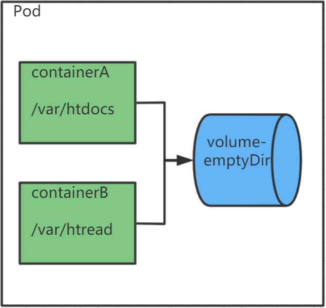
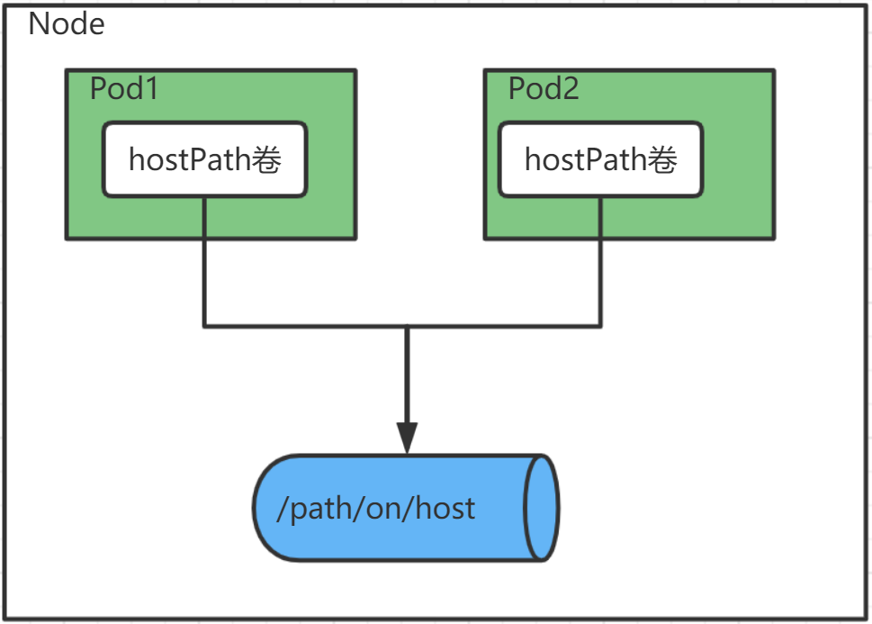
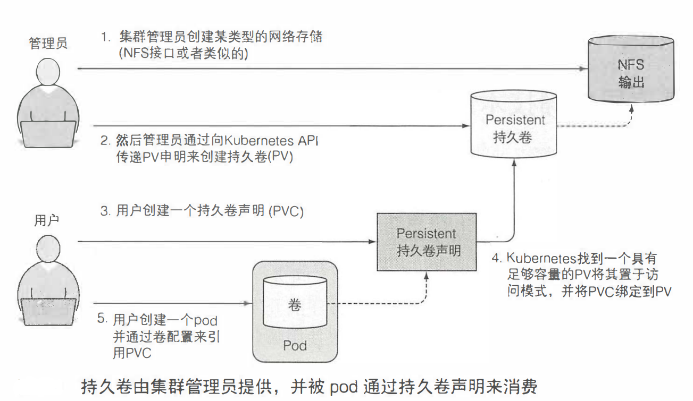
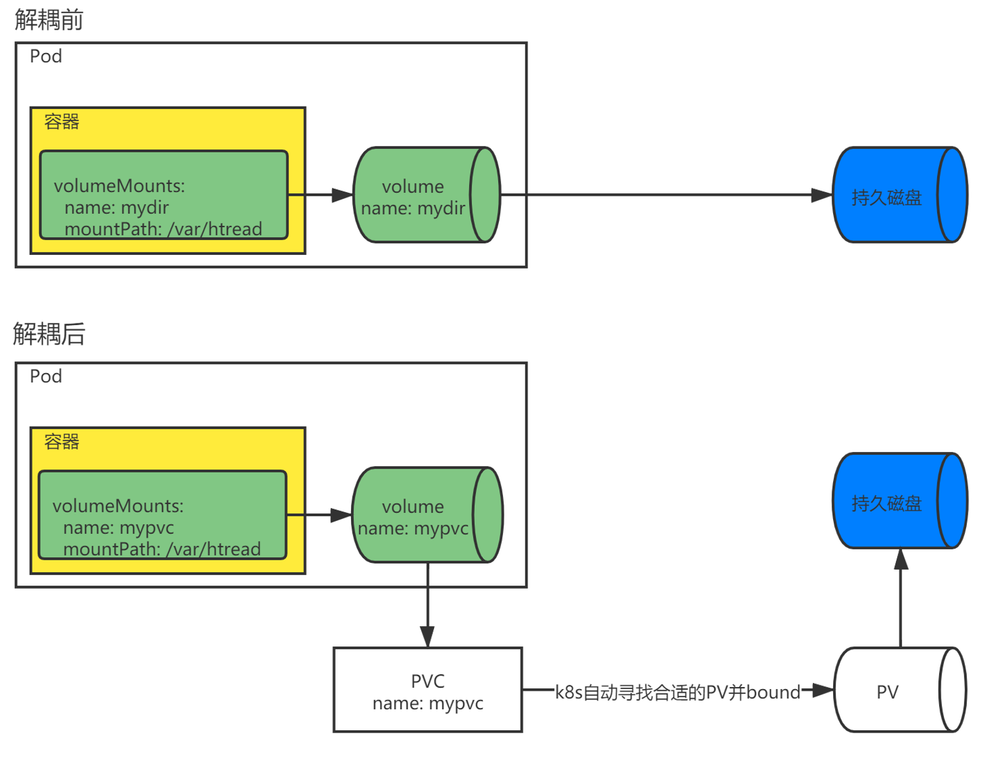

> # k8s-volume(五)

# volume

## 介绍

k8s的卷是Pod的一个组成部分，像容器一样，在Pod的规范中就被定义了。Pod中的所有容器都可以使用定义在Pod中的卷，但必须先将它挂载在每个需要访问它的容器中。

## emptyDir卷

当 Pod 指定到某个节点上时,首先创建的是一个 emptyDir 卷,并且只要 Pod 在该节点上运行,卷就一直存在。 就像它的名称表示的那样,卷最初是空的。 尽管Pod 中的容器挂载 emptyDir 卷的路径可能相同也可能不同,但是这些容器都可以读写 emptyDir 卷中相同的文件。 当 Pod 因为某些原因被从节点上删除时,emptyDir 卷中的数据也会永久删除。

> emptyDir 的使用场景:

- 缓存空间,例如基于磁盘的归并排序。
- 为耗时较长的计算任务提供检查点,以便任务能方便地从崩溃前状态恢复执行。
- 在 Web 服务器容器服务数据时,保存内容管理器容器获取的文件。

> 介质

默认情况下, emptyDir 卷存储在支持该节点所使用的介质上;这里的介质可以是磁盘或 SSD 或网络存储,这取决于您的环境。 但是,您可以将 emptyDir.medium 字段设置为 “Memory”,以告诉 Kubernetes 为您安装 tmpfs(基于内存的文件系统)。虽然tmpfs 速度非常快,但是要注意它与磁盘不同。 tmpfs 在节点重启时会被清除,并且您所写入的所有文件都会计入容器的内存消耗,受容器内存限制约束。

```yaml
volumes:
  name: html
  emptyDir:
    medium: Memory
```

> 图解



### 环境准备

创建一个Pod，Pod中包含两个容器，两个容器共享同一个volume，一个容器写数据，另一个容器读。

> 写容器

`appendloop.sh`，每隔10秒往`/var/htdocs/index.html`文件中写入当前时间

```shell
#!/bin/bash
trap "exit" SIGINT
mkdir /var/htdocs
while true
do
  date >> /var/htdocs/index.html
  echo "date writed"
  sleep 10
done
```

`Dockerfile`

```dockerfile
FROM daocloud.io/library/ubuntu:artful-20170619
ADD appendloop.sh /bin/appendloop.sh
ENTRYPOINT /bin/appendloop.sh
```

`构建镜像`

```shell
[root@node1 write]# docker build -t appendloop .
```

> 读容器

`readloop.sh`，一直读取`/var/htread/index.html`文件的内容

```shell
#!/bin/bash
trap "exit" SIGINT
mkdir /var/htread
while [ ! -f "/var/htread/index.html" ]
do
  echo "waitting file index.html"
  sleep 5
done
tail -f /var/htread/index.html
```

`Dockerfile`

```dockerfile
FROM daocloud.io/library/ubuntu:artful-20170619
ADD readloop.sh /bin/readloop.sh
ENTRYPOINT /bin/readloop.sh
```

`构建镜像`

```shell
[root@node1 write]# docker build -t readloop .
```

### yaml定义

因为是跟Pod相关，所以也只需要关注Pod部分的配置，这里测试依旧是使用的rs.所以只需要关系`template.spec`部分.

```yaml
apiVersion: apps/v1
kind: ReplicaSet
metadata:
  name: volumeloop
spec:
  replicas: 1
  selector:
    matchLabels:
      app: volumeloop
  template:
    metadata:
      name: volumeloop
      labels:
        app: volumeloop
    spec:
      containers:
      - name: appendloop                 ## 写容器
        image: appendloop:latest         ## 写容器镜像
        imagePullPolicy: Never
        volumeMounts:                    ## 挂载volume
        - name: html                     ## 挂载的volume的名字
          mountPath: /var/htdocs         ## 挂在到容器内的目录
      - name: readloop                   ## 读容器
        image: readloop:latest           ## 读容器镜像
        imagePullPolicy: Never
        volumeMounts:                    
        - name: html                    
          mountPath: /var/htread         
      volumes:                           ## 定义Pod的volumes(注意，上级是spec，是Pod的规范)
      - name: html                       ## volume的名字
        emptyDir: {}                     ## volume类型emptyDir, 测试用，就不用memory了
```

yaml中两个容器的挂载目录不相同，这个是可以的，因为这个目录是容器内部的，yaml中`/var/htdocs`和`/var/htread`两个容器内的目录均挂载了名称为html的volume，所以他们会共享volume的数据。

### 演示

`apply后查检查是否正常运行Pod,输出中2/2是因为这个Pod中有两个容器`

```shell
[root@master1 kubeyaml]# kubectl apply -f volume-loop.yaml
replicaset.apps/volumeloop created
[root@master1 kubeyaml]# kubectl get rs
NAME              DESIRED   CURRENT   READY   AGE
volumeloop        1         1         1       8s
[root@master1 kubeyaml]# kubectl get po
NAME                    READY   STATUS             RESTARTS   AGE
volumeloop-zpz5g        2/2     Running            0          12s
[root@master1 kubeyaml]#
```

`查看日志，当前Pod有两个容器，需要使用-c来指定查看哪个容器的日志`

```shell
[root@master1 kubeyaml]# kubectl logs volumeloop-zpz5g -c appendloop
date writed
date writed
date writed
[root@master1 kubeyaml]# kubectl logs volumeloop-zpz5g -c readloop
Tue Jul  6 04:54:27 UTC 2021
Tue Jul  6 04:54:37 UTC 2021
Tue Jul  6 04:54:47 UTC 2021
[root@master1 kubeyaml]# 
```

## gitRepo卷

### 介绍

gitRepo卷基本上也是一个emptyDir卷，它通过克隆Git仓库并在Pod启动时(但在创建容器之前)检出特定版本来填充数据。

创建 gitRepo 卷后，它并不能和对应的git仓库保持同步 当向库推送新增 的提交时，卷中的文件将不会被更新。**但是，如果所用 pod 是由rs管理的，删除这个 pod 将触发新建一个新的 pod ，而这个新 po 的卷中将包含最新的提交, 因为容器启动钱会重新检出特定版本的数据到卷中**。

> TIPS
>
> 我们可以使用这个gitRepo卷，搭配ng来做一个简单的静态资源服务器哦

### yaml定义

```yaml
volumes:
- name: html        ## volume的名字
  gitRepo:          ## volume类型gitRepo
    repository: http://github.com/xxx/projectName.git      ## git仓库地址
    revision: master             ## 分支
    directory: .           ## 将分支克隆到当前目录
```

在创建 pod 时，首先将卷初始化为一个空目录，然后将制定的 Git仓库克隆到其中。 如果没有将目录设置为 `．(句点)`,存储库将会被克隆到`projectName`目录中。

### Git同步

gitRepo卷是不支持代码同步的，我们已经知道了可以通过rs管理，然后通过删除Pod来重新来取，来变相进行同步。

我们也可以使用其他方式，比方说运行一个附加进程(容器，卷是共享的，由其他容器去进行同步)来使卷和Git仓库保持同步，列如`sidecar`容器, 它是增加了对 Pod 主容器的操作。

## hostPath卷

### 介绍

大多数 pod 应该忽略它们的主机节点， 因此它们不应该访问节点文件系统上的任何文件。 但是某些系统级别的 pod( 切记， 这些通常由 DaemonSet 管理）确实需要 读取节点的文件或使用节点文件系统来访问节点设备。k8s对此提供了`hostPath卷`来实现这一功能。

**hostPath卷**指向节点文件系统上的特定文件或目录。 在同一个节点上运行并在其**hostPath卷**中使用相同路径的 Pod 可以看到相同的文件。**emptyDir卷只是同一个Pod内所有容器共享，hostPath卷是同一个Node上，所有Pod都可以看到相同的文件; emptyDir卷在Pod被删除时删除，hostPath具有持久性**。

```
因为hostPath卷跟Pod所在的Node有关，所以当Pod被重新安排到其他Node的时候，就会出现找不到历史数据的问题，所以对常规的Pod，不推荐使用hostPath卷，因为这会使Pod对预定规划的Node很敏感。
```

> 图解



### yaml定义

```yaml
 volumes:
  - name: test-volume
    hostPath:
      path: /data                 ## Node节点机器上的直接文件路径
      type: Directory             ## 类型
```

> type的可选值有以下这些

| 值                  | 行为                                                         |
| :------------------ | :----------------------------------------------------------- |
|                     | 空字符串（默认）是为了向后兼容，这意味着在挂载 hostPath 卷之前不会执行任何检查。 |
| `DirectoryOrCreate` | 如果给定路径中不存在任何内容，则会根据需要在那里创建一个空目录，权限设置为 0755，与 Kubelet 具有相同的组和所有权。 |
| `Directory`         | 给定路径中必须存在目录                                       |
| `FileOrCreate`      | 如果给定路径中不存在任何内容，则会根据需要在那里创建一个空文件，其权限设置为 0644，与 Kubelet 具有相同的组和所有权。 |
| `File`              | 文件必须存在于给定路径                                       |
| `Socket`            | 给定路径中必须存在 UNIX 套接字                               |
| `CharDevice`        | 字符设备必须存在于给定的路径中                               |
| `BlockDevice`       | 块设备必须存在于给定的路径上                                 |

该`FileOrCreate`模式不会创建文件的父目录。如果挂载文件的父目录不存在，则pod启动失败。为确保此模式有效，您可以尝试分别挂载目录和文件，如下：

```yaml
volumes:
  - name: mydir
    hostPath:
      ## 保证文件夹正常创建
      path: /var/local/aaa
      type: DirectoryOrCreate
  - name: myfile
    hostPath:
      path: /var/local/aaa/1.txt
      type: FileOrCreate
```

### 演示

同样用rs来管理Pod，使用上一次创建的readloop那个读镜像

```yaml
apiVersion: apps/v1
kind: ReplicaSet
metadata:
  name: volume-hostpath
spec:
  replicas: 1
  selector:
    matchLabels:
      app: volume-hostpath
  template:
    metadata:
      name: volume-hostpath
      labels:
        app: volume-hostpath
    spec:
      containers:
      - name: volume-hostpath
        image: readloop:latest
        imagePullPolicy: Never
        volumeMounts:
        - name: mydir            ## 挂载hostPath的卷
          mountPath: /var/htread
      volumes:
      - name: mydir
        hostPath:                 ## hostPath卷
          path: /var/local        ## 指向Node的/var/local目录
          type: DirectoryOrCreate
```

> apply，检查目录，日志

```shell
[root@master1 kubeyaml]# kubectl apply -f volume-hostpath.yaml
replicaset.apps/volume-hostpath created
[root@master1 kubeyaml]# kubectl get po
NAME                    READY   STATUS             RESTARTS   AGE
volume-hostpath-8btx9   1/1     Running            0          4m50s
[root@master1 kubeyaml]# kubectl logs volume-hostpath-8btx9
waitting file index.html
waitting file index.html
waitting file index.html
[root@master1 kubeyaml]# ll /var/local
总用量 0
[root@master1 kubeyaml]#
```

部署正常，因为目录`/var/local`路径下还没有`index.html`文件，所以，一直在输出等待信息。

> 在Pod所在的Node上，创建`index.html`文件

```shell
[root@node1 ~]# date >> /var/local/index.html
```

`回到master节点`

```shell
[root@node1 ~]# kubectl logs volume-hostpath-8btx9
waitting file index.html
...
waitting file index.html
2021年 07月 06日 星期二 17:08:57 CST
[root@node1 ~]#
```

## 其他存储卷

以上所有设计到的卷都是在本地，或者Pod内，Pod消失数据就消失了，或Pod强依赖于当前运行的Node，不具备任何分布式特性，比如无论Pod怎么删除，重启，调度，都可以正常访问到数据。

k8s提供了其他的类型的卷中就有这类卷来实现这种功能，比如说`gcePersistentDisk`,`awsElasticBlockStore`,`cephfs`等等。

还有更多类型的卷可以通过`kubectl explain`查阅. 你可以使用你喜欢的和习惯的任何存储技术。

# PV和PVC解耦Pod

在 k8s 集群中为了使应用能够正常请求存储资源， 同时避免处理基础设施细节， 引入了两个新的资源， 分别是`持久卷`和`持久卷声明`.

```properties
PV(PersistentVolume): 持久卷
PVC(PersistentVolumeClaim): 持久卷声明
```

研发人员无须向他们的 Pod 中添加特定技术的卷， 而是由集群管理员设置底层存储， 然后通过k8s API 服务器创建持久卷并注册。 在创建持久卷时， 管理员可以指定其大小和所支持的访问模式.

当集群用户需要在其 pod 中使用持久化存储时， 他们首先创建PVC 清单， 指定所需要的最低容量要求和访问模式， 然后用户将PVC清单提交给 k8s API 服务器， k8s 将找到可匹配的PV并将其绑定到PVC。 

**PVC可以当作 Pod 中的一个卷来使用， 其他用户不能使用相同的持久卷， 除非先通过删除持久卷声明绑定来释放**.



## PV

### yaml定义

```yaml
apiVersion: v1
kind: PersistentVolume
metadata: 
  name: pv-hostpath
spec:
  capacity: 
    storage: 500Mi       ## 定义PV的大小
  accessModes:           ## 访问模式
  - ReadWriteOnce
  - ReadOnlyMany
  persistentVolumeReclaimPolicy: Retain      ## 当PVC被释放后，PV的处理策略,在讲回收时会详细说
  hostPath:                        ## 指定卷的类型和相关参数，和Pod的一样，有很多类型可选
    path: /var/local/pvdir 
    type: DirectoryOrCreate
```

> accessModes访问模式

```properties
ReadWriteOnce: 仅允许单个节点挂载读写，显示为RWO
ReadOnlyMany: 允许多个节点挂载只读，显示为ROX
ReadWriteMany: 允许多个节点挂载读写，显示为RWX
```

> apply, 状态为`Available`

```shell
[root@master1 ~]# kubectl apply -f pv-hostpath.yaml
persistentvolume/pv-hostpath created
[root@master1 ~]# kubectl get pv
NAME      CAPACITY   ACCESS MODES   RECLAIM POLICY   STATUS      CLAIM   STORAGECLASS   REASON   AGE
pv-hostpath  500Mi      RWO,ROX        Retain       Available                                    4s
[root@master1 ~]#
```

`STATUS`状态为`Available`,标识PV为可用，因为我们还没有创建PVC来绑定它。

**PV不属于任何namespace，它跟Node一样，属于集群层面的资源**。

## PVC

### yaml定义

```yaml
apiVersion: v1
kind: PersistentVolumeClaim
metadata:
  name: pvc-hostpath                  ## PVC的名字，PVC当做Pod的卷使用的时候会用到
spec:
  resources:
    requests:
      storage: 500Mi                  ## 申请500Mi的空间
  accessModes:
  - ReadWriteOnce                     ## 允许单个客户端的读写
  storageClassName: ""                ## PV的动态配置，这里先保持空字符串
  ## storageClassName保持空字符串是为了确保PVC绑定到预先手动配置的PV上，如果不为空串，及时有预先手动配置的PV，动态卷驱动仍然会为其配置新的PV.动态卷驱动后续会说.
```

> apply,看PV和PVC

当创建好PVC之后，k8s就会找到适当的PV并将其绑定到PVC，当前PVC中，申请500Mi空间和ReadWriteOnce访问模式，之前创建的PV刚好符合，所以它会被绑定到对应的PVC中。

```shell
[root@master1 kubeyaml]# kubectl apply -f pvc-hostpath.yaml
persistentvolumeclaim/pvc-hostpath created
[root@master1 kubeyaml]# kubectl get pvc
NAME           STATUS   VOLUME        CAPACITY   ACCESS MODES   STORAGECLASS   AGE
pvc-hostpath   Bound    pv-hostpath   500Mi      RWO,ROX                       6s
[root@master1 kubeyaml]# kubectl get pv
NAME      CAPACITY   ACCESS MODES  RECLAIM POLICY   STATUS   CLAIM       STORAGECLASS   REASON   AGE
pv-hostpath   500Mi    RWO,ROX      Retain         Bound    default/pvc-hostpath                11m
[root@master1 kubeyaml]# 
```

可以看到PV的status已经变成了`Bound`,CLAIM的值是`default/pvc-hostpath`表示PV被绑定到`default/pvc-hostpath`上，`default`表示命名空间(`namespace`)。

**PV是集群范围的，因此不能在特定的namespace中创建，但是PVC又只能在特定namespace中创建，所以PV和PVC只能被同一namespace内的Pod创建使用**。

## Pod中使用PVC

PV已经可用使用了，除非先释放掉PV，否则没有人可以声明相同的PV。要在Pod中使用，需要在Pod中引用PVC。

### yaml定义

也是Pod级的规范，只写核心部分。

```yaml
volumes:
- name: mypvc                        ## 和普通emptyDir一样，定义volume的名字
  persistentVolumeClaim:             ## 引用PVC
    claimName: pvc-hostpath          ## 引用的PVC名称
```

### 演示

同样用rs来管理Pod，使用之前创建的readloop那个读镜像

```yaml
apiVersion: apps/v1
kind: ReplicaSet
metadata:
  name: pvc-hostpath-rs
spec:
  replicas: 1
  selector:
    matchLabels:
      app: pvc-hostpath-rs
  template:
    metadata:
      name: pvc-hostpath-rs
      labels:
        app: pvc-hostpath-rs
    spec:
      containers:
      - name: pvc-hostpath-rs
        image: readloop:latest
        imagePullPolicy: Never
        volumeMounts:
        - name: mypvc             ## 容器挂载名为mypvc的卷
          mountPath: /var/htread
      volumes:
      - name: mypvc
        persistentVolumeClaim:
          claimName: pvc-hostpath
```

> apply，检查日志

```shell
[root@master1 kubeyaml]# kubectl apply -f pvc-hostpath-rs.yaml 
replicaset.apps/pvc-hostpath-rs created
[root@master1 kubeyaml]# kubectl get po
NAME                    READY   STATUS             RESTARTS   AGE
pvc-hostpath-rs-9mvq5   1/1     Running            0          6s
[root@master1 kubeyaml]# kubectl logs pvc-hostpath-rs-9mvq5
waitting file index.html
waitting file index.html
waitting file index.html
[root@master1 kubeyaml]#
```

> 同样是缺少文件，去Pod所在的节点创建对应的文件

由于我们的PV定义的hostpash路径是` /var/local/pvdir`,所以我们需要在这个目录下创建文件，因为`hostpath.type=DirectoryOrCreate`，所以可以看到目录已经存在了.

```shell
## pvdir目录已经存在
[root@node1 local]# ls /var/local
pvdir
[root@node1 local]# date >> pvdir/index.html
[root@node1 local]#
```

> 我们向index.html中写入了当前时间，再次回到master节点检查日志。

```shell
[root@node1 ~]# kubectl logs volume-hostpath-8btx9
waitting file index.html
...
waitting file index.html
2021年 07月 07日 星期三 10:40:33 CST
[root@node1 ~]#
```

## 解耦前后和Pod的关系

这里说到的持久卷统一值外部的，与Node非强依赖的，例如`gcePersistentDisk`，由于没有真正的外部存储资源，这里直接拿`hostpath`类型的来做示例，如图：



## 回收策略(persistentVolumeReclaimPolicy)

```properties
Retain: 持久化，需要手动释放(删除后重建，删除前需要处理里面的数据)，当PVC被删除时，PV依然存在，并且状态变为Released，但是它尚不可用，因为之前使用过这个卷，所以它可能包含前一个声明人的数据，如果集群管理员还没来得及清理，那么不应该将这个卷再绑定到其他声明中。
Recycle: 已弃用，推荐使用动态配置
Delete: 删除底层存储
```

Retain属于手动回收，Recycle和Delete属于自动回收。

### 手动回收

删除rs和PVC，检查PV状态

```shell
[root@master1 kubeyaml]# kubectl delete rs pvc-hostpath-rs
replicaset.apps "pvc-hostpath-rs" deleted
[root@master1 kubeyaml]# kubectl delete pvc pvc-hostpath
persistentvolumeclaim "pvc-hostpath" deleted
[root@master1 kubeyaml]# kubectl get pv
NAME     CAPACITY  ACCESS MODES   RECLAIM POLICY   STATUS     CLAIM    STORAGECLASS   REASON   AGE
pv-hostpath   500Mi   RWO,ROX      Retain       Released   default/pvc-hostpath               6m4s
[root@master1 kubeyaml]# 
```

可以看到我们把rs和PVC删除后，PV状态变成了`Released`，这个时候的PV还需要手动释放，需要被释放后才能被绑定。

```shell
[root@master1 kubeyaml]# kubectl apply -f pvc-hostpath.yaml
persistentvolumeclaim/pvc-hostpath created
[root@master1 kubeyaml]# kubectl get pvc
NAME           STATUS    VOLUME   CAPACITY   ACCESS MODES   STORAGECLASS   AGE
pvc-hostpath   Pending                                                     5s
[root@master1 kubeyaml]# 
```

可以看到，由于我们的PV还没有释放，这个新建的PVC会一直处于Pending状态，这个PVC别删，Delete演示的时候会用。

### Delete演示

删除已有的未释放的PV，复制一份已有的PV的yaml，将策略改成Delete。

> 创建Delete策略的PV

```shell
[root@master1 kubeyaml]# kubectl apply -f pv-hostpath-delete.yaml
persistentvolume/pv-hostpath created
[root@master1 kubeyaml]# kubectl get pv
NAME       CAPACITY   ACCESS MODES   RECLAIM POLICY   STATUS   CLAIM   STORAGECLASS   REASON   AGE
pv-hostpath   500Mi      RWO,ROX        Delete       Available                                 13s
[root@master1 kubeyaml]# 
```

> 由之前的PVC的yaml文件创建PVC

创建完之后等待一会儿，这个PV将绑定到上面创建的处于`Pending`状态的PVC上。

```shell
[root@master1 kubeyaml]# kubectl apply -f pv-hostpath-delete.yaml
persistentvolume/pv-hostpath created
[root@master1 kubeyaml]# kubectl get pv
NAME      CAPACITY   ACCESS MODES   RECLAIM POLICY   STATUS   CLAIM     STORAGECLASS   REASON   AGE
pv-hostpath   500Mi   RWO,ROX        Delete          Bound  default/pvc-hostpath                13s
[root@master1 kubeyaml]# kubectl get pvc
NAME           STATUS   VOLUME        CAPACITY   ACCESS MODES   STORAGECLASS   AGE
pvc-hostpath   Bound    pv-hostpath   500Mi      RWO,ROX                       106s
[root@master1 kubeyaml]# 
```

> 直接删除PVC，检查PV是否会自动删除，释放

```shell
[root@master1 kubeyaml]# kubectl delete pvc pvc-hostpath
persistentvolumeclaim "pvc-hostpath" deleted
[root@master1 kubeyaml]# kubectl get pv
NAME    CAPACITY   ACCESS MODES   RECLAIM POLICY   STATUS   CLAIM      STORAGECLASS   REASON   AGE
pv-hostpath   500Mi      RWO,ROX        Delete     Failed   default/pvc-hostpath               4m49s
[root@master1 kubeyaml]#
```

> ？？？`STATUS=Faild`，好像没有如愿以偿的删掉，来看看错误呢。

```shell
[root@master1 kubeyaml]# kubectl describe pv pv-hostpath
Name:            pv-hostpath
Labels:          <none>
Annotations:     pv.kubernetes.io/bound-by-controller: yes
Finalizers:      [kubernetes.io/pv-protection]
StorageClass:    
Status:          Failed
Claim:           default/pvc-hostpath
Reclaim Policy:  Delete
Access Modes:    RWO,ROX
VolumeMode:      Filesystem
Capacity:        500Mi
Node Affinity:   <none>
Message:         host_path deleter only supports /tmp/.+ but received provided /var/local/pvdir
Source:
    Type:          HostPath (bare host directory volume)
    Path:          /var/local/pvdir
    HostPathType:  DirectoryOrCreate
Events:
  Type     Reason              Age   From                         Message
  ----     ------              ----  ----                         -------
  Warning  VolumeFailedDelete  20s   persistentvolume-controller  host_path deleter only supports /tmp/.+ but received provided /var/local/pvdir
[root@master1 kubeyaml]# 
```

可以看到错误原因`host_path deleter only supports /tmp/.+ but received provided /var/local/pvdir`.主机路径只支持`/tmp.`,其实也就是说我们定义的`/var/local/pvdir`无法删，当然Pod中使用是正常的(看之前演示)，实际上也是为了安全考虑，不支持删非`/tmp`的目录吧，所以是失败状态。

好了，手动删吧，不改`/tmp`目录了。
