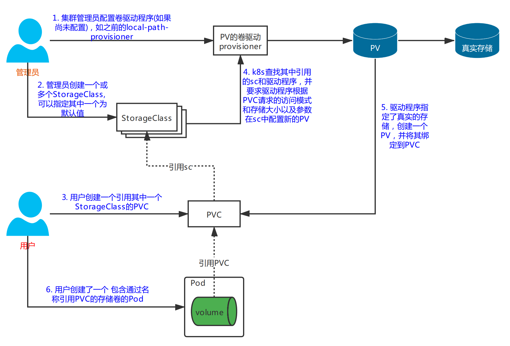

> # k8s-storageclass(六)

# PV的动态卷配置

## 介绍

使用PV和PVC声明可以轻松获得持化存储资源，无须研发人员处理下面实际使用的存储技术，但这仍然需要一个集群管理员来支持实际的存储，需要运维人员先创建好PV，然后开发人员定义好PVC进行一对一的Bound，但是如果PVC请求成千上万，那么就需要创建成千上万的PV，对于运维人员来说维护成本很高。对此，k8s提供一种自动创建PV的机制，叫`StorageClass`，它的作用就是创建PV的模板。

**与PV类似，StorageClass也是非namespace的资源**

**与管理员预先提供一组持久卷不同的是，它们需要定义一个或多个 `StorageClass` 并允许系统在每次通过PVC请求时创建一个新的PV。最重要的是，不可能耗尽PV，很明显 ，你可以用完存储空间**。

## yaml定义

`StorageClass`对象定义调用时，哪一个驱动将被使用(`provisioner`)和哪些参数(`parameters`)将被传递给驱动都需要在yaml文件中定义好。

```yaml
apiVersion: storage.k8s.io/v1
kind: StorageClass
metadata:
  name: fast                          ## sc的名字,PVC定义的时候会引用
provisioner: kubernetes.io/gce-pd     ## 用于配置PV的卷驱动
parameters:                           ## 需要传递给驱动的参数
  type: pd-ssd
```

以上配置中使用的`kubernetes.io/gce-pd`是创建`gcePersistentDisk`类型的PV的驱动。

由于没有这方面的资源，所以，会安装一个分配本地磁盘创建PV的一个驱动，来继续我们对sc的学习。

## 安装local-path-provisioner

### 获取驱动

```shell
## 获取驱动local-path-provisioner, 也可以直接下压缩包然后解压
$ git clone https://github.com/rancher/local-path-provisioner.git
```

### 修改定义

```shell
$ vi local-path-provisioner/deploy/local-path-storage.yaml
```

以下是修改后的部分，只是修改了一个`paths`，原路径是`/opt/local-path-provisioner`，不想修改的也可以忽略

```yaml
---
kind: ConfigMap
apiVersion: v1
metadata:
  name: local-path-config
  namespace: local-path-storage
data:
  config.json: |-
        {
                "nodePathMap":[
                {
                        "node":"DEFAULT_PATH_FOR_NON_LISTED_NODES",
                        "paths":["/usr/local/local-path-provisioner"]
                }
                ]
        }
```

创建对应的路径

```shell
## 在Node节点上创建，供后续的Pod使用，其实我没有创建，它也自动创建了...嘻嘻
$ mkdir /usr/local/local-path-provisioner
```

### 在新的命名空间部署

资源文件`local-path-provisioner/deploy/local-path-storage.yaml`中已经帮我们定义一个了StrogeClass(不喜欢的可以自己重新定义)，来看看这个默认的。

```yaml
---
apiVersion: storage.k8s.io/v1
kind: StorageClass
metadata:
  name: local-path
provisioner: rancher.io/local-path
volumeBindingMode: WaitForFirstConsumer
reclaimPolicy: Delete
```

> apply 资源文件

```shell
[root@master1 kubeyaml]# kubectl create ns local-path-storage
namespace/local-path-storage created
[root@master1 kubeyaml]# kubectl apply -f local-path-provisioner/deploy/local-path-storage.yaml -n local-path-storage
Warning: kubectl apply should be used on resource created by either kubectl create --save-config or kubectl apply
namespace/local-path-storage configured
serviceaccount/local-path-provisioner-service-account created
clusterrole.rbac.authorization.k8s.io/local-path-provisioner-role created
clusterrolebinding.rbac.authorization.k8s.io/local-path-provisioner-bind created
deployment.apps/local-path-provisioner created
storageclass.storage.k8s.io/local-path created
configmap/local-path-config created
[root@master1 kubeyaml]# kubectl get po -n local-path-storage
NAME                                      READY   STATUS    RESTARTS   AGE
local-path-provisioner-5696dbb894-77dmx   1/1     Running   0          37m
[root@master1 kubeyaml]# kubectl get sc
NAME         PROVISIONER         RECLAIMPOLICY   VOLUMEBINDINGMODE      ALLOWVOLUMEEXPANSION   AGE
local-path   rancher.io/local-path   Delete      WaitForFirstConsumer       false              38m
[root@master1 kubeyaml]# 
```

可以从上面输出中看到，我们部署的`local-path-provisioner/deploy/local-path-storage.yaml`资源中已经默认帮我们部署了一个sc的资源，名字是`local-path`.

## PVC使用SC

### yaml定义

```yaml
apiVersion: v1
kind: PersistentVolumeClaim
metadata:
  name: pvc-sc
spec:
  storageClassName: local-path   ## 请求自定义的PVC类型，使用名称为local-path的sc
  resources:
    requests:
      storage: 200Mi
  accessModes:
  - ReadWriteOnce
```

### apply PVC并检查

```shell
[root@master1 kubeyaml]# kubectl apply -f pvc-sc.yaml
persistentvolumeclaim/pvc-sc created
[root@master1 kubeyaml]# kubectl get pv
No resources found
[root@master1 kubeyaml]# kubectl get pvc
NAME     STATUS    VOLUME   CAPACITY   ACCESS MODES   STORAGECLASS   AGE
pvc-sc   Pending                                      local-path     15s
[root@master1 kubeyaml]#
```

可以看到这个时候还没有自动创建PV，连PVC也是Pending状态。

`来检查一下PVC的详细`

```shell
[root@master1 kubeyaml]# kubectl describe pvc pvc-sc
Name:          pvc-sc
Namespace:     default
StorageClass:  local-path
Status:        Pending
Volume:        
Labels:        <none>
Annotations:   <none>
Finalizers:    [kubernetes.io/pvc-protection]
Capacity:      
Access Modes:  
VolumeMode:    Filesystem
Mounted By:    <none>
Events:
  Type    Reason                Age                  From                         Message
  ----    ------                ----                 ----                         -------
  Normal  WaitForFirstConsumer  7s (x12 over 2m51s)  persistentvolume-controller  waiting for first consumer to be created before binding
[root@master1 kubeyaml]# 
```

最后一行显示`waiting for first consumer to be created before binding`，由于我们虽然创建了PVC，但是没有地方使用，这个提示说的就是在绑定之前需要等待第一个使用者被创建。也就是说我们需要有使用的时候才会创建这个PV，好了，我们现在来创建一个Pod来使用这个PVC。

### 使用并创建

同样是定义rs资源。

```yaml
apiVersion: apps/v1
kind: ReplicaSet
metadata:
  name: pvc-sc-rs
spec:
  replicas: 1
  selector:
    matchLabels:
      app: pvc-sc-rs
  template:
    metadata:
      name: pvc-sc-rs
      labels:
        app: pvc-sc-rs
    spec:
      containers:
      - name: pvc-sc-rs
        image: readloop:latest
        imagePullPolicy: Never
        volumeMounts:
        - name: mypvcsc           ## 使用volume
          mountPath: /var/htread
      volumes:
      - name: mypvcsc             ## 定义volume的名字
        persistentVolumeClaim:
          claimName: pvc-sc       ## 应用pvc-sc这个PVC
```

> apply并查看

```shell
[root@master1 kubeyaml]# kubectl apply -f pvc-sc-rs.yaml
replicaset.apps/pvc-sc-rs created
[root@master1 kubeyaml]# kubectl get po 
NAME                    READY   STATUS             RESTARTS   AGE
pvc-sc-rs-sd9wm         1/1     Running            0          2m16s
[root@master1 kubeyaml]# kubectl get pv
NAME       CAPACITY   ACCESS MODES   RECLAIM POLICY   STATUS   CLAIM     STORAGECLASS   REASON   AGE
pvc-b7e...   200Mi      RWO            Delete        Bound    default/pvc-sc   local-path        2s
[root@master1 kubeyaml]# kubectl get pvc
NAME     STATUS   VOLUME       CAPACITY   ACCESS MODES   STORAGECLASS   AGE
pvc-sc   Bound    pvc-b7e...   200Mi      RWO            local-path     5m27s
[root@master1 kubeyaml]# 
```

上面的NAME `pvc-b7e...`这个是个很长的uuid，就没写了，需要说明的一点是上面输出中的两个`pvc-b7e...`值是一样的，pvc绑定了上面的pv。而且PVC中申请了多少存储，PV就会有多少存储(上面是200Mi).

> 检查Pod是否正常，日常查日志，没有什么毛病

```shell
[root@master1 kubeyaml]# kubectl logs pvc-sc-rs-sd9wm
waitting file index.html
waitting file index.html
[root@master1 kubeyaml]# 
```

> 依旧去Pod所在的节点上创建对应的文件，进到之前我们部署驱动时的那个目录`/usr/local/local-path-provisioner`

```shell
[root@node1 local-path-provisioner]# pwd
/usr/local/local-path-provisioner
[root@node1 local-path-provisioner]# ls
pvc-b7e1cb85-d202-4b27-be85-654237ec47fd_default_pvc-sc
[root@node1 pvc-b7e...]# cd pvc-b7e1cb85-d202-4b27-be85-654237ec47fd_default_pvc-sc
[root@node1 pvc-b7e...]# date >> index.html
```

这个路径下多了一个文件夹`pvc-b7e...`，好吧，你猜到了，这个就是之前自动创建那个PV的名字。

写入日期之后日常回到master节点查日志，再贴一次吧，我吐了。

```shell
[root@master1 kubeyaml]# kubectl logs pvc-sc-rs-sd9wm
waitting file index.html
...
waitting file index.html
2021年 07月 07日 星期三 18:17:27 CST
[root@master1 kubeyaml]# 
```

## 持久卷动态配置的完整图示



