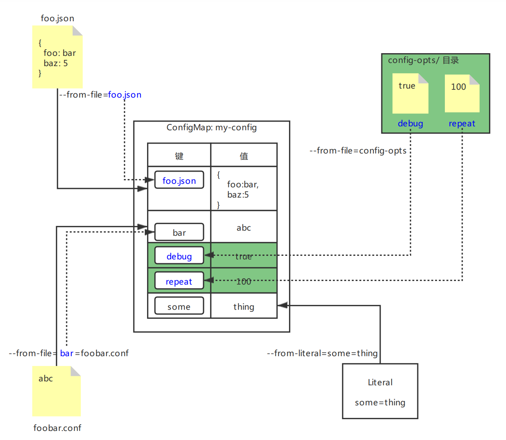

> # k8s-configmap(七)

# 向容器数据

## 了解ENTRYPOINT和CMD

Dockerfile中这两种指令分别定义`命令`与`参数`这里两个部分

```properties
ENTRYPOINT: 定义容器启动时被调用的可执行程序
CMD: 定义传递给ENTRYPOINT的参数
```

当然，可以使用CMD命令直接指定镜像运行时想要执行的指令，但是推荐的做法还是借助ENTRYPOINT命令，仅仅使用CMD指定默认参数，这样容器可以直接运行，无需添加任何其他参数。

```shell
## 不指定参数直接运行
$ docker run <image>
## 添加一些参数，覆盖Dockerfile中任何由CMD指定的默认参数值
$ docker run <image> <args>
```

## 了解shell和exec的区别

上面两条指令均支持以下两种方式，它们的区别在于**指定的指令是否在shell中被调用**

```properties
shell形式: 如ENTRYPOINT node app.js
exec形式: 如ENTRYPOINT ["node", "app.js"]
```

> 分别对两种形式创建不同的Dockerfile查看区别，app.js就是之前`kubia:latest`镜像使用的那个，贴一下吧之前也没贴过

```javascript
//app.js
const http = require('http');
const os = require('os');

console.log("Kubia server starting...");

var handler = function(request, response) {
	console.log("Received request from " + request.connection.remoteAddress);
	response.writeHead(200);
	response.end("You've hit " + os.hostname() + "\n");
};
var www = http.createServer(handler);
www.listen(8080);
```

> Dockerfile

```dockerfile
FROM daocloud.io/library/node:8.2.1-alpine
ADD app.js /app.js
ENTRYPOINT ["node", "app.js"]
```

```shell
FROM daocloud.io/library/node:8.2.1-alpine
ADD app.js /app.js
ENTRYPOINT node app.js
```

`kubia:latest`这个镜像已经是使用的exec模式了，所以只需要对shell模式的这个Dockerfile打一次镜像。

```shell
$ docker build -t kubia:shell .
```

> 查看两者运行的区别

```shell
[root@node1 kubia]# docker run --name kubia-shell -d kubia:shell
0debd97788d32b900a10644be715514fd4cf509ffd784840f7a1b1aa7ba5f120
[root@node1 kubia]# docker run --name kubia-exec -d kubia:latest
d9276846f220e30a60165ac72fffc20df9403a3c2d57a7b8edb61a0ab420226c
[root@node1 kubia]# docker ps | grep kubia-*
0debd97788d3        kubia:shell             "/bin/sh -c 'node ap…"   ...  kubia-shell
d9276846f220        kubia:latest            "node app.js"            ...  kubia-exec
[root@node1 kubia]# docker exec 0debd97788d3 ps x
PID   USER     TIME   COMMAND
 1    root     0:00   /bin/sh -c node app.js
 6    root     0:00   node app.js
12    root     0:00   ps x
[root@node1 kubia]# docker exec d9276846f220 ps x
PID   USER     TIME   COMMAND
 1    root     0:00   node app.js
11    root     0:00   ps x
[root@node1 kubia]# 
```

- 基于exec的，主进程(PID=1)是node进程; 

- 基于shell的，主进程是shell进程，而非node进程，node进程是在shell进程中启动的。

而shell进程往往是多余的， 因此通常可以直接采用exec形式的ENTRYPOINT指令。

## 命令行传递

镜像的ENTRYPOINT和CMD均可以被覆盖，仅需在容器中定义设置属性`command`和`args`的值。

| Docker     | k8s(容器规范) | 描述                                     |
| ---------- | ------------- | ---------------------------------------- |
| ENTRYPOINT | command       | 容器中运行的可执行文件，一般很少覆盖命令 |
| CMD        | args          | 传给可执行文件的参数                     |

**command 和 args 字段在 pod 创建后无法被修改！！！**

### yaml定义

```yaml
kind: Podspec:  containers:  - image: some/image    command: ["/bin/command"]    args: ["argl", "arg2", "arg3"]
```

> 数组参数可以使用如上的中括号的形式，也可以使用yaml的短横线方式。

```yaml
args:- arg1- arg2- "30"
```

**字符串值无须用引号标记，数值需要！！！**

示例将和环境变量传参一起演示。

## 环境变量传递

环境变量和命令行参数一样，都是容器级的，可以为单个容器指定。**与容器的命令和参数设置相同，环境变量列表无法在pod创建后被修改**。

### yaml定义

```yaml
kind: Podspec:  containers:  - image: some/image    env:    - name: FIRST_VAR   ## 添加一个名为FIRST_VAR的环境变量      value: "foo"      ## 指定环境变量FIRST_VAR的值为foo    - name: SECOND_VAR      value: "$(FIRST_VAR)bar"   ## 值引用上一个环境变量的值...
```

环境变量的值引用可以采用如yaml中`$(key)`的形式。

**k8s会自动暴露相同命名空间下每个service对应的环境变量。这些环境变量基本上可以被看作自动注入的配置！！！**

## ENV&ARGS演示

### 环境准备

> envargs.sh

```shell
#!/bin/bashtrap "exit" SIGINTwhile truedo  echo "args=$1, env(MY_NAME)=$MY_NAME"      ## 输出参数的值和环境变量的值  sleep 5done
```

> Dockerfile

```dockerfile
FROM daocloud.io/library/ubuntu:artful-20170619ADD envargs.sh /bin/envargs.shENTRYPOINT ["/bin/envargs.sh"]    ## exec模式CMD ["wtRead"]           ## 给定默认参数
```

> 构建

```shell
## 记得在Node节点上构建，都是用的本地镜像，Pod要在Node节点拉镜像运行$ docker build -t envargs .
```

### yaml定义

```yaml
apiVersion: apps/v1kind: ReplicaSetmetadata:  name: envargs-rsspec:  replicas: 1  selector:    matchLabels:      app: envargs-rs  template:    metadata:      name: envargs-rs      labels:        app: envargs-rs    spec:      containers:      - name: one        image: envargs:latest               imagePullPolicy: Never        args: ["changedArgs"]          ## 覆盖Dockerfile的CMD参数        env:        - name: MY_NAME                ## 定义环境变量          value: envargs-first      - name: two        image: envargs:latest        imagePullPolicy: Never        env:        - name: SECOND_KEY          value: second        - name: MY_NAME          value: "envargs-$(SECOND_KEY)"        ## 引用环境变量的值
```

> apply查看结果

```shell
[root@master1 kubeyaml]# kubectl apply -f envargs-rs.yamlreplicaset.apps/envargs-rs created[root@master1 kubeyaml]# kubectl get poNAME               READY   STATUS    RESTARTS   AGEenvargs-rs-twpwz   2/2     Running   0          4s[root@master1 kubeyaml]# kubectl logs envargs-rs-twpwz -c oneargs=changedArgs, env(MY_NAME)=envargs-first[root@master1 kubeyaml]# kubectl logs envargs-rs-twpwz -c twoargs=wtRead, env(MY_NAME)=envargs-second[root@master1 kubeyaml]# 
```

可以看到name为`one`的容器中args参数被覆盖，name为`two`的容器的环境变量`MY_NAME`成功引用`$(SECOND_KEY)`，且两个容器中相同名字`MY_NAME`的环境变量的值互不影响。

## ConfigMap

使用ConfigMap有助于在不同环境(开发，测试，生产等)下拥有多份同名配置清单，Pod是通过名称引用ConfigMap的，因此可以在多环境下使用相同的Pod定义，同事保持不同的配置值以适应不同环境。

### 命令行创建ConfigMap

```shell
$ kubectl create configmap my-config  --from-file=foo.json              ## 单独的文件，key默认为文件名，值Wie文件内容  --from-file=bar=foobar.conf       ## 指定了自定义的key，key为自定义的bar，不再是文件名  --from-file=config-opts/           ## 完整的文件夹，key默认为文件名，值为文件内容  --from-literal=some=thing         ## 字面量，key=some, value=thing
```

> 图解



### yaml文件创建

```yaml
apiVersion: v1kind: ConfigMapmetadata:  name: my-config  ## configMap的名称，通过这个名字来引用configMapdata:              ## data下直接写key-value  jdkVersion: "1.8"       ## 数字记得加引号  MY_NAME: wt  
```

```shell
## apply一下这个configMap，后续会用$ kubectl apply -f cm-my-config.yaml
```

### 引用configMap

老规矩，rs测试。

```yaml
apiVersion: apps/v1kind: ReplicaSetmetadata:  name: cm-rsspec:  replicas: 1  selector:    matchLabels:      app: cm-rs  template:    metadata:      name: cm-rs      labels:        app: cm-rs    spec:      containers:      - name: one        image: envargs:latest        imagePullPolicy: Never        envFrom:                           ## 直接引用configMap作为环境变量        - configMapRef:            name: my-config                ## 引用的configMap的名字            optional: true                 ## 指定为true当configMap不存在时容器也可以启动        args: ["$(jdkVersion)"]            ## 参数直接引用环境变量      - name: two        image: envargs:latest        imagePullPolicy: Never        env:        - name: JDK_VERSION                ## 定义环境变量的名字          valueFrom:                       ## 指定环境变量的值来源是configMap中的某个key            configMapKeyRef:              optional: true               ## 指定为true当key不存在时容器也可以启动              name: my-config              ## 值来自configMap的名字              key: jdkVersion              ## 值来自configMap的哪个key        args: ["$(JDK_VERSION)"]           ## 参数直接引用环境变量
```

容器`two`中，仅引用name为`my-config`的其中一个键为`jdkVersion`的值，作为环境变量`JDK_VERSION`的值。

容器`one`中，直接使用`envFrom`来指定将name为`my-config`的configMap直接作为环境变量(包含`my-config`的所有键值对)。**可以通过`envFrom.prefix`来指定引入后的环境变量的统一前缀**。

```yaml
...
envFrom
- prefix: CONFIG_
  configMapRef:
    name: my-config 
... 
## 这种方式，引入后所有key都被加上CONFIG_的前缀，jdkVersion --> CONFIG_jdkVersion
```

> apply查看日志

```shell
[root@master1 kubeyaml]# kubectl apply -f cm-rs.yaml
replicaset.apps/cm-rs created
[root@master1 kubeyaml]# kubectl get po
NAME          READY   STATUS        RESTARTS   AGE
cm-rs-jhd97   2/2     Running       0          2s
[root@master1 kubeyaml]# kubectl logs cm-rs-jhd97 -c one
args=1.8, env(MY_NAME)=wt
[root@master1 kubeyaml]# kubectl logs cm-rs-jhd97 -c two
args=1.8, env(MY_NAME)=
[root@master1 kubeyaml]#
```

日志输出中，容器`输出`正常，容器`two`环境变量`MY_NAME`为空，原因是rs定义中，只引入了`my-config`的jdkVersion这个key，而没有引入`MY_NAME`这个key。

### 注意事项

在引用configMap作为容器中env的时候，如果configMap中的key不合法，比如confgMap中包含键`FOO-BAR`，破折号在环境变量中不合法，这个时候创建环境变量的时候会忽略该条目，**且忽略时不会发出任何事件通知**

## ConfigMap卷

**开始之前先清除之前创建的cm和rs**

创建文件夹和对应文件，及configMap

```shell
[root@master1 kubeyaml]# mkdir config-map-dir
[root@master1 kubeyaml]# echo wangtao >> config-map-dir/MY_NAME 
[root@master1 kubeyaml]# echo 18 >> config-map-dir/jdkVersion
[root@master1 kubeyaml]# ls config-map-dir/
jdkVersion  MY_NAME
[root@master1 kubeyaml]# 
```

> 从文件夹创建configMap

```shell
[root@master1 kubeyaml]# kubectl create cm dir-cm --from-file=config-map-dir
configmap/dir-cm created
[root@master1 kubeyaml]# kubectl get cm
NAME     DATA   AGE
dir-cm   2      9s
[root@master1 kubeyaml]# kubectl describe cm dir-cm
Name:         dir-cm
Namespace:    default
Labels:       <none>
Annotations:  <none>

Data
====
MY_NAME:
----
wangtao

jdkVersion:
----
18

Events:  <none>
[root@master1 kubeyaml]#
```

> 创建普通的字面量configMap

```shell
[root@master1 config-map-dir]# kubectl create cm kv-cm --from-literal=age=28 --from-literal=sex=male
configmap/kv-cm created
[root@master1 kubeyaml]# kubectl get cm
NAME     DATA   AGE
dir-cm   2      1m
kv-cm    2      1m
[root@master1 kubeyaml]#
```

### 挂载configMap卷

这个示例包含普通的字面量configMap和以文件夹形式创建的configMap，采用两种方式的configMap来做示例为了说明configMap以卷的方式挂载，跟configMap的出创建方式无关，它本质上就是configMap。

```yaml
apiVersion: apps/v1
kind: ReplicaSet
metadata:
  name: cm-rs-volume
spec:
  replicas: 1
  selector:
    matchLabels:
      app: cm-rs-volume
  template:
    metadata:
      name: cm-rs-volume
      labels:
        app: cm-rs-volume
    spec:
      containers:
      - name: one
        image: envargs:latest
        imagePullPolicy: Never
        volumeMounts:
        - name: config           
          mountPath: /var/config    ## 挂在到容器的目录
        - name: config-age
          mountPath: /var/config-age
      volumes:
      - name: config            ## 卷名字
        configMap:              ## 挂载configMap
          name: dir-cm          ## configMap的名字
      - name: config-age
        configMap:
          name: kv-cm           ## 字面量的configMap
          items:                ## 仅将列出的key项挂载
          - key: sex            ## configMap中的键名
            path: dir/sex.conf  ## 改条目的值被存储在该文件中，只能使用相对路径
```

> 日常apply检查

```shell
[root@master1 kubeyaml]# kubectl apply -f cm-rs-volume.yaml
replicaset.apps/cm-rs-volume created
[root@master1 kubeyaml]# kubectl get po
NAME                 READY   STATUS    RESTARTS   AGE
cm-rs-volume-lnxgv   1/1     Running   0          3s
[root@master1 kubeyaml]# kubectl exec cm-rs-volume-lnxgv -- ls /var/config
MY_NAME
jdkVersion
[root@master1 kubeyaml]# kubectl exec cm-rs-volume-lnxgv -- cat /var/config/MY_NAME
wangtao
[root@master1 kubeyaml]# kubectl exec cm-rs-volume-lnxgv -- cat /var/config/jdkVersion
18
[root@master1 kubeyaml]# kubectl exec cm-rs-volume-lnxgv -- cat /var/config-age/dir/sex.conf
male
[root@master1 kubeyaml]# 
```

可以看到挂载的全量`dir-cm`被放在容器目录下`/var/config`的地方，configMap键值对的key作为文件名，value作为文件内容。

按条目挂载的键值被放在`/var/config-age/dir/sex.conf`中，其中包含我们定义的相对路径`dir/sex.conf`.

### 动态更新

**ConfigMap的动态更新，对于Pod中的对应文件的同步可能会很慢，会很慢，很慢，甚至长达几分钟**！

环境变量或者ARGS参数作为配置源的弊端是无法动态更改配置项，configMap可以。来试一下修改configMap中键MY_NAME的值，将其改为changed.

```shell
## 这行命令执行后会给出yaml配置，更改之后保存就ok
[root@master1 kubeyaml]# kubectl edit cm dir-cm
configmap/dir-cm edited
[root@master1 kubeyaml]# kubectl exec cm-rs-volume-lnxgv -- cat /var/config/MY_NAME
changed
[root@master1 kubeyaml]#
```

> 变更记录

```shell
[root@master1 kubeyaml]# kubectl exec cm-rs-volume-lnxgv -- ls -lA /var/config
total 0
drwxr-xr-x. 2 root root 39 Jul  9 05:18 ..2021_07_09_05_18_22.955785617
lrwxrwxrwx. 1 root root 31 Jul  9 05:18 ..data -> ..2021_07_09_05_18_22.955785617
lrwxrwxrwx. 1 root root 14 Jul  9 04:58 MY_NAME -> ..data/MY_NAME
lrwxrwxrwx. 1 root root 17 Jul  9 04:58 jdkVersion -> ..data/jdkVersion
[root@master1 kubeyaml]# 
```

**可以看到， 被挂载的configMap卷中的文件是` ..data`文件夹中文件的符号链接， 而`..data`文件夹同样是`..2021_07_09_05_18_22.955785617`的符号链接。 每当 ConfigMap被更新后， k8s就会创建一个这样的文件夹， 写入所有文件并重新将符号`.. data`链接至新文件夹， 通过这种方式可以一次性修改所有文件**。

### 挂载非完整卷(不会动态更新)

```yaml
spec:
  containers:
  - image: some/image
    volumeMounts:
    - name: myvolume
      mountPath: /etc/someconfig.conf   ## 挂载至某一文件而不是文件夹
      subPath: myconfig.conf            ## 仅挂载指定条目
```

通常来讲，将卷挂载至某个文件夹如`/etc`，意味着，容器镜像中`/etc`下的原本存在的文件都会隐藏。

对于任何类型卷来讲，都可以通过属性subPath可以将该文件挂载的同时又不影响文件夹中的其他文件，但是这种挂载方式会带来动态更新上的缺陷(configMap可能无法动态更新)。

### 设置configMap卷中文件权限

```yaml
volumes:
- name: config
  configMap:
    name: kv-cm
    defaultMode: "6600"  ## 设置所有文件的权限为-rw-rw------
```

## Secret

ConfigMap用来传递非敏感数据，Secret是用来传递敏感数据，如证书，密码等。

Secret 结构与 ConfigMap类似，均是键值对的映射。Secret 的使用方法也与 ConfigMap 相同，可以将 Secret 条目作为环境变量传递给容器，也可以将 Secret 条目暴露为卷中的文件。

k8s 通过仅仅将 Secret 分发到需要访问 Secret 的 pod所在的机器节点来保障其安全性。另外，Secret 只会存储在节点的内存中，永不写入物理存储，这样从节点上删除Secret 时就不需要擦除磁盘了

### yaml定义

```yaml
kind: Secret
apiVersion: v1
type: generaic              ## 类型，可选值geneic，tls等
stringData:
  foo: bar                  ## 由于直接编码后比较难辨认，可以直接写到stringData中
data:
  key: base64(value)        ## kv键值对，值为base64编码后的值         
```

`type`的在yaml定义时可以自定义值(后续有演示)，但是在命令行创建时只能用可选值，可以用`kubectl create secret --help`查看可选值。

> apply一个查看

```yaml
kind: Secret
apiVersion: v1
type: abcd                  
stringData:
  foo: bar                
data:
  foo2: YmFy            ## YmFy是base64(bar)的值，用于后续和上面的foo比较
```

> 开搞

```shell
[root@master1 kubeyaml]# kubectl apply -f my-secret.yaml
secret/my-secret created
[root@master1 kubeyaml]# kubectl get secret 
NAME                  TYPE                                  DATA   AGE
default-token-d7xjk   kubernetes.io/service-account-token   3      40d
my-secret             abcd                                  2      14s
[root@master1 kubeyaml]# kubectl get secret my-secret -o yaml
apiVersion: v1
data:
  foo: YmFy
  foo2: YmFy
kind: Secret
metadata:
...
type: abcd
[root@master1 kubeyaml]#
```

可以看到，输出中是看不到`stringData`这列栏的，foo键的值已经被base64加密。

### 命令行创建

```yaml
## 自动定义的type=abcdefg创建报错
[root@master1 kubeyaml]# kubectl create secret abcdefg cmd-secret --from-literal=kk=bb
Error: unknown flag: --from-literal
See 'kubectl create secret --help' for usage.
## 使用可选的type=generic创建成功
[root@master1 kubeyaml]# kubectl create secret generic cmd-secret --from-literal=kk=bb
secret/cmd-secret created
[root@master1 kubeyaml]# kubectl get secret cmd-secret -o yaml
apiVersion: v1
data:
  kk: YmI=
kind: Secret
...
type: Opaque            ## ???不应该是generic吗?
[root@master1 kubeyaml]# 
```

### 验证secret是否存储在内存中

**开始之前先删除自己创建的secret**

每个容器都默认挂载了一个叫`default-token-xxx`的secret。我们直接用这个来验证吧。

> 随便 拿个Pod来检查

```shell
[root@master1 kubeyaml]# kubectl get secret
NAME                  TYPE                                  DATA   AGE
default-token-d7xjk   kubernetes.io/service-account-token   3      40d
[root@master1 kubeyaml]# kubectl get po
NAME                 READY   STATUS    RESTARTS   AGE
cm-rs-volume-lnxgv   1/1     Running   0          104m
[root@master1 kubeyaml]# kubectl describe po cm-rs-volume-lnxgv
    Mounts:
    ...
      /var/run/secrets/kubernetes.io/serviceaccount from default-token-d7xjk (ro)
...
Volumes:
  default-token-d7xjk:
    Type:        Secret (a volume populated by a Secret)
    SecretName:  default-token-d7xjk
    Optional:    false
...
[root@master1 kubeyaml]#
```

可以看到这个secret被挂载到容器中的路径是`/var/run/secrets/kubernetes.io/serviceaccount`.

> 验证

```shell
[root@master1 kubeyaml]# kubectl exec cm-rs-volume-czgjn -- mount | grep serviceaccount
tmpfs on /run/secrets/kubernetes.io/serviceaccount type tmpfs (ro,relatime,seclabel)
[root@master1 kubeyaml]#
```

可以看到，被挂载到了tmpfs上。这样存储在secret中的数据就不会写入磁盘，也就无法被窃取。

### 从私有仓库拉镜像时使用secret

需要创建`docker-registry`类型的secret。

```shell
$ kubectl create secret docker-registry mydockerhubsecre t \
--docker-username=myusername --docker-password=mypassword \
--docker-email=my.email@proider.com
```

> 容器拉取的yaml

```yaml
kind: Pod
spec
  imagePullSecrets: 
  - name: mydockerhubsecret   ## 配置好secret
containers:
...
```

这样就可以使用`mydockerhubsecret`去拉取私有库的镜像了，由于没有环境，看起来有比较简单，演示就略过了。

