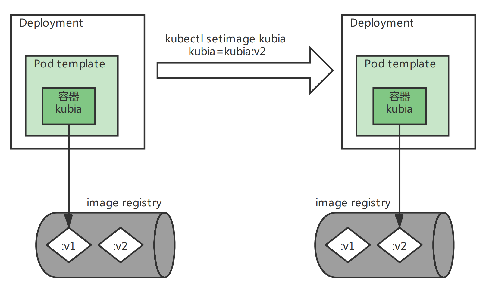
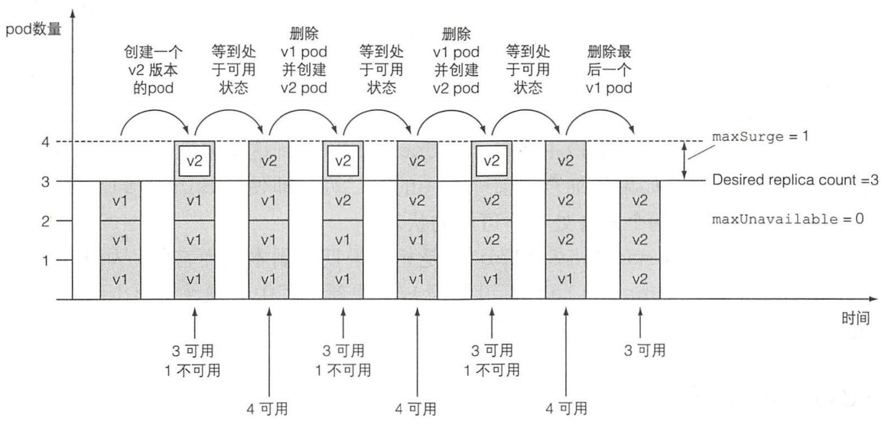

> # k8s-deployment(八)

# Deployment

## 介绍

Deployment 是一种更高阶资源，用于部署应用程序并以声明的方式升级应用，而不是通过 ReplicationController 或 ReplicaSet 进行部署，这俩都被认为是更底层的概念。在使用 Deployment 时，实际的 pod 是由 Deployment 的 Replicaset 创建和管理的， 而不是由 Deployment 直接创建和管理的。


创建Deployment与创建ReplicationController并没有任何区别。Deployment也是由标签选择器、期望副数和pod模板组成的。此外，它还包含另一个字段，指定一个部署策略，该策略定义在修改Deployment资源时应该如何执行更新。

## yaml定义

```yaml
apiVersion: apps/v1
kind: Deployment
metadata:
  name: kubia
spec:
  replicas: 3
  selector:
    matchLabels:
      app: kubia
  template:
    metadata:
      name: kubia
      labels:
        app: kubia
    spec:
      containers:
        - name: kubia
          image: kubia:v1
          imagePullPolicy: Never
          ports:
            - containerPort: 8080
```

## apply演示

> apply检查，加上`--record`选项记录历史版本号，后续会很有用

```shell
[root@master1 kubeyaml]# kubectl apply -f  kubia-deployment-v1.yaml --record
deployment.apps/kubia created
[root@master1 kubeyaml]# kubectl get deployment
NAME    READY   UP-TO-DATE   AVAILABLE   AGE
kubia   3/3     3            3           6m8s
[root@master1 kubeyaml]# 
```

> 查看部署状态

这个命令可以在后续用来查看整个滚动升级的过程

```shell
[root@master1 kubeyaml]# kubectl rollout status deployment kubia
deployment "kubia" successfully rolled out
[root@master1 kubeyaml]# 
```

也可以用`kubectl get deploment`或者`kubectl describe`来查看。

> 检查rs和po

```shell
[root@master1 kubeyaml]# kubectl get rs
NAME               DESIRED   CURRENT   READY   AGE
kubia-58689d9459   3         3         3       6m24s
[root@master1 kubeyaml]# kubectl get po
NAME                     READY   STATUS    RESTARTS   AGE
kubia-58689d9459-9fggh   1/1     Running   0          6m29s
kubia-58689d9459-s4fgc   1/1     Running   0          6m29s
kubia-58689d9459-wzn6b   1/1     Running   0          6m29s
[root@master1 kubeyaml]# 
```

Deployment是管理ReplicaSet的，创建Pod是有rs完成的，所以我们可以看到，生成了一个rs资源`kubia-58689d9459`，且由这个rs创建了三个Pod。

我们知道，rs在创建Pod的时候，会在Pod名字的后面加一串随机串防止重复。

Deployment在创建rs的时候也会在后面加一串字符，如上面的rs`kubia-58689d9459`，但是这串数字不是随机的，这个实际上对应Pod模板的hash值，可以describe看下

```shell
[root@master1 kubeyaml]# kubectl describe rs kubia-58689d9459
Name:           kubia-58689d9459
Namespace:      default
Selector:       app=kubia,pod-template-hash=58689d9459
Labels:         app=kubia
                pod-template-hash=58689d9459
...
[root@master1 kubeyaml]#   
```

**Deployment 会创建多个 ReplicaSet, 用来对应和管理一个版本的 pod 模板。 像这样使用 pod 模板的hash值， 可以让 Deployment 始终对给定版本的 pod 模板创建相同的 （或使用已有的） ReplicaSet**

## 部署service

部署一个service，用来暴露上面的Pod。用以前的那个service定义就好，贴一下。

```yaml
apiVersion: v1
kind: Service
metadata:
  name: kubia
spec:
  ports:
  - port: 80
    targetPort: 8080
  selector:
    app: kubia
```

> apply

```shell
[root@master1 kubeyaml]# kubectl apply -f kubia-service.yaml
[root@master1 kubeyaml]# kubectl get svc
NAME         TYPE        CLUSTER-IP      EXTERNAL-IP   PORT(S)   AGE
kubernetes   ClusterIP   10.96.0.1       <none>        443/TCP   21d
kubia        ClusterIP   10.111.95.115   <none>        80/TCP    21m
[root@master1 kubeyaml]# kubectl getcurl 10.111.95.115
Error: unknown command "getcurl" for "kubectl"
Run 'kubectl --help' for usage.
[root@master1 kubeyaml]# curl 10.111.95.115
v1 version, You've hit kubia-58689d9459-wzn6b
[root@master1 kubeyaml]# 
```

服务正常访问就行，用于后续滚动升级用

## 滚动升级

### 减慢升级过程

由于我们的kubia服务太过于简单，所以部署速度会非常快，可能看不到滚动升级的过程，因此我们需要减慢滚动升级的速度，来完成我们的演示。

```shell
[root@master1 kubeyaml]# kubectl patch deployment kubia -p '{"spec": {"minReadySeconds": 10}}'
deployment.apps/kubia patched
[root@master1 kubeyaml]#
```

### 测试脚本

新开一个shell窗口，每1秒访问一次我们的服务，检查滚动升级过程

```shell
 $ while true; do curl 10.111.95.115;sleep 1; done
```

### 升级过程

以上两步都完成后，开始执行滚动升级

```shell
[root@master1 kubeyaml]# kubectl set image deployment kubia kubia=kubia:v2
deployment.apps/kubia image updated
[root@master1 kubeyaml]# kubectl rollout status deployment kubia 
Waiting for deployment "kubia" rollout to finish: 1 out of 3 new replicas have been updated...
...
```

第二个命令执行完之后会打印日志，直到升级过程完成。

第一个命令`kubectl set image deployment kubia kubia=kubia:v2`中的第一个kubia表示deployment的名字，第二个kubia表示容器的名字，去对比之前的yaml定义。



在滚动升级过程中，中途你可能会看到如下情况。

```shell
## 出现新旧Pod同时存在的情况
[root@master1 kubeyaml]# kubectl get po
NAME                     READY   STATUS    RESTARTS   AGE
kubia-58689d9459-9fggh   1/1     Running   0          37m
kubia-58689d9459-s4fgc   1/1     Running   0          37m
kubia-58689d9459-wzn6b   1/1     Running   0          37m
kubia-85d7c5d76-zfqm2    1/1     Running   0          17s
## k8s此时正在终止旧的Pod
[root@master1 kubeyaml]# kubectl get po
NAME                     READY   STATUS        RESTARTS   AGE
kubia-58689d9459-9fggh   1/1     Running       0          40m
kubia-58689d9459-wzn6b   1/1     Terminating   0          40m
kubia-85d7c5d76-cmtb5    1/1     Running       0          18s
kubia-85d7c5d76-v554j    1/1     Running       0          99s
kubia-85d7c5d76-zfqm2    1/1     Running       0          3m
[root@master1 kubeyaml]# 
```

循环访问的那个窗口输出可能如下

```shell
[root@master1 ~]# while true; do curl 10.111.95.115;sleep 0.5; done
v1 version, You've hit kubia-58689d9459-wzn6b
v1 version, You've hit kubia-58689d9459-9fggh
v1 version, You've hit kubia-58689d9459-s4fgc
...
## v2版部署之后
v2 version, You've hit kubia-85d7c5d76-zfqm2
v1 version, You've hit kubia-58689d9459-wzn6b
v1 version, You've hit kubia-58689d9459-9fggh
v1 version, You've hit kubia-58689d9459-s4fgc
...
## v2部署完之后
v2 version, You've hit kubia-85d7c5d76-zfqm2
v2 version, You've hit kubia-85d7c5d76-cmtb5
v2 version, You've hit kubia-85d7c5d76-v554j
...
```

`rollout status`输出

```shell
[root@master1 ~]# kubectl rollout status deployment kubia
Waiting for deployment "kubia" rollout to finish: 1 out of 3 new replicas have been updated...
Waiting for deployment "kubia" rollout to finish: 1 out of 3 new replicas have been updated...
Waiting for deployment "kubia" rollout to finish: 1 out of 3 new replicas have been updated...
Waiting for deployment "kubia" rollout to finish: 2 out of 3 new replicas have been updated...
Waiting for deployment "kubia" rollout to finish: 2 out of 3 new replicas have been updated...
Waiting for deployment "kubia" rollout to finish: 2 out of 3 new replicas have been updated...
Waiting for deployment "kubia" rollout to finish: 2 out of 3 new replicas have been updated...
Waiting for deployment "kubia" rollout to finish: 1 old replicas are pending termination...
Waiting for deployment "kubia" rollout to finish: 1 old replicas are pending termination...
Waiting for deployment "kubia" rollout to finish: 1 old replicas are pending termination...
deployment "kubia" successfully rolled out
[root@master1 ~]# 
```

> 升级过程图解


> 历史rs

```shell
[root@master1 kubeyaml]# kubectl get rs
NAME               DESIRED   CURRENT   READY   AGE
kubia-58689d9459   0         0         0       108m
kubia-85d7c5d76    3         3         3       70m
[root@master1 kubeyaml]# 
```

升级完成后，我们依然可以看到历史的rs并没有被删除，这个后续可以用来进行版本的回滚。

**滚动升级过程，需要Pod template有变更才会触发升级，比如说只是更改了Pod引用的ConfigMap，那么更改ConfigMap资源本身将不会触发升级操作。但是可以通过创建新的ConfigMap，修改Pod template对其的引用来触发升级操作**

## 重要常用属性

### 升级策略

升级策略的配置在deployment的yaml文件中配置如下，之前没有配置都是使用的默认的(rollingUpdate).

```yaml
spec:
  strategy: 
    rollingUpdate:        ## 仅当类型为rollingUpdate时有此配置
      maxSurge: 25%       
      maxUnavailable: 25%
  type: rollingUpdate     ## 策略类型，rollingUpdate/Recreate
```

策略有两种类型rollingUpdate就是滚动升级，Recreate是先删除旧的，再启动新的。

#### 控制滚动升级的速率

> maxSurge

```
决定了 Deployment 配置中期望的副本数之外，最多允许超出的 Pod 实例的数量。
默认值为 25% ，所以 pod 实例最多可以比期望数量多 25% 。
如果期望副本数被设置为4，那么在滚动升级期间，不会运行超过5个 pod 实例。
当把百分数转换成绝对值时，会将数字四舍五入。
这个值也可以不是百分数而是绝对值，例如，可以允许最多多1个或2个 po.
```

`图解3个Pod,maxSurge=25%,也就是最多允许Pod数量达到4`



> maxUnavailable

```
决定了在滚动升级期间 ，相对于期望副本数能够允许有多少 实例处于不可用状态。默认值也是 25%,
所以可用 Pod 实例的数量不能低于期望副本数的 75%. 百分数转换成绝对值时这个数字也会四舍五入.
如果期望副本数设置为4 ，并且百分比为 25%. 那么只能有一个 pod 处于不可用状态。
在整个发布过程中 ，总是保持至少有三个实例处于可用状态来提供服务.
与maxSurge一样，也可以指定绝对值而不是百分比.
```

`图解3个Pod, maxSurge=1且maxUnavailable=1, 也就是最多允许Pod数量达到4,最大不可用Pod数量1(最少可用3-1=2)`


### 阻止出错的版本升级

```
minReadySeconds: 当所有容器的就绪探针返回成功时, pod 就被标记为就绪状态。
如果一个新的pod运行出错，就绪探针返回失败， 
如果一个新的pod运行出错，并且在minReadySeconds时间内它的就绪探针出现了失败，那么新版本的滚动升级将被阻止。
```

使用这个属性可以通过让k8s在pod就绪之后继续等待指定的时长， 然后继续执行滚动升级， 来减缓滚动升级的过程(之前减慢升级过程就是用的这个参数)。 

通常情况下需要 将minReadySeconds 设置为 更高的值， 以确保pod在它们真正开始接收实际流量之后可以持续保持就绪 状态。

> TIPS: 你可以搞一个v3版本，然后将app.js改成会返回错误(是返回错误，不是程序错误导致重启！！)的版本，之前测试就绪探针那个版本就很合适，然后将当前deployment的镜像修改成v3，测试一下是否会停止升级

## 升级中的rollout操作

### 查看历史版本(history)

```shell
[root@master1 kubeyaml]# kubectl rollout history deployment kubia
deployment.apps/kubia 
REVISION  CHANGE-CAUSE
1         kubectl apply --filename=kubia-deployment-v1.yaml --record=true
3         kubectl apply --filename=kubia-deployment-v1.yaml --record=true
4         kubectl apply --filename=kubia-deployment-v2.yaml --record=true

[root@master1 kubeyaml]#
```

`REVISION`是版本号，回滚时可选。

`CHANGE-CAUSE`是每次升级的相关信息，如果部署的时候不指定`--record`参数的话，这行将为空，不利于后续版本的迭代和回滚时看相关信息。

经过测试，只有修改了yaml文件，从yaml文件通过apply进行的升级会记录一个如版本4的一个命令。版本3是我们通过命令`kubectl set image`升级的，没有改动过yaml，看到的信息也是部署原yaml的命令，看不到`set image`命令(k8s版本1.19.0)。

### 暂停(pause)和恢复(resume)

升级过程中暂停

```shell
## 暂停
$ kubectl rollout pause deployment kubia
## 恢复
$ kubectl rollout resume deployment kubia
```

在滚动升级过程中， 想要在一个确切的位置暂停滚动升级目前还无法做到， 以后会有一种新的升级策略来自动完成上面的需求(金丝雀发布) 。 但目前想要 进行金丝雀发布 的正确方式是，使用两个不同的Deployment并同时调整它们对应的pod数量。

### 回滚(undo)

回滚版本，如果当前正在滚动升级，则会取消当前的滚动升级(取消了本次相当是回到了上个版本)

```shell
## 默认回滚到上一个版本
$ kubectl rollout undo deployment kubia
## 指定退回版本, 版本号就是查看历史版本里面的REVISION的值
$ kubectl rollout undo deployment kubia --to-revision=1
```

# 修改 Deployment 或其他资源方式	 

| 方法                | 作用                                                         |
| ------------------- | ------------------------------------------------------------ |
| `kubectl edit`      | 使用默认编辑器打开资源配置。修改保存并退出编辑器，资源对象会被更新. 例子：`kubectl edit deployment kubia` |
| `kubectl patch`     | 修改单个资源属性， 例子: `kubectl patch deployment kubia -p'{"spec": {"template": {"spec": {"containers": [ {"name": "kubia", "image": "kubia:v2"}]}}}}'` |
| `kubectl apply`     | 通过一 个完整的YAML或JSON文件，应用其中新的值来修改对象。如果 YAML/JSON中指定的对象不存在，则会被创建。该文件需要包含资源的 完整定义（不能像kubectl patch那样只包含想要更新的字段） 例子 ： `kubectl apply -f kubia-deployment-v2.yaml` |
| `kubectl replace`   | 将原有对象替换为YAML/JSON文件中定义的新对象。与apply命令相反， 运行这个命令前要求对象必须存在，否则会打印错误 例子： `kubectl replace -f kubia-deployment-v2.yaml` |
| `kubectl set image` | 修改Pod、ReplicationController、Deployment、DernonSet、Job或 ReplicaSet内的镜像. 例子： ``kubectl set image deployment kubia kubia=kubia:v2` |

