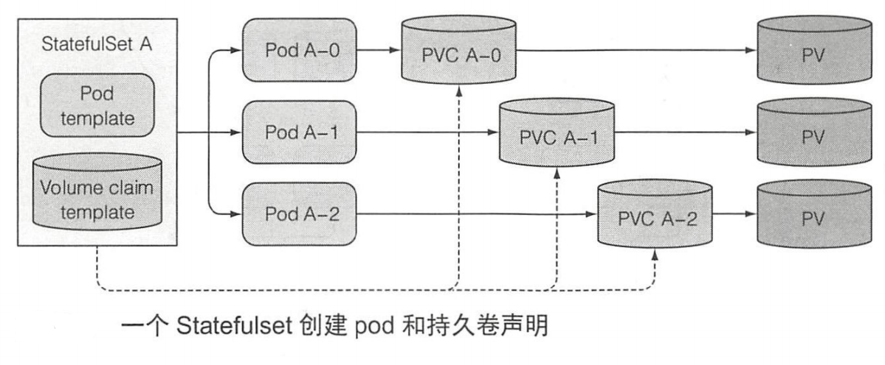

> # k8s-StatefulSet(九)

# StatefulSet

## 介绍

StatefulSet是为了解决有状态服务的问题（对应Deployments和ReplicaSets是为无状态服务而设计），其应用场景包括：

- 稳定的持久化存储，即Pod重新调度后还是能访问到相同的持久化数据，基于PVC来实现
- 稳定的网络标志，即Pod重新调度后其PodName和HostName不变，基于Headless Service（即没有Cluster IP的Service）来实现
- 有序部署，有序扩展，即Pod是有顺序的，在部署或者扩展的时候要依据定义的顺序依次依次进行（即从0到N-1，在下一个Pod运行之前所有之前的Pod必须都是Running和Ready状态），基于init containers来实现
- 有序收缩，有序删除（即从N-1到0）

从上面的应用场景可以发现，StatefulSet由以下几个部分组成：

- 用于定义网络标志（DNS domain）的Headless Service
- 用于创建PersistentVolumes的volumeClaimTemplates
- 定义具体应用的StatefulSet

### 和普通ReplicaSet的Pod命名和存储对比

>  命名上


> 存储上




### at-most-one

k8s必须保证两个拥有相同标记和绑定相同PVC的有状态 Pod 实例不会同时运行。一个 Statefuset 必须保证有状态的 Pod 实例的 at- most-one 语义， 也就是说 Statefulset 必须在准确确认不再运行后，才会去创建它的替换 Pod.

## 准备工作

> app.js
>
> 功能: 创建post请求创建文件，get请求读取创建的文件

```javascript
const http = require('http');
const os = require('os');
const fs = require('fs');
const dataFile = "/var/data/kubia.txt";
console.log("Kubia server starting...");

var handler = function(request, response) {
	if (request.method == 'POST') {
		var file = fs.createWriteStream(dataFile);
		file.on('open', function (fd) {
			request.pipe(file);
			console.log("New Data has bean received and stored.");
			response.writeHead(200);
			response.end("Data stored on "+ os.hostname() + "\n");
		});
	} else {
		var data= "No data posted yet";
		try {
			data = fs.readFileSync(dataFile, 'utf8');
		} catch(e) {
			data= "No data posted yet";
		}
		response.writeHead(200);
		response.write("You've hit " + os.hostname() + "\n");
		response.end("Data stored on this Pod: "+ data + "\n");
	}
};
var www = http.createServer(handler);
www.listen(8080)
```

> Dockerfile

```dockerfile
FROM daocloud.io/library/node:8.2.1-alpine
ADD app.js /app.js
ENTRYPOINT node app.js
```

在node节点上构建这个镜像

```shell
$ docker build -t kubia-stored .
```

## yaml定义

```yaml
## 定义一个headless Service, StatefulSet必须要求的
apiVersion: v1
kind: Service
metadata: 
  name: kubia
spec:
  clusterIP: None
  selector:
    app: kubia
  ports:
  - name: http
    port: 80
    targetPort: http

---
## 定义statefulSet
apiVersion: apps/v1
kind: StatefulSet
metadata:
  name: kubia
spec:
  serviceName: kubia
  replicas: 3
  selector:
    matchLabels:
      app: kubia
  template:
    metadata:
      labels:
        app: kubia
    spec:
      containers:
      - name: kubia
        image: kubia-stored
        imagePullPolicy: Never
        ports:
        - name: http
          containerPort: 8080
        volumeMounts:
        - name: datapvc
          mountPath: /var/data
  volumeClaimTemplates:             ## statefulset使用PVC来实现有状态的持久存储
  - metadata: 
      name: datapvc
    spec:
      storageClassName: local-path   ## 卷使用动态卷自动生成，手动时这个属性删掉
      resources:
        requests:
          storage: 1Mi
      accessModes:
      - ReadWriteOnce
```

yaml定义中存储采用动态卷方式来自动创建PV(使用之前安装的local-path-provisioner)，也可以自己手动创建PV，然后通过k8s自动将`volumeClaimTemplates`中的PVC绑定合适的PV上。

## 演示

### apply检查创建过程

```shell
[root@master1 kubeyaml]# kubectl apply -f  kubia-statefulset.yaml
service/kubia created
statefulset.apps/kubia created
[root@master1 kubeyaml]# kubectl get po
NAME      READY   STATUS              RESTARTS   AGE
kubia-0   0/1     ContainerCreating   0          4s
[root@master1 kubeyaml]# kubectl get po
NAME      READY   STATUS              RESTARTS   AGE
kubia-0   1/1     Running             0          8s
kubia-1   0/1     ContainerCreating   0          3s
[root@master1 kubeyaml]# kubectl get po
NAME      READY   STATUS    RESTARTS   AGE
kubia-0   1/1     Running   0          14s
kubia-1   1/1     Running   0          9s
kubia-2   1/1     Running   0          6s
[root@master1 kubeyaml]# kubectl get statefulset
NAME    READY   AGE
kubia   3/3     31s
[root@master1 kubeyaml]# 
```

pod的创建是从0到n-1，依次创建的。

### 检查pv,pvc,svc

```shell
root@master1 kubeyaml]# kubectl get pv
NAME                                       CAPACITY   ACCESS MODES   RECLAIM POLICY   STATUS   CLAIM                     STORAGECLASS   REASON   AGE
pvc-7262e77f-bf6a-47d1-bc00-1602bacfda6d   1Mi        RWO            Delete           Bound    default/datapvc-kubia-1   local-path              8m2s
pvc-aaef15fd-2453-4fa3-add8-dc09d5cc7f4f   1Mi        RWO            Delete           Bound    default/datapvc-kubia-2   local-path              7m59s
pvc-d0954087-b830-4dd4-af84-635381e0cdb8   1Mi        RWO            Delete           Bound    default/datapvc-kubia-0   local-path              8m5s
[root@master1 kubeyaml]# kubectl get pvc
NAME              STATUS   VOLUME                                     CAPACITY   ACCESS MODES   STORAGECLASS   AGE
datapvc-kubia-0   Bound    pvc-d0954087-b830-4dd4-af84-635381e0cdb8   1Mi        RWO            local-path     8m17s
datapvc-kubia-1   Bound    pvc-7262e77f-bf6a-47d1-bc00-1602bacfda6d   1Mi        RWO            local-path     8m12s
datapvc-kubia-2   Bound    pvc-aaef15fd-2453-4fa3-add8-dc09d5cc7f4f   1Mi        RWO            local-path     8m9s
[root@master1 kubeyaml]# kubectl get svc
NAME         TYPE        CLUSTER-IP   EXTERNAL-IP   PORT(S)   AGE
kubernetes   ClusterIP   10.96.0.1    <none>        443/TCP   22d
kubia        ClusterIP   None     
```

动态卷自动创建了不同的PV，分别绑定到了不同的kubia上，可以看到命名也是有序的。

### 访问检查存储

为了方便测试，我们直接通过Pod的ip去访问，我们可以通过之前的Headless service查看所有的Pod的IP列表。

```shell
[root@master1 kubeyaml]# kubectl get svc
NAME         TYPE        CLUSTER-IP   EXTERNAL-IP   PORT(S)   AGE
kubernetes   ClusterIP   10.96.0.1    <none>        443/TCP   22d
kubia        ClusterIP   None         <none>        80/TCP    27m
[root@master1 kubeyaml]# kubectl get endpoints
NAME         ENDPOINTS                                                     AGE
kubernetes   192.168.2.14:6443                                             22d
kubia        100.109.35.224:8080,100.109.35.239:8080,100.109.35.244:8080   27m
[root@master1 kubeyaml]#
```

> 检查

```shell
## 此时还没有文件
[root@master1 kubeyaml]# curl 100.109.35.224:8080
You've hit kubia-1
Data stored on this Pod: No data posted yet

## post请求，创建文件, 被存储到kubia-1这个节点
[root@master1 kubeyaml]# curl -X POST -d "hello kubia." 100.109.35.224:8080 
Data stored on kubia-1

## 再次访问这个节点，读取到了对应的文件
[root@master1 kubeyaml]# curl 100.109.35.224:8080
You've hit kubia-1
Data stored on this Pod: hello kubia.

## 访问另外的节点
[root@master1 kubeyaml]# curl 100.109.35.244:8080
You've hit kubia-0
Data stored on this Pod: No data posted yet
[root@master1 kubeyaml]#
```

通过访问不同的节点，可以看到数据并不是共享的，而是每一个Pod一个(这个其实在看到三个PVC那里就应该明白了).

> 检查Node节点

打开sc的本地路径`/usr/local/local-path-provisioner`. 可以看到日常3个Pod的卷文件夹。打开kubia-1的，可以看到成功写入的文件。

```shell
[root@node1 local-path-provisioner]# ls
pvc-7262e77f-bf6a-47d1-bc00-1602bacfda6d_default_datapvc-kubia-1  pvc-d0954087-b830-4dd4-af84-635381e0cdb8_default_datapvc-kubia-0
pvc-aaef15fd-2453-4fa3-add8-dc09d5cc7f4f_default_datapvc-kubia-2
[root@node1 local-path-provisioner]# ls pvc-7262e77f-bf6a-47d1-bc00-1602bacfda6d_default_datapvc-kubia-1/
kubia.txt
[root@node1 local-path-provisioner]# 
```

### 删除节点检查

```shell
[root@master1 kubeyaml]# kubectl delete po kubia-1
pod "kubia-1" deleted
[root@master1 kubeyaml]# kubectl get po
NAME      READY   STATUS    RESTARTS   AGE
kubia-0   1/1     Running   0          39m
kubia-1   1/1     Running   0          13s
kubia-2   1/1     Running   0          38m
[root@master1 kubeyaml]# kubectl get endpoints
NAME         ENDPOINTS                                                     AGE
kubernetes   192.168.2.14:6443                                             22d
kubia        100.109.35.239:8080,100.109.35.244:8080,100.109.35.245:8080   39m
[root@master1 kubeyaml]# curl 100.109.35.245:8080
You've hit kubia-1
Data stored on this Pod: hello kubia.
[root@master1 kubeyaml]# 
```

删除Pod kubia-1之后，可以看到自动又起了一个Pod kubia-1，这个Pod和之前是一模一样的，我们检查一下IP，和之前不一样的这个IP`100.109.35.245:8080 `就是新起的Pod(Pod重新生成后IP是会变的)。通过访问，可以看到之前的数据依然还在。

## 滚动升级

类比Deployment，查阅`kubectl explain statefulset.spec.updateStrategy`.statefulset的滚动升级顺序由n-1到0.

> 自行修改一下app.js为v2版本，然后构建v2的镜像，之后执行升级查看。

```shell
[root@master1 kubeyaml]# kubectl set image statefulset kubia kubia=kubia-stored:v2
statefulset.apps/kubia image updated
[root@master1 kubeyaml]# kubectl get po
NAME      READY   STATUS        RESTARTS   AGE
kubia-0   1/1     Running       0          82m
kubia-1   1/1     Running       0          43m
kubia-2   1/1     Terminating   0          82m
[root@master1 kubeyaml]# kubectl get po
NAME      READY   STATUS        RESTARTS   AGE
kubia-0   1/1     Terminating   0          84m
kubia-1   1/1     Running       0          11s
kubia-2   1/1     Running       0          45s
[root@master1 kubeyaml]# kubectl get po
NAME      READY   STATUS    RESTARTS   AGE
kubia-0   1/1     Running   0          66s
kubia-1   1/1     Running   0          109s
kubia-2   1/1     Running   0          2m23s
[root@master1 kubeyaml]# 
```

可以看到升级过程从kubia-2开始，到kubia-0结束。

> 访问kubia-1检查输出，可以通过describe查看Pod的IP.

```shell
[root@master1 kubeyaml]# curl 100.109.35.194:8080
You've hit kubia-1
v2, Data stored on this Pod: hello kubia.
[root@master1 kubeyaml]#
```

从输出可以看到v2版本镜像已经生效，滚动升级完成.


