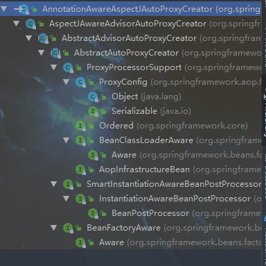
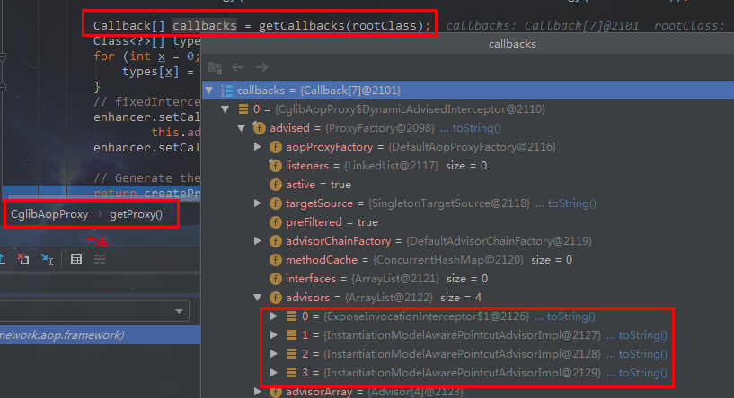
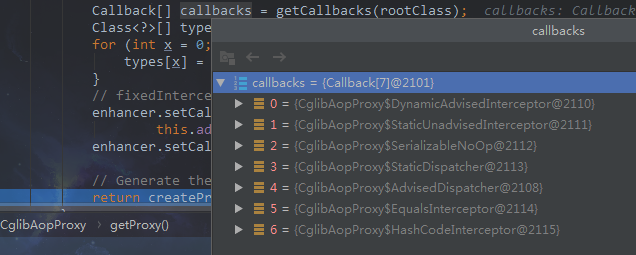

> # AOP实现

@AspectJ和@Point注解，加上一个自动代理的标签就可以自动完成aop的代理。这里来研究一下这个过程是怎么实现的。

# aop自定义标签

自动代理的aop标签是aop:aspectj-autoproxy，这个标签是个自定义标签，很容易想到我们的自定义标签的处理流程，查找NamespaceHandler子类，很容已找到一个叫AopNamespaceHandler的家伙。

```java
//AopNamespaceHandler.java
public void init() {
	//...
	registerBeanDefinitionParser("aspectj-autoproxy", new AspectJAutoProxyBeanDefinitionParser());
	//...
	}
```

看到了吧，这家伙注册了一个AspectJAutoProxyBeanDefinitionParser标签解析器。

## AspectJAutoProxyBeanDefinitionParser

```java
// AspectJAutoProxyBeanDefinitionParser.java
public BeanDefinition parse(Element element, ParserContext parserContext) {
    //注册自动代理的处理器
	AopNamespaceUtils.registerAspectJAnnotationAutoProxyCreatorIfNecessary(parserContext, element);
	extendBeanDefinition(element, parserContext);
	return null;
}
```

### 注册自动代理处理器

```java
// AopNamespaceUtils.java
public static void registerAspectJAnnotationAutoProxyCreatorIfNecessary(
        ParserContext parserContext, Element sourceElement) {
    // 得到需要注册的自动代理处理器
    BeanDefinition beanDefinition = AopConfigUtils.registerAspectJAnnotationAutoProxyCreatorIfNecessary(
            parserContext.getRegistry(), parserContext.extractSource(sourceElement));
    //设置是否强制使用Cglib和暴露proxy(这个后头会解释)
    useClassProxyingIfNecessary(parserContext.getRegistry(), sourceElement);
    //注册bean
    registerComponentIfNecessary(beanDefinition, parserContext);
}
```

以上代码完成了三件事，很容易理解，

第一步获取需要注册的自动代理处理器；

第二步对proxy_target_class和expose_proxy属性进行处理；

第三步注册自动代理的处理器。

#### 获取或创建一个代理处理器

```java
// AopConfigUtils.java
public static BeanDefinition registerAspectJAnnotationAutoProxyCreatorIfNecessary(
			BeanDefinitionRegistry registry, @Nullable Object source) {
	return registerOrEscalateApcAsRequired(AnnotationAwareAspectJAutoProxyCreator.class, registry, source);
}

private static BeanDefinition registerOrEscalateApcAsRequired(
        Class<?> cls, BeanDefinitionRegistry registry, @Nullable Object source) {
    Assert.notNull(registry, "BeanDefinitionRegistry must not be null");
	//首先检查是否有已经存在的自动代理处理器，特定名字的！！！
    if (registry.containsBeanDefinition(AUTO_PROXY_CREATOR_BEAN_NAME)) {
        BeanDefinition apcDefinition = registry.getBeanDefinition(AUTO_PROXY_CREATOR_BEAN_NAME);
        //如果存在自动代理创建器，并且跟当前的不一致，那么就根据优先级来确定使用哪一个
        if (!cls.getName().equals(apcDefinition.getBeanClassName())) {
            int currentPriority = findPriorityForClass(apcDefinition.getBeanClassName());
            int requiredPriority = findPriorityForClass(cls);
            if (currentPriority < requiredPriority) {
                apcDefinition.setBeanClassName(cls.getName());
            }
        }
        return null;
    }
	//如果没有就创建一个并返回
    RootBeanDefinition beanDefinition = new RootBeanDefinition(cls);
    beanDefinition.setSource(source);
    beanDefinition.getPropertyValues().add("order", Ordered.HIGHEST_PRECEDENCE);
    beanDefinition.setRole(BeanDefinition.ROLE_INFRASTRUCTURE);
    registry.registerBeanDefinition(AUTO_PROXY_CREATOR_BEAN_NAME, beanDefinition);
    return beanDefinition;
}
```

从上面代码中，我们可看到如果没有存在的自动代理创建器，那么我们将自动默认注册一个AnnotationAwareAspectJAutoProxyCreator自动代理创建器，通常情况下，我们都不会使用自定义的自动代理创建器，等哈自动代理的创建就要从这个类开始了，好好记住这家伙吧。

#### useClassProxyingIfNecessary

```java
// AopNamespaceUtils.java
private static void useClassProxyingIfNecessary(BeanDefinitionRegistry registry, @Nullable Element sourceElement) {
    if (sourceElement != null) {
        //设置属性proxy_target_class
        boolean proxyTargetClass = Boolean.parseBoolean(sourceElement.getAttribute(PROXY_TARGET_CLASS_ATTRIBUTE));
        if (proxyTargetClass) {
            AopConfigUtils.forceAutoProxyCreatorToUseClassProxying(registry);
        }
        //设置属性expose_proxy
        boolean exposeProxy = Boolean.parseBoolean(sourceElement.getAttribute(EXPOSE_PROXY_ATTRIBUTE));
        if (exposeProxy) {
            AopConfigUtils.forceAutoProxyCreatorToExposeProxy(registry);
        }
    }
}
```

从上面代码中科院看出来，这个部分主要是对标签aop:aspectj-autoproxy的属性proxy_target_class和expose_class的处理。而且仅仅是设置了两个属性的值而已，并没有做其他事。

**proxy_target_class设置是否强制使用Cglib进行代理，spring默认是能使用jdk动态代理就是用动态代理，后续源码跟踪到这里会介绍到。expose_class设置是否暴露目标代理类。**

有读者可能不了解expose_class这个属性的作用。很简单，这里介绍一下，比如我们有如下的类：

```java
public class A {
  	@Transacational
    public void method1(){
        
    }
    
    public void method2(){
        method1();
    }
    
    public void method3(){
        ((A)AopContext.currentProxy()).method1();
    }
}
```

**在上述类中，method1是被代理的方法。但是当我们在其他地方注入A类之后，调用method2的时候，在method2当中的method1方法是不会执行事务增强的。这个时候我们就需要使用method3当中的这种形式，而这种形式就需要设置expose-class=true。当然通过在A类中自动注入自己也可以解决这个问题。**

# 自动代理创建器

现在，拿出你记住的这个家伙AnnotationAwareAspectJAutoProxyCreator。我们即将脱下她神秘的外衣，来看看它到底是个什么玩意儿。



快看，里面有我们熟悉的东西，BeanPostProcessor，具有中断效应的InstantiaionAwareBeanPostProcessor。这些方法实现都在超类AbstractAutoProxyCreator中

这里不讨论InstantiaionAwareBeanPostProcessor，这个接口的postProcessBeforeInstantiation方法确实有代码，但是在代理走到这里头的时候，因为某种条件不符合(需要有TargetSource)，所以会返回null，也就不会执行中断了，喜欢的朋友自己去调试吧。

我们重点来开BeanPosrProcessor的postProcessAfterInitialization方法。

```java
// AbstractAutoProxyCreator.java
public Object postProcessAfterInitialization(@Nullable Object bean, String beanName) {
    if (bean != null) {
        //获得缓存key
        Object cacheKey = getCacheKey(bean.getClass(), beanName);
        if (this.earlyProxyReferences.remove(cacheKey) != bean) {
            //符合代理的条件，开始创建代理类
            return wrapIfNecessary(bean, beanName, cacheKey);
        }
    }
    return bean;
}

protected Object wrapIfNecessary(Object bean, String beanName, Object cacheKey) {
    //如果已经处理过就直接返回
    if (StringUtils.hasLength(beanName) && this.targetSourcedBeans.contains(beanName)) {
        return bean;
    }
    //如果bean不需要增强，直接返回
    if (Boolean.FALSE.equals(this.advisedBeans.get(cacheKey))) {
        return bean;
    }
    //bean是否是一个基础设施类，基础设施类(比如Advice，Pointcut)不应该被增强，或者配置了指定的bean不被代理
    if (isInfrastructureClass(bean.getClass()) || shouldSkip(bean.getClass(), beanName)) {
        this.advisedBeans.put(cacheKey, Boolean.FALSE);
        return bean;
    }

    // 查找增强的方法
    Object[] specificInterceptors = getAdvicesAndAdvisorsForBean(bean.getClass(), beanName, null);
    //如果存在增强的方法，就创建代理，DO_NOT_PROXY=null
    if (specificInterceptors != DO_NOT_PROXY) {
        // 日常加缓存
        this.advisedBeans.put(cacheKey, Boolean.TRUE);
        //日常创建代理，使用SingletonTargetSource
        Object proxy = createProxy(
                bean.getClass(), beanName, specificInterceptors, new SingletonTargetSource(bean));
        //记录当前代理的bean类型
        this.proxyTypes.put(cacheKey, proxy.getClass());
        return proxy;
    }
    //不需要代理的日常加缓存
    this.advisedBeans.put(cacheKey, Boolean.FALSE);
    return bean;
}
```

到这里，已经看到了创建代理的雏形。

1. 首先获取增强的方法，也就是增强器，不是被代理的方法;
2. 根据获取的增强进行代理。

## 获取增强器

```java
//AbstractAdvisorAutoProxyCreator.java
protected Object[] getAdvicesAndAdvisorsForBean(
        Class<?> beanClass, String beanName, @Nullable TargetSource targetSource) {
    //获取合适的增强器
    List<Advisor> advisors = findEligibleAdvisors(beanClass, beanName);
    if (advisors.isEmpty()) {
        return DO_NOT_PROXY;
    }
    return advisors.toArray();
}

protected List<Advisor> findEligibleAdvisors(Class<?> beanClass, String beanName) {
    //获取所有的增强器
    List<Advisor> candidateAdvisors = findCandidateAdvisors();
    //查找匹配的增强器
    List<Advisor> eligibleAdvisors = findAdvisorsThatCanApply(candidateAdvisors, beanClass, beanName);
    //方法内部会判断是否是AsbectJ的advisor，如果是，则添加默认的ExposeInvocationInterceptor.AdVISOR，这个家伙是DefaultPointcutAdvisor
    extendAdvisors(eligibleAdvisors);
    if (!eligibleAdvisors.isEmpty()) {
        //排序
        eligibleAdvisors = sortAdvisors(eligibleAdvisors);
    }
    return eligibleAdvisors;
}
```

### findCandidateAdvisors

```java
protected List<Advisor> findCandidateAdvisors() {
    //当使用注解的方式时并不是舍弃了配置文件，
    //这里调用父类方法，获取配置文件中申明的advisor
    List<Advisor> advisors = super.findCandidateAdvisors();
    if (this.aspectJAdvisorsBuilder != null) {
        //查找beanFactory中所有的bean，并冲Aspect注解的bean中构建advisor返回
        advisors.addAll(this.aspectJAdvisorsBuilder.buildAspectJAdvisors());
    }
    return advisors;
}
```

这一步获取所有的增强器，buildAspectJAdvisors部分代码有点多，我这里就不跟进去了，介绍一下这个方法的大体流程。其实很容易想到，无非就是从所有的bean当中，查找有@AspectJ注解的bean，然后提取对应的增强方法，封装到Advisor中，返回，当然，日常加缓存，这个没有什么问题。流程很长，包括根据不同的注解@After，@Before，@Around等类型生成不同的Advisor等等逻辑。篇幅太长，这里就不写了。

### findAdvisorsThatCanApply

这一步是从上面获取到的所有增强器中获取适合当前bean的增强器。

```java
// AbstractAdvisorAutoProxyCreator.java
protected List<Advisor> findAdvisorsThatCanApply(
        List<Advisor> candidateAdvisors, Class<?> beanClass, String beanName) {

    ProxyCreationContext.setCurrentProxiedBeanName(beanName);
    try {
        //查找匹配的增强器
        return AopUtils.findAdvisorsThatCanApply(candidateAdvisors, beanClass);
    }
    finally {
        ProxyCreationContext.setCurrentProxiedBeanName(null);
    }
}
```

```java
// AopUtils.java
public static List<Advisor> findAdvisorsThatCanApply(List<Advisor> candidateAdvisors, Class<?> clazz) {
    if (candidateAdvisors.isEmpty()) {
        return candidateAdvisors;
    }
    List<Advisor> eligibleAdvisors = new ArrayList<>();
    for (Advisor candidate : candidateAdvisors) {
        //首先处理引介增强
        if (candidate instanceof IntroductionAdvisor && canApply(candidate, clazz)) {
            eligibleAdvisors.add(candidate);
        }
    }
    boolean hasIntroductions = !eligibleAdvisors.isEmpty();
    for (Advisor candidate : candidateAdvisors) {
        if (candidate instanceof IntroductionAdvisor) {
            //引介增强在上个for循环已经处理
            continue;
        }
        //对于普通bean的处理
        if (canApply(candidate, clazz, hasIntroductions)) {
            eligibleAdvisors.add(candidate);
        }
    }
    return eligibleAdvisors;
}
```

真正的匹配是在canApply()方法中实现的。

```java
//AopUtils.java
public static boolean canApply(Advisor advisor, Class<?> targetClass, boolean hasIntroductions) {
    if (advisor instanceof IntroductionAdvisor) {
        return ((IntroductionAdvisor) advisor).getClassFilter().matches(targetClass);
    }
    else if (advisor instanceof PointcutAdvisor) {
        PointcutAdvisor pca = (PointcutAdvisor) advisor;
        //判断匹配
        return canApply(pca.getPointcut(), targetClass, hasIntroductions);
    }
    else {
        // It doesn't have a pointcut so we assume it applies.
        return true;
    }
}

public static boolean canApply(Pointcut pc, Class<?> targetClass, boolean hasIntroductions) {
    Assert.notNull(pc, "Pointcut must not be null");
    if (!pc.getClassFilter().matches(targetClass)) {
        return false;
    }

    MethodMatcher methodMatcher = pc.getMethodMatcher();
    if (methodMatcher == MethodMatcher.TRUE) {
        // 如果是默认的TrueMethodMatcher直接返回true
        return true;
    }

    IntroductionAwareMethodMatcher introductionAwareMethodMatcher = null;
    if (methodMatcher instanceof IntroductionAwareMethodMatcher) {
        introductionAwareMethodMatcher = (IntroductionAwareMethodMatcher) methodMatcher;
    }

    Set<Class<?>> classes = new LinkedHashSet<>();
    if (!Proxy.isProxyClass(targetClass)) {
        //加入当前类class
        classes.add(ClassUtils.getUserClass(targetClass));
    }
    //加入所有接口class
    classes.addAll(ClassUtils.getAllInterfacesForClassAsSet(targetClass));
    //遍历class,我们bean的class
    for (Class<?> clazz : classes) {
        Method[] methods = ReflectionUtils.getAllDeclaredMethods(clazz);
        for (Method method : methods) {
            //如果方法和pointcut上的描述匹配，返回true
            if (introductionAwareMethodMatcher != null ?
                    introductionAwareMethodMatcher.matches(method, targetClass, hasIntroductions) :
                    methodMatcher.matches(method, targetClass)) {
                return true;
            }
        }
    }
    return false;
}
```

这里有个遍历我们的class，这个class是通过classes.add(ClassUtils.getUserClass(targetClass))产生的，这里的getUserClass()方法会去判断当前类是不是已经是Cglib代理过了的，如果是，就查找超类，超类才是我们实际的bean类型，返回真正的class。

**判断是否是cglib代理的类可以根据名字来判断，以User为例会是xx.xx.User$$xxx类型的**。

## 创建代理

创建代理的方法入口是createProxy(
                bean.getClass(), beanName, specificInterceptors, new SingletonTargetSource(bean));这里使用了SingletonTargetSource来作为默认的TargetSource。还记的最开始没有讨论的InstantiaionAwareBeanPostProcessor这个里头的postProcessBeforeInstantiation方法么，在方法里头就是因为没有targetSource，所以没有创建代理，而是直接返回了null。

一切准备工作就绪之后，这个时候才真正开始创建代理。

```java
// AbstractAutoProxyCreator.java
protected Object createProxy(Class<?> beanClass, @Nullable String beanName,
                             @Nullable Object[] specificInterceptors, TargetSource targetSource) {
    if (this.beanFactory instanceof ConfigurableListableBeanFactory) {
        AutoProxyUtils.exposeTargetClass((ConfigurableListableBeanFactory) this.beanFactory, beanName, beanClass);
    }

    ProxyFactory proxyFactory = new ProxyFactory();
    //复制相关属性
    proxyFactory.copyFrom(this);
    //判断是否使用cglib代理，这个地方判断如果不是走的Cglib，那么再判断当前类是否需要Cglib进行代理，
    //比如当前类没有接口，那么就只能使用Cglib
    if (!proxyFactory.isProxyTargetClass()) {
        if (shouldProxyTargetClass(beanClass, beanName)) {
            proxyFactory.setProxyTargetClass(true);
        }
        else {
            //尝试使用jdk动态代理，方法中会检查是否有接口，如果没有接口，那么会设置ProxyTargetClass=true，使用Cglib
            evaluateProxyInterfaces(beanClass, proxyFactory);
        }
    }
	//封装advisors
    Advisor[] advisors = buildAdvisors(beanName, specificInterceptors);
    //加入增强器
    proxyFactory.addAdvisors(advisors);
    //设置目标代理类
    proxyFactory.setTargetSource(targetSource);
    //定制代理
    customizeProxyFactory(proxyFactory);
    //冻结，默认值为false，即在代理被配置之后，不允许修改代理的配置
    proxyFactory.setFrozen(this.freezeProxy);
    if (advisorsPreFiltered()) {
        proxyFactory.setPreFiltered(true);
    }
    //创建代理
    return proxyFactory.getProxy(getProxyClassLoader());
}
```

看看主要流程：

1.  获取当前类中的属性;
2.  添加代理接口;
3.  封装Advisor并加入到ProxyFactory中;
4. 设置要代理的目标类;
5. 留给子类实现customizeProxyFactory();这个实现的话就需要我们继承默认的自动代理创建器了，然后注册到beanFactory当中，并且优先级应该要比默认创建的那个要高，在之前“获取或创建一个代理处理器”的时候有介绍哦。
6. 通过proxyFactory获取代理。

### proxyFactory.getProxy()

```java
// ProxyFactory.java
public Object getProxy(@Nullable ClassLoader classLoader) {
	return createAopProxy().getProxy(classLoader);
}
```

这个地方分两步，第一步createAopProxy(),这个方法在父类ProxyCreatorSupport中，第二步getProxy()

#### createAopProxy

```java
// ProxyCreatorSupport.java
protected final synchronized AopProxy createAopProxy() {
	if (!this.active) {
		activate();
	}'
	return getAopProxyFactory().createAopProxy(this);
}

public AopProxyFactory getAopProxyFactory() {
	return this.aopProxyFactory;
}

public ProxyCreatorSupport() {
	this.aopProxyFactory = new DefaultAopProxyFactory();
}
```

我们看createAopProxy方法的return，同样也是分两步，首先获取aopProxyFactory，这个是默认的DefaultAopProxyFactory，在无参构造函数中初始化的。

接下来看第二步createAopProxy(this)；

```java
// DefaultAopProxyFactory.java
public AopProxy createAopProxy(AdvisedSupport config) throws AopConfigException {
    //判断isOptimize || proxy_target_class || 是否存在代理接口
    if (config.isOptimize() || config.isProxyTargetClass() || hasNoUserSuppliedProxyInterfaces(config)) {
        Class<?> targetClass = config.getTargetClass();
        if (targetClass == null) {
            throw new AopConfigException("TargetSource cannot determine target class: " +
                    "Either an interface or a target is required for proxy creation.");
        }
        //如果目标类就是是接口或者是Proxy子类，则直接使用Jdk动态代理
        if (targetClass.isInterface() || Proxy.isProxyClass(targetClass)) {
            return new JdkDynamicAopProxy(config);
        }
        //返回Cglib代理
        return new ObjenesisCglibAopProxy(config);
    }
    else {
        //使用Jdk动态代理
        return new JdkDynamicAopProxy(config);
    }
}
```

从这个方法中，我们可以看到正常情况下设置了proxy_target_class，就会返回Cglib的代理，但是如果我们的目标代理类直接就是一个接口，那么就需要使用jdk动态代理了。这个地方可能需要解释一下，这个地方有可能出现我们设置了proxy_target_class，但是还是使用了jdk动态代理。

**JDK动态代理是对接口的代理，需要实现InvocationHandler.Cglib是基于拦截器。在这个地方，本人已试过，cglib能够使用纯接口(没有实现类的情况)进行代理。但是即使是这样这里也使用JDK动态代理的情况，应该是考虑到了性能的问题。在早起1.6，17的时候。Cglib创建代理的速度虽然比JDK动态代理要慢些，但是到了1.8之后JDK动态代理崛起了！对，崛起了！但是看了spring3.2.x这部分的代码，这种情况下也是使用的JDK动态代理。这就。。。略显尴尬，哈哈！**

从这个方法中，我们就可以看出来，其实spring在处理代理的时候，能够给使用JDK代理，就会使用JDK代理的。

至于if判断中的optimize，这个家伙是用来控制通过Cglib创建的代理是否使用激进的优化策略，除非完全了解aop代理如何处理优化，否则不推荐使用这个设置，目前这个属性仅用于Cglib，对JDK动态代理无效。嗯。。。这个我也没用过，哈哈。

#### getProxy--JDK

先来研究jdk的动态代理实现部分吧：

```java
// JdkDynamicAopProxy.java
public Object getProxy(@Nullable ClassLoader classLoader) {
    if (logger.isTraceEnabled()) {
        logger.trace("Creating JDK dynamic proxy: " + this.advised.getTargetSource());
    }
    //目标类需要实现的接口
    Class<?>[] proxiedInterfaces = AopProxyUtils.completeProxiedInterfaces(this.advised, true);
    //确定是否有覆盖了equals或者hashCode方法，并设置相应属性
    findDefinedEqualsAndHashCodeMethods(proxiedInterfaces);
    //创建JDK动态代理
    return Proxy.newProxyInstance(classLoader, proxiedInterfaces, this);
}

private void findDefinedEqualsAndHashCodeMethods(Class<?>[] proxiedInterfaces) {
	for (Class<?> proxiedInterface : proxiedInterfaces) {
		Method[] methods = proxiedInterface.getDeclaredMethods();
		for (Method method : methods) {
            //遍历所有的方法，确定是否有覆盖equals方法
			if (AopUtils.isEqualsMethod(method)) {
				this.equalsDefined = true;
			}
            //遍历所有的方法，确定是否有覆盖hashCode方法
			if (AopUtils.isHashCodeMethod(method)) {
				this.hashCodeDefined = true;
			}
            //如果确认两个方法都被覆盖了，就不用再遍历了，直接返回
			if (this.equalsDefined && this.hashCodeDefined) {
				return;
			}
		}
	}
}
```

我们知道JDK动态代理是基于接口的，在如上代码中可以看到首先就去获取了所需要实现的接口。第二行看方法名就很容易知道干了什么事，如果equals或hashCode方法被覆盖了，会设置相应的属性。第三行创建JDK代理第三个参数(InvocationHandler)的入参是this，说明JdkDynamicAopProxy实现类相应接口。我们直接来看invoke方法（假定你已经了解了JDK动态代理，不熟悉的就去百度吧，很棒的哦）。

```java
// JdkDynamicAopProxy.java
public Object invoke(Object proxy, Method method, Object[] args) throws Throwable {
	MethodInvocation invocation;
	Object oldProxy = null;
	boolean setProxyContext = false;

	//目标类的包装
	TargetSource targetSource = this.advised.targetSource;
	Object target = null;

	try {
		if (!this.equalsDefined && AopUtils.isEqualsMethod(method)) {
			//是否有自实现的equals方法
			return equals(args[0]);
		}
		else if (!this.hashCodeDefined && AopUtils.isHashCodeMethod(method)) {
			//是否有自实现的hashCode方法
			return hashCode();
		}
		else if (method.getDeclaringClass() == DecoratingProxy.class) {
			//判断是否是DecorationProxy类型
			return AopProxyUtils.ultimateTargetClass(this.advised);
		}
		else if (!this.advised.opaque && method.getDeclaringClass().isInterface() &&
				method.getDeclaringClass().isAssignableFrom(Advised.class)) {
			//判定是Advised类型
			return AopUtils.invokeJoinpointUsingReflection(this.advised, method, args);
		}

		Object retVal;
		//如果设置了expose-proxy则暴露当前proxy
		if (this.advised.exposeProxy) {
			// Make invocation available if necessary.
			oldProxy = AopContext.setCurrentProxy(proxy);
			setProxyContext = true;
		}

		//获得被代理的目标类
		target = targetSource.getTarget();
		Class<?> targetClass = (target != null ? target.getClass() : null);

		//查找当前方法的所有增强，并封装成链式结构，以供后续调用****
         //主要就是获取到需要调用的增强，你觉得呢？
		List<Object> chain = this.advised.getInterceptorsAndDynamicInterceptionAdvice(method, targetClass);

		if (chain.isEmpty()) {
			//如果增强为空，则说明当前方法没有被增强，直接调用原方法即可，AspecgJ注解形式进不了这坨，之后会解释
			Object[] argsToUse = AopProxyUtils.adaptArgumentsIfNecessary(method, args);
			retVal = AopUtils.invokeJoinpointUsingReflection(target, method, argsToUse);
		}
		else {
			//增强不为空，封装成invocation
			invocation = new ReflectiveMethodInvocation(proxy, target, method, args, targetClass, chain);
			//调用方法执行链，获得结果
			retVal = invocation.proceed();
		}

		//获取方法返回值类型
		Class<?> returnType = method.getReturnType();
		if (retVal != null && retVal == target &&
				returnType != Object.class && returnType.isInstance(proxy) &&
				!RawTargetAccess.class.isAssignableFrom(method.getDeclaringClass())) {
			retVal = proxy;
		}
		else if (retVal == null && returnType != Void.TYPE && returnType.isPrimitive()) {
			throw new AopInvocationException(
					"Null return value from advice does not match primitive return type for: " + method);
		}
		return retVal;
	}
	finally {
		if (target != null && !targetSource.isStatic()) {
			targetSource.releaseTarget(target);
		}
		if (setProxyContext) {
			AopContext.setCurrentProxy(oldProxy);
		}
	}
}
```

虽然代码很长，但是大多都是if判断。整理流程就是

1.  判断是否是equals或者hash，或者其他指定的类型然后执行相对应的处理;

2.  普通情况下，根据当前调用的方法，获取到所有的方法增强，就是那个chain，是不是想到了servlet的filter，哈哈，这俩的模式是一样的，等哈你就知道了;

3. 如果增强为空，则直接调用目标方法即可；

   3.1  注释里头表示了这个地方注解的Aspect进不来，是因为我们之前在分析"获取增强器"的时候，注释在红有写，判断如果是AspectJ会默认加一个默认的DefaultPointcutAdvisor进来，所以这里就不会为空。

4. 将所有增强封装成invocation调用链，这个链是跟servlet的Filter一样的模式，喜欢的朋友跟进后面一行代码invocation.proceed()就明白了。

5. 处理结果并返回。

#### getProxy--Cglib

Cglib和JDK的实现流程主体上差不太多，只是两种方式创建代理的方式不一样而存在差异。这里只简单介绍一下Cglib的大体。Cglib不像JDK动态代理一样实现InvocationHanlder，而是采用的拦截器的（Interceptor）方式。这里也假定你已经会使用Cglib了，我贴个图吧，你就明白怎么回事了。



看到了吧，当然不止DynamicAdvisedInterceptor，还有好几个，好吧，这里就贴个图，不解释了哈！



来吧，看看DynamicAdvisedInterceptor的intercept方法。

```java
// CglibAopProxy.DynamicAdvisedInterceptor.java
public Object intercept(Object proxy, Method method, Object[] args, MethodProxy methodProxy) throws Throwable {
	//...
	//呵呵，看到了吧，又到这个链这儿了~~~
	List<Object> chain = this.advised.getInterceptorsAndDynamicInterceptionAdvice(method, targetClass);
	Object retVal;
	if (chain.isEmpty() && Modifier.isPublic(method.getModifiers())) {
		Object[] argsToUse = AopProxyUtils.adaptArgumentsIfNecessary(method, args);
		retVal = methodProxy.invoke(target, argsToUse);
	}
	else {
		retVal = new CglibMethodInvocation(proxy, target, method, args, targetClass, chain, methodProxy).proceed();
	}
	retVal = processReturnType(proxy, target, method, retVal);
	return retVal;
	//...
}
```

不明白代理的可以自己去百度一下，老刺激了这家伙~~~

aop的分析就到此结束了，@Transocation事务也是基于Aop实现的哦，有自定义的事务标签哦，记得从NameHandler开始找起走哦，Good Luck! My friend~


over~~~