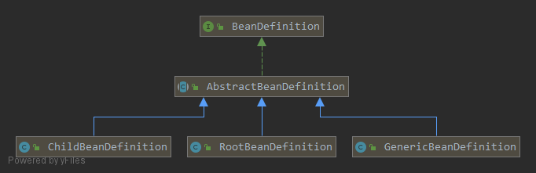
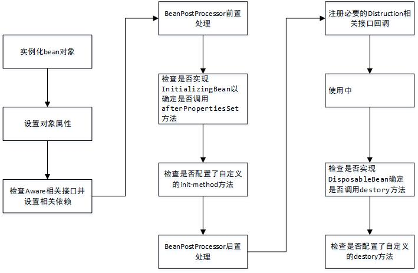

> # bean的加载-初始化和使用

自上一篇[bean的加载-配置文件的解析](https://my.oschina.net/wtkid/blog/3069738)之后，仅仅是将所有的bean定义拿到了，这个时候的bean是还未进行初始化的。对于bean的初始化，是从BeanFactory.getBean()为入口开始的。

bean的加载是在拿到bean的定义之后，解析xml之后，bean的定义会被封装到BeanDefinition中，这个部分是在解析自定义标签和解析默认标签的时候封装的，这里只提一下，不做这个封装的分析了，喜欢的朋友自己去看吧，比较简单。

# BeanDefinition



BeanDefinition是个借口，他有三个实现，都继承至AbstractBeanDefinition。<bean>元素标签拥有的class，scope、lazy-init等配置属性都是和BeanDefinition中是一一对应的，这个就不贴代码了，在父类AbstractBeanDefinition中。RootBeanDefinition是最常用的实现类，它对应一盘的<bean>标签。GenericBeandefinition是2.5之后新加入的，是一站式服务类。配置文件中可以定义父Bean和子Bean，父bean或者没有父beanean的普通bean就用RootBeanDefintion表示，而子bean就用childBeanDefinition表示。

所有的bean定义都会被注册到BEanDefinitionRegistry当中。spring容器的BeanDefinitionregistry就是spring的内存数据库，主要是以Map的形式保存，后续的操作都直接从BeanDefinitionRegistry中读取配置信息。

# doGetBean()

了解了BeanDefinition之后，现在来开始加载这个bean吧。

```java
//AbstractBeanFactory.java
protected <T> T doGetBean(final String name, @Nullable final Class<T> requiredType,
                          @Nullable final Object[] args, boolean typeCheckOnly) throws BeansException {

    // 提取对应的bean name
    final String beanName = transformedBeanName(name);
    Object bean;
    /**
     * 检查缓存中或者实例工厂中是否有对应的实例，为什么首先会使用这段代码呢？
     * 因为在创建单例Bean的时候会存在依赖注入的情况，而在创建依赖的时候为了避免循环依赖，
     * Spring创建Bean的时候会不等Bean创建完成，就将其提前曝光，也就是将其加入缓存，一旦下一个bean需要，就可以立即从缓存中获得
     */
    Object sharedInstance = getSingleton(beanName);
    if (sharedInstance != null && args == null) {
        //...日志
        //返回对应的实例，有时候在诸如FactoryBean存在的情况下，并不是返回实例本身，而是应该返回<指定方法返回的实例>
        //比如FactoryBean时，指定方法就是getObject()，这里拿到的Bean是FactoryBean，而返回的应该是FactoryBean.getObject()
        bean = getObjectForBeanInstance(sharedInstance, name, beanName, null);
    } else {
        /**
         * 检查是否存在循环依赖，只有单例模式下才会尝试解决循环依赖，原型模式不解决，所以这里要判断是否存在循环依赖
         * 是否存在循环依赖的判断就是检查当前线程正在创建的bean是不是已经处于正在创建的状态了
         * 这个地方跟进去可以看到是是使用的一个TheadLocal, 加入正在创建的bean是在之后开始创建bean的时候加入的。
         * 注意：这里是原型模式的检查循环依赖！！不要找错地方了
         */
        if (isPrototypeCurrentlyInCreation(beanName)) {
            throw new BeanCurrentlyInCreationException(beanName);
        }
        BeanFactory parentBeanFactory = getParentBeanFactory();
        //如果检查当前容器的beanDefinitionMap中不包含该bean，则尝试从父容器parentBeanFactory中获取
        if (parentBeanFactory != null && !containsBeanDefinition(beanName)) {
            String nameToLookup = originalBeanName(name);
            if (parentBeanFactory instanceof AbstractBeanFactory) {
                return ((AbstractBeanFactory) parentBeanFactory).doGetBean(
                        nameToLookup, requiredType, args, typeCheckOnly);
            }
            else if (args != null) {
                return (T) parentBeanFactory.getBean(nameToLookup, args);
            }
            else if (requiredType != null) {
                return parentBeanFactory.getBean(nameToLookup, requiredType);
            }
            else {
                return (T) parentBeanFactory.getBean(nameToLookup);
            }
        }

        //如果不仅仅是做类型检查，那就是要创建bean，这里要进行记录
        if (!typeCheckOnly) {
            markBeanAsCreated(beanName);
        }

        try {
            //将xml文件读取的GernericBeanDefinition转换为RootBeanDefinition
            //如果指定Bean是子Bean的话，同时会合并父Bean的相关属性
            final RootBeanDefinition mbd = getMergedLocalBeanDefinition(beanName);
            checkMergedBeanDefinition(mbd, beanName, args);

            String[] dependsOn = mbd.getDependsOn();
            //如果存在依赖，则需要递归实例化依赖的bean。
            //这个地方是指当前bean初始化前必须要存在的依赖，比如@DependsOn；并不是bean自身内部属性的依赖，
            if (dependsOn != null) {
                for (String dep : dependsOn) {
                    //...日志
                    //缓存依赖调用
                    registerDependentBean(dep, beanName);
                    try {
                        //递归获取需要的bean
                        getBean(dep);
                    }
                    //...
                }
            }

            //实例化依赖的Bean之后就可以实例化本身了
            //singleton模式的创建
            if (mbd.isSingleton()) {
                sharedInstance = getSingleton(beanName, () -> {
                    try {
                        return createBean(beanName, mbd, args);
                    }
                    catch (BeansException ex) {
                        destroySingleton(beanName);
                        throw ex;
                    }
                });
                bean = getObjectForBeanInstance(sharedInstance, name, beanName, mbd);
            } else if (mbd.isPrototype()) {
                //原型模式下的实例化bean
                Object prototypeInstance = null;
                try {
                    //加入到ThreadLocal，检查循环依赖时使用的那个，正在创建的bean就是从这里加进去的
                    beforePrototypeCreation(beanName);
                    prototypeInstance = createBean(beanName, mbd, args);
                }
                finally {
                    afterPrototypeCreation(beanName);
                }
                bean = getObjectForBeanInstance(prototypeInstance, name, beanName, mbd);
            } else {
                //其他指定scope下的实例化bean
                String scopeName = mbd.getScope();
                final Scope scope = this.scopes.get(scopeName);
                //...
                try {
                    Object scopedInstance = scope.get(beanName, () -> {
                        beforePrototypeCreation(beanName);
                        try {
                            return createBean(beanName, mbd, args);
                        }
                        finally {
                            afterPrototypeCreation(beanName);
                        }
                    });
                    bean = getObjectForBeanInstance(scopedInstance, name, beanName, mbd);
                }
                //...
            }
        }
        //...
    }

    //检查需要的类型是否符合bean的实际类型
    if (requiredType != null && !requiredType.isInstance(bean)) {
        try {
            T convertedBean = getTypeConverter().convertIfNecessary(bean, requiredType);
            if (convertedBean == null) {
                throw new BeanNotOfRequiredTypeException(name, requiredType, bean.getClass());
            }
            return convertedBean;
        }
        //...
    }
    return (T) bean;
}
```

```
梳理一下大致流程：
1. 装换对应的beanName;
2. 尝试从缓存中加载单例;
3. bean的实例化，如果从缓存中得到了bean的原始状态，则需要对bean进行实例化。
缓存中记录的只是最原始状态的bean，并不一定是我们最终想要的bean，有可能是我们的工厂bean。
这个时候就需要对工厂bean进行处理，也就是调用工厂bean重定义的factory-method方法来返回我们真正想要的bean，
而getObjectForBeanInstance就是完成这个工作的。
4. 原型模式的循环依赖检查;
5. 如果当前容器中没有找到对应的bean，则检查parentBeanFactory，通常parentBeanFactory都为null;
6. 将xml配置文件的GernericBeanDefinition转换为RootBeanDefinition;
7. 寻找依赖到的其他bean;
8. 针对不同的scope进行bena的创建;
9. 类型转换，并返回相应的bean。
```

## transformedBeanName()

这个方法是获得真正的bean名称，比如我们注册了别名的，如果我们使用别名获取的，那这里就会转换成真正的bean名称；还有种就是如果我们获取的是FactoryBean类型的话，会把前缀&去掉，然后使用这个beanname获得一个FactoryBean。可能有读者会有有点懵，FactoryBean是啥，提一下，这个东西其实是一个工厂Bean，他是用来创建我们所需要Bean的一种工厂，如果spring监测到我们获取的bean其实是一个工厂Bean的话，Spring会调用工厂Bean的指定方法来返回我们真正的Bean，而不是直接返回这个工厂Bean，有点绕，不明白的朋友可以去百度一下spring的FactoryBean的使用，很简单。

## 缓存获取getSingleton(beanName)

```java
//DefaultSingletonBeanRegistry.java
public Object getSingleton(String beanName) {
    //参数设置为true表示允许早期依赖（就是允许检查为了解决循环依赖而提早曝光的bean）
    return getSingleton(beanName, true);
}

protected Object getSingleton(String beanName, boolean allowEarlyReference) {
    //先检查缓存中是否存在实例
    Object singletonObject = this.singletonObjects.get(beanName);
    //如果为空，且当前单例正在创建中
    if (singletonObject == null && isSingletonCurrentlyInCreation(beanName)) {
        synchronized (this.singletonObjects) {
            //如果此bean正在加载，则不做任何处理
            singletonObject = this.earlySingletonObjects.get(beanName);
            if (singletonObject == null && allowEarlyReference) {
                //如果为空，且允许循环依赖检查，则获取正在加载的bean
                ObjectFactory<?> singletonFactory = this.singletonFactories.get(beanName);
                if (singletonFactory != null) {
                    //调用指定的方法返回bean
                    singletonObject = singletonFactory.getObject();
                    //记录在缓存中，earlySingletonObjects与singletonFactories互斥，将正在加载的bean暴露到earlySingletonObjects当中，
                    //第一次暴露其实并不是真正暴露，仅仅是标记了当前bean正在创建中，是放在singletonFactory当中的，每一个bean都会这样做，这是为了解决循环依赖而设计的，具体细节去看另一篇博客<循环依赖>
                    this.earlySingletonObjects.put(beanName, singletonObject);
                    this.singletonFactories.remove(beanName);
                }
            }
        }
    }
    return singletonObject;
}
```

```
解释一下这里涉及的用于存储bean的不同的集合:
singletonObjects: 用于保存BeanName和穿件bean实例之间的关系，bean name-->bean instance;
singletonFactories: 用于保存BeanName和创建bean的工厂之间的关系，bean name--> ObjectFactory;
earlySingletonObjects: 也是保存beanName和创建bean实例之间的关系，与singletonObjects的不同在于，当一个单例bean被放到这里面后，那么当bean还在创建过程中，就可以获取到了，其目的使用来检查循环引用;
registeredSingletons: 用来保存当前所有已注册的bean。
```

## singleton模式创建getSingleton(beanName, ObjectFactory)

```java
//DefaultSingletonBeanRegistry.java
public Object getSingleton(String beanName, ObjectFactory<?> singletonFactory) {
    //全局变量需要同步
    synchronized (this.singletonObjects) {
        //从缓存中取
        Object singletonObject = this.singletonObjects.get(beanName);
        //不存在时开始创建单例
        if (singletonObject == null) {
            //...日志
            //把当前正在创建的bean name加入到set集合中
            beforeSingletonCreation(beanName);
            boolean newSingleton = false;
            boolean recordSuppressedExceptions = (this.suppressedExceptions == null);
            if (recordSuppressedExceptions) {
                this.suppressedExceptions = new LinkedHashSet<>();
            }
            try {
                //初始化bean，这个singletonFacotry是调用当前方法的时候传递进来的匿名内部类，getObject()方法中会调用内部类的createBean()方法
                singletonObject = singletonFactory.getObject();
                newSingleton = true;
            }
            //...
            finally {
                //...
                //从当前正在创建的bean的集合中移除掉当前bean name
                afterSingletonCreation(beanName);
            }
            if (newSingleton) {
                //将新创建的单例bean加入缓存
                addSingleton(beanName, singletonObject);
            }
        }
        return singletonObject;
    }
}
```

回顾一下匿名内部类：

```java
getSingleton(beanName, () -> {
						try {
							return createBean(beanName, mbd, args);
						}
						//...
					});
					bean = getObjectForBeanInstance(sharedInstance, name, beanName, mbd);
```

第二个参数就是我们的singletonFactory，调用的getObject方法就会回到这里，执行createBean。这个方法内容有点多，可以先去看对初始化完成后的bean的获取getObjectForBeanInstance。

## createBean()

来吧，饶了这么久，还是要来createBean。

```java
protected Object createBean(String beanName, RootBeanDefinition mbd, @Nullable Object[] args)
        throws BeanCreationException {
    //...
    RootBeanDefinition mbdToUse = mbd;
    //...
    //锁定class，根据class的属性或者className来解析class
    Class<?> resolvedClass = resolveBeanClass(mbd, beanName);
    if (resolvedClass != null && !mbd.hasBeanClass() && mbd.getBeanClassName() != null) {
        mbdToUse = new RootBeanDefinition(mbd);
        mbdToUse.setBeanClass(resolvedClass);
    }
    try {
        //验证及准备覆盖的方法
        mbdToUse.prepareMethodOverrides();
    }
    //...
    try {
        //给beanPostProcessor一个机会返回代理来替代真正的实例,具有中断效应的beanPostProcessor就是在这里调用的
        Object bean = resolveBeforeInstantiation(beanName, mbdToUse);
        //如果bean不为空，则中断后续流程，直接返回bean
        if (bean != null) {
            return bean;
        }
    }
    //...
    try {
        //正常创建bean
        Object beanInstance = doCreateBean(beanName, mbdToUse, args);
        //...日志
        return beanInstance;
    }
    //...
}
```

### prepareMethodOverrides()

不知道有没有读者用过replace-method和lookup-method这配置功能。这两个东西加载的配置都会放到BeanDefinition的methodOverrides属性里。这两个功能实现原理其实就是在bean实例化的时候如果监测到存在methodOverride属性，会动态的对当前bean声场代理，并使用对应的拦截器为bean做增强处理，相关逻辑的实现在bean的实例化部分。

```java
//AbstractBeanDefinition.java
public void prepareMethodOverrides() throws BeanDefinitionValidationException {
    //如果有被覆盖的方法
    if (hasMethodOverrides()) {
        Set<MethodOverride> overrides = getMethodOverrides().getOverrides();
        synchronized (overrides) {
            for (MethodOverride mo : overrides) {
                //遍历替换的方法进行处理
                prepareMethodOverride(mo);
            }
        }
    }
}

protected void prepareMethodOverride(MethodOverride mo) throws BeanDefinitionValidationException {
    int count = ClassUtils.getMethodCountForName(getBeanClass(), mo.getMethodName());
    if (count == 0) {
        throw new BeanDefinitionValidationException(
                "Invalid method override: no method with name '" + mo.getMethodName() +
                        "' on class [" + getBeanClassName() + "]");
    }
    else if (count == 1) {
        //如果方法只有一个，则直接设置该方法没有被重载，省去参数检查的开销
        mo.setOverloaded(false);
    }
}
```

**在java中方法是可以重载的，这样的话确定需要被覆盖的方法除了方法名之外，还需要匹配参数。在上面的检查中，如果找到的方法只有一个，则设置当前方法没有被重载，在后续覆盖的时候就可以直接获取该方法，省去了参数检查的开销**。

### resolveBeforeInstantiation()

之前提到过有一种具有中断效应的beanPostProcessor，就是在这个地方进行调用的，看看吧。为什么说具有中断效应呢，因为如果在这里获得了bean之后，后续的流程就不会走了。但这不是很正常嘛？正常吗？我们需要的bean到这里其实还并没有实例化哦！！！震惊吧！

```java
//AbstractAutowireCapableBeanFactory.java
protected Object resolveBeforeInstantiation(String beanName, RootBeanDefinition mbd) {
    Object bean = null;
    if (!Boolean.FALSE.equals(mbd.beforeInstantiationResolved)) {
        //如果含有具有中断类型的bean处理器InstantiationAwareBeanPostProcessors
        if (!mbd.isSynthetic() && hasInstantiationAwareBeanPostProcessors()) {
            //获得目标类型，其实就是Bean的类型
            Class<?> targetType = determineTargetType(beanName, mbd);
            if (targetType != null) {
                //使用中断效应的InstantiationAwareBeanPostProcessors的处理器进行处理
                bean = applyBeanPostProcessorsBeforeInstantiation(targetType, beanName);
                if (bean != null) {
                    //如果bean不为空，说明中断效果的处理器处理了，产生了中断之后，就走不到getObjectForBeanInstance了，因此这里继续调用bean的后置处理器
                    bean = applyBeanPostProcessorsAfterInitialization(bean, beanName);
                }
            }
        }
        mbd.beforeInstantiationResolved = (bean != null);
    }
    //返回bean
    return bean;
}


/**
 * 遍历调用具有中断效应的bean处理器InstantiationAwareBeanPostProcessor
 */
protected Object applyBeanPostProcessorsBeforeInstantiation(Class<?> beanClass, String beanName) {
    for (BeanPostProcessor bp : getBeanPostProcessors()) {
        if (bp instanceof InstantiationAwareBeanPostProcessor) {
            InstantiationAwareBeanPostProcessor ibp = (InstantiationAwareBeanPostProcessor) bp;
            Object result = ibp.postProcessBeforeInstantiation(beanClass, beanName);
            //在遍历的过程中，可以看出来在遇到的第一个处理完后如果result不为null，就直接返回了
            if (result != null) {
                return result;
            }
        }
    }
    return null;
}
```

在这个地方产生了中断效应，注意区分InstantiationAwareBeanPostProcessor和BeanPostProcessor这俩的方法哦！！！一个结尾是Initxxx，一个是Instxxx哦！

```java
public interface BeanPostProcessor {
	default Object postProcessBeforeInitialization(Object bean, String beanName) throws BeansException {
		return bean;
	}
	default Object postProcessAfterInitialization(Object bean, String beanName) throws BeansException {
		return bean;
	}
}
```

```java
public interface InstantiationAwareBeanPostProcessor extends BeanPostProcessor {
	default Object postProcessBeforeInstantiation(Class<?> beanClass, String beanName) throws BeansException {
		return null;
	}
	default boolean postProcessAfterInstantiation(Object bean, String beanName) throws BeansException {
		return true;
	}
	default PropertyValues postProcessProperties(PropertyValues pvs, Object bean, String beanName)
			throws BeansException {
		return null;
	}
	default PropertyValues postProcessPropertyValues(
			PropertyValues pvs, PropertyDescriptor[] pds, Object bean, String beanName) throws BeansException {
		return pvs;
	}
}
```

**InstantiationAwareBeanPostProcessor具有中断效应，BeanPostProcessor不具有中断效应**

### doCreateBean()

终于要开始真正实例化并创建我们的bean了，开始吧，虽然有点小累。

```java
protected Object doCreateBean(final String beanName, final RootBeanDefinition mbd, final @Nullable Object[] args)
        throws BeanCreationException {
    //开始实例化并初始化bean
    BeanWrapper instanceWrapper = null;
    if (mbd.isSingleton()) {
        //从缓存中取
        instanceWrapper = this.factoryBeanInstanceCache.remove(beanName);
    }
    if (instanceWrapper == null) {
        //如果缓存中为空，则实例化bean，并包装成BeanWrapper，
        //convertService和自定义的属性解析器propertyEditor都会在这里一并封装到BeanWrapper中
        instanceWrapper = createBeanInstance(beanName, mbd, args);
    }
    final Object bean = instanceWrapper.getWrappedInstance();
    Class<?> beanType = instanceWrapper.getWrappedClass();
    //检查是否是NullBean类型
    if (beanType != NullBean.class) {
        mbd.resolvedTargetType = beanType;
    }
    synchronized (mbd.postProcessingLock) {
        if (!mbd.postProcessed) {
            try {
                //执行MergedBeanDefinitionPostProcessor的处理，也是BeanPostProcessor的子类
                applyMergedBeanDefinitionPostProcessors(mbd, beanType, beanName);
            }
            //...
            mbd.postProcessed = true;
        }
    }
    //检查是否允许循环依赖并提早曝光，allowCircularReferences这个参数可以通过BeanFactory设置
    //单例 && 允许循环依赖 && 当前bean正在创建中
    boolean earlySingletonExposure = (mbd.isSingleton() && this.allowCircularReferences &&
            isSingletonCurrentlyInCreation(beanName));
    if (earlySingletonExposure) {
        //...日志
        //如果允许循环依赖，则提前暴露出一个bean工厂
        //getEarlyBeanReference里面应用了SmartInstantiationAwareBeanPostProcessor的处理，也是BeanPostProcessor的子类。
        //aop的织入就是就在这里，相关的处理器都是SmartInstantiationAwareBeanPostProcessor的子类
        addSingletonFactory(beanName, () -> getEarlyBeanReference(beanName, mbd, bean));
    }

    Object exposedObject = bean;
    try {
        //bean属性的设置，对bean进行填充，依赖注入
        populateBean(beanName, mbd, instanceWrapper);
        //检查aware接口->bean前置处理->检查是否实现InitializingBean并调用afterPropertiesSet方法->调用init-method->bean后置处理
        exposedObject = initializeBean(beanName, exposedObject, mbd);
    }
    //...
    if (earlySingletonExposure) {
        Object earlySingletonReference = getSingleton(beanName, false);
        //earlySingletonReference只有在检测到有循环依赖的情况下才不会为空
        if (earlySingletonReference != null) {
            //如果exposedObject没有在初始化方法中被改变，也就是说没有被增强
            if (exposedObject == bean) {
                exposedObject = earlySingletonReference;
            }
            else if (!this.allowRawInjectionDespiteWrapping && hasDependentBean(beanName)) {
                //如果不允许循环依赖 && 存在依赖的bean，则检查自己和所依赖的bean中是否存在循环依赖
                String[] dependentBeans = getDependentBeans(beanName);
                Set<String> actualDependentBeans = new LinkedHashSet<>(dependentBeans.length);
                //检查循环依赖
                for (String dependentBean : dependentBeans) {
                    if (!removeSingletonIfCreatedForTypeCheckOnly(dependentBean)) {
                //if条件语句中，会检查以来是否已经创建，如果已经创建就会将其移除，并返回true，如果当前的依赖还未创建，就返回false，并将其添加到actualDependentBeans中
                        actualDependentBeans.add(dependentBean);
                    }
                }
                //因为bean创建后，其依赖的bean一定是已经创建的
                //actualDependentBeans不为空则说明bean创建后还有以来未创建，也就说存在循环依赖
                if (!actualDependentBeans.isEmpty()) {
                    throw new BeanCurrentlyInCreationException(beanName,
                            "...");
                }
            }
        }
    }

    try {
        //注册destroy-method,包括实现DisposableBean的和自定义的
        registerDisposableBeanIfNecessary(beanName, bean, mbd);
    }
    //...
    //返回bean
    return exposedObject;
}
```

```
粗略概括一下主要流程：
1. 如果是单例，则需要首先清除缓存;
2. 实例化bean，并将其和convertService，自定义属性解析器propertyEditor一并封装成BeanWrapper,初始化方式有以下几种;
 2.1如果存在工厂方法则使用工厂方法进行初始化;
 2.2. 存在多个构造函数，根据参数锁定构造函数进行初始化;
 2.3. 使用默认构造函数进行初始化;
3. 应用MergedBeanDefinitionPostProcessor;
4. 依赖处理;
5. 属性填充;
6. 循环依赖检查;
7. 注册DisposableBean和自定义的destory方法;
8. 完成创建并返回。
```

#### populateBean

```java
protected void populateBean(String beanName, RootBeanDefinition mbd, @Nullable BeanWrapper bw) {
    if (bw == null) {
        if (mbd.hasPropertyValues()) {
            throw new BeanCreationException(
                    mbd.getResourceDescription(), beanName, "Cannot apply property values to null instance");
        }
        else {
            //bw为null，没有可填充的属性，直接返回
            return;
        }
    }

    boolean continueWithPropertyPopulation = true;

    //给InstantiationAwareBeanPostProcessor最后一次机会在属性设置前来改变bean
    //如：可以用来支持属性注入的类型
    if (!mbd.isSynthetic() && hasInstantiationAwareBeanPostProcessors()) {
        for (BeanPostProcessor bp : getBeanPostProcessors()) {
            if (bp instanceof InstantiationAwareBeanPostProcessor) {
                InstantiationAwareBeanPostProcessor ibp = (InstantiationAwareBeanPostProcessor) bp;
                //返回值为是否继续填充bean，如果返回为false，则表示当前bean不需要在进行后续的处理了
                if (!ibp.postProcessAfterInstantiation(bw.getWrappedInstance(), beanName)) {
                    continueWithPropertyPopulation = false;
                    break;
                }
            }
        }
    }
    //如果后处理器发出了停止填充命令，直接返回
    if (!continueWithPropertyPopulation) {
        return;
    }

    PropertyValues pvs = (mbd.hasPropertyValues() ? mbd.getPropertyValues() : null);

    if (mbd.getResolvedAutowireMode() == AUTOWIRE_BY_NAME || mbd.getResolvedAutowireMode() == AUTOWIRE_BY_TYPE) {
        MutablePropertyValues newPvs = new MutablePropertyValues(pvs);
        //根据名称自动注入
        if (mbd.getResolvedAutowireMode() == AUTOWIRE_BY_NAME) {
            autowireByName(beanName, mbd, bw, newPvs);
        }
        //根据类型自动注入
        if (mbd.getResolvedAutowireMode() == AUTOWIRE_BY_TYPE) {
            autowireByType(beanName, mbd, bw, newPvs);
        }
        pvs = newPvs;
    }

    //后处理器是否已经初始化
    boolean hasInstAwareBpps = hasInstantiationAwareBeanPostProcessors();
    //是否需要进行依赖检查
    boolean needsDepCheck = (mbd.getDependencyCheck() != AbstractBeanDefinition.DEPENDENCY_CHECK_NONE);

    PropertyDescriptor[] filteredPds = null;
    if (hasInstAwareBpps) {
        if (pvs == null) {
            pvs = mbd.getPropertyValues();
        }
        for (BeanPostProcessor bp : getBeanPostProcessors()) {
            if (bp instanceof InstantiationAwareBeanPostProcessor) {
                InstantiationAwareBeanPostProcessor ibp = (InstantiationAwareBeanPostProcessor) bp;
                PropertyValues pvsToUse = ibp.postProcessProperties(pvs, bw.getWrappedInstance(), beanName);
                if (pvsToUse == null) {
                    if (filteredPds == null) {
                        filteredPds = filterPropertyDescriptorsForDependencyCheck(bw, mbd.allowCaching);
                    }
                    //对所有需要进行依赖检查的属性值进行后处理，这里也是InstantiationAwareBeanPostProcessor哦
                    pvsToUse = ibp.postProcessPropertyValues(pvs, filteredPds, bw.getWrappedInstance(), beanName);
                    if (pvsToUse == null) {
                        return;
                    }
                }
                pvs = pvsToUse;
            }
        }
    }
    if (needsDepCheck) {
        if (filteredPds == null) {
            filteredPds = filterPropertyDescriptorsForDependencyCheck(bw, mbd.allowCaching);
        }
        checkDependencies(beanName, mbd, filteredPds, pvs);
    }

    if (pvs != null) {
        //将属性值应用到bean中
        applyPropertyValues(beanName, mbd, bw, pvs);
    }
}
```

```
populateBean主要流程:
1. InstantiationAwareBeanPostProcessor处理器的应用，给它最后一次机会来处理bean，可以产生中断效果;
2. 根据注入类型byName/byType，提取依赖的bean，并同意放入propertyValues中;
  2.1 byName由autowireByName()方法处理，主要是根据名字获取对应的bean。
  2.2 byType由autowireByType()方法处理，主要逻辑是根据类型获取对应的bean，但是要比byName复杂一些，比如处理@Value注解，或者我们的自动注入是一个集合的时候，@AutoWired List<XxxService>.
3. 应用InstantiationAwareBeanPostProcessor的postProcessPropertyValues方法，对获取完的属性，在填充之前再次处理，典型应用RequiredAnnotationBeanPostProcessor类中对属性的验证;
4. applyPropertyValues方法将上面所有的propertyValues中的属性填充至BeanWrapper，包括对Converter和PropertyEditors的使用对属性值进行处理。
```

#### initializeBean

```java
//AbstractAutowireCapableBeanFactory.java
protected Object initializeBean(final String beanName, final Object bean, @Nullable RootBeanDefinition mbd) {
    if (System.getSecurityManager() != null) {
        //...
    }
    else {
        //对特殊bean的处理，检查是否实现Aware并调用相应方法
        invokeAwareMethods(beanName, bean);
    }
    Object wrappedBean = bean;
    if (mbd == null || !mbd.isSynthetic()) {
        //应用bean的前置处理器
        wrappedBean = applyBeanPostProcessorsBeforeInitialization(wrappedBean, beanName);
    }
    try {
        //检查是否实现InitializingBean并调用afterPropertiesSet方法，调用初始化方法init-method
        invokeInitMethods(beanName, wrappedBean, mbd);
    }
    //...
    if (mbd == null || !mbd.isSynthetic()) {
        //应用bean的后处理器
        wrappedBean = applyBeanPostProcessorsAfterInitialization(wrappedBean, beanName);
    }

    return wrappedBean;
}
```

```
主要流程:
1. 对特殊bean的处理，检查是否是Aware子类，并调用相应的方法;
2. 应用bean的前处理器，BeanPostProcessor的子类;
3. 初始化bean;
  3.1 检查是否实现InitializingBean并调用相应方法;
  3.2 调用初始化方法init-method;
4. 应用bean的后处理器，BeanPostProcessor的子类。

这里可以看出来bean在初始化时的处理顺序。
Aware处理 --> 前置处理 --> afterPropertiesSet --> init-metod --> 后置处理。
```

#### registerDisposableBeanIfNecessary

```java
protected void registerDisposableBeanIfNecessary(String beanName, Object bean, RootBeanDefinition mbd) {
    AccessControlContext acc = (System.getSecurityManager() != null ? getAccessControlContext() : null);
    if (!mbd.isPrototype() && requiresDestruction(bean, mbd)) {
        if (mbd.isSingleton()) {
            //单例模式
            //注册bean销毁方法，所有逻辑都在构造函数DisposableBeanAdapter中
            //包括检查是否是自定义的destroy方法，还是实现了DisposableBean
            registerDisposableBean(beanName,
                    new DisposableBeanAdapter(bean, beanName, mbd, getBeanPostProcessors(), acc));
        }
        else {
            //自定义scope模式
            Scope scope = this.scopes.get(mbd.getScope());
            if (scope == null) {
                throw new IllegalStateException("No Scope registered for scope name '" + mbd.getScope() + "'");
            }
            scope.registerDestructionCallback(beanName,
                    new DisposableBeanAdapter(bean, beanName, mbd, getBeanPostProcessors(), acc));
        }
    }
}
```


## getObjectForBeanInstance

这个方法是获得我们真正想要的bean，因为原始bean可能是工厂bean，这样的话我们就需要调用指定的方法来获得真正的bean。

```java
//AbstractAutowireCapableBeanFactory.java
protected Object getObjectForBeanInstance(
        Object beanInstance, String name, String beanName, @Nullable RootBeanDefinition mbd) {
	//ThreadLocal，如果当前线程正在创建bean，那说明本次获取的bean其实是上个bean的依赖bean，加入到依赖当中
    String currentlyCreatedBean = this.currentlyCreatedBean.get();
    if (currentlyCreatedBean != null) {
        registerDependentBean(beanName, currentlyCreatedBean);
    }
	//调用父类返回bean
    return super.getObjectForBeanInstance(beanInstance, name, beanName, mbd);
}
```

继续看父类的方法。

```java
//AbstractBeanFactory.java
protected Object getObjectForBeanInstance(
        Object beanInstance, String name, String beanName, @Nullable RootBeanDefinition mbd) {

    //如果我们制定的name是&开头的，则说明可能是获取的工厂Bean或者其他，直接返回benInstance，不做任何处理
    if (BeanFactoryUtils.isFactoryDereference(name)) {
        //5.0之后出现了新的接口NullBean，如果实例是NullBean类型，则直接返回
        if (beanInstance instanceof NullBean) {
            return beanInstance;
        }
        //检查当前bean是否是FactoryBean类型，如果不是则报错，因为进入这个if，并走到这步，就说明需要返回的实例一定是FactoryBean
        if (!(beanInstance instanceof FactoryBean)) {
            throw new BeanIsNotAFactoryException(transformedBeanName(name), beanInstance.getClass());
        }
    }
    //检查原始beanInstance是否是FactoryBeen类型，如果不是，那说明就是我们需要的bean，直接返回
    if (!(beanInstance instanceof FactoryBean) || BeanFactoryUtils.isFactoryDereference(name)) {
        return beanInstance;
    }

    //方法走到这里说明原始beanInstance是一个FactoryBean，而我们需要的真正bean是需要调用这个工厂bean的指定方法来获取的
    Object object = null;
    if (mbd == null) {
        //检查缓存是否存在已经解析过了的
        object = getCachedObjectForFactoryBean(beanName);
    }
    if (object == null) {
        FactoryBean<?> factory = (FactoryBean<?>) beanInstance;
        if (mbd == null && containsBeanDefinition(beanName)) {
            mbd = getMergedLocalBeanDefinition(beanName);
        }
        boolean synthetic = (mbd != null && mbd.isSynthetic());
        //缓存没有，则走到这里，调用FactoryBean的指定方法，返回我们真正需要的bean
        object = getObjectFromFactoryBean(factory, beanName, !synthetic);
    }
    return object;
}
```

继续跟进getObjectFromFactoryBean(factory, beanName, !synthetic)这个方法。

```java
//FactoryBeanRegistrySupport.java
protected Object getObjectFromFactoryBean(FactoryBean<?> factory, String beanName, boolean shouldPostProcess) {
    //单例模式
    if (factory.isSingleton() && containsSingleton(beanName)) {
        synchronized (getSingletonMutex()) {
            //单例模式，先从缓存取
            Object object = this.factoryBeanObjectCache.get(beanName);
            if (object == null) {
                //如果缓存中没有，则开始第一次初始化，这个方法里头就是去调用工厂Bean的指定方法factory.getObject()了
                object = doGetObjectFromFactoryBean(factory, beanName);
                //再检查一次缓存
                Object alreadyThere = this.factoryBeanObjectCache.get(beanName);
                if (alreadyThere != null) {
                    object = alreadyThere;
                }
                else {
                    if (shouldPostProcess) {
                        //检查当前bean是否正在创建当中，如果是，则直接返回，不做任何处理
                        if (isSingletonCurrentlyInCreation(beanName)) {
                            // Temporarily return non-post-processed object, not storing it yet..
                            return object;
                        }
                        //开始处理bean
                        //将当前bean加入正在创建的集合
                        beforeSingletonCreation(beanName);
                        try {
                            //执行bean的处理器BeanPostProcessor的后置处理方法postProcessAfterInitialization方法
                            //不要慌以为漏掉了前置处理方法哦postProcessBeforeInitialization，前置处理是在createBean的时候，之前说过这个内容有点多，放到后边了的哦
                            object = postProcessObjectFromFactoryBean(object, beanName);
                        }
                        catch (Throwable ex) {
                            throw new BeanCreationException(beanName,
                                    "Post-processing of FactoryBean's singleton object failed", ex);
                        }
                        finally {
                            //从正在创建的bean的集合中移除当前bean
                            afterSingletonCreation(beanName);
                        }
                    }
                    //加入缓存，如果是单例模式，下次直接从缓存取
                    if (containsSingleton(beanName)) {
                        this.factoryBeanObjectCache.put(beanName, object);
                    }
                }
            }
            return object;
        }
    }
    else {
        //非单例模式重新获取
        Object object = doGetObjectFromFactoryBean(factory, beanName);
        if (shouldPostProcess) {
            try {
                object = postProcessObjectFromFactoryBean(object, beanName);
            }
            catch (Throwable ex) {
                throw new BeanCreationException(beanName, "Post-processing of FactoryBean's object failed", ex);
            }
        }
        return object;
    }
}

private Object doGetObjectFromFactoryBean(final FactoryBean<?> factory, final String beanName)
    throws BeanCreationException {
    //...
    object = factory.getObject();
    //...
    return object;
}
```

### 后置处理BeanPostProcessror

注释写得很详细，就不多解释了，直接来看调用bean的处理器BeanPostProcessror的方法。

```java
protected Object postProcessObjectFromFactoryBean(Object object, String beanName) {
	return applyBeanPostProcessorsAfterInitialization(object, beanName);
}

public Object applyBeanPostProcessorsAfterInitialization(Object existingBean, String beanName)
        throws BeansException {
    Object result = existingBean;
    //遍历所有注册了的BeanPostProcessor
    for (BeanPostProcessor processor : getBeanPostProcessors()) {
        //执行处理器的后处理方法
        Object current = processor.postProcessAfterInitialization(result, beanName);
        //如果处理后bean变成null了，则终止掉处理，返回result
        //所以在这里我们可以自己来实现一个BeanPostProcessor，指定了特定的顺序之后，返回null，就可以中断后续的处理了哦；不过还有专门用来中断的，称为具有中断 效应的bean处理器InstantiationAwareBeanPostProcessor哦！
        if (current == null) {
            return result;
        }
        //将处理过的bean赋值给result
        result = current;
    }
    return result;
}
```

## bean的加载流程图

到最后了总结一下，把大致的bean加载流程图梳理一下。




over ...