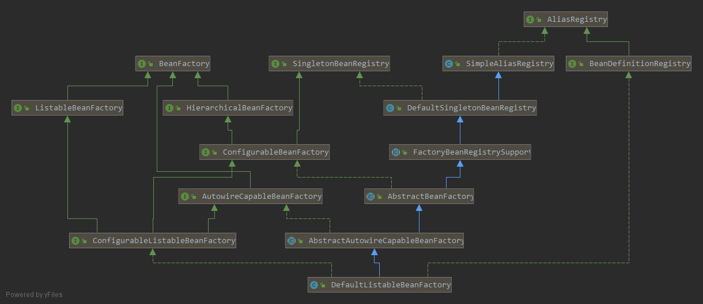

# bean的加载-配置文件的解析

spring是个包含很多个模块的框架。其中核心部分有四个，bean，core，context和Expresion Language.

core和bean是spring的基础模块。提供Ioc(控制反转)和依赖注入特性，这些的基础概念是BeanFactory。即bean工厂，一个可以创建各种bean的工厂。我们使用spring来过将项目的时候，都离不开bean，Bean模块包含访问配置文件，创建和管理bean以及进行Ioc和DI操作相关的所有类。

既然bean这么重要，那么就来分析一下bean的加载过程就顺理成章了。只分析比较核心的，能够根据这些方法想起其中细节的一些方法，所以有些地方不会太深入，适合对spring有一定了解的读者，深究就留给自己去研究吧。

```xml
<bean id="xxx" class="com.xx.xx.Person"/>
```

如上，bean的定义是如此简单，但是加载过程是怎样的呢？为了简便起见，这里还是会使用已经过时的DefaultListableBeanFactory的子类XmlBeanFactory来做分析，源码使用的是spring 5.1.5.RELEASE。[这里是学习工程](https://gitee.com/wt123/learn/tree/master/spring_source_learn)

## 核心类

### DefaultListableBeanFacory



先给一个类图，了解一下，有个印象，后续会逐步熟悉的。

```
AliasRegistry: 定义对alias的简答年增删改等操作;
SimpleAliasRegistry: 主要是用map作为alias的缓存，并对接口AliasRegistry进行实现;
SingletonBeanRegistry: 定义对单例的注册及获取;
BeanFactory: 定义获取bean及bean的各种属性;
DefaultSingletonBeanRegistry: 对接口SingletonBeanRegistry各函数的实现;
hierarchicalBeanFactory: 继承BeanFactory，也就是在beanFactory定义的功能的基础上增加了对ParrentFactory的支持;
BeanDefintionRegistry: 定义对BeanDefinition的各种增删改操作;
FactoryBeanRegistrySupport: 在DefaultSingletonBeanRegistry基础上增加了对FactoryBean的特殊处理功能;
ConfigurableBeanFactory: 提供配置Factory的各种方法;
ListableBeanFactory: 根据各种条件获取备案的配置清单;
AbstractBeanFactory: 综合FactoryBeanRegistrySupport和ConfigurableBeanFactory的功能。
AutowireCapableBeanFacotry: 提供创建bean、自动注入、初始化以及应用bean的后置处理器;
AbstractAutowireCapableBeanFactory: 综合AbstractBeanFactory并对接口AutowireCapableBeanFactory进行实现;
ConfigurableListableBeanFactory: BeanFactory配置清单，指定胡烈类型及接口等;
DefaultListableBeanFactory: 综合上面内所有功能，主要是对Bean注册后的处理;
```

XmlBeanFactory是DefaultListableBeanFactory的子类，标记为已经过时，里面增加了XmlBeanDefinitionReader类型的reader属性。虽然已经标记为过时，但是即使是DefaultListableBeanFactory，最终在spring初始化的过程中，也是使用的XmlBeanDefinitionReader来读取的配置文件。因此不影响我们对代码的分析。

### XmlBeanDefinitionReader

spring的配置文件是实现bean配置的最常用方式(这里不讨论springboot)，而读取xml配置文件的就是XmlBeanDefinitionReader。先来看一下会使用到的一些类的功能。

```
ResourceLoader: 定义资源加载器，主要应用于根据给定的资源文件地址返回对应你的Resource;
BeanDefinitionReader: 主要定义资源文件读取并转换为BeanDefinition的各个功能;
EnvironmentCapable: 定义获取Environment方法;
DocumentLoader: 定义从资源文件加载到转换为Document的功能;
AbstractBeanDefinitionReader: 对EnvironmentCapable、BeanDefinitionReader类定义的功能进行实现;
BeanDefinitionDocumentReader: 定义读取Document并注册BeanDefinition功能;
BeanDefinitionParserDelegate: 定义解析Element的各种方法；
```

XmlBeanDefinitionReader通过继承AbstractBeanDefinitionReader中的方法，来使用ResourseLoader将资源文件路径转换为对应的Resource文件；通过DocumentLoader对Resource文件进行转换，将Resource文件转换为Document文件；通过实现接口BeanDefinitionDocumentReader的DefaultBeanDefinitionDocumentReader类对Document进行解析，并使用BeanDefinitionParserDelegate对Element进行解析。

## xml文件读取

```java
public XmlBeanFactory(Resource resource, BeanFactory parentBeanFactory) throws BeansException {
	super(parentBeanFactory);
    // 开始加载并读取xml文件
	this.reader.loadBeanDefinitions(resource);
}
```

构造方法中super调用了父类，一直跟到底，会在AbstractAutowireCapableBeanFactory中发现以下代码：

```java
public AbstractAutowireCapableBeanFactory() {
	super();
    // 忽略指定接口的自动装配功能
	ignoreDependencyInterface(BeanNameAware.class);
	ignoreDependencyInterface(BeanFactoryAware.class);
	ignoreDependencyInterface(BeanClassLoaderAware.class);
}
```

回到构造函数的this.reader.loadBeanDefinitions(resource);

```java
// XmlBeanDefinitionReader
public int loadBeanDefinitions(Resource resource) throws BeanDefinitionStoreException {
	return loadBeanDefinitions(new EncodedResource(resource));
}

public int loadBeanDefinitions(EncodedResource encodedResource) throws BeanDefinitionStoreException {
	//...
	// 检查当前线程正正在加载的resource
	Set<EncodedResource> currentResources = this.resourcesCurrentlyBeingLoaded.get();
	if (currentResources == null) {
		currentResources = new HashSet<>(4);
		this.resourcesCurrentlyBeingLoaded.set(currentResources);
	}
    //如果当前准备解析的encodeResource正在加载，则抛出异常
	if (!currentResources.add(encodedResource)) {
		throw new BeanDefinitionStoreException(
				"Detected cyclic loading of " + encodedResource + " - check your import definitions!");
	}
	try {
		//获取resource的inputStream
		InputStream inputStream = encodedResource.getResource().getInputStream();
		try {
			//包装成inputSource
			InputSource inputSource = new InputSource(inputStream);
			if (encodedResource.getEncoding() != null) {
				inputSource.setEncoding(encodedResource.getEncoding());
			}
			//开始加载
			return doLoadBeanDefinitions(inputSource, encodedResource.getResource());
		}
		finally {
			inputStream.close();
		}
	}
	//...
}

protected int doLoadBeanDefinitions(InputSource inputSource, Resource resource)
		throws BeanDefinitionStoreException {
	try {
        //将resource转成document，这里头会去验证xml文件，DTD或者XSD，不同的类型会用不用的解析方式，喜欢的自己去看吧
		Document doc = doLoadDocument(inputSource, resource);
        //解析document并注册bean
		int count = registerBeanDefinitions(doc, resource);
		//...
        //返回加载的bean的数量
		return count;
	}
}

public int registerBeanDefinitions(Document doc, Resource resource) throws BeanDefinitionStoreException {
    //创建document解析器
	BeanDefinitionDocumentReader documentReader = createBeanDefinitionDocumentReader();
	int countBefore = getRegistry().getBeanDefinitionCount();
    //使用document解析器解析document
    //这里createReaderContext()创建的是XmlReaderContext
	documentReader.registerBeanDefinitions(doc, createReaderContext(resource));//***①
	return getRegistry().getBeanDefinitionCount() - countBefore;
}

public XmlReaderContext createReaderContext(Resource resource) {
	return new XmlReaderContext(resource, this.problemReporter, this.eventListener,
			this.sourceExtractor, this, getNamespaceHandlerResolver());
}

public NamespaceHandlerResolver getNamespaceHandlerResolver() {
	if (this.namespaceHandlerResolver == null) {
		this.namespaceHandlerResolver = createDefaultNamespaceHandlerResolver();
	}
	return this.namespaceHandlerResolver;
}

protected NamespaceHandlerResolver createDefaultNamespaceHandlerResolver() {
	ClassLoader cl = (getResourceLoader() != null ? getResourceLoader().getClassLoader() : getBeanClassLoader());
    //返回默认的命名空间解析器，这个东西会用来获取解析标签的NamespaceHandler
	return new DefaultNamespaceHandlerResolver(cl);
}
```

看方法***①:

```java
//DefaultBeanDefinitionDocumentReader.java
public void registerBeanDefinitions(Document doc, XmlReaderContext readerContext) {
	this.readerContext = readerContext;
    //解析document
	doRegisterBeanDefinitions(doc.getDocumentElement());
}

protected void doRegisterBeanDefinitions(Element root) {
    BeanDefinitionParserDelegate parent = this.delegate;
    //创建默认的BeanDefinitionParserDelegate，用来解析自定义标签
	this.delegate = createDelegate(getReaderContext(), root, parent);
    //...profile的处理，如果在web.xml中定义了profile，则只解析相应的文件
    if (this.delegate.isDefaultNamespace(root)) {
		String profileSpec = root.getAttribute(PROFILE_ATTRIBUTE);
		if (StringUtils.hasText(profileSpec)) {
			String[] specifiedProfiles = StringUtils.tokenizeToStringArray(
					profileSpec, BeanDefinitionParserDelegate.MULTI_VALUE_ATTRIBUTE_DELIMITERS);
			// We cannot use Profiles.of(...) since profile expressions are not supported
			// in XML config. See SPR-12458 for details.
			if (!getReaderContext().getEnvironment().acceptsProfiles(specifiedProfiles)) {
				if (logger.isDebugEnabled()) {
					logger.debug("Skipped XML bean definition file due to specified profiles [" + profileSpec +
							"] not matching: " + getReaderContext().getResource());
				}
				return;
			}
		}
	}
    //留给子类扩展
    preProcessXml(root);
    //真正开始解析
	parseBeanDefinitions(root, this.delegate);
    //留给子类扩展
	postProcessXml(root);
}

protected void parseBeanDefinitions(Element root, BeanDefinitionParserDelegate delegate) {
	if (delegate.isDefaultNamespace(root)) {
		NodeList nl = root.getChildNodes();
		for (int i = 0; i < nl.getLength(); i++) {
			Node node = nl.item(i);
			if (node instanceof Element) {
				Element ele = (Element) node;
				if (delegate.isDefaultNamespace(ele)) {
                    //解析默认标签
					parseDefaultElement(ele, delegate);
				}
				else {
                    //解析自定义标签
					delegate.parseCustomElement(ele);
				}
			}
		}
	}
	else {
        //解析自定义标签
		delegate.parseCustomElement(root);
	}
}
```

### 解析默认标签

```java
private void parseDefaultElement(Element ele, BeanDefinitionParserDelegate delegate) {
	if (delegate.nodeNameEquals(ele, IMPORT_ELEMENT)) {
        //解析import标签，如果有import标签，其实就会递归解析了
		importBeanDefinitionResource(ele);
	}
	else if (delegate.nodeNameEquals(ele, ALIAS_ELEMENT)) {
        //解析别名标签
		processAliasRegistration(ele);
	}
	else if (delegate.nodeNameEquals(ele, BEAN_ELEMENT)) {
        //解析bean标签
		processBeanDefinition(ele, delegate);
	}
	else if (delegate.nodeNameEquals(ele, NESTED_BEANS_ELEMENT)) {
		// 解析beans标签，其实就是把当前节点继续丢去解析而已，产生了递归
		doRegisterBeanDefinitions(ele);
	}
}
```

对默认标签的解析就不多写了，无非不过就是怎么去读取文件，怎么解决文件中的各种数据，喜欢的就自己深究下去吧，再细下去就太多了，为了给自己一个印象，我这里不会深究下去。

### 解析自定义标签

先看个demo吧。
```xml
<?xml version="1.0" encoding="UTF-8"?>
<beans xmlns="http://www.springframework.org/schema/beans"
       xmlns:xsi="http://www.w3.org/2001/XMLSchema-instance"
       xmlns:myname="http://www.wt.com/schema/user"
       xsi:schemaLocation="http://www.springframework.org/schema/beans http://www.springframework.org/schema/beans/spring-beans-3.2.xsd
	   http://www.wt.com/schema/user http://www.wt.com/schema/user.xsd">

    <myname:user id="user" name="wt" age="23" email="taow"/>
</beans>
```

指定命名空间myname="http：//www.wt.com.schema/user"，看下面META-INF/Spring.handlers配置定义了当前命名空间所使用的解析器；schemaLocation中的http://www.wt.com/schema/user.xsd指定文件所在目录，看下面META-INF/Spring.schemas的配置，指定了xsd的文件所在目录。

```
# META-INF/Spring.handlers
# 定义指定namespace解析器，格式namespace = NamespaceHandler
http\://www.wt.com/schema/user=com.wt.test.customtag.MyNamespaceHandler
```

```
# META-INF/Spring.schemas
# 定义xml约束文档xsd所在目录
http\://www.wt.com/schema/user.xsd=META-INF/user.xsd
```

```xml
<!-- META-INF/user.xsd -->
<?xml version="1.0" encoding="UTF-8"?>
<schema xmlns="http://www.w3.org/2001/XMLSchema"
        targetNamespace="http://www.wt.com/schema/user"
        elementFormDefault="qualified">

    <element name="user">
        <complexType>
            <attribute name="id" type="string" />
            <attribute name="email" type="string" />
            <attribute name="name" type="string" />
            <attribute name="age" type="int" />
        </complexType>
    </element>
</schema>
```

```java
//注册自定义的命名空间解析器
public class MyNamespaceHandler extends NamespaceHandlerSupport {
	public void init() {
        //注册解析器
		registerBeanDefinitionParser("user", new UserBeanDefinitionParser());
	}
}

//该方法在父类NamespaceHandlerSupport中，父类实现了NamespaceHandler
public BeanDefinition parse(Element element, ParserContext parserContext) {
	BeanDefinitionParser parser = findParserForElement(element, parserContext);
	return (parser != null ? parser.parse(element, parserContext) : null);
}
```

```java
//标签解析器
public class UserBeanDefinitionParser extends AbstractSingleBeanDefinitionParser {

	@Override
	protected Class<?> getBeanClass(Element element) {
		return User.class;
	}

	@Override
	protected void doParse(Element element, BeanDefinitionBuilder bean) {
		String name = element.getAttribute("name");
		String age = element.getAttribute("age");
		String email = element.getAttribute("email");
		if (StringUtils.hasText(name)) {
			bean.addPropertyValue("name", name);
		}
		if (StringUtils.hasText(age)) {
			bean.addPropertyValue("age", age);
		}
		if (StringUtils.hasText(email)) {
			bean.addPropertyValue("email", email);
		}
	}
}
```

以上就是所有的自定义标签的配置。实现NamespaceHandler，在init方法中注册我们自定义的解析器。其实逻辑只是我们调用namespaceHandler的parse方法来解析自定义标签。但真正的解析肯定就是在parse方法中调用我们自己的解析器来解析而已。

现在开始分析，自定义标签是通过delegate.parseCustomElement(ele)来解析的。dalegate就是注释中提到的创建的默认的BeanDefinitionParserDelegate。

```java
//BeanDefinitionParserDelegate.java
public BeanDefinition parseCustomElement(Element ele) {
	return parseCustomElement(ele, null);
}

public BeanDefinition parseCustomElement(Element ele, @Nullable BeanDefinition containingBd) {
	//获取namespaceURI，也就是我们定义的命名空间http://www.wt.com/schema/user
    String namespaceUri = getNamespaceURI(ele);
	if (namespaceUri == null) {
		return null;
	}
    //使用nameSpaceHandlerResolver，根据namespaceUri获取自定义的标签解析器NamespaceHandler，
	NamespaceHandler handler = this.readerContext.getNamespaceHandlerResolver().resolve(namespaceUri);
	if (handler == null) {
		error("Unable to locate Spring NamespaceHandler for XML schema namespace [" + namespaceUri + "]", ele);
		return null;
	}
    //解析自定义标签
	return handler.parse(ele, new ParserContext(this.readerContext, this, containingBd));
}
```

我们自定义的MyNamespaceHandler是就是通过NamespaceHandler handler = this.readerContext.getNamespaceHandlerResolver().resolve(namespaceUri);这一行来获取的。直接跟进去，进入resolve方法。至于getNamespaceHandlerResolver()在哪里创建的之前提到过，这里就不继续说了，是默认的。

```java
//DefaultNamespaceHandlerResolver.java
public NamespaceHandler resolve(String namespaceUri) {
	//获取所有的命名空间->命名空间解析器的映射，就是Spring.handlers中的映射
	Map<String, Object> handlerMappings = getHandlerMappings();
	Object handlerOrClassName = handlerMappings.get(namespaceUri);
	if (handlerOrClassName == null) {
		return null;
	}
	//第一次加载的时候是String->String,但是如果已经获取过，就会实例化而变成String->NamespaceHandler并加入缓存,
	//所以这里先判断是不是已经初始化过，如果是就不用再初始化了
	else if (handlerOrClassName instanceof NamespaceHandler) {
		return (NamespaceHandler) handlerOrClassName;
	}
	else {
		//第一次加载，根据全限定类名初始化
		String className = (String) handlerOrClassName;
		try {
			Class<?> handlerClass = ClassUtils.forName(className, this.classLoader);
			//...
			NamespaceHandler namespaceHandler = (NamespaceHandler) BeanUtils.instantiateClass(handlerClass);
            //执行init方法，我们自定义的namespaceHandler在这个方法中注册了我们自己的解析器
			namespaceHandler.init();
			//加入当前实例，避免下次进入再次实例化
			handlerMappings.put(namespaceUri, namespaceHandler);
			return namespaceHandler;
		}
		//...
	}
}

private Map<String, Object> getHandlerMappings() {
	Map<String, Object> handlerMappings = this.handlerMappings;
	if (handlerMappings == null) {
		synchronized (this) {
			handlerMappings = this.handlerMappings;
			if (handlerMappings == null) {
				//...
				try {
					//从文件中获取映射关系
					Properties mappings =
						PropertiesLoaderUtils.loadAllProperties(this.handlerMappingsLocation, this.classLoader);
					//...
					handlerMappings = new ConcurrentHashMap<>(mappings.size());
					CollectionUtils.mergePropertiesIntoMap(mappings, handlerMappings);
					this.handlerMappings = handlerMappings;
				}
				//...
			}
		}
	}
	return handlerMappings;
}

public static final String DEFAULT_HANDLER_MAPPINGS_LOCATION = "META-INF/spring.handlers";

public DefaultNamespaceHandlerResolver() {
	this(null, DEFAULT_HANDLER_MAPPINGS_LOCATION);
}
```

在getHandlerMappings()方法中，我们注意看这行代码Properties mappings =
						PropertiesLoaderUtils.loadAllProperties(this.handlerMappingsLocation, this.classLoader);这样代码就是从Spring.handlers文件中获取所有的映射关系。在上面的代码最后面，贴上了默认的地址，也就是META-INF/Spring.handlers。

这样就拿到了我们自定义的NamespaceHandler，接下来就是调用我们的MyNameSpaceHandler的parse方法来解析咯（实际上在这里头会调用我们自己的解析器UserBeanDefinitionParser哦，比较简单，自己看咯）。

```
我们熟悉的spring-aop就是通过自定义标签来实现的哦，使用的是AopNamespaceHandler哦。
还有springmvc的<annotation-driven/>也是哦，使用的是MvcNamespaceHandler哦。
```


xml的解析内容比较少，但是如果不熟悉spring的话看起来还是有一定难度的。这里重在给自己勾勒初一个大致的轮廓，在这其中可以回忆起其中的细节。所以如果想要深入的了解细节，还是自己去看哦。在下比较懒，细节我就只是回忆，就不给分析了~。


over...