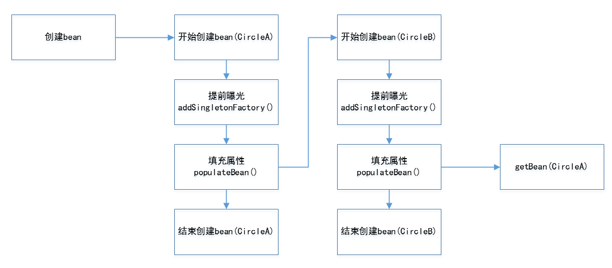
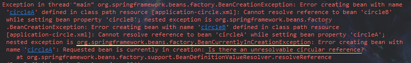

# 循环依赖解决

## constructor(此种无法解决)

```
（看完sertter之后再来看这部分吧）我想看过下部分setter解决循环依赖的实现之后，肯定有想法为啥constructor无法实现，我们同样可以提前曝光一个SingletonFactory(以下简称fac)噻？
其实不然，当然，我们想法是没有问题的，我们当然可以提前暴露一个fac，但是为什么此种方式不行。首先我们分析一下为什么setter能够实现，我们知道在setter中是在bean实例化完毕之后，这里很重要，因为是实例化之后，所有这个时候A其实是已经存在了，只是还没有填充属性而已，在populateBean填充属性的时候发现没有B，然后再去创建B， 这个时候B可以通过提前曝光的fac拿到的A实例，看清楚了，是拿到的A的实例，不是fac。这种情况A在填充完属性之后，B持有的A地址不会变，所以这种情况提前曝光可以解决循环依赖。
再来看constructor的情况，我们说了，我们当然可以天暴露一个fac（可以在构造函数执行前暴露），但是当我们在初始化B，为B填充属性A的时候，你觉得我们能从fac中拿到一个A的地址吗？当然不能咯，因为A的constructor并未执行完成，这种情况下，A是没有分配到地址的，也就是说A并不存在，而我们只有一个fac，这个fac的getObject是没办法获取到A的，因为A还不存在啊，但是B需要的是一个A类型的属性，而不是一个Factory，所以无法注入！无法注入怎么办，无法注入当然就无法实现咯！
```

## setter

提前暴露一个单例bean的工厂方法，使其他bean能引用到该bean。



```java
//AbstractAutowireCapableBeanFactory.java
protected Object doCreateBean(final String beanName, final RootBeanDefinition mbd, final Object[] args) {
	...
		//提前暴露条件，当前实例是单例 && 允许循环依赖 && 当前实例正在创建中
		boolean earlySingletonExposure = (mbd.isSingleton() && this.allowCircularReferences &&
				isSingletonCurrentlyInCreation(beanName));
		if (earlySingletonExposure) {
			...
			addSingletonFactory(beanName, new ObjectFactory<Object>() {
				public Object getObject() throws BeansException {
                    //对bean再一次依赖引用，主要应用SmartInstantiationAware BeanPostProcessor，
                    //AOP就是在这里将advice动态之织入bean中，若没有则直接返回bean，不作任何处理
					return getEarlyBeanReference(beanName, mbd, bean);
				}
			});
		}
    ...
	}
```

`code`

```xml
 <bean id="circleA" class="com.wt.test.circle.CircleA">
     <property name="circleB" ref="circleB"/>
 </bean>
 <bean id="circleB" class="com.wt.test.circle.CircleB">
     <property name="circleA" ref="circleA"/>
 </bean>
```

```java
private static void circleSolution() {
		ClassPathXmlApplicationContext x = new ClassPathXmlApplicationContext("application-circle.xml");
		CircleA a = x.getBean(CircleA.class);
		CircleB b = x.getBean(CircleB.class);
		System.out.println(a);
		System.out.println(b);
		System.out.println(a.getCircleB() == b);
		System.out.println(b.getCircleA() == a);
	}
```

`结果`


> prototype模式

`xml`

```xml
<bean id="circleA" class="com.wt.test.circle.CircleA" scope="prototype">
    <property name="circleB" ref="circleB"/>
</bean>
<bean id="circleB" class="com.wt.test.circle.CircleB" scope="prototype">
    <property name="circleA" ref="circleA"/>
</bean>
```

`结果`



>***注意：只有在单例模式下才能解决循环依赖，prototype作用域的bean是无法完成循环依赖注入的，因为Spring容器不进行缓存prototype作用域的bean，因此无法提前暴露出一个创建中的bean！***

