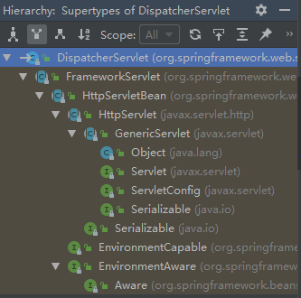
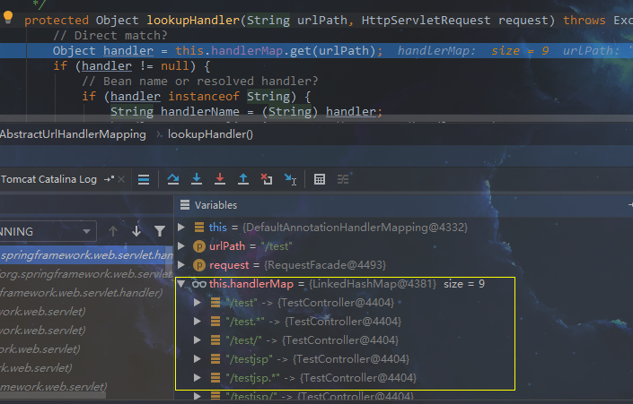
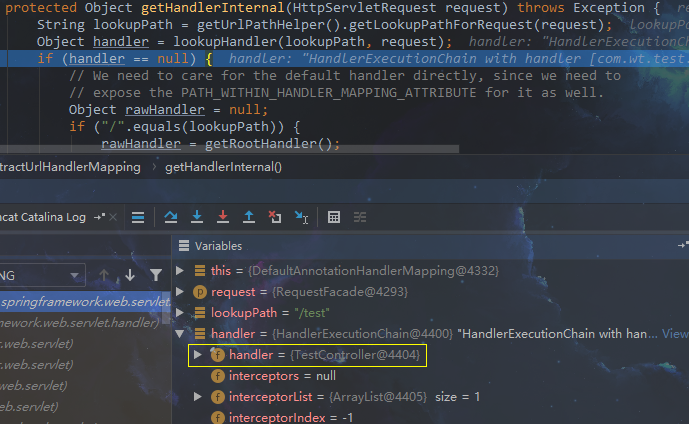
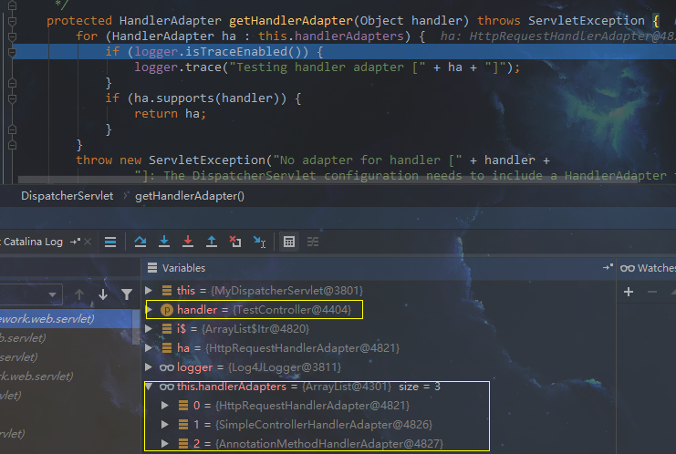

## spring-webmvc请求处理流程

我们先来看哈DispathcerServlet的继承关系。



```
springmvc是基于servlet来的，web.xml中只有一个DispatcherServlet，我们知道这其实只是所有请求处理都要经过的一个servlet，这个servlet只是做请求的分发处理，找到合适的处理器，处理，并返回结果，这个是springmvc主要的实现方式，现在我们来看这个核心DispatcherServlet的处理流程。
```

```
这里先简单说一下入口，servlet处理是从service(request,response)方法开始的，这个方法的实现在Httpservlet中。这个方法最终会根据请求的method(post，get等)转到子类FrameServlet中的doPost(),doGet()方法进行处理，在这些方法中，又会委托给processRequest(request, response)方法进行处理，这里就直接从这个方法入手了，前面的啥service(),doPost()等的就自己去瞧了。
```

## processRequest(request, response)

```java
//FrameworkServlet.java
protected final void processRequest(HttpServletRequest request, HttpServletResponse response)
			throws ServletException, IOException {
		//为了保证当前线层的LocalContext以及RequestAttributes可以再当前请求后还能恢复，提取当前线程的两个属性(需要点进去看，buildLocaleContext()方法中)
    	//根据当前request创建对应的LocaleContext和requestAttibutes，并绑定到当前线程
		LocaleContext previousLocaleContext = LocaleContextHolder.getLocaleContext();
		LocaleContext localeContext = buildLocaleContext(request);
		RequestAttributes previousAttributes = RequestContextHolder.getRequestAttributes();
		ServletRequestAttributes requestAttributes = buildRequestAttributes(request, response, previousAttributes);
		...
		try {
            //委托给doSerivce()做进一步处理
			doService(request, response);
		}
    	...
		finally {
            //请求结束后恢复线程原始状态
			resetContextHolders(request, previousLocaleContext, previousAttributes);
            //请求处理结束后无论成功与否，发布事件通知
			...
			publishRequestHandledEvent(request, startTime, failureCause);
		}
}
```

```
从FrameworkServlet的processRequest()方法中，我们可以看到以下流程（都在注释中）：
1. 为了保证当前线层的LocalContext以及RequestAttributes可以再当前请求后还能恢复，提取当前线程的两个属性；
2. 根据当前request创建对应的LocaleContext和requestAttibutes，并绑定到当前线程；
3. 委托给doSerivce()做进一步处理；
4. 请求结束后恢复线程原始状态；
5. 请求处理结束后无论成功与否，发布事件通知。
```

## doService(request, response)

这个时候，我们来到了DispacherServlet的doService()方法。

```java
//DispacherServlet.java
protected void doService(HttpServletRequest request, HttpServletResponse response) throws Exception {
    ...
    try {
        	//请求分发处理
			doDispatch(request, response);
		}
    ...
}
```

根据spring一贯的风格，这个时候的doservice依然是在做一些准备工作，准备工作中spring会把我们初始化的各种resolver和WebapplicationContext放到request的Attribute中，以便之后使用。重点来到doDispatch(request, response);

```java
//DispacherServlet.java
protected void doDispatch(HttpServletRequest request, HttpServletResponse response) throws Exception {
		...
         HandlerExecutionChain mappedHandler = null;
         //如果是文件上传使用的MultipartContent类型的request，则将request转换成MultipartHtptServletRequest类型的request
		processedRequest = checkMultipart(request);
    	...
		// 根据request信息寻找对应的handler，
		mappedHandler = getHandler(processedRequest, false);
		if (mappedHandler == null || mappedHandler.getHandler() == null) {
            //如果没有找到对应的handler，则通过response返回错误信息
			noHandlerFound(processedRequest, response);
			return;
		}
		// 通过找到的handler，寻找它的适配器handlerAdapter
		HandlerAdapter ha = getHandlerAdapter(mappedHandler.getHandler());
    	...
		// 调用拦截器的preHandle方法
		if (!mappedHandler.applyPreHandle(processedRequest, response)) {
			return;
		}
		try {
			// 真正的激活handler调用，并返回视图
			mv = ha.handle(processedRequest, response, mappedHandler.getHandler());
		}
    	...
		//视图名称的转换，用于需要添加前后缀的情况
        applyDefaultViewName(request, mv);
		// 调用拦截器的postHandle方法
    	mappedHandler.applyPostHandle(processedRequest, response, mv);
		...
         //处理结果
		processDispatchResult(processedRequest, response, mappedHandler, mv, dispatchException);
		...
}
```

### getHandler

>  gethandler最终会调用到如下方法，可以看到其实就是遍历我们初始化的所有handlerMappings来寻找一个合适的handler并返回。

```java
// DispacherServlet.java
protected HandlerExecutionChain getHandler(HttpServletRequest request) throws Exception {
		for (HandlerMapping hm : this.handlerMappings) {
			...
			HandlerExecutionChain handler = hm.getHandler(request);
			if (handler != null) {
				return handler;
			}
		}
		return null;
	}
```

以我们最熟悉的@Controller注解方式来分析，系统会注册默认的requestMapping，其中包含DefaultAnnotationHandlerMapping，一看就知道这个是处理注解映射的，不过这个类在3.2.x版本之后就弃用了，该用RequestMappingHandlerMapping，我们进入hm.getHandler(request)查看，这个方法来自于超类AbstractHandlerMapping。

```java
//AbstractHandlerMapping.java
public final HandlerExecutionChain getHandler(HttpServletRequest request) throws Exception {
		//根据request获取对应的handler,由子类AbstractUrlHandlerMapping实现
		Object handler = getHandlerInternal(request);
		if (handler == null) {
            //如果没有handler，则使用默认的handler
			handler = getDefaultHandler();
		}
    	//如果也没有默认的handler，则不继续处理，返回null
		if (handler == null) {
			return null;
		}
		//如果handler是一个string类型的，那说明这是个bean的name，根据它去获取对应的bean
		if (handler instanceof String) {
			String handlerName = (String) handler;
			handler = getApplicationContext().getBean(handlerName);
		}
    	//加入拦截器，并返回添加了拦截器的handler处理链
		return getHandlerExecutionChain(handler, request);
}
```

```java
//AbstractUrlHandlerMapping.java
protected Object getHandlerInternal(HttpServletRequest request) throws Exception {
		String lookupPath = getUrlPathHelper().getLookupPathForRequest(request);
    	//查找对应的handler
		Object handler = lookupHandler(lookupPath, request);
		...
		return handler;
	}

protected Object lookupHandler(String urlPath, HttpServletRequest request) throws Exception {
		//根据urlPath找到对应的handler，其实就是我们的Controller
		Object handler = this.handlerMap.get(urlPath);
    	if (handler != null) {
			...
             //添加Inteceptor并封装成HandlerExecutionChain并返回
			return buildPathExposingHandler(handler, urlPath, urlPath, null);
		}
		...
}

protected Object buildPathExposingHandler(Object rawHandler, String bestMatchingPattern,
			String pathWithinMapping, Map<String, String> uriTemplateVariables) {
		//将handler封装到HandlerExecutionChain中
		HandlerExecutionChain chain = new HandlerExecutionChain(rawHandler);
    	//添加Interceptor
		chain.addInterceptor(new PathExposingHandlerInterceptor(bestMatchingPattern, pathWithinMapping));
		if (!CollectionUtils.isEmpty(uriTemplateVariables)) {
			chain.addInterceptor(new UriTemplateVariablesHandlerInterceptor(uriTemplateVariables));
		}
		return chain;
	}
```

```
如下图，我们可以看到在lookupHandler()方法中的handlerMap其实就是url->controller的映射。
```



```
看下图，我们可以看到，lookupHandler返回了封装好的HandlerExcutionChain,该实例的属性handler是之前找到的controller。
```



### getHandlerAdapter

> getHandlerAdapter也是遍历之前注册的所有adapter来获取对应的handler的adapter，注意入参，是handler，就是我们的controller。

```java
protected HandlerAdapter getHandlerAdapter(Object handler) throws ServletException {
		for (HandlerAdapter ha : this.handlerAdapters) {
			...
			if (ha.supports(handler)) {
				return ha;
			}
		}
    	...
}
```

直接上图，可以看到handlerAdapters有三个，我们使用的是@Controller注解的方式，我们直接来看AnnotationMethodHandlerAdapter。



```java
//AnnotationMethodHandlerAdapter.java
public boolean supports(Object handler) {
    //其实就是找一个resolver，如果没有初始化一个，然后判断一下handler里面的method是否为空
    //因为我们是注解的方式，能够想到方法调用是采用反射的方式，所以这里会判断method是否为空
	return getMethodResolver(handler).hasHandlerMethods();
}
```

### ha.handle()

> 这个ha是上一步获取到的handlerAdapter，不是第一步获取的的handler哦,这里才真正开始执行调用我们的controller逻辑。

```java
//AnnotationMethodHandlerAdapter.java
public ModelAndView handle(HttpServletRequest request, HttpServletResponse response, Object handler) throws Exception {
	...
    //一贯风格又来了
    return invokeHandlerMethod(request, response, handler);
}

protected ModelAndView invokeHandlerMethod(HttpServletRequest request, HttpServletResponse response, Object handler) throws Exception {
    	...
         //调用我们的controller的方法，返回结果
		Object result = methodInvoker.invokeHandlerMethod(handlerMethod, handler, webRequest, implicitModel);
    	//生成一个视图，会根据返回值的类型，是否加了ResponseBody注解做不同的处理，感兴趣的自己去看
		ModelAndView mav =
				methodInvoker.getModelAndView(handlerMethod, handler.getClass(), result, implicitModel, webRequest);
		...
		return mav;
	}
```

```
可以看到我们的controller最终被调用了，spring在调用返回结果后会对结果的返回值类型，方法是否加了@ResponseBody注解等做进一步处理，这部份就自己去看了哦，这里说明一下，如果方法加了@ResponseBody注解，那么返回的mav=null。
```

### processDispatchResult()

> 在这个的上一步会执行Interceptor的postHandle()方法mappedHandler.applyPostHandle(processedRequest, response, mv);，这里提一下。

```java
private void processDispatchResult(HttpServletRequest request, HttpServletResponse response,
			HandlerExecutionChain mappedHandler, ModelAndView mv, Exception exception) throws Exception {
		boolean errorView = false;

		if (exception != null) {
			if (exception instanceof ModelAndViewDefiningException) {
				logger.debug("ModelAndViewDefiningException encountered", exception);
				mv = ((ModelAndViewDefiningException) exception).getModelAndView();
			}
			else {
				Object handler = (mappedHandler != null ? mappedHandler.getHandler() : null);
                //调用HandlerExceptionResolver处理异常，
                //这个东西就是在servlet初始化的时候最后一步initStrategies()方法当中，跟requestMapping等一起注册的
				mv = processHandlerException(request, response, handler, exception);
				errorView = (mv != null);
			}
		}
    	if (mv != null && !mv.wasCleared()) {
            //如果返回的mv不为空，处理视图，并跳转，这里会用到viewResolver
			render(mv, request, response);
			if (errorView) {
				WebUtils.clearErrorRequestAttributes(request);
			}
		}
		...
		if (mappedHandler != null) {
            //调用Intecepter的afterCompletion()方法
			mappedHandler.triggerAfterCompletion(request, response, null);
		}
	}
```

```
在最后的处理结果当中，如果请求有异常发生，就会导向异常处理器去处理，如果没有，就会根据是否存在视图进行跳转，最后调用Interceptor的afterCompletion()方法。到这里整个请求算完了，剩下的就是一些后续清理工作，发布时间通知等工作了。
```


over ...