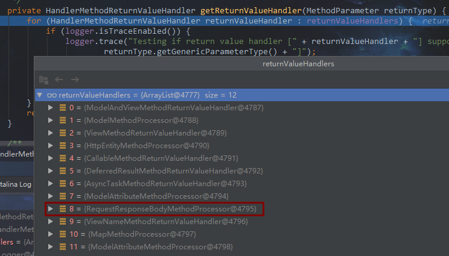
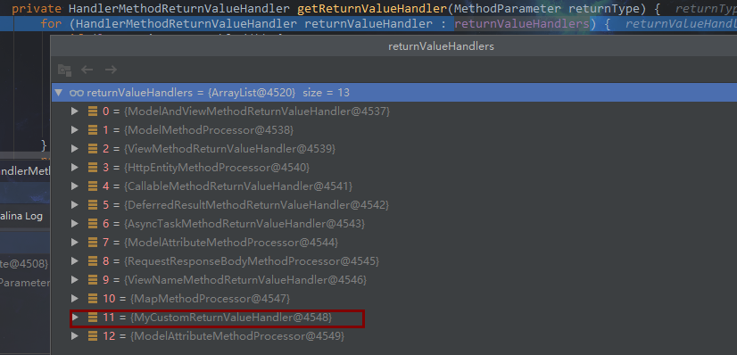

# spring-webmvc请求处理流程——返回值处理


## RequestMappingHandlerAdapter

自3.2之后的版本，引入了RequestMappingHandlerAdapter来替换了AnnotationMethodHandlerAdapter的处理。这里也来分析一下这个玩意儿。

因为也是一个HandlerAdapter，所以，前面的处理流程都是一样的，servlet的getHandlerAdapter这个时候就返回了RequestMappingHandlerAdapter，而不是AnnotationMethodHandlerAdapter了。

拿到HandlerAdapter之后，我们就直接冲ha.handle()方法开始分析吧。

```java
// RequestMAppingHandlerAdapter.java
protected final ModelAndView handleInternal(HttpServletRequest request,
			HttpServletResponse response, HandlerMethod handlerMethod) throws Exception {
    //...做一些检查
    return invokeHandleMethod(request, response, handlerMethod);
}

private ModelAndView invokeHandleMethod(HttpServletRequest request,
             HttpServletResponse response, HandlerMethod handlerMethod) throws Exception {
    ServletWebRequest webRequest = new ServletWebRequest(request, response);
	
    WebDataBinderFactory binderFactory = getDataBinderFactory(handlerMethod);
    ModelFactory modelFactory = getModelFactory(handlerMethod, binderFactory);
    //拿取我们需要执行的controller的方法
    ServletInvocableHandlerMethod requestMappingMethod = createRequestMappingMethod(handlerMethod, binderFactory);
	// 用于后面构造mv的Container
    ModelAndViewContainer mavContainer = new ModelAndViewContainer();
    mavContainer.addAllAttributes(RequestContextUtils.getInputFlashMap(request));
    modelFactory.initModel(webRequest, mavContainer, requestMappingMethod);
    mavContainer.setIgnoreDefaultModelOnRedirect(this.ignoreDefaultModelOnRedirect);
	//...这一段是对异步请求的处理
    //调用controller的方法，并处理mavContainer
    requestMappingMethod.invokeAndHandle(webRequest, mavContainer);

    if (asyncManager.isConcurrentHandlingStarted()) {
        return null;
    }

    return getModelAndView(mavContainer, modelFactory, webRequest);
}

private ModelAndView getModelAndView(ModelAndViewContainer mavContainer,
                                     ModelFactory modelFactory, NativeWebRequest webRequest) throws Exception {

    modelFactory.updateModel(webRequest, mavContainer);
    //判断，如果当前请求已经处理完成，则不进行后续的处理没直接返回null
    if (mavContainer.isRequestHandled()) {
        return null;
    }
    //如果请求还未处理完成，那说明可能有页面需要返回，开始查找，处理并返回mav
    ModelMap model = mavContainer.getModel();
    ModelAndView mav = new ModelAndView(mavContainer.getViewName(), model);
    if (!mavContainer.isViewReference()) {
        mav.setView((View) mavContainer.getView());
    }
    if (model instanceof RedirectAttributes) {
        Map<String, ?> flashAttributes = ((RedirectAttributes) model).getFlashAttributes();
        HttpServletRequest request = webRequest.getNativeRequest(HttpServletRequest.class);
        RequestContextUtils.getOutputFlashMap(request).putAll(flashAttributes);
    }
    return mav;
}
```

直接跟进去。来到RequestMappingHAndlerAdapter的handleInternal()方法，不要惊慌，按照spring的一贯风格，这TM当然不是核心方法，他只是做了一些检查。方法最后调用了invokeHandleMethod()。在该方法中，做了一些所需参数的获取，比如请求的controller层方法，参数。然后调用ServletInvocableHandlerMethod对象invokeAndHandle方法。

### 调用业务方法，并处理返回值

```java
//ServletInvocableHandlerMethod.java
public final void invokeAndHandle(ServletWebRequest webRequest,
       ModelAndViewContainer mavContainer, Object... providedArgs) throws Exception {
    // 真正调用controller方法，获得结果
    Object returnValue = invokeForRequest(webRequest, mavContainer, providedArgs);
	//设置响应状态
    setResponseStatus(webRequest);
	//如果返回值为null，则说明该请求不返回任何结果，直接设置mavContainer.setRequestHandled(true)
    //设置为true之后，表示该请求已经处理完，后续不再处理，后续会提到这个
    if (returnValue == null) {
        if (isRequestNotModified(webRequest) || hasResponseStatus() || mavContainer.isRequestHandled()) {
            mavContainer.setRequestHandled(true);
            return;
        }
    }
    else if (StringUtils.hasText(this.responseReason)) {
        mavContainer.setRequestHandled(true);
        return;
    }
	//设置为false，表示当前请求还未处理完成
    mavContainer.setRequestHandled(false);

    try {
        //调用默认的和自定义的所有返回值解析器处理返回结果
        this.returnValueHandlers.handleReturnValue(returnValue, getReturnValueType(returnValue), mavContainer, webRequest);
    }
    catch (Exception ex) {//...}
        throw ex;
    }
}
```

从注释中可于了解到，首先调用业务逻辑获得返回结果，然后对返回值做一定的判断并简单处理。通过returnValueHandlers对象来进一步处理返回结果。这是个HandlerMethodReturnValueHandlerComposite类型的对象，继续跟进。

```java
public void handleReturnValue(
        Object returnValue, MethodParameter returnType,
        ModelAndViewContainer mavContainer, NativeWebRequest webRequest)
        throws Exception {
	// 获得可以处理返回值的handler，当然也是通过遍历，可以看方法
    HandlerMethodReturnValueHandler handler = getReturnValueHandler(returnType);
    //如果没有合适的返回值处理器，就会报错
    Assert.notNull(handler, "Unknown return value type [" + returnType.getParameterType().getName() + "]");
    //使用返回值处理器处理返回结果
    handler.handleReturnValue(returnValue, returnType, mavContainer, webRequest);
}

private HandlerMethodReturnValueHandler getReturnValueHandler(MethodParameter returnType) {
    //遍历所有handler，包括自定义的
    for (HandlerMethodReturnValueHandler returnValueHandler : returnValueHandlers) {
        //...
        if (returnValueHandler.supportsReturnType(returnType)) {
            //如果该handler能够处理当前返回值，就返回该handler
            return returnValueHandler;
        }
    }
    return null;
}
```

来，看一下所有的默认注册的处理器。看到了RequestResponseBodyMethodProcessor是不是很亲切呢，对咯，他就是处理@ResponseBody注解的。喜欢的朋友可以去看哈这个类的supportsReturnType()方法就明白了。



到这里就不继续跟了，我们熟悉的RequestResponseBodyMethodProcessor处理器处理结果的时候会设置mavContainer.setRequestHandled(true);表示处理已经完毕。

### getModelAndView()

处理完之后，回到RequestMappingHandlerAdapter的invokeHandleMethod()方法。这个方法最终返回了getModelAndView();

从该方法中，我们可以看到，如果当前请求已经处理完成(mavContainer.isRequestHandled()值为true)，则不进行后续的处理没直接返回null，否则spring会继续处理当前请求，并试图返回一个ModelAndView。

## 自定义HandlerMethodReturnValueHandler

既然上面提到了自定义的返回值处理器，那这个自定义是在哪里的呢？这个返回值处理器就是在哪里注册的呢？精彩马上回来！

### 自定义返回值处理器

返回值处理器需要实现HandlerMethodReturnValueHandler

```java
public class MyCustomReturnValueHandler implements HandlerMethodReturnValueHandler {
    @Override
    public boolean supportsReturnType(MethodParameter returnType) {
        //判断方法是否包含自定义注解MyResonse或者返回结果是指定的某种类型
        return returnType.getMethodAnnotation(MyResponse.class) != null || ResponseResult.class.isAssignableFrom(returnType.getParameterType());
    }

    @Override
    public void handleReturnValue(Object returnValue, MethodParameter returnType, ModelAndViewContainer mavContainer, NativeWebRequest webRequest) throws Exception {
        // 表明该请求已经处理，后面spring不会再处理
        mavContainer.setRequestHandled(true);
        HttpServletResponse response = webRequest.getNativeResponse(HttpServletResponse.class);
        response.setCharacterEncoding("UTF-8");
        response.setContentType("application/json;charset=UTF-8");
        response.getWriter().println(JSON.toJSONString(returnValue));
    }
}
```

controller,我这里注解和返回值类型都符合上面处理器的要求，事实上只要一种就好了。

```java
@RequestMapping("/testValueHandler")
@MyResponse
public ResponseResult testValueHandler() {
	return new ResponseResult(0,"success");
}
```

springmvc.xml

```xml
<mvc:annotation-driven>
	<mvc:return-value-handlers>
		<bean class="com.wt.test.webmvc.config.MyCustomReturnValueHandler"/>
	</mvc:return-value-handlers>
</mvc:annotation-driven>
```

### 自定义返回结果处理器的初始化过程

从xml中可以看到是自定义标签mvc:return-value-handlers，跟踪MvcNamespaceHandler。

```java
// MvcNamespaceHandler.java
public void init() {
    //解析自定义标签的parser
	registerBeanDefinitionParser("annotation-driven", new AnnotationDrivenBeanDefinitionParser());
}
```

进入AnnotationDrivenBeanDefinitionParser的parse方法，自定义的就是在这里处理的，我们来看一下。

```java
// AnnotationDrivenBeanDefinitionParser
public BeanDefinition parse(Element element, ParserContext parserContext) {
	//...
    //获取自定义的返回值处理器
    ManagedList<?> returnValueHandlers = getReturnValueHandlers(element, parserContext);
    //...
    // 定义RequestMappingAdapterHandler
    RootBeanDefinition handlerAdapterDef = new RootBeanDefinition(RequestMappingHandlerAdapter.class);
    //...
    if (returnValueHandlers != null) {
        //设置自定义返回值处理器的属性customReturnValueHandlers
	handlerAdapterDef.getPropertyValues().add("customReturnValueHandlers", returnValueHandlers);
		}
    //...
    // 将定义的RequestMappingAdapterHandler注册为spring的bean
    parserContext.registerComponent(new BeanComponentDefinition(handlerAdapterDef, handlerAdapterName));
    //...
}

// 解析自定义标签return-value-handlers
private ManagedList<?> getReturnValueHandlers(Element element, ParserContext parserContext) {
	Element handlersElement = DomUtils.getChildElementByTagName(element, "return-value-handlers");
	if (handlersElement != null) {
		return extractBeanSubElements(handlersElement, parserContext);
	}
	return null;
}
```

直接看注释了，不解释了。到这里自定义的返回值处理器就已经注册完了，已经是spring的一个bean了。现在我们来看看RequestMappingHandlerAdapter。

这个家伙实现了InitializingBean，我们来看afterPropertiesSet方法。

```java
public void afterPropertiesSet() {
    //...
    }
    if (this.returnValueHandlers == null) {
        //获取所有的返回值处理器，不要看方法名是getDefaultReturnVanlueHandler，实际上在里面也包含了自定义的处理器
        List<HandlerMethodReturnValueHandler> handlers = getDefaultReturnValueHandlers();
        this.returnValueHandlers = new HandlerMethodReturnValueHandlerComposite().addHandlers(handlers);
    }
    initControllerAdviceCache();
}

private List<HandlerMethodReturnValueHandler> getDefaultReturnValueHandlers() {
    List<HandlerMethodReturnValueHandler> handlers = new ArrayList<HandlerMethodReturnValueHandler>();
	// 默认的返回值处理器
    // Single-purpose return value types
    handlers.add(new ModelAndViewMethodReturnValueHandler());
    handlers.add(new ModelMethodProcessor());
    handlers.add(new ViewMethodReturnValueHandler());
    handlers.add(new HttpEntityMethodProcessor(getMessageConverters(), this.contentNegotiationManager));
    handlers.add(new CallableMethodReturnValueHandler());
    handlers.add(new DeferredResultMethodReturnValueHandler());
    handlers.add(new AsyncTaskMethodReturnValueHandler(this.beanFactory));

    // Annotation-based return value types
    handlers.add(new ModelAttributeMethodProcessor(false));
    handlers.add(new RequestResponseBodyMethodProcessor(getMessageConverters(), this.contentNegotiationManager));

    // Multi-purpose return value types
    handlers.add(new ViewNameMethodReturnValueHandler());
    handlers.add(new MapMethodProcessor());

    // 自定义的返回值处理器，就是在之前parse处理的那些
    if (getCustomReturnValueHandlers() != null) {
        handlers.addAll(getCustomReturnValueHandlers());
    }
    // 添加其他的默认返回值处理器
    // Catch-all
    if (!CollectionUtils.isEmpty(getModelAndViewResolvers())) {
        handlers.add(new ModelAndViewResolverMethodReturnValueHandler(getModelAndViewResolvers()));
    }
    else {
        handlers.add(new ModelAttributeMethodProcessor(true));
    }
    return handlers;
}
```

从上可以看出，我们虽然我们的自定义返回值处理器放进去了，但是一定会用到嘛？那不一定哦。可以看到对所有的返回值处理器，并没有进行排序，因此我们不能控制这个顺序。先给一个调试的图：



从图中我们可看到，**我们自定义的handler确实是加载进去了，但是由于spring在处理这个handlers的时候并没有进行排序，所以我们自定义被放在了后面，我们不能够控制这个顺序(其他骚方法可以实现，这里不考虑这种情况)。所以存在一种情况，我们的返回值能够被前面的11个处理器中的某一个处理，那么就轮不到我们自定义的返回值处理器了**。举个简单的例子，比如你返回值类型是String，那么就会别ViewNameMethodReturnValueHandler处理；如果返回的类型是Map，那么就会被MapMethodProcessor处理，可以自行测试。因此我们的返回值其实也很重要。**所以要使用到我们自定义的处理器，那么首先我们就得让前面的处理器无法处理我们的返回结果**。

通常可以实现一个通用的返回结果实体，或者某个标记接口（空接口），这样其他的返回值处理器无法处理返回的值类型，这样就轮到我们自己的返回值处理器了。也可以返回喜欢的实体类型，像示例中一样使用注解也可以。但是因为通常一个项目来讲返回值都是有定义的，返回的类型都是有同一种格式的，所以这类比较偏向使用通用相同的返回实体，或者使用某个接口标记。


over ...