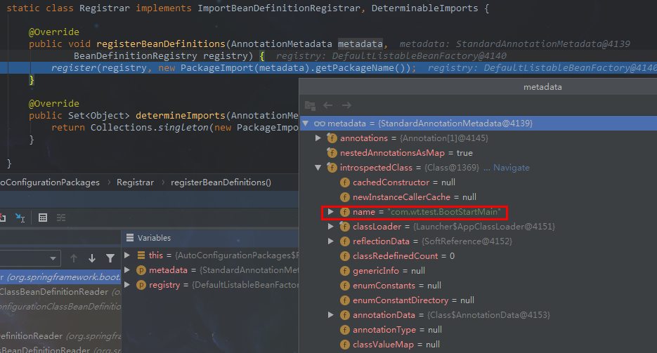
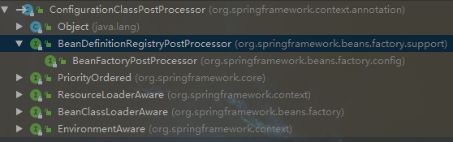
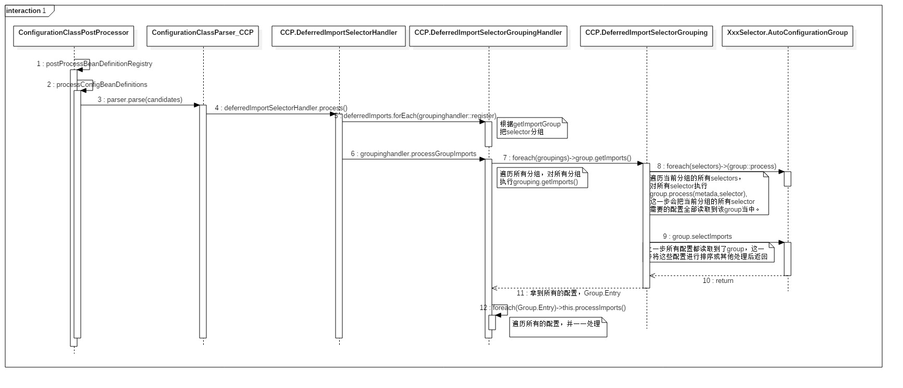

> # springboot-AutoConfiguration原理

**springboot自动配置原理，基于springboot 2.1.5.RELEASE版本**  [这里是示例工程](https://gitee.com/wt123/learn/tree/master/springboot_source_learn "示例工程"). 

闲话不说，先来看看主类。

```java
@SpringBootApplication
public class BootStartMain {
    public static void main(String[] args) {
        SpringApplication app = new SpringApplication(BootStartMain.class);
        app.setBanner(new ResourceBanner(new ClassPathResource("banner.txt")));
		app.run(args);
	}
}
```

上一篇[springboot的启动流程](https://my.oschina.net/wtkid/blog/3079375 "springboot的启动流程")分析了run方法的逻辑，阐述了springboot的启动流程，最后在load资源的时候，主类以bean的形式被注册到了bean当中，而在之前部分我们也提到了在本部分会用到的ConfigurationClassPostProcessor这个家伙，不熟悉的就回过头再去看看吧。

既然注册成了bean，那bean就要初始化，初始化的时候事情就发生了，所有的事件导火索就是@SpringBootApplication这个牛x的注解。

# @SpringBootApplication

```java
@Inherited
@SpringBootConfiguration
@EnableAutoConfiguration
@ComponentScan(excludeFilters = {
      @Filter(type = FilterType.CUSTOM, classes = TypeExcludeFilter.class),
      @Filter(type = FilterType.CUSTOM,
            classes = AutoConfigurationExcludeFilter.class) })
public @interface SpringBootApplication {
	...
}
```

这家伙其实是个复合注解，看到了我们想要的了吧，@EnableAutoConfiguration这家伙出现了。

# @EnableAutoConfiguration

```java
@Inherited
@AutoConfigurationPackage
@Import(AutoConfigurationImportSelector.class)
public @interface EnableAutoConfiguration {
    ...
}
```

这家伙也是个复合注解。

## @AutoConfigurationPackage

```java
@Inherited
@Import(AutoConfigurationPackages.Registrar.class)
public @interface AutoConfigurationPackage {}
```

我们来看@Import的AutoConfigurationPackages.Registrar这个东西到底注册了个啥子。

```java
public void registerBeanDefinitions(AnnotationMetadata metadata,
      BeanDefinitionRegistry registry) {
   register(registry, new PackageImport(metadata).getPackageName());
}
```



metadata其实就包含了我们的主类信息。

我们看看PackageImport的构造方法，初始化了packageName，也就是我们主类所在的包名。

```java
PackageImport(AnnotationMetadata metadata) {
	this.packageName = ClassUtils.getPackageName(metadata.getClassName());
}
```

我们继续进register方法看。

```java
public static void register(BeanDefinitionRegistry registry, String... packageNames) {
	//检查是否已经注册了org.springframework.boot.autoconfigure.AutoConfigurationPackages
	if (registry.containsBeanDefinition(BEAN)) {
		//如果已经注册了，就直接获取
		BeanDefinition beanDefinition = registry.getBeanDefinition(BEAN);
		ConstructorArgumentValues constructorArguments = beanDefinition
				.getConstructorArgumentValues();
		//把新的packageName加进去
		constructorArguments.addIndexedArgumentValue(0,
				addBasePackages(constructorArguments, packageNames));
	}
	else {
		//如果没有注册，就重新注册一个
		GenericBeanDefinition beanDefinition = new GenericBeanDefinition();
		//设置bean类型
		beanDefinition.setBeanClass(BasePackages.class);
		//添加packageNames
		beanDefinition.getConstructorArgumentValues().addIndexedArgumentValue(0,
				packageNames);
		beanDefinition.setRole(BeanDefinition.ROLE_INFRASTRUCTURE);
		//注册bean
		registry.registerBeanDefinition(BEAN, beanDefinition);
	}
}
```

逻辑很清晰，如果没有注册指定的bean，那么就新注册一个，把packageName加进去；如果已经有了指定的bean，那么就直接把packageName加进去。**这就是为什么我们的主类不用加@CompomnentScan也能扫描我们的bean了，扫描的只是主类package以及其子package**。

扫描部分就不做过多解释了。

## ConfigurationClassPostProcessor

介绍AutoConfigurationImportSelector之前我先来初略介绍一下ConfigurationClassPostProcessor这个东西。



可以看到这个家伙实现了BeanDefinitionRegistryPostProcessor，这东西在哪里调用的我就不解释了哈。我们直接来看核心方法。

```java
// BeanDefinitionRegistryPostProcessor.java
public void postProcessBeanDefinitionRegistry(BeanDefinitionRegistry registry) {
   //...
   processConfigBeanDefinitions(registry);
}

public void processConfigBeanDefinitions(BeanDefinitionRegistry registry){
    // 由于代码过多，就不贴了，只介绍我们需要的部分
    ConfigurationClassParser parser = new ConfigurationClassParser(...);
    parser.parse(candidates);
    //...
}
```

继续看parser.parse()方法.

```java
public void parse(Set<BeanDefinitionHolder> configCandidates) {
   for (BeanDefinitionHolder holder : configCandidates) {
      BeanDefinition bd = holder.getBeanDefinition();
      try {
         if (bd instanceof AnnotatedBeanDefinition) {
             //这个地方会把初始化deferredImportSelectorHandler，即把所有的selector都放到这个家伙当中
             //逻辑很深，下面会说在哪里
            parse(((AnnotatedBeanDefinition) bd).getMetadata(), holder.getBeanName());
         }
       //...
   }
   this.deferredImportSelectorHandler.process();
}
```

上图parse方法的逻辑很深，我们的我们的selector加入deferredImportSelectorHandler这个家伙的逻辑是在这个地方，parse->processConfigurationClass->doProcessConfigurationClass->processImports,然后在这个方法中的this.deferredImportSelectorHandler.handle()方法。

> ImportSelectorHandler的处理

我们的selector加入之后，就要处理selector了，来看this.deferredImportSelectorHandler.process();的process方法。

```java
// ConfigurationClassParser.DeferredImportSelectorHandler.java
public void process() {
    //赋值DeferredImportSelectorHandler持有的所有selectors
   List<DeferredImportSelectorHolder> deferredImports = this.deferredImportSelectors;
   this.deferredImportSelectors = null;
   try {
      if (deferredImports != null) {
         DeferredImportSelectorGroupingHandler handler = new DeferredImportSelectorGroupingHandler();
         deferredImports.sort(DEFERRED_IMPORT_COMPARATOR);
          //对deferredImports的每一个对象，都调用handler的register方法，即注册到handler当中
         deferredImports.forEach(handler::register);
          //祖册到handler当中之后，执行handler的processGroupImports方法
         handler.processGroupImports();
      }
   }
   finally {
       //初始化deferredImportSelectors
      this.deferredImportSelectors = new ArrayList<>();
   }
}
```

> > register

调用handler的register的时候，会涉及到一个group的东西，主要作用就是将不同的selector分组存放。来看一下这个方法吧。

```java
// ConfigurationClassParser.DeferredImportSelectorGroupingHandler.java
public void register(DeferredImportSelectorHolder deferredImport) {
    //这个地方的getImportGroup就是调用我们的importSelector来获取一个所属的组
   Class<? extends Group> group = deferredImport.getImportSelector()
         .getImportGroup();
    //放到map当中
   DeferredImportSelectorGrouping grouping = this.groupings.computeIfAbsent(
         (group != null ? group : deferredImport),
         key -> new DeferredImportSelectorGrouping(createGroup(group)));
   grouping.add(deferredImport);
   this.configurationClasses.put(deferredImport.getConfigurationClass().getMetadata(),
         deferredImport.getConfigurationClass());
}
```

来看一下我们的AutoConfigurationImportSelector所属的组。

```java
// AutoConfigurationImportSelector.java
public Class<? extends Group> getImportGroup() {
	return AutoConfigurationGroup.class;
}
```

> > handler.processGroupImports

继续来看handler.processGroupImports.

```java
// ConfigurationClassParser.DeferredImportSelectorGroupingHandler.java
public void processGroupImports() {
    //遍历所有的组
   for (DeferredImportSelectorGrouping grouping : this.groupings.values()) {
       //注意这个荫蔽的方法getImports()
      grouping.getImports().forEach(entry -> {
         ConfigurationClass configurationClass = this.configurationClasses.get(
               entry.getMetadata());
         try {
             //方法里头会注册相应的bean
            processImports(configurationClass, asSourceClass(configurationClass),
                  asSourceClasses(entry.getImportClassName()), false);
         }
         //...
      });
   }
}
```

继续来看看getImports。

```java
// DeferredImportSelectorGrouping.java
public Iterable<Group.Entry> getImports() {
    //遍历组里面的所有DeferredImportSelectorHolder
   for (DeferredImportSelectorHolder deferredImport : this.deferredImports) {
       //执行process方法，这个group就是我们的selector所属的AutoConfigurationGroup组
      this.group.process(deferredImport.getConfigurationClass().getMetadata(),
            deferredImport.getImportSelector());
   }
    //返回获取到的bean，这个方法会接下来的在selector讲
   return this.group.selectImports();
}
```

ConfigurationClassPostProcessor的分析暂时就到这里，我们讨论的部分，大体上就是处理bean的注解，然后处理Selectors，当然selectors里面获取到的bean肯定也是有注解的bean，然后通过这个类去注册，处理。

至于这最后出现的this.group.process()和this.group.selectImports()这两个方法我们留在Selector中去分析。主要是这俩方法都是他们所属的组当中的。

里面逻辑有点长，这里来一个sequence图，大家看一下.。



## AutoConfigurationImportSelector

@EnableAutoConfiguration注解上除了上面说到的@AutoConfigurationPackage之外，还有一个@Import，我们来看哈这个import又引入了什么东西。

先来初略看哈这个类。

```java
public class AutoConfigurationImportSelector implements ...{
    //这个方法在老版本中会使用这个方法去获取所有配置，但是在我使用的版本中，这个方法没有使用
    //而是使用的内部类AutoConfigurationGroup的selectImports方法
	public String[] selectImports(){...}
    //重要方法，获取了所有自动配置的类
    protected AutoConfigurationEntry getAutoConfigurationEntry(){...}
    //返回所属的组
    public Class<? extends Group> getImportGroup() {
		return AutoConfigurationGroup.class;
	}
    private static class AutoConfigurationGroup implements ...{
        //新版本使用的这个方法来获取的配置
        public String[] selectImports(){...}
        //重要方法
        public void process(){...}
    }
    
    //对获取到的配置的一些封装
    protected static class AutoConfigurationEntry {
        ...
    }
}
```

我们在分析ConfigurationImportSelector的最后。在getImports方法后就没有继续分析了，这个方法里头出现this.group.process()和this.group.selectImports()两个方法，这两个方法在这里进行分析。

> 注意：这里分析的process()和selectImports()是group的哦！不是Selector的！所以我们要打开我们的AutoConfigurationImportSelector，然后找到它所属的group，也就是AutoConfigurationGroup。然后再来看这俩方法。

### process()

```java
// AutoConfigurationImportSelector.utoConfigurationGroup.java
public void process(AnnotationMetadata annotationMetadata,
      DeferredImportSelector deferredImportSelector) {
   //...
    //获取所有的自动配置类
   AutoConfigurationEntry autoConfigurationEntry = ((AutoConfigurationImportSelector) deferredImportSelector)
         .getAutoConfigurationEntry(getAutoConfigurationMetadata(),
               annotationMetadata);
    //添加到当前group的集合当中，因为一个group会有很多个selector，这里用个结合，在外层每一个selector被调用该方法的时候，都可以将结果放到这个结合当中，最终调用selectImports()处理的时候就可以直接用这个集合了
   this.autoConfigurationEntries.add(autoConfigurationEntry);
   for (String importClassName : autoConfigurationEntry.getConfigurations()) {
      this.entries.putIfAbsent(importClassName, annotationMetadata);
   }
}
```

来看一下重点的方法，getAutoConfigurationEntry(),这个方法就是我们的Selector的了，看它被强转成了AutoConfigurationImportSelector，来看看吧。

```java
// AutoConfigurationImportSelector.java
protected AutoConfigurationEntry getAutoConfigurationEntry(AutoConfigurationMetadata autoConfigurationMetadata, AnnotationMetadata annotationMetadata) {
	//检查是否开启自动配置功能
	if (!isEnabled(annotationMetadata)) {
		return EMPTY_ENTRY;
	}
	//获取注解的属性值，exclude,excludeName
	AnnotationAttributes attributes = getAttributes(annotationMetadata);
	//获取所有的自动配置类
	List<String> configurations = getCandidateConfigurations(annotationMetadata,
			attributes);
	//去重，当前版本其实就是换了个集合，使用了LinkedHashList
	configurations = removeDuplicates(configurations);
	//把不需要自动配置的(exclude的)放到集合
	Set<String> exclusions = getExclusions(annotationMetadata, attributes);
	//检查不需要自动配置的class
	checkExcludedClasses(configurations, exclusions);
	//移除掉不需要的自动配置或者不存在的自动配置
	configurations.removeAll(exclusions);
	//过滤，这个地方也会用到spring.factories哦
	configurations = filter(configurations, autoConfigurationMetadata);
	//发送通知，这个地方获取监听自动配置的Listener，也会用到spring.factories哦
	fireAutoConfigurationImportEvents(configurations, exclusions);
	//封装并返回
	return new AutoConfigurationEntry(configurations, exclusions);
}

protected boolean isEnabled(AnnotationMetadata metadata) {
	if (getClass() == AutoConfigurationImportSelector.class) {
        //获取自动配置是否开启，默认未配置，返回true，也就是说默认就是开启的
        //ENABLED_OVERRIDE_PROPERTY = "spring.boot.enableautoconfiguration"
		return getEnvironment().getProperty(
				EnableAutoConfiguration.ENABLED_OVERRIDE_PROPERTY, Boolean.class,
				true);
	}
	return true;
}

protected List<String> getCandidateConfigurations(AnnotationMetadata metadata,
		AnnotationAttributes attributes) {
	List<String> configurations = SpringFactoriesLoader.loadFactoryNames(
			getSpringFactoriesLoaderFactoryClass(), getBeanClassLoader());
	//... 日志
	return configurations;
}
```

基本上很简单，就不多解释了，只解释下核心方法getCandidateConfigurations

##### Selector.getCandidateConfigurations

从上面的getCandidateConfigurations这个方法可以看到，这个方法直接调用了SpringFactoriesLoader.loadFactoryNames，很熟悉吧，来看看吧。

```java
// SpringFactoriesLoader.java
public static List<String> loadFactoryNames(Class<?> factoryClass, @Nullable ClassLoader classLoader) {
	String factoryClassName = factoryClass.getName();
	return loadSpringFactories(classLoader).getOrDefault(factoryClassName, Collections.emptyList());
}

private static Map<String, List<String>> loadSpringFactories(@Nullable ClassLoader classLoader) {
   MultiValueMap<String, String> result = cache.get(classLoader);
   if (result != null) {
      return result;
   }

   try {
       //读取classpath配置文件
      Enumeration<URL> urls = (classLoader != null ?
            classLoader.getResources(FACTORIES_RESOURCE_LOCATION) :
            ClassLoader.getSystemResources(FACTORIES_RESOURCE_LOCATION));
      result = new LinkedMultiValueMap<>();
      while (urls.hasMoreElements()) {
         URL url = urls.nextElement();
         UrlResource resource = new UrlResource(url);
         Properties properties = PropertiesLoaderUtils.loadProperties(resource);
         for (Map.Entry<?, ?> entry : properties.entrySet()) {
            String factoryClassName = ((String) entry.getKey()).trim();
            for (String factoryName : StringUtils.commaDelimitedListToStringArray((String) entry.getValue())) {
               result.add(factoryClassName, factoryName.trim());
            }
         }
      }
      cache.put(classLoader, result);
      return result;
   }
   //...
}
```

这个方法就不解释了吧，很熟悉吧！启动流程里头说过哦，就是那个META-INF/spring.factories哦！贴个代码回顾一下，接下来的就不解释了哈。这个地方拿到了所有的AutoConfiguration配置类。来嘛，贴个图给你看哈。

```properties
# META-INF/spring.factories
# Auto Configure
org.springframework.boot.autoconfigure.EnableAutoConfiguration=\
org.springframework.boot.autoconfigure.admin.SpringApplicationAdminJmxAutoConfiguration,\
org.springframework.boot.autoconfigure.aop.AopAutoConfiguration,\
org.springframework.boot.autoconfigure.amqp.RabbitAutoConfiguration,\
org.springframework.boot.autoconfigure.batch.BatchAutoConfiguration,\
org.springframework.boot.autoconfigure.cache.CacheAutoConfiguration,\
...还有很多
```

### selectImports()

```java
public Iterable<Entry> selectImports() {
   if (this.autoConfigurationEntries.isEmpty()) {
      return Collections.emptyList();
   }
   //调用AutoConfigurationEntry的getExclusions转成集合
   Set<String> allExclusions = this.autoConfigurationEntries.stream()
         .map(AutoConfigurationEntry::getExclusions)
         .flatMap(Collection::stream).collect(Collectors.toSet());
   //调用AutoConfigurationEntry的getConfigurations转成集合
   Set<String> processedConfigurations = this.autoConfigurationEntries.stream()
         .map(AutoConfigurationEntry::getConfigurations)
         .flatMap(Collection::stream)
         .collect(Collectors.toCollection(LinkedHashSet::new));
   //移除掉不需要自动配置的
   processedConfigurations.removeAll(allExclusions);
   //排序并返回
   return sortAutoConfigurations(processedConfigurations,
         getAutoConfigurationMetadata())
         .stream()
         .map((importClassName) -> new Entry(
               this.entries.get(importClassName), importClassName))
         .collect(Collectors.toList());
}
```

这个方法就比较简单了，无非就是将当前组里面的所有Entry进行处理，排除掉不需要自动配置的，然后封装一下，调用一下排队的方法sortAutoConfigurations，最后返回结果。

还记得在介绍ConfigurationClassPostProcessor的最后有一个方法吧，来看看，回忆一下。

```java

grouping.getImports().forEach(entry -> {
    ConfigurationClass configurationClass = this.configurationClasses.get(
        entry.getMetadata());
    try {
        //方法里头会注册相应的bean
        processImports(configurationClass, asSourceClass(configurationClass),
                  asSourceClasses(entry.getImportClassName()), false);
    }
}
```

最终这些自动配置的bean都会在这里processImports被注册成bean。被注册成bean之后就会被spring处理了。我们来看一个熟悉的MybatisAutoConfiguration自动配置类吧。

```java
@org.springframework.context.annotation.Configuration
@ConditionalOnClass({ SqlSessionFactory.class, SqlSessionFactoryBean.class })
@ConditionalOnSingleCandidate(DataSource.class)
@EnableConfigurationProperties(MybatisProperties.class)
@AutoConfigureAfter(DataSourceAutoConfiguration.class)
public class MybatisAutoConfiguration implements InitializingBean {
    @Bean
    public Xxx getXxx(){...}
    //其他就不写了，自己去看类吧，都是些配置
}
```

看到了吧，这个bean其实就是个配置bean，就跟我们自己写@Configuration的配置一样，只不过springboot把这些都给我们写好了，我们只需要加个依赖，这些配置就全部进来了，于是就有了这些配置，我们只需要再配置上一些数据库啊参数啊啥的就能启用相应的功能了。

这些都是springboot-starter的功劳哦！懂了autoConfiguration，离starter就只差个demo了哦，哈哈~爽吧。


over ~~~