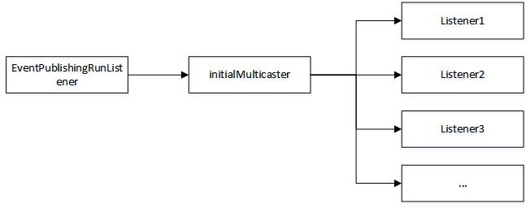
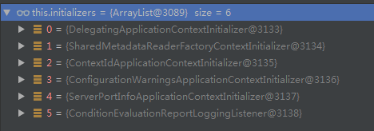

> # Springboot 启动流程

**基于springboot 2.1.5.RELEASE版本**

# spring和springboot

springboot实际上是spring的升级版，从一定程度上简化了我们的配置。

先来看看spring吧:

1.  xml配置繁琐;
2.  mvc需要自己配置web.xml;
3.  mvc需要自己提供容器(比如tomcat);

springboot就不一样了:

1.  可以无xml配置文件（基本上用boot的都不会主动去写xml了，当然也支持xml）;
2.  不需要自己写web.xml;
3.  内部已经集成了容器;
4.  main方法启动，方便快捷； 

当然，springboot也有缺点，就是有点重，因为所有东西都集成起来了，所以应用打包回比较大，但是，重要的是可以接受就行了。当然，优缺点并不止这么多，只是列举几个来表述一下boot，也顺便介绍一下boot的功能。

这里假定你已经会使用boot了。废话不多说，直接来看run方法。

# run

springboot的启动方法就一个，所有流程都在里头。

```java
// SpringApplication.java
public ConfigurableApplicationContext run(String... args) {
	//启动监视器
	StopWatch stopWatch = new StopWatch();
	stopWatch.start();
	ConfigurableApplicationContext context = null;
	Collection<SpringBootExceptionReporter> exceptionReporters = new ArrayList<>();
	//设置Headless模式，就是设置一个系统属性值
	configureHeadlessProperty();
	//获取listenners
	SpringApplicationRunListeners listeners = getRunListeners(args);
	//应用启动通知
	listeners.starting();
	try {
		//启动参数封装
		ApplicationArguments applicationArguments = new DefaultApplicationArguments(
				args);
		//初始化环境
		ConfigurableEnvironment environment = prepareEnvironment(listeners,
				applicationArguments);
		//配置忽略的beaninfo，也是设置一个系统属性
		configureIgnoreBeanInfo(environment);
		//启动时打印的banner
		Banner printedBanner = printBanner(environment);
		//创建ApplicationContext
		context = createApplicationContext();
		//获取所有的SpringBootExceptionReporter
		exceptionReporters = getSpringFactoriesInstances(
				SpringBootExceptionReporter.class,
				new Class[] { ConfigurableApplicationContext.class }, context);
		//准备applicationContext
		prepareContext(context, environment, listeners, applicationArguments,
				printedBanner);
		//刷新上下文
		refreshContext(context);
		//启动完毕之后调用，留给子类实现
		afterRefresh(context, applicationArguments);
		stopWatch.stop();
		if (this.logStartupInfo) {
			new StartupInfoLogger(this.mainApplicationClass)
					.logStarted(getApplicationLog(), stopWatch);
		}
		//应用启动完毕通知
		listeners.started(context);
		//启动所有的ApplicationRunner和CommandLineRunner
		callRunners(context, applicationArguments);
	}
	catch (Throwable ex) {
		handleRunFailure(context, ex, exceptionReporters, listeners);
		throw new IllegalStateException(ex);
	}
	try {
		//应用正在运行通知
		listeners.running(context);
	}
	catch (Throwable ex) {
		handleRunFailure(context, ex, exceptionReporters, null);
		throw new IllegalStateException(ex);
	}
	return context;
}
```

看注释就大概了解了大致的启动流程，接下来重点介绍其中的一些方法。这个run方法中没有介绍的部分都很简单，都只有极少的代码量，就自己去看了。

## getSpringFactoriesInstances

这个方法会经常被使用，这里先来介绍一下这个重点方法。

```java
// SpringApplication.java
private <T> Collection<T> getSpringFactoriesInstances(Class<T> type,
		Class<?>[] parameterTypes, Object... args) {
	ClassLoader classLoader = getClassLoader();
	// 获得所有的需要加载的类名
	Set<String> names = new LinkedHashSet<>(
			SpringFactoriesLoader.loadFactoryNames(type, classLoader));
	// 实例化所有的类
	List<T> instances = createSpringFactoriesInstances(type, parameterTypes,
			classLoader, args, names);
	//排序并返回
	AnnotationAwareOrderComparator.sort(instances);
	return instances;
}
```

可以看到这个方法逻辑很清晰，先获取到所有需要加载的类，然后实例化，最后排好序返回。这些需要加载的类是从哪里来的呢？哪些类有需要加载呢？来看一下它的方法。

```java
// SpringFactoriesLoader.java
public static final String FACTORIES_RESOURCE_LOCATION = "META-INF/spring.factories";

public static List<String> loadFactoryNames(Class<?> factoryClass, @Nullable ClassLoader classLoader) {
	String factoryClassName = factoryClass.getName();
    //根据类名返回所有类列表
	return loadSpringFactories(classLoader).getOrDefault(factoryClassName, Collections.emptyList());
}

private static Map<String, List<String>> loadSpringFactories(@Nullable ClassLoader classLoader) {
	MultiValueMap<String, String> result = cache.get(classLoader);
	if (result != null) {
		return result;
	}

	try {
		//加载指定路径下的资源spring.factories
		Enumeration<URL> urls = (classLoader != null ?
				classLoader.getResources(FACTORIES_RESOURCE_LOCATION) :
				ClassLoader.getSystemResources(FACTORIES_RESOURCE_LOCATION));
		result = new LinkedMultiValueMap<>();
		while (urls.hasMoreElements()) {
			URL url = urls.nextElement();
			UrlResource resource = new UrlResource(url);
            //读取资源
			Properties properties = PropertiesLoaderUtils.loadProperties(resource);
			//封装成map
            for (Map.Entry<?, ?> entry : properties.entrySet()) {
				String factoryClassName = ((String) entry.getKey()).trim();
				for (String factoryName : StringUtils.commaDelimitedListToStringArray((String) entry.getValue())) {
					result.add(factoryClassName, factoryName.trim());
				}
			}
		}
		cache.put(classLoader, result);
		return result;
	}
	catch (IOException ex) {
		throw new IllegalArgumentException("Unable to load factories from location [" +
				FACTORIES_RESOURCE_LOCATION + "]", ex);
	}
}
```

从以上方法，我们只看到了应用去读取了指定位置的配置文件，然后将内容转成map，然后在通过指定的type的类名，来从map中获取指定的结果。来看一下这个配置文件你就明白了。在spring-boot-2.1.5.RELEASE.jar中META-INF/spring.factories。

```properties
# 内容很长，只取一截
# Run Listeners
org.springframework.boot.SpringApplicationRunListener=\
org.springframework.boot.context.event.EventPublishingRunListener

# Application Listeners
org.springframework.context.ApplicationListener=\
org.springframework.boot.ClearCachesApplicationListener,\
org.springframework.boot.builder.ParentContextCloserApplicationListener,\
org.springframework.boot.context.FileEncodingApplicationListener,\
org.springframework.boot.context.config.AnsiOutputApplicationListener,\
org.springframework.boot.context.config.ConfigFileApplicationListener,\
org.springframework.boot.context.config.DelegatingApplicationListener,\
org.springframework.boot.context.logging.ClasspathLoggingApplicationListener,\
...
```

看了这个文件，应该就很明白咋回事了吧。根据一个指定的类型type，通过type的名字(key)来获取一个包含相应类的集合。

## getRunListeners

取得所有的RunListeners。**这个RunListenrer是跟普通的Listener不一样的哦！！！这个是SpringApplicationRunListener的子类，而我们通常自行添加的Listener都是ApplicationListener哦。**

```java
private SpringApplicationRunListeners getRunListeners(String[] args) {
	Class<?>[] types = new Class<?>[] { SpringApplication.class, String[].class };
	return new SpringApplicationRunListeners(logger, getSpringFactoriesInstances(
			SpringApplicationRunListener.class, types, this, args));
}
```

看到getSpringFactoriesInstances这个方法，明白了吧，我们得去spring.factories中找key是SpringApplicationRunListener类名的家伙。

```properties
# Run Listeners
org.springframework.boot.SpringApplicationRunListener=\
org.springframework.boot.context.event.EventPublishingRunListener
```

从配置中可以看到对应的是一个EventPublishingRunListener，这个看过spring的朋友知道，这其实就是一个用来广播的分发器，他本身也是一个Listener，但是他主要目的是注册其他的listener，然后有事件来的时候，找到合适的listener，发送广播。换句话说，这货就是其他的listener的管理者，所有事件都需要通过他去分发给listener。

画个图理解一下（当然EventPublishingRunListener可能不止一个，万一有我们自定义的呢，对吧）：



### EventPublishingRunListener的创建

由于是通过反射创建的，我们直接来看一下这货的构造方法。

```java
public EventPublishingRunListener(SpringApplication application, String[] args) {
 	//这个application不用解释吧
	this.application = application;
	this.args = args;
    //默认使用SimpleApplicationEventMulticaster广播器
	this.initialMulticaster = new SimpleApplicationEventMulticaster();
    //获取所有的listeners，并加到分发器当中
	for (ApplicationListener<?> listener : application.getListeners()) {
		this.initialMulticaster.addApplicationListener(listener);
	}
}
```

从上面的代码可以看到了吧，application的所有listener全部都由initialMulticaster管理，然后initialMulticaster又由EventPublishingRunListener来持有。

listener的添加直接调用SpringApplication的addListener方法或者添加@Component注解让其成为bean就可以了，Listener的初始化是在SpringApplication当中，这个就不贴代码了，这里介绍一下两个比较重要的Listener。

```
ConfigFileApplicationListener: 这货负责配置文件的读取;
LoggingApplicationListener: 这货负责日志系统的初始化；
```

**SpringApplication提供了很多类似的方法，像ContextInitializer这种也可以直接通过add方法来进行添加。具体的可以自行去查阅api**。

当然我们也可以定义自己的SpringApplicationRunListener，在META-INF/spring.factories配置文件中配置就行了。这样我们就可以根据不同的listener类型，来加到我们特定的SpringApplicationRunListener当中去分发。当然，可以是可以，但是没必要，因为我们可以直接注册Listener啊，对吧，我们注册的ApplciationListener不是会由EventPublishingRunListener持有的initialMulticaster来分发请求么？为什么非要去整个这货呢？直接使用SpringApplication.addListener就可以注册了，多方便。

## prepareEnvironment

```java
private ConfigurableEnvironment prepareEnvironment(
		SpringApplicationRunListeners listeners,
		ApplicationArguments applicationArguments) {
	//创建环境environment
	ConfigurableEnvironment environment = getOrCreateEnvironment();
	//配置environment
	configureEnvironment(environment, applicationArguments.getSourceArgs());
	//发送通知
	listeners.environmentPrepared(environment);
	//绑定environment
	bindToSpringApplication(environment);
	if (!this.isCustomEnvironment) {
		environment = new EnvironmentConverter(getClassLoader())
				.convertEnvironmentIfNecessary(environment, deduceEnvironmentClass());
	}
	ConfigurationPropertySources.attach(environment);
	return environment;
}
```

这个方法中首先创建了一个enviroment。我们来看看这个方法。

### getOrCreateEnvironment

```java
private ConfigurableEnvironment getOrCreateEnvironment() {
	if (this.environment != null) {
		return this.environment;
	}
    //根据webApplicationType实例化一个Environment
	switch (this.webApplicationType) {
		case SERVLET:
			return new StandardServletEnvironment();
		case REACTIVE:
			return new StandardReactiveWebEnvironment();
		default:
			return new StandardEnvironment();
	}
}
```

创建Enviroment的时候出现了一个webApplicationType，这个家伙在new SpringApplication()的时候就会自动设置，可以去看SpringApplication的构造方法。

### configureEnvironment

Environment创建完成之后开始配置这个Environment。配置这个Environment主要就是设置一些active的profiles。

```java
protected void configureEnvironment(ConfigurableEnvironment environment,
		String[] args) {
	if (this.addConversionService) {
		ConversionService conversionService = ApplicationConversionService
				.getSharedInstance();
		environment.setConversionService(
				(ConfigurableConversionService) conversionService);
	}
    //配置默认的属性
	configurePropertySources(environment, args);
	//配置启用的配置文件
	configureProfiles(environment, args);
}
```

其中configurePropertySources()方法配置默认的属性包括SpringApplication的defaultProperties属性，还有命令行参数的properties。

configureProfiles()方法添加的配置文件是SpringApplication的属性additionalProfiles，和environment的属性activeProfiles，由于我们在上个方法就设置了一些属性，这个activeProfiles就是是从目前已经设置的所有属性值当中查找key为spring.profiles.active的值。**我们properties或者yml文件中的spring.profiles.active这个key在这里暂时还不会生效，因为这个配置文件我们还没有开始读取，到目前为止所有的properties都是通过其他方式设置的，并不是通过读取配置文件设置的。**

### listeners.environmentPrepared

**配置文件的读取是由ConfigFileApplicationListener来完成的**

这里解释一下，不贴代码了。

我们配置文件中的spring.profiles.active这个是在这一步实现的，由ConfigFileApplicationListener负责读取默认的配置文件，读取完之后，就会读取由spring.profiles.active属性的值指定的配置文件，并将添加到environment的activeProfiles属性当中，这个就不多说了。

## createApplicationContext

```java
public static final String DEFAULT_SERVLET_WEB_CONTEXT_CLASS = "org.springframework.boot."
			+ "web.servlet.context.AnnotationConfigServletWebServerApplicationContext";
protected ConfigurableApplicationContext createApplicationContext() {
	Class<?> contextClass = this.applicationContextClass;
	if (contextClass == null) {
		try {
			//创建Environment的时候用过这货，现在创建ApplicationContext，这货又来了
			switch (this.webApplicationType) {
				case SERVLET:
					contextClass = Class.forName(DEFAULT_SERVLET_WEB_CONTEXT_CLASS);
					break;
				case REACTIVE:
					contextClass = Class.forName(DEFAULT_REACTIVE_WEB_CONTEXT_CLASS);
					break;
				default:
					contextClass = Class.forName(DEFAULT_CONTEXT_CLASS);
			}
		}
		//...
	}
	return (ConfigurableApplicationContext) BeanUtils.instantiateClass(contextClass);
}
```

这个方法很简单吧，创建了一个叫做AnnotationConfigServletWebServerApplicationContext的东西，这就是我们用到的applicationContext了。

来看一下这货的构造方法。

```java
public AnnotationConfigServletWebServerApplicationContext() {
	this.reader = new AnnotatedBeanDefinitionReader(this);
	this.scanner = new ClassPathBeanDefinitionScanner(this);
}
```

### 添加一些必要的BeanPostProcessor等配置

看AnnotatedBeanDefinitionReader这货，最终回调用到如下构造方法。

```java
public AnnotatedBeanDefinitionReader(BeanDefinitionRegistry registry, Environment environment) {
   Assert.notNull(registry, "BeanDefinitionRegistry must not be null");
   Assert.notNull(environment, "Environment must not be null");
   this.registry = registry;
   this.conditionEvaluator = new ConditionEvaluator(registry, environment, null);
   AnnotationConfigUtils.registerAnnotationConfigProcessors(this.registry);
}
```

我们来看看registerAnnotationConfigProcessors。registerAnnotationConfigProcessors(this.registory)最终会调用到如下方法。

```java
// AnnotationConfigUtils.java
public static Set<BeanDefinitionHolder> registerAnnotationConfigProcessors(
		BeanDefinitionRegistry registry, @Nullable Object source) {

	//...
	Set<BeanDefinitionHolder> beanDefs = new LinkedHashSet<>(8);

	if (!registry.containsBeanDefinition(CONFIGURATION_ANNOTATION_PROCESSOR_BEAN_NAME)) {
        //注册ConfigurationClassPostProcessor，这货会解析bean的@import等注解，看名字可以看出来，Configuration嘛，当然会处理一些Configuration的bean咯。
		RootBeanDefinition def = new RootBeanDefinition(ConfigurationClassPostProcessor.class);
		def.setSource(source);
		beanDefs.add(registerPostProcessor(registry, def, CONFIGURATION_ANNOTATION_PROCESSOR_BEAN_NAME));
	}
	//...
	return beanDefs;
}
```

这里提一下注册了这个东西，在以后分析springboot的autoConfiguration的时候也会用到这货。springboot没有xml配置文件，所有全部都是由注解来处理的，所有这个东西对springboot很重要，他会解析所有的我们在bean当中的配置比如@Import。

## prepareContext

```java
private void prepareContext(ConfigurableApplicationContext context,
		ConfigurableEnvironment environment, SpringApplicationRunListeners listeners,
		ApplicationArguments applicationArguments, Banner printedBanner) {
	context.setEnvironment(environment);
	//初始化一些属性
	postProcessApplicationContext(context);
	//调用ContextInitializers
	applyInitializers(context);
	//通知
	listeners.contextPrepared(context);
	//日志
	if (this.logStartupInfo) {
		logStartupInfo(context.getParent() == null);
		logStartupProfileInfo(context);
	}
	//获取到beanFactory，默认的DefaultListableBeanFactory
	ConfigurableListableBeanFactory beanFactory = context.getBeanFactory();
	//注册bean
	beanFactory.registerSingleton("springApplicationArguments", applicationArguments);
	if (printedBanner != null) {
		beanFactory.registerSingleton("springBootBanner", printedBanner);
	}
	if (beanFactory instanceof DefaultListableBeanFactory) {
		((DefaultListableBeanFactory) beanFactory)
				.setAllowBeanDefinitionOverriding(this.allowBeanDefinitionOverriding);
	}
	// 获取所有的资源，其实就是SprintApplication的primarySource属性和source属性
	Set<Object> sources = getAllSources();
	Assert.notEmpty(sources, "Sources must not be empty");
	//加载sources，这里的加载其实就是根据不同的source类型，向容器中注册bean
	load(context, sources.toArray(new Object[0]));
	listeners.contextLoaded(context);
}
```

流程很清晰，首先初始化context的属性；然后调用contextInitializer；获取beanFactory；load必要的source，包括主类。接下来物品们一步一步分析。

### postProcessApplicationContext

```java
protected void postProcessApplicationContext(ConfigurableApplicationContext context) {
	if (this.beanNameGenerator != null) {
		context.getBeanFactory().registerSingleton(
				AnnotationConfigUtils.CONFIGURATION_BEAN_NAME_GENERATOR,
				this.beanNameGenerator);
	}
	if (this.resourceLoader != null) {
		if (context instanceof GenericApplicationContext) {
			((GenericApplicationContext) context)
					.setResourceLoader(this.resourceLoader);
		}
		if (context instanceof DefaultResourceLoader) {
			((DefaultResourceLoader) context)
					.setClassLoader(this.resourceLoader.getClassLoader());
		}
	}
	if (this.addConversionService) {
		context.getBeanFactory().setConversionService(
				ApplicationConversionService.getSharedInstance());
	}
}
```

这个方法就是看看我们有没有自定义的一些属性，比如beanNameGenerator，resourceLoader，如果有，就设置成我们自定义的。这些属性我们都可以直接在SpringApplication中设置，很方便吧。

### applyInitializers

这个部分调用ContextInitializer。

```java
protected void applyInitializers(ConfigurableApplicationContext context) {
   for (ApplicationContextInitializer initializer : getInitializers()) {
      Class<?> requiredType = GenericTypeResolver.resolveTypeArgument(
            initializer.getClass(), ApplicationContextInitializer.class);
      Assert.isInstanceOf(requiredType, context, "Unable to call initializer.");
      initializer.initialize(context);
   }
}
```

首先getInitializers()方法返回的是SpringApplication的属性initializers，这个属性的初始化是在构造函数当中。

```java
public SpringApplication(ResourceLoader resourceLoader, Class<?>... primarySources) {
	this.resourceLoader = resourceLoader;
	Assert.notNull(primarySources, "PrimarySources must not be null");
	this.primarySources = new LinkedHashSet<>(Arrays.asList(primarySources));
	this.webApplicationType = WebApplicationType.deduceFromClasspath();
	setInitializers((Collection) getSpringFactoriesInstances(
			ApplicationContextInitializer.class));
	setListeners((Collection) getSpringFactoriesInstances(ApplicationListener.class));
	this.mainApplicationClass = deduceMainApplicationClass();
}
```

看到getSpringFactoriesInstances这个东西，我就不解释了吧。

我们来看一下都有哪些。



我们来看第一个DelegatingApplicationContextInitializer。

DelegatingApplicationContextInitializer这货跟之前的EventPublishingRunListener是很类似的，我们首先来回顾一下，EventPublishingRunListener管理了一个initialMulticaster，而我们其他的Listener是由initialMulticaster这货持有的，忘记了就回过头去看看“getRunLinsteners”这节吧。

接下来我们再来看看眼下这货，这货本身也是一个ContestInitializer，但是他主要的目的是去找我们配置文件中的ContestInitializer来执行，这样就不用我们一个一个ContestInitializer的去注册了。

```java
// DelegatingApplicationContextInitializer.java
public void initialize(ConfigurableApplicationContext context) {
	ConfigurableEnvironment environment = context.getEnvironment();
    //获取initializerClasses
	List<Class<?>> initializerClasses = getInitializerClasses(environment);
	if (!initializerClasses.isEmpty()) {
		applyInitializerClasses(context, initializerClasses);
	}
}

private static final String PROPERTY_NAME = "context.initializer.classes";

private List<Class<?>> getInitializerClasses(ConfigurableEnvironment env) {
    //获取配置文件中配置的initializerClasses
	String classNames = env.getProperty(PROPERTY_NAME);
	List<Class<?>> classes = new ArrayList<>();
	if (StringUtils.hasLength(classNames)) {
		for (String className : StringUtils.tokenizeToStringArray(classNames, ",")) {
			classes.add(getInitializerClass(className));
		}
	}
	return classes;
}
```

ContextInitializer主要作用就是初始化context，在容器初始化前给Context设置一些属性，或者注册一些必要的bean，或者做一些其他的处理。比如SharedMetadataReaderFactoryContextInitializer就是注册了一个BeanFactoryPostProcessor。其他几个就不具体讲了。

### getAllSources

这部分是获取所有的资源。包括我们的主类，还有我们注册到主类的资源。

```java
public Set<Object> getAllSources() {
   Set<Object> allSources = new LinkedHashSet<>();
   //这个属性就是记录主类的
   if (!CollectionUtils.isEmpty(this.primarySources)) {
      allSources.addAll(this.primarySources);
   }
   //这个就是其他的需要加载的资源
   if (!CollectionUtils.isEmpty(this.sources)) {
      allSources.addAll(this.sources);
   }
   return Collections.unmodifiableSet(allSources);
}
```

### load所有资源

```java
protected void load(ApplicationContext context, Object[] sources) {
	//...日志
    //创建BeanDefinitionLoader
	BeanDefinitionLoader loader = createBeanDefinitionLoader(
			getBeanDefinitionRegistry(context), sources);
	if (this.beanNameGenerator != null) {
		loader.setBeanNameGenerator(this.beanNameGenerator);
	}
	if (this.resourceLoader != null) {
		loader.setResourceLoader(this.resourceLoader);
	}
	if (this.environment != null) {
		loader.setEnvironment(this.environment);
	}
    //load资源
	loader.load();
}
```

我们来看最后的loader.load()方法。

```java
// BeanDefinitionLoader.java
public int load() {
	int count = 0;
    //遍历所有资源，并load
	for (Object source : this.sources) {
		count += load(source);
	}
	return count;
}

private int load(Object source) {
	Assert.notNull(source, "Source must not be null");
    //如果资源类型是Class
	if (source instanceof Class<?>) {
		return load((Class<?>) source);
	}
    //如果资源是Resource类型
	if (source instanceof Resource) {
		return load((Resource) source);
	}
    //如果资源是package类型
	if (source instanceof Package) {
		return load((Package) source);
	}
    //如果资源是CharSequence类型
	if (source instanceof CharSequence) {
		return load((CharSequence) source);
	}
    //其他类型不支持，抛出异常
	throw new IllegalArgumentException("Invalid source type " + source.getClass());
}
```

从上面代码中可以看到，资源的load很简单，无非就是遍历所有的资源，然后根据资源类型的不同，使用不同的加载方式。我们的主类是Class类型，就是之前提到的primarySource，此时，我们先看Class类型的加载。

```java
private int load(Class<?> source) {
	if (isGroovyPresent()
			&& GroovyBeanDefinitionSource.class.isAssignableFrom(source)) {
		GroovyBeanDefinitionSource loader = BeanUtils.instantiateClass(source,
				GroovyBeanDefinitionSource.class);
		load(loader);
	}
    //判断石佛士组件Component，其实就是检查一下是否有@Comnponent注解
	if (isComponent(source)) {
        //把当前资源注册成bean
		this.annotatedReader.register(source);
		return 1;
	}
	return 0;
}
```

很简单吧，判断主类是否是组件，如果是就注册bean，不是就不处理，上一个逻辑就略过了。

这时候我们再来看如果是resource类型的资源的load。

```java
private int load(Resource source) {
   if (source.getFilename().endsWith(".groovy")) {
      if (this.groovyReader == null) {
         throw new BeanDefinitionStoreException(
               "Cannot load Groovy beans without Groovy on classpath");
      }
      return this.groovyReader.loadBeanDefinitions(source);
   }
    //直接读取资源文件，注册成bean
   return this.xmlReader.loadBeanDefinitions(source);
}
```

Resource的处理也很简单，直接读取，然后注册成bean就行了。剩下的就不解释了，package的话也能够想象了吧，直接扫描包，然后注册bean，对吧。

## refreshContext

这个部分就回到了Spring的扩展部分初始化，这个方法没有其他任何逻辑，最终目的只是去调用AbstractApplicationContext的refresh()，这哥refresh这里就不再做分析了。在[spring扩展启动流程-refresh](https://my.oschina.net/wtkid/blog/3071447) 中已经分析过了。

## callRunners

这坨就更easy了，找到所有的Runner，然后全部启动就ok了。

```java
private void callRunners(ApplicationContext context, ApplicationArguments args) {
	List<Object> runners = new ArrayList<>();
	//找到所有的ApplicationRunner
	runners.addAll(context.getBeansOfType(ApplicationRunner.class).values());
	//找到所有CommandLineRunner
	runners.addAll(context.getBeansOfType(CommandLineRunner.class).values());
	//排好队
	AnnotationAwareOrderComparator.sort(runners);
	//启动所有的Runner
	for (Object runner : new LinkedHashSet<>(runners)) {
		if (runner instanceof ApplicationRunner) {
			callRunner((ApplicationRunner) runner, args);
		}
		if (runner instanceof CommandLineRunner) {
			callRunner((CommandLineRunner) runner, args);
		}
	}
}

private void callRunner(ApplicationRunner runner, ApplicationArguments args) {
	try {
		(runner).run(args);
	}
	catch (Exception ex) {
		throw new IllegalStateException("Failed to execute ApplicationRunner", ex);
	}
}

private void callRunner(CommandLineRunner runner, ApplicationArguments args) {
	try {
		(runner).run(args.getSourceArgs());
	}
	catch (Exception ex) {
		throw new IllegalStateException("Failed to execute CommandLineRunner", ex);
	}
}
```


over ~~~