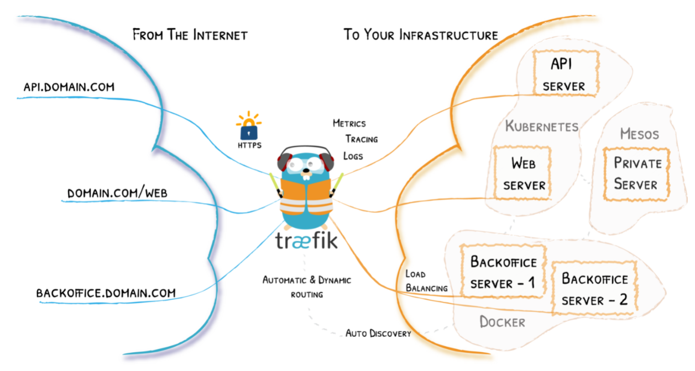

> # Traefik

## Helm

k8s的包管理工具，helm于k8s，就如同yum之于Linux.

这里是[官方文档](https://helm.sh/zh/docs/intro/using_helm/)

### 概念

***Chart*** : 代表着 Helm 包。它包含在 Kubernetes 集群内部运行应用程序，工具或服务所需的所有资源定义。你可以把它看作是 Apt dpkg或 Yum RPM 在Kubernetes 中的等价物。

***Repository(仓库)***:  是用来存放和共享 charts 的地方。它就像 yum 的 软件包仓库，只不过它是供 Kubernetes 包所使用的仓库。

***Release*** : 是运行在 Kubernetes 集群中的 chart 的实例。一个 chart 通常可以在同一个集群中安装多次。每一次安装都会创建一个新的 *release*。以 MySQL chart为例，如果你想在你的集群中运行两个数据库，你可以安装该chart两次。每一个数据库都会拥有它自己的 *release* 和 *release name*。

在了解了上述这些概念以后，我们就可以这样来解释 Helm：

Helm 安装 *charts* 到 Kubernetes 集群中，每次安装都会创建一个新的 *release*。你可以在 Helm 的 chart *repositories* 中寻找新的 chart。

```
1. 直接下载二进制的执行文件
2. chmod +x 
3. 放到可执行目录/usr/bin
4. helm version
```

## Traefik

先贴上[官方文档](https://doc.traefik.io/traefik/getting-started/install-traefik/)

官方安装步骤

```shell
## 给helm添加traefik仓库
$ helm repo add traefik https://helm.traefik.io/traefik
## 更新charts
$ helm repo update
## 创建专属命名空间
$ kubectl create ns traefik-v2
## 安装到专属的命名空间traefik-v2
$ helm install --namespace=traefik-v2 traefik traefik/traefik
## 卸载
$ helm uninstall --namespace=traefik-v2 traefik
```

### 安装示例

```shell
## 已经安装了repo了，直接搜索下traefik的chart
[root@master1 ~]# helm search repo traefik
NAME           	CHART VERSION	APP VERSION	DESCRIPTION
traefik/traefik	10.6.0       	2.5.3      	A Traefik based Kubernetes ingress controller
[root@master1 ~]#
[root@master1 ~]# helm install --namespace=traefik-v2 traefik traefik/traefik
NAME: traefik
LAST DEPLOYED: Wed Nov  3 12:33:40 2021
NAMESPACE: traefik-v2
STATUS: deployed
REVISION: 1
TEST SUITE: None
## 查看相关的信息
[root@master1 ~]# kubectl get po -n traefik-v2
NAME                       READY   STATUS    RESTARTS   AGE
traefik-5577895f66-xcw2c   1/1     Running   0          4h37m
[root@master1 ~]# kubectl get svc -n traefik-v2
NAME      TYPE           CLUSTER-IP      EXTERNAL-IP   PORT(S)                      AGE
traefik   LoadBalancer   10.102.207.62   <pending>     80:30146/TCP,443:30702/TCP   4h37m
[root@master1 ~]# kubectl get endpoints -n traefik-v2
NAME      ENDPOINTS                                 AGE
traefik   100.109.35.225:8000,100.109.35.225:8443   4h37
[root@master1 ~]# kubectl get ingressroute -n traefik-v2
NAME                AGE
traefik-dashboard   4h38m
[root@master1 ~]# 
```

好了，我们可以发现多了一个traefik的Pod，实际上就这玩意儿是核心。调用链路外部通过某种方式打到traefik的service，这个service打到这个Pod上，然后这个Pod根据所有的ingressroute规则打到对应的服务上去。

逻辑如下图所示：



我们这个时候并不能从外部通过这个LoadBalancer的服务访问到，官网通过port-forward暴露了9000端口，但是不能从外网访问，我这里直接加一个NodePort的service，我们来看看这个dashboard。我们先给traefik这个pod打个标签。

```
$ kubectl label po traefik-5577895f66-xcw2c k8s-app=traefik
```

`traefik-nodeport-svc.yaml`这个service里面我只暴露了80，8000和9000端口，可以参考他原本的那个service。

9000端口是dashboard的，8000是web服务的，也就是说我们之后部署的Pod服务，要走ingressroute，我们需要把请求打到这个traefick的pod的8000端口上，然后再走ingressroute规则，到我们的服务。

```yaml
apiVersion: v1
kind: Service
metadata:
  labels:
    k8s-app: traefik
  name: traefik-nodeport
  namespace: traefik-v2
spec:
  type: NodePort
  ports:
  - nodePort: 30001
    name: xxx
    port: 80
    targetPort: 80
  - nodePort: 30002
    name: dashboard
    port: 9000
    targetPort: 9000
  - nodePort: 30003              ## 暴露的宿主机的端口
    name: web                    ## 取个名字
    port: 8000                   ## service集群的端口
    targetPort: 8000             ## 背后pod的端口
  selector:
    k8s-app: traefik
```

>  apply查看结果

```shell
[root@master1 traefik]# kubectl apply -f traefic-nodeport-svc.yaml -n traefik-v2
[root@master1 traefik]# kubectl get svc -n traefik-v2
NAME               TYPE           CLUSTER-IP     ...   PORT(S)                      
traefik            LoadBalancer   10.111.182.143 ...   80:32689/TCP,443:31431/TCP    
traefik-nodeport   NodePort       10.100.112.8   ...   80:30001/TCP,9000:30002/TCP,8000:30003/TCP
[root@master1 traefik]#
```

可以看到我们的NodePort服务已经生效，访问`http://192.168.2.14:30002/dashboard/`页面查看，NodePort暴露出去的，IP直接就是宿主机的IP.


## 第一个应用

目的: 通过`www.abc.com`这域名，走ingressroute规则，从外网访问我们的服务。贴流程图,


看了这个流程图再去看官网的图，就感觉清晰多了。中间蓝色的部分，其实全部发生在traefik这个pod当中。

开始创建，先把我们的应用和service都准备好。对，你没有看错，依然是我们最喜欢的kubia这个nodejs的测试pod。

`kubia-deploy.yaml`

```yaml
apiVersion: apps/v1
kind: Deployment
metadata:
  name: kubia-app
  namespace: kubia
spec:
  replicas: 1
  selector:
    matchLabels:
      app: kubia-app
  template:
    metadata:
      name: kubia-app
      labels:
        app: kubia-app
    spec:
      containers:
      - name: kubia
        image: kubia:v1
        imagePullPolicy: Never
        ports:
        - containerPort: 8080

---
apiVersion: v1
kind: Service
metadata:
  name: kubia-app-svc
  namespace: kubia
spec:
  ports:
  - port: 80
    targetPort: 8080
  selector:
    app: kubia-app
```

apply创建好之后，先检查service是否正常的。

```shell
[root@master1 traefik]# kubectl get svc -n kubia
NAME             TYPE        CLUSTER-IP      EXTERNAL-IP   PORT(S)        AGE
kubia-app-svc    ClusterIP   10.103.90.147   <none>        80/TCP         2d22h
[root@master1 traefik]# curl 10.103.90.147
v1 version, You've hit kubia-app-6bbc77495f-dwrjt
[root@master1 traefik]#
```

### 创建ingressroute

`www.abc.com.yaml`

```yaml
apiVersion: traefik.containo.us/v1alpha1
kind: IngressRoute
metadata:
  name: www.abc.com
spec:
  routes:
    - kind: Rule
      match: Host(`www.abc.com`) && (PathPrefix(`/`) || PathPrefix(`/test`))
      services:
        - name: kubia-app-svc
          namespace: kubia
          port: 80
```

`traefik.containo.us/v1alpha1`这个apiVersion在helm正常安装traefik之后就会有。

ingressroute为了好记，我直接用域名作为name。

`spec.routes`是个列表，上面配置表示域名`www.abc.com`，并且路劲是`/`或者`/test`开头的，直接打到命名空间为kubia的`kubia-app-svc`这个service上，service的端口为80.

### apply页面检查

这个ingressroute要和service在同一个命名空间哦

```shell
$ kubectl apply -f www.abc.com.yaml -n kubia
```

**目前不考虑可以在其他空间的情情况**，比如我们直接把这个ingressroute放到default命名空间下，和app的service不在同一个命名空间，会无法访问，我们查看traefik的pod的日志，你会看到如下信息:

```
level=error msg="service kubia/kubia-app-svc not in the parent resource namespace default" ingress=www.abc.com namespace=traefik-v2
## 告诉你在服务kubia-app-svc不在命名空间default下面
```

> 验证

```shell
[root@master1 traefik]# kubectl get ingressroute -n kubia
NAME          AGE
www.abc.com   25m
[root@master1 traefik]#
```

8000端口对应宿主机的30003端口，我们ingressroute规则的于明师`www.abc.com`,我们需要加一个host，直接打到我们的宿主机`192.168.2.14`。来吧，截图留念。


我们在dashboard的service面板中可以看到我们配置的ingressroute规则了。


好了，本次demo就到这儿吧。

over~~

