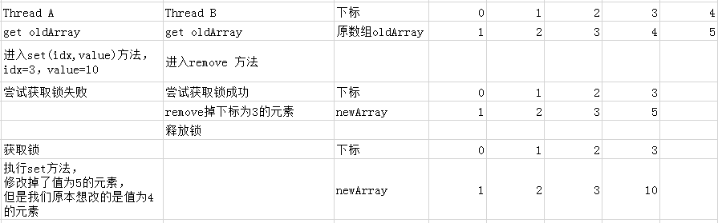
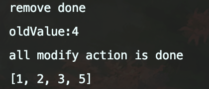
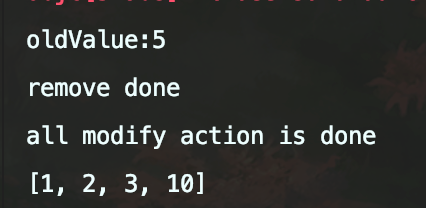

> # CopyOnWriteArrayList问题

```
本篇记录了一个CopyOnWriteArrayList会出现的导致数据错误的问题，
这个问题是在阅读某本书的时候的一种猜想，但是通过验证之后发现问题是存在的。
原本我是以为jdk既然上了，是肯定不会存在这个问题的，但是并没有，既然没有，那么我们就要规避这个问题了。
```

## 问题描述

当多个线程同时对一个CopyOnWriteArraylist对象进行写操作的时候，会引起数据被写乱的情况。

## 核心方法

看CopyOnWriteArrayList类的方法，不要看它内部类的。

```java
public E set(int index, E element) {
	final ReentrantLock lock = this.lock;
	lock.lock();//(1)
	try {
        //获取最新的数组
		Object[] elements = getArray();
		E oldValue = get(elements, index);

		if (oldValue != element) {
            //如果设置的目标元素和旧元素不同，则覆盖掉
			int len = elements.length;
			Object[] newElements = Arrays.copyOf(elements, len);
			newElements[index] = element;
			setArray(newElements);
		} else {
			//如果元素相同，则为了volitale语义，重新设置一下
			setArray(elements);
		}
		return oldValue;
	} finally {
		lock.unlock();
	}
}

public E remove(int index) {
	final ReentrantLock lock = this.lock;
	lock.lock();//(2)
	try {
        //获取最新的数组
		Object[] elements = getArray();
		int len = elements.length;
        //获取index位置的元素
		E oldValue = get(elements, index);
		int numMoved = len - index - 1;
        //移除掉index处的元素
		if (numMoved == 0)
			setArray(Arrays.copyOf(elements, len - 1));
		else {
			Object[] newElements = new Object[len - 1];
			System.arraycopy(elements, 0, newElements, 0, index);
			System.arraycopy(elements, index + 1, newElements, index,
					numMoved);
			setArray(newElements);
		}
		return oldValue;
	} finally {
		lock.unlock();
	}
}
```

## 猜想分析

我们来看上面的两个方法，操作的都是索引。那么我们试想一种情况，有两个线程，线程A执行set方法，线程B执行remove方法，并且线程A执行到方法中的第一行，线程B执行到了方法中的第二行。

```
final ReentrantLock lock = this.lock;
locl.lock();
```

这个时候线程B首先获得锁，线程A继续执行，将阻塞在第二行，等到线程B执行完Remove并且释放锁之后，才能继续执行，但是这个时候，由于CopyOnWriteArrayList的内部array是volitale的，所以线程B对其的修改线程A是立即可见的。

由于我们使用的index索引，后续的线程A的set操作将会改掉我们并不想改的元素，因为我们remove操作完成之后，我们的索引所对应的元素可能就已经不是我们想删除的了。

看个图吧，这个流程看起来更能明白一些。



## 猜想验证

验证代码

```java
public static void main(String[] args) {
	List<Integer> rawList = Lists.newCopyOnWriteArrayList();
	rawList.add(1);
	rawList.add(2);
	rawList.add(3);
	rawList.add(4);
	rawList.add(5);
	final CyclicBarrier barrier = new CyclicBarrier(2);
	MultiModifyJob task1 = new MultiModifyJob(rawList, barrier, 1);
	MultiModifyJob task2 = new MultiModifyJob(rawList, barrier, 2);
	ExecutorService executorService = Executors.newFixedThreadPool(2);
	executorService.submit(task1);
	executorService.submit(task2);

	try {
		Thread.sleep(2000);
	} catch (InterruptedException e) {
		e.printStackTrace();
	}
	executorService.shutdown();
	while (!executorService.isTerminated()) {
		try {
			Thread.sleep(10);
		} catch (InterruptedException e) {
			e.printStackTrace();
		}
	}
	System.out.println("all modify action is done");
	System.out.println(rawList);
}

static class MultiModifyJob implements Runnable {
	private final List<Integer> rawList;
	private final CyclicBarrier barrier;
	private final int type;

	public MultiModifyJob(List<Integer> rawList, CyclicBarrier barrier, int type) {
		this.rawList = rawList;
		this.barrier = barrier;
		this.type = type;
	}

	public void run() {
		try {
			this.barrier.await();
			if (this.type == 1) {
				this.rawList.remove(3);
				System.out.println("remove done");
			} else if (this.type == 2) {
				Integer oldValue = this.rawList.set(3, 10);
				System.out.println("oldValue:" + oldValue);
			}
		} catch (InterruptedException e) {
			e.printStackTrace();
		} catch (BrokenBarrierException e) {
			e.printStackTrace();
		}
	}
}
```

代码很简单，很容易看懂，使用一个栅栏来使两个线程同时进入run方法，一个执行set，一个执行remove。

这个代码会有两种不同的结果，一种是先修改再删除，结果是

```
[1,2,3,5]
```

另一种就是我们分析的情况，先删除再set，结果是

```
[1,2,3,10]
```

贴上结果图片：





## 结果

通过问题的分析，我们可以知道这种情况会造成乱的数据。但是实际操作中可能我们很少使用这种index的方式去操作，但是这毕竟是一个问题。

**那为什么当初我会认为JDK已经解决了这个问题呢**？简单描述一下吧。

首先多写的时候时加了锁的，这种情况按照正常思路来讲，应该是解决了的；而且换个角度来讲，如果这个问题需要我们自己来解决的话，我们也可能选择加锁来解决，这样我们的锁就需要有更大的粒度，需要在获取index之前就加，如果是这样的话，JDK方法中的lock不就没用了吗？所有在这种情况下，我理所当然的认为了jdk的锁是解决了这个问题的。

既然问题存在，那我们就规避它吧。Good Luck!


over~~~