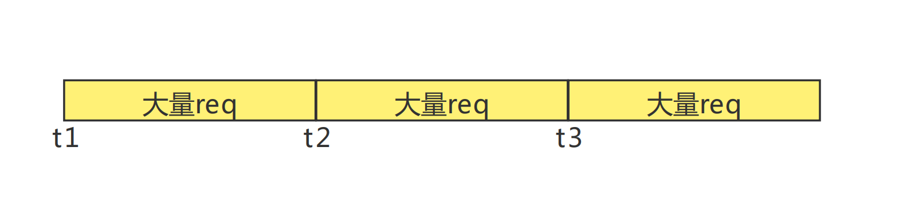
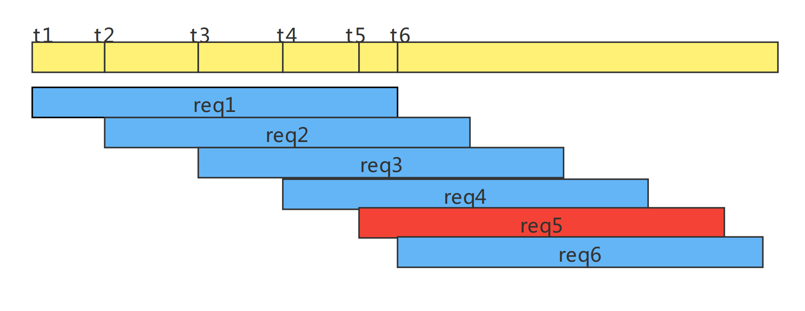

## 关于限流和限频的思考(45033)

这是一场45033的战役，我其实一开始也想从网上找点相关的资料来解决这个问题，但是无奈，大部分都不对劲，因为都走远了。。。无奈之下，只有自己解决这个问题了，也留个记录。

在企微对接如此频繁的今天，希望这篇文章能够帮到你。

### 45033

限流其实大家都能够理解，但是限频大家的理解可能就不太一样了。在我的经历当中，很多朋友都把限频理解为了限流，真正去实现限频的时候也是按照限流的方式去实现，最后发现根本没有达到想要的效果。我们平时几乎接触不到限频的东西，唯一一个大家可能都接触过的应该是微信接口的45033，我这里将解释什么是限频，和限流的区别，并解决限频，解决这个45033的问题。

归齐原因，其实很简单，大家可以去网上找各种限频的资料，博客等，你会发现关于这方面的知识太少了，而且很多的博客都将限流和限频混为一谈。当然我并不是说网上说的没有道理，我承认，限流在某种情况下，能够解决掉限频的问题，但是这种特殊问题的解决会让你根深蒂固的以为限流就是限频，且并没有真正解决掉你的问题。你的问题只是在这种方式下被规避了！！！

多的不说了，我来跟大家举个例子。我也拿企微接口来举例吧，好理解。

```
企微接口的限流策略：单个企微每分钟1万次请求(api文档中有)
企微限频45033: 单个企微打标签接口同一时刻下并发请求不能超过5个
```

以上两个是企微官方的限频和限流规则。很多人看到这个地方就懵了，第一个限流大家都看得懂，第二个是啥意思？如果你把限频和限流认为是一样的，诸如网上大多数博客一样，你会发现，这第二个你完全无法按照限流的方式去理解，第一个有时间，大家都能理解1分钟限流1万次；第二个的同一时刻，就懵了。所以有人会索性这样去思考：那我就按照1秒吧(毕竟行业中大家说熟知的qps单位也是秒)，然后就会按照这种方式去限流，最后写出的逻辑就是每秒钟限流5个，每分钟1万个。最终的结果当然是解决问题了，这种就是我上面说的利用特殊情况去解决限频的问题。但是问题真的解决了吗？程序确实再也不会有45033的限频错误了。

当然，这个问题实际上是没有解决的。如果按照这种思路去解决，细心的朋友已经发现了，每分钟打的请求数最多60*5=300个。如果这样的话，那第一条限流有什么用呢？这不是互相矛盾了吗？为何不直接写每秒5个请求，而是写同一时刻并发不超过5个呢？

回头仔细想想，这两个策略确实不一样。虽然按照限流的的理解，以特殊的方式，解决了这个问题，但是请求量打不上去。

我先给出限流和限频的解释。

### 限流

限流大家都能理解，就是限制单位时间内，请求的量不能超过某个值。

从下面的简图大概解释一下，在单位时间(t1到t2，或者t2到t3)内，对请求req的限制是有上限的。



## 限频

限频指的是在同一时刻内，并发请求数不能超过某个值。



解释一下，上图中黄色为时间轴，蓝色和红色是请求，限频是4。

可以看到在t1，t2，t3，t4，t5，t6这6个时刻都有请求打入。在t4到t6这个时间段内，服务器正在处理这个请求的并发量已经有req1到req4这4个了。因为限频是4，那么在t4到t6这个时间段内的**任何一个时刻**，都不允许有任何请求打进来。

t5时刻: req5请求被限频拒绝了，因为**这个时刻**，并发数量已经达到了4

t6时刻: req6正常执行，因为这个时刻req1已经处理完成，正在进行中的请求只有req2到req4,这三个，没有达到限频上限。

> 在t4到t6这个时间段内的**任何一个时刻**，任何一个请求都会被拒绝，这就是所谓的**同一时刻**。

好了理解了限流和限频的区别之后，我们来解决45033这个问题。

## 解决45033

首先，要解决问题，作为一个标准小猿，我们对待问题必须要先猜想，再论证，再实现这个步骤去处理。当然，我解决限频这个问题也是按照这个思路去解决的。

要处理45033我们就必须要知道限频是怎么玩儿得，什么叫同一时刻？这个时候就需要发挥我们的思维了。

### 猜想

首先，我们来理解一下这段话“单个企微同一时刻并发数不能超过5个”。如果你是企业微信的开发者，你会怎么去实现限频，防止某个企微账号的并发数量超过限制，注意，是并发数量，不是请求数量。这个并发数的限制是不是不像限流那么好理解，好处理呢？

其实不然。我们换个思路，如果当前请求还没有处理完，又来了一个请求，那这两个请求是不是同时都在处理中，那么这个时刻是不是就有2个请求正在处理，那么**这个时刻**这个接口的并发量是不是2，所以按照这个猜想，假定限频在企微端也是这样玩儿得。

我们先以猜想来拟一下这个代码的最简逻辑。(corpId表示企微账号)

```java
public Object tag(String corpId) {
	try {
        // 请求来了，标记当前请求正在处理中
        int cnt = redis.incr("tag:" + corpId);
        if (cnt > 5) {
            // 如果当前时刻corpId对这个接口的请求，正在并行处理的已经超过了5个，抛出45033异常
            throw new Exception("45033")
        }
        // do sth
    } finally {
        // 请求处理完成，释放
        redis.decr("tag:" + corpId)
    }
}
```

好了，看了这个猜想，你是不是已经理解到了限频的意思了？那企微那边是不是也是相同的思路来处理这个逻辑的呢？这个时候我们就需要论证了。

### 限频论证

论证代码直接看**Redis实现限频**目录，

***已经用代码论证了这个猜想，且此代码已在生产环境长期运行无故障***!!!

通过论证后发现，此种猜想是正确的，企微侧可能不是按照以上猜想的逻辑来处理的限频，但是可以确保我们在理解上是没有问题的。

### 实现

实现代码也在**Redis实现限频**目录，和**测试代码**目录。

## Redis实现限频

要实现对外访问的限频(防止访问企微接口时超过限频，报45033错误)。

我们用redis的zset来实现这个逻辑。

### 为什么要用zset

按照我们之前限频的代码理解来看，我们要实现对外的访问限制，其实也不是可以按以下方式很简单的实现吗？比如

```java
public void requestWxworkTag(String corpId) {
    try {
        int cnt = redis.incr("tag:" + corpId);
        if (cnt > 5) {
            throw new Exception("超限了");
        }
        // 对企微接口发起调用
        requestWxworkApi();
    } finally {
        redis.decr("tag:" + corpId);
    }
}
```

咋一看貌似没有问题，理想状态下这个代码会运行的很好，但是你会发现时间一长，这个程序终究会有一些问题，让你难以发觉。

**我们不能在理想状态下编程，我们必须假定网络是不可靠的，服务器也是不可靠的，Pod会挂掉**。

好了，我们再来看一下这个逻辑，如果我们使用简单的自增，那么如果代码在执行到redis在key自增完成之后挂掉了，这个时候连finally里面的代码都还没有执行，那么这种情况在Pod多次挂掉之后，redis中key的值已经超过5了，这个时候你就会发现你已经不能再向企微发起任何请求了，因为if那个判断都过不去。

既然自增的方式不能用，那我们可以考虑使用队列，其实队列也会有相同的问题，而且队列还无界!

所以我们需要解决这个问题，需要在Pod挂掉的时候，我们能够释放调那个空间(key减一)，让请求能够正常进入。那在Pod挂掉之后，这个空间没有被释放，新Pod也没法再去释放这个空间了(因为新起的Pod不知道需要去释放这个空间)。**所以我们需要采用超时自动释放来解决这个问题**。

这就是为什么要使用zset这个数据结构的原因。

### 使用zset实现的原理和逻辑

我们知道zset是根据score来进行升序排列的，所以我们把score设置为当前时间戳，用来判定这个空间是否已经过期，如果过期了就可以正常使用。利用zset的集合元素个数来对请求做频率限制。

很多朋友这个时候有疑问了，zset集合是无上限的，怎么做频率限制？那这个时候就需要我们的Lua脚本出场了。逻辑都在注释中了，就不解释了。

### Lua

```lua
-- ARGV[1]=score，当前时间戳秒数
-- ARGV[2] 元素的值
-- ARGV[3] 过期时间，秒数
-- ARGV[4] 限流上线，其实也是限制zset的元素个数

-- 取zset中的首元素和分值,分值其实就是时间戳秒数
local zElems=redis.call('zrange',KEYS[1],0,0,'withscores')
-- zElems[元素，分值(元素写入的时间)],下标从1开始
-- 判断元素时间是否过期(当前时间-元素时间>过期时间)
if (zElems[2] and ARGV[1]-zElems[2]-ARGV[3]>0)
then
    -- 如果元素过期，直接删除过期元素
    local success=redis.call('zrem',KEYS[1],zElems[1])
    -- 删除成功，添加新元素
    if (success==1)
    then
        local ret=redis.call('zadd',KEYS[1],ARGV[1],ARGV[2])
        return ret
    end
end
-- 如果zset中没有元素，或者第一个元素都没有过期，就判断上限
local cnt=redis.call('zcard',KEYS[1])
if (cnt-ARGV[4]<0)
then
    -- 如果未达到上限，就添加新元素
    local r=redis.call('zadd',KEYS[1],ARGV[1],ARGV[2])
    return r
end
return 0
```

## 测试代码

> `LimitFrequencyUtil`

```java
package com.dustess.colainit.gatewayimpl;

import org.springframework.data.redis.core.StringRedisTemplate;
import org.springframework.data.redis.core.script.RedisScript;
import org.springframework.stereotype.Component;

import javax.annotation.Resource;
import java.util.Collections;

/**
 * @author wangtao
 * @date 2021/12/30 14:09
 * @email 386427665@qq.com
 **/
@Component
public class LimitFrequencyUtil {

    private final static String LIMIT_FREQUENCY_LUA = "local zElems=redis.call('zrange',KEYS[1],0,0,'withscores')\n" +
            "if (zElems[2] and ARGV[1]-zElems[2]-ARGV[3]>0)\n" +
            "then\n" +
            "    local success=redis.call('zrem',KEYS[1],zElems[1])\n" +
            "    if (success==1)\n" +
            "    then\n" +
            "        local ret=redis.call('zadd',KEYS[1],ARGV[1],ARGV[2])\n" +
            "        return ret\n" +
            "    end\n" +
            "end\n" +
            "local cnt=redis.call('zcard',KEYS[1])\n" +
            "if (cnt-ARGV[4]<0)\n" +
            "then\n" +
            "    local r=redis.call('zadd',KEYS[1],ARGV[1],ARGV[2])\n" +
            "    return r\n" +
            "end\n" +
            "return 0";

    private final static RedisScript<Long> SCRIPT = RedisScript.of(LIMIT_FREQUENCY_LUA, Long.class);

    @Resource
    private StringRedisTemplate stringRedisTemplate;

    /**
     * zset做频率限制，限制同一时刻并发数
     *
     * @param key          zset的key
     * @param elemValue    元素
     * @param expireSecond 元素过期时间(lua脚本会根据这个时间判断这个元素是否过期)，如果执行线程挂掉时，没有释放掉这个元素，那么元素会在过期时间后被释放
     * @param limit        限制zset的元素个数(限频最大进入数)
     * @return
     */
    public boolean limit(String key, String elemValue, int expireSecond, int limit) {
        // score必须用当前时间戳秒数，用来后续计算元素过期时间
        long score = System.currentTimeMillis() / 1000;
        // 脚本中所有参数类型必须一致，eleValue是String类型的，int和long类型需要转成字符串处理
        Long ret = stringRedisTemplate.execute(SCRIPT, Collections.singletonList(key), score + "", elemValue, expireSecond + "", limit + "");
        return ret != null && ret == 1;
    }

    /**
     * 移除zset中的某个元素
     *
     * @param key       zset的key
     * @param elemValue zset的元素
     * @return
     */
    public boolean remove(String key, String elemValue) {
        Long ret = stringRedisTemplate.opsForZSet().remove(key, elemValue);
        return ret != null && ret == 1;
    }
}
```

> `TestController`

```java
package com.dustess.colainit.controller;

import com.dustess.colainit.gatewayimpl.LimitFrequencyUtil;
import org.springframework.web.bind.annotation.GetMapping;
import org.springframework.web.bind.annotation.RestController;

import javax.annotation.Resource;
import java.util.UUID;
import java.util.function.Supplier;

/**
 * @author wangtao
 * @date 2021/12/30 14:09
 * @email 386427665@qq.com
 **/
@RestController
public class TestController {

    @Resource
    private LimitFrequencyUtil limitFrequencyUtil;

    /**
     * 测试
     *
     * @return
     */
    @GetMapping(value = "/test")
    public String listATAMetrics() throws InterruptedException {
        for (int i =0; i< 100; i++) {
            Thread.sleep(1000);
            long score = System.currentTimeMillis()/1000;
            boolean ret = limitFrequencyUtil.limit("pp", "t"+System.currentTimeMillis(),20, 5);
            System.out.println("当前时间：" + score+"， 进入成功："+ret);
        }
        return "";
    }

    /**
     * 常规通用方法
     *
     * @param supplier 限频访问的方法返回调用
     * @param <T>
     * @return
     */
    public <T> T limitEntry(Supplier<T> supplier) {
        String key = "/abc/path";
        // elemValue用uuid,保证只有当前线程才能删除zset中的这条数据，除非线程死掉，过期删除
        String elemValue = UUID.randomUUID().toString();
        try{
            while(!limitFrequencyUtil.limit(key, elemValue, 2, 5)){
                // 更新score的值，睡眠50ms后重试
                Thread.sleep(100);
            }
            // 进入成功时执行调用，返回结果
            return supplier.get();
        } catch (InterruptedException e) {
            e.printStackTrace();
        } finally {
            // finally保证当前请求完成后，一定清楚zset中的elemvalue，给其他等待线程腾出进入的空间
            limitFrequencyUtil.remove(key, elemValue);
        }
        return null;
    }
}
```

## 对比

即使到了这里，我相信还是会有朋友有疑问，我用限流的方式去限频不是更简单吗，结果都是一样的解决了限频问题，用zset还要更复杂些。所以我们来比较一下这两种方式真正的区别在哪里。

上面其实提到了，采用限流的方式去限频，请求量上不去！

> 限流

如果一秒钟限制5个请求，那么一分钟就是300个。

> 限频

如果我请求一次企微接口总耗时为100ms.那么理论状态下，我每100ms都可以打5个请求，一秒钟就是50个，一分钟就是3000个.

好吧，大于10倍差距！

有朋友就会说了，那我也把我的限流改成100ms5个不就行了吗？那你能确定100ms就能真的请求回来吗?如果有网络延迟呢？如果网络良好情况下50ms就能请求一次呢？而这些都是没办法确定的。

牛皮不是吹的，你敢改成100ms,它就敢给你报45033.

> TIPS
>
> 遇到问题，思考是最重要的，就像解决这个45033，我们首先必须要进行猜想，猜想别人是怎么考虑的，然后去论证。这个步骤其实是很重要的，包括我们在现实生活中改bug，那你会经历先猜想，然后再定位确认的过程。这是一种很实用，并且不可或缺的一种态度。
>
> 但是在很多时候(我遇到过很多的leader)，你都会收到一句: "你不要跟我说猜！"。这句话其实是很憋屈的。如果我们都缺少了这个流程，话说问题需要怎么去找？其实大家都是在猜测，论证的路上，只是还没有到解决问题那一步，转换一下思路，多一点理解，多换位思考，祝大家code愉快。
>
> 无论你的leader怎么样，一定不要丢弃猜想+论证的习惯。你必须要有这个习惯，你才能对所有问题有想法，有思考，能论证，能实现，才能让整体架构向理想的方向演进！

good luck！

