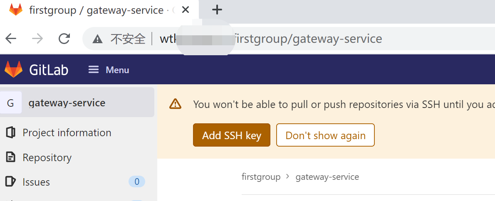
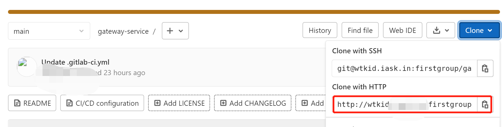
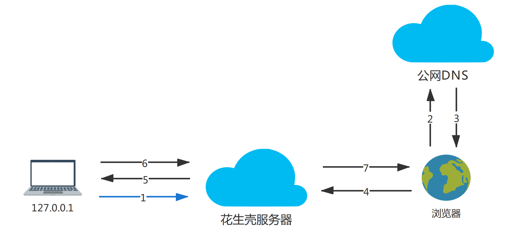

# gitlab安装

## 基于docker

```shell
$docker pull gitlab/gitlab-ce:latest
```

手写一个简单的运行脚本

```shell
export export GITLAB_HOME=/usr/local/app/gitlab
cid=$(docker ps | grep gitlab-server | awk '{print $1}')
if test ! -z $cid 
then
  echo "container is running...[$cid]"
  exit 0
fi

cid=$(docker ps -a | grep gitlab-server | awk '{print $1}')

if test ! -z $cid 
then
  echo "container already exisit, will start it.$cid"
  docker start $cid
else
  echo 'start new container...'
  docker run --detach \
  --hostname gitlab.wtkid.com \
  --publish 443:443 --publish 80:80 --publish 2222:22 \
  --name gitlab-server \
  --restart always \
  --volume /etc/localtime:/etc/localtime \
  --volume $GITLAB_HOME/config:/etc/gitlab \
  --volume $GITLAB_HOME/logs:/var/log/gitlab \
  --volume $GITLAB_HOME/data:/var/opt/gitlab \
  gitlab/gitlab-ce:latest
fi
```

脚本中`--hostname`指定了访问当前gitlab的域名，当配置成域名的时候，宿主机访问，需要配置该域名的host。

也可以直接写IP。下面在主机deepin中运行的时候，通过内网穿透映射出去的，就是直接配置的IP。

该配置对应如下配置(容器中): `/etc/gitlab/gitlab.rb`

```properties
external_url 'gitlab.wtkid.com'
```

## 主机直接运行

> 当前是在deepin上，Linux内核

### 相关版本及配置

```properties
主机: deepin 20.2.3
gitlab: gitlab-ce_14.1.3-ce.0_amd64.deb, version=debian/buster
```

### 安装依赖

```shell
## 更新源
$ sudo apt-get update
## 安装必要依赖
$ sudo apt-get  install  -y openssh-server ca-certificates
## 如果需要邮件服务需要安装postfix
$ sudo apt-get install -y postfix
```

### 下载deb包

去[gitlab仓库]( https://packages.gitlab.com/gitlab/gitlab-ce/)下载对应的安装包，最好下载社区版`-ce`，`-ee`是企业版。

由于deepin是基于debian的，我这里下载的是gitlab-ce_14.1.3-ce.0_amd64.deb, version=debian/buster

```shell
xxx@xxx-PC:~/Download$ ls
gitlab-ce_14.1.3-ce.0_amd64.deb
xxx@xxx-PC:~/Download$ 
```

### 安装

可以直接使用deepin的包管理工具安装，但是既然咱都上命令行了，那B格也要提上去，咱命令行来搞。

```shell
$ sudo dpkg -i gitlab-ce_xx.x.x-ce.x_amd64.deb
```

安装完之后配置`gitlab.rb`，就是那个`external_url`，当前机器安装后，我们后续会穿透出去，所以这个url就不像docker安装那样用域名了，直接整成IP。

```shell
## 以下是已经改好的文件, 忽略了无用输出
$ cat /etc/gitlab/gitlab.rb | grep external_url
external_url 'http://127.0.0.1'
$ 
```

修改之后执行以下命令重新配置，会比较慢，慢慢等吧，理论上不会出错。

```shell
$ sudo gitlab-ctl reconfigure
```

上述命令执行完之后，检查gitlab.

```shell
$ sudo gitlab-ctl status
```

如果失败会有如下类似输出(我没遇到过，贴一下别个的错误记录一下)：

```shell
fail: alertmanager: runsv not running
fail: gitaly: runsv not running
fail: gitlab-monitor: runsv not running
fail: gitlab-workhorse: runsv not running
fail: logrotate: runsv not running
fail: nginx: runsv not running
fail: node-exporter: runsv not running
fail: postgres-exporter: runsv not running
fail: postgresql: runsv not running
fail: prometheus: runsv not running
fail: redis: runsv not running
fail: redis-exporter: runsv not running
fail: sidekiq: runsv not running
fail: unicorn: runsv not running
```

如果有此种错误是由于`gitlab-runsvdir.service`没启，执行以下命令启动一下，并重新启动gitlab

```shell
## 启动服务
$ systemctl start gitlab-runsvdir.service
## 检查服务是否启动成功
$ systemctl status gitlab-runsvdir.service
## 启动gitlab
$ sudo gitlab-ctl start
```

## 访问gitlab

### 主界面

由于我们配置的`external_url=127.0.0.1`，我们直接在浏览器方位127.0.0.1就可以访问，默认80端口。

如果是像docker方式那样配置的域名的话，使用IP是访问不到的，gitlab有自己的nginx(可以在gitlab目录中找到)，这种情况你需要配置hosts，使域名解析到对应的IP，然后通过域名去访问。

gitlab启动很慢，如果出现`Whoops, GitLab is taking too much time to respond.`表示gitlab还在启动中，别急，等哈在访问。

### root账户

gitlab启动之后超级管理员账号为root，密码在`/etc/gitlab/initial_root_password`文件中，拿到了之后尽快修改密码，这个文件会过期。

### 注册普通账号访问

root账户整好之后，就可以在登陆界面注册普通账号使用了，注册之后记得登陆root账号取通过申请，注册的普通账号才能正常使用。

贴个图(别看地址，我这个是内网穿透，并且又提交记录了的)，本地直接使用external_url配置的127.0.0.1就可以。内网穿透后面有简单介绍。



## 项目clone路径问题

内网穿透配置成功之后，我们就可以通过外网域名访问到我们的gitlab了。



图中圈起来的部分(我这个是已经配置好了的)，如果你按我的步骤到这里了，这个地方通过内网穿透过去，这个clone的地址应该是`127.0.0.1`。这个地方需要修改配置文件`gitlab.yml`。

```properties
如果你是docker安装(容器中目录): 
主机deepin安装: /opt/gitlab/embedded/service/gitlab-rails/config/gitlab.yml
```

更改如下配置，把修改以下配置的host值为正确的地址。项目clone地址中的域名其实就是这个host的值。

```properties
  #
  # 1. GitLab app settings
  # ==========================

  ## GitLab settings
  gitlab:
    ## Web server settings (note: host is the FQDN, do not include http://)
    host: 127.0.0.1   // 这个地方确定了clone地址的域名
    port: 80
    https: false
```

修改完之后重启gitlab，不会命令的请使用Linux基操。顺便说一句，gitlab也可以通过`gitlab-ctl enable`设置开启启动。

```shell
$ gitlab-ctl restart
```

重启之后，你就会看到你的这个clone地址变成了你想要的样子。

## 内网穿透

### 安装phddns

内网穿透工具我这边用的是花生壳(phddns)，貌似花了6块钱认证的，域名不会变，挺不错的。直接下载linux的版本，下载下叫phddns.

```properties
## 以下是我下载的版本
https://down.oray.com/hsk/linux/phddns_5_1_amd64.deb
```

也是deb文件，可以直接安装管理器安装，也可以高B格安装，不演示了。

安装完之后默认是启动了的，如果没有的话手动启动一下。

```shell
## 不记得命令可以采用linux基操，输入phddns，直接回车，就可以看到指令啥的了
$ phddns start（启动）| status（状态）| stop（停止）|restart（重启）| reset（重置）|enable（开机自启动）|disable（关闭开机自启动）|version（版本）
## 添加到服务，开机启动
$ phddns enable
```

### 子账号绑定

官网有[教程](https://service.oray.com/question/11630.html)，我这里简单捋一下步骤。

1. phddns启动完之后，现在还不能用的，需要绑定到主账号上，主账号才有域名等信息。执行`phddns status`,可以看到一个SN和一个地址，这个SN就是子账号的用户名，默认密码是admin。

2. 浏览器览器访问上面的地址http://b.oray.com，输入SN码与默认登录密码admin登录。

3. 然后会出现一个二维码，扫码直接绑定到主账号上，然后主账号上建立域名映射就可以了。

4. 如果下载了手机版下载的花生壳，也可以可以直接绑定SN(我没有试过)。

### 穿透原理

说到内网穿透，加上花生壳这波奇怪的配置方式，相信很多没玩儿过linux版本phddns的朋友已经一头雾水了。我这里简提供一种变相的简单的理解方式，**仅供各位大佬粗暴的理解一下花生壳是为什么这样配置，如何生效，不代表内网穿透原理**！！！



```
作为简单理解，假定域名为domain,参照上图箭头1-7步骤:
1. 本机开启phddns(绑定主账号之后)，本机就连接到了花生壳服务器，直接设想成和花生壳服务器建立了一个长链接(domain-->127.0.0.1);
2. 外网通过浏览器访问domain, 这个域名打到公网DNS上;
3. 这个域名公网可以直接解析到花生壳服务器，返回花生壳服务器ip地址;
4. 浏览器拿着第3步获取到的ip地址直接访问到花生壳服务器;
5. 花生壳服务器通过请求头中的域名domain找到一个对应的连接(domain-->127.0.0.1),然后向其发起请求
6. 本机接收到请求后返回数据给花生壳服务器;
7. 花生壳服务器再把数据返回给浏览器
```

**再次重申！！！以上理解仅供用来理解花生壳配置用，不具有任何学习和参考的价值！！！更不代表内网穿透原理！！！**

## 庆祝一下

用上内网穿透后，当前gitlab可用过外网访问了，以后的所有操作如无特殊说明，均在普通账号上进行，包括CI/CD，runner的配置。

开心了，咱也有自己的gitlab了~~~
