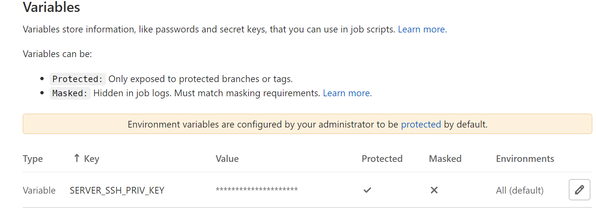
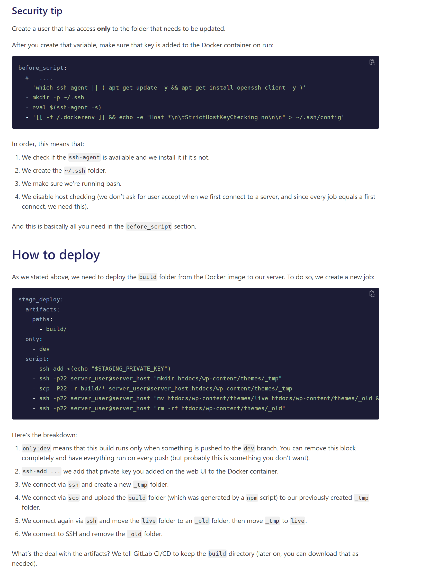
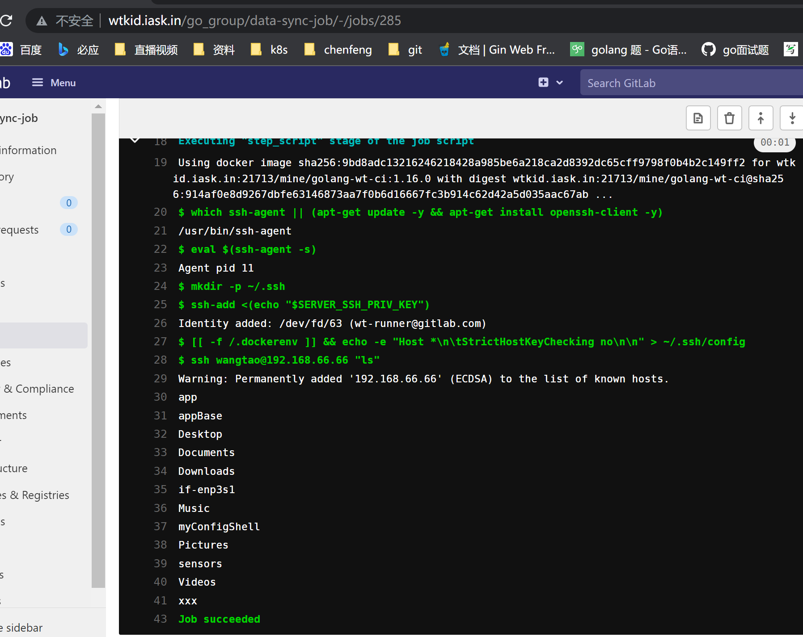

> # gitlab-runner Docker模式下实现ssh,scp部署

## 概述

在前面，我们知道了gitlab-runner以docker模式运行的整体流程。在我们使用容器化部署项目的情况下，我们可以将镜像推送到Harbor仓库，那如果我们在进行ci脚本的时候需要使用scp命令进行远程复制操作，或者说使用ssh的时候，基于docker运行的runner这个时候就没有想象中那么简单了，至少你不能在ssh的时候输入用户名密码了，那就只有借助ssh免密登录了。

经过了之前的学习，我们知道了runner本身是不运行job的，runner只是任务的监听者，有任务时，runner容器会创建一个job容器去执行ci任务。如果不熟悉ssh的话那可能我们会想，直接把ssh文件夹挂载到我们的job容器中，这样不就可以直接shs登陆了吗？哈哈，这个是不行的，不相信的小伙伴可以自行测试。

这个时候我们就要求助 [官方文档](https://docs.gitlab.com/ee/ci/examples/deployment/composer-npm-deploy.html) 了.

啰嗦几句，关于ssh的原理就不多说了，ssh主要是依靠非对称加密来实现client和server端的免密登陆认证

## Step1:生成密钥并copy到server

为了不干扰整个环境，我们启动另一个容器，在里面进行生成密钥的操作。

```shell
// 我们使用随便一个邮箱或者主机名生成一个ssh密钥，这个不影响，只是用来登录认证
# ssh-keygen -t rsa -C "wt-runner@gitlab.com"
```

密钥生成之后，我们通过`ssh-copy-id`这个命令将公钥钥添加到我们需要ssh到的目标服务器的authorized_keys中，我需要远程登录的服务器ip为`192.168.66.66`，用户`wangtao`

```shell
# ssh-copy-id wangtao@192.168.66.66
```

这个时候，我们当前这个容器就可以ssh到目标主机了。但是我们今天的主角不是他。

生成密钥的过程中一直回车就可以了，经常操作的朋友会知道这个命令再生成密钥的时候会提示你输入密码，这个时候不要输入，要不然你ssh登录的时候就会要求你输入密码。

## Step2: 配置私钥到git仓库

密钥生成之后，将私钥配置到git仓库，路径为`Settings > CI/CD > Variables`，把私钥配置到这里时因为后续我们的ci云心时需要读取这个配置，来作为自己的ssh的私钥，取登录目标服务器。



## Step3: gitlab-ci.yml

现在是万事俱备只欠东风，开始搞`gitlan-ci.yml`文件。

这个地方有点特殊的是我们需要用这个配置的私钥变量来作为我们ci容器的ssh私钥，这个地方具体细节可以查看官方文档。贴一个官方文档的图。



继续搞一下我们的`.gitlab-ci.yml`，为了方便测试，我就直接打印一下目标服务器上的文件列表了，因为没有什么真正的构建流程，只是为了测试一下ssh，所以文件里面重点只关注构建部分脚本就ok.

```yaml
variables:
  HARBOR_URL: wtkid.iask.in:21713/mine
  IMAGE: $HARBOR_URL/golang-wt-ci:1.16.0

# 本次构建的阶段：build package
stages:
  - build

# 构建
job_build:
  image: $IMAGE
  stage: build
  tags:
    - go_group
  script:
    - 'which ssh-agent || (apt-get update -y && apt-get install openssh-client -y)'
    - eval $(ssh-agent -s)
    - mkdir -p ~/.ssh
    - ssh-add <(echo "$SERVER_SSH_PRIV_KEY")
    - '[[ -f /.dockerenv ]] && echo -e "Host *\n\tStrictHostKeyChecking no\n\n" > ~/.ssh/config'
    - ssh wangtao@192.168.66.66 "ls"
  only:
    - main
```

脚本内容比较简单，大部分的含义就不解释了，说一下最后一行`echo -e "Host *\n\tStrictHostKeyChecking no\n\n" > ~/.ssh/config`，这一行我们在容器中禁用主机检查(这个命令时ci容器执行的，所以需要提示一下这个地方时禁用的容器的主机检查，不是目标服务器的!!)，当我们第一次连接到服务器时，我们不要求用户接受，因为每个job在执行时都等于第一次连接，所以我们需要禁用这个。

## Step4: 目标成果

因为只是测试ssh，所以随便找了个项目测试，哈哈，不要在意这些细节

