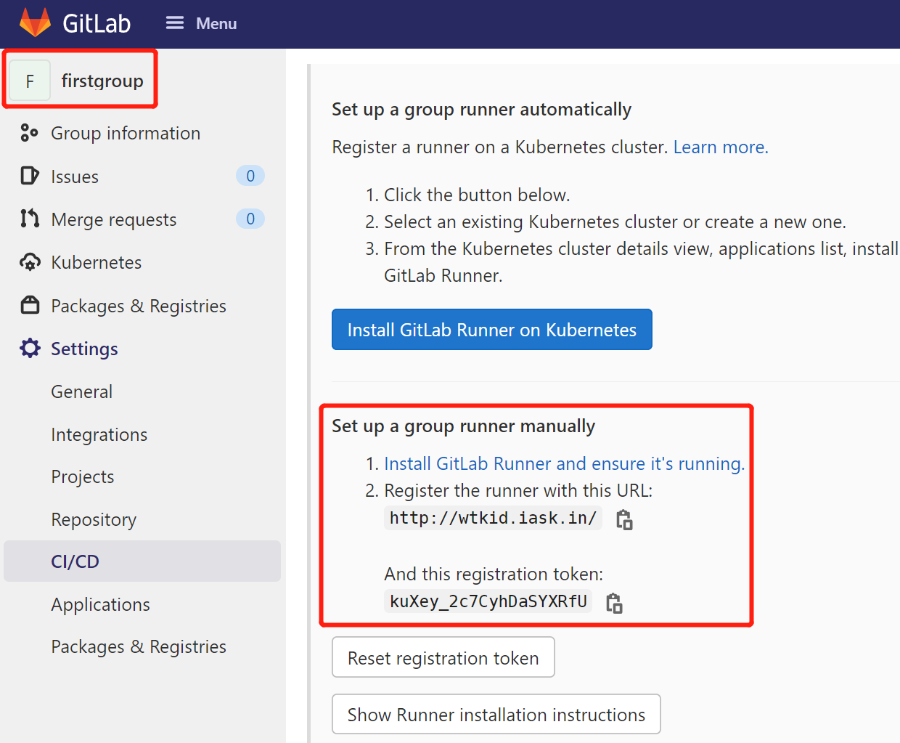
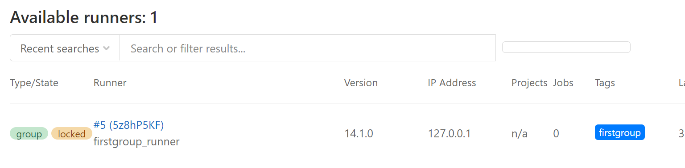

## gitlab-runner

## 安装

### 先拉镜像

```shell
$ docker pull gitlab/gitlab-runner:latest
```

### 推荐方式

```shell
## 先运行runner，如果不需要配置指向gitlab域名的host，就不需要挂载hosts文件
## 如果gitlab运行在某个域名时，在runner里面又无法访问到该域名的时候，
## 可以选择挂载一个hosts进去，将域名指向对应的IP -v /usr/local/app/gitlab-runner/hosts:/etc/hosts 
## 把config挂载进去，在需要的时候方便些
$ docker run -d --name gitlab-runner --restart always \
-v /usr/local/app/gitlab-runner/config:/etc/gitlab-runner \
-v /var/run/docker.sock:/var/run/docker.sock \
gitlab/gitlab-runner:latest

## 注册gitlab-runner
$ docker exec -it gitlab-runner gitlab-ci-multi-runner register -n \
  --url http://yourdomain/ \
  --registration-token yourtoken \
  --tag-list=firstgroup \
  --description "firstgroup_runner" \
  --docker-privileged=false \
  --docker-pull-policy="if-not-present" \
  --docker-image "maven:3-jdk-8" \
  --docker-volumes /var/run/docker.sock:/var/run/docker.sock \
  --docker-volumes /usr/local/app/gitlab-runner/mvnrepo:/root/.m2 \
  --executor docker
```

`参数解释`

```properties
--url: 访问gitlab的地址，gitlab-runner配置部分有(看上面贴图)
--registration-token: gitlab-runner配置部分的token(看上面贴图)
--tag-list: 指定runner的tag，ci配置时，可以使用tag标签来指定由那个runner来执行，就是匹配这里的tag
--executor: docker, gitlab-ci触发时，job的运行方式，docker表示由docker方式执行，此种方式runner会拉起一个docker容器，用来执行job
--docker-image: executor=docker时，用来指定运行的镜像
--docker-volumes: 把目录挂载到执行job的镜像中，这里把mvn的库路径挂载进去，防止每次拉起镜像执行job的时候都会重新取拉依赖包，慢得一P
```

`runner配置贴图`，在`Setting-->CI/CD`中，`Runner`部分，点击右边的`Expand`就可以看到了。

如果你是想我一样创建了一个group的话，就在这个group里面加runner吧，这样这个组下面的所有项目都可以共用一个，要不然每个单独的项目都要配一个runner(这个坑我先踩了)。



### 官方方式(不推荐)

```shell
## 官方的方式直接运行镜像的方式注册runner，此种操作会一步一步提示填写相关信息
$ docker run -d --name gitlab-runner --restart always \
-v /usr/local/app/gitlab-runner/config:/etc/gitlab-runner \
-v /var/run/docker.sock:/var/run/docker.sock \
gitlab/gitlab-runner:latest register

## 官方的方式启动runner
docker run --rm -it --name gitlab-runner -v /usr/local/app/gitlab-runner/hosts:/etc/hosts -v /usr/local/app/gitlab-runner/config:/etc/gitlab-runner -v /usr/local/app/gitlab-runner/mvnrepo:/root/.m2 -v /var/run/docker.sock:/var/run/docker.sock gitlab/gitlab-runner:latest register
```

### 注册

如果url和token配置正确，不出意外runner会注册成功，类似如下输出

```shell
## 启动
[root@master1 gitlab-runner]# docker run -d --name gitlab-runner --restart always \
> -v /usr/local/app/gitlab-runner/config:/etc/gitlab-runner \
> -v /var/run/docker.sock:/var/run/docker.sock \
> gitlab/gitlab-runner:latest
e412fa3807de719b7401b1a8e20750970ae9e252a7e6253c30fd515a29cac144
##
[root@master1 gitlab-runner]# docker exec -it gitlab-runner gitlab-ci-multi-runner register -n \
>   --url http://yourdomain/ \
>   --registration-token yourtoken \
>   --tag-list=firstgroup \
>   --description "firstgroup_runner" \
>   --docker-privileged=false \
>   --docker-pull-policy="if-not-present" \
>   --docker-image "maven:3-jdk-8" \
>   --docker-volumes /var/run/docker.sock:/var/run/docker.sock \
>   --docker-volumes /usr/local/app/gitlab-runner/mvnrepo:/root/.m2 \
>   --executor docker
Runtime platform                                    arch=amd64 os=linux pid=17 revision=8925d9a0 version=14.1.0
Running in system-mode.                            
                                                   
Registering runner... succeeded                     runner=_Ws9-NTn
Runner registered successfully. Feel free to start it, but if it's running already the config should be automatically reloaded! 
[root@master1 gitlab-runner]# 
```

runner注册成功后，在gitlab上就可以看到刚刚注册的runner了，小绿点表示runner可用。



### 检查runner和配置

```shell
## 忽略了部分输出
[root@master1 config]# docker ps
CONTAINER ID   IMAGE                        ...            NAMES
e412fa3807de   gitlab/gitlab-runner:latest  ...            gitlab-runner
[root@master1 config]# 
```

runner启动的时候配置文件目录挂载到了`/usr/local/app/gitlab-runner/config`,来看下，这些都是刚刚注册runner的参数配置。**`toml`文件类似json结构，如下所示，`runnrs`是根节点；如果注册了多个runner，配置文件中将出现多个`runners`的配置**。

```shell
[root@master1 config]# cat /usr/local/app/gitlab-runner/config/config.toml
concurrent = 1
check_interval = 0

[session_server]
  session_timeout = 1800

[[runners]]
  name = "desc"
  url = "http://wtkid.iask.in/"
  token = "_Ws9-NTn9v78QuZSUTZ4"
  executor = "docker"
  [runners.custom_build_dir]
  [runners.cache]
    [runners.cache.s3]
    [runners.cache.gcs]
    [runners.cache.azure]
  [runners.docker]
    tls_verify = false
    image = "maven:3-jdk-8"
    privileged = false
    disable_entrypoint_overwrite = false
    oom_kill_disable = false
    disable_cache = false
    volumes = ["/var/run/docker.sock:/var/run/docker.sock", "/usr/local/app/gitlab-runner/mvnrepo:/root/.m2", "/cache"]
    pull_policy = ["if-not-present"]
    shm_size = 0
[root@master1 config]# 
```

## 添加CI文件执行runner

### .gitlab-ci.yml

```shell
image: maven:3-jdk-8

# 本次构建的阶段：build package
stages:
  - build
  - deploy

  # 生产jar的job
job_build:
  image: maven:3-jdk-8
  stage: build
  tags:
    - firstgroup
  script:
    - echo "stage one start"
    - mvn clean package
  only:
    - main

jar_deploy:
  stage: deploy
  tags:
    - firstgroup
  before_script:
    - echo "before deploy"
  script:
    - sleep 5
  after_script:
    - echo "after deploy"
  only:
    - main

```

CI文件中的`tags`属性，就是为了找我们刚注册的`tags-list=firstgroup`的runner，如果这个标签匹配，这个runner才能用来执行此项目。

这个很好理解，比如说我们现在有java和go的项目，他们打包所需要的镜像肯定是不一样的，那我们就行需要注册两个runner，一个用来运行java的job，一个运行go的job。**实际上运行的runner也只有一个，注意那个config.toml的配置，这个runner只是根据配置去拉起容器执行job**

### job

```shell
## 忽略了部分输出
[root@master1 mvnrepo]# docker ps
CONTAINER ID   IMAGE                                     NAMES
614bbfd10d89   8cdb8ae3abd1    ...   runner-3nffueqw-project-2-concurrent-0-734e83eb7ef83e55-build-2
42f23a88e36e   gitlab/gitlab-runner:latest   ...         gitlab-runner
[root@master1 mvnrepo]# 
```

可以看到自动拉起了另一个容器。

任务执行完之后，可以在界面看到构建已经通过，因为配置了mvn库挂载到宿主机，所以可以在我们挂载的目录看到打包下载的依赖包，这些依赖包在下次job执行的时候，又可以使用。


细心的同学可能发现了图中有个`#6`，`runner`刚注册好的的那个截图上是`#5`，这两个地方的这个都没任何关系，这个`#n`代表你操作，会越来越大，runner那个`#5`其实是我第五次注册了runner了。

