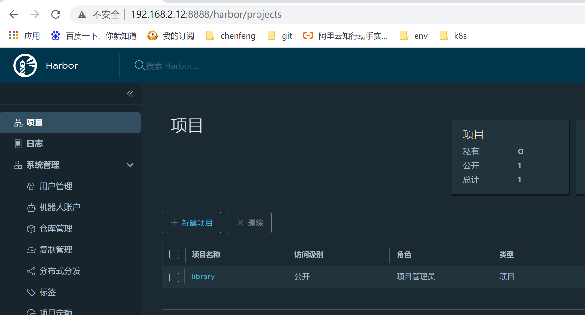
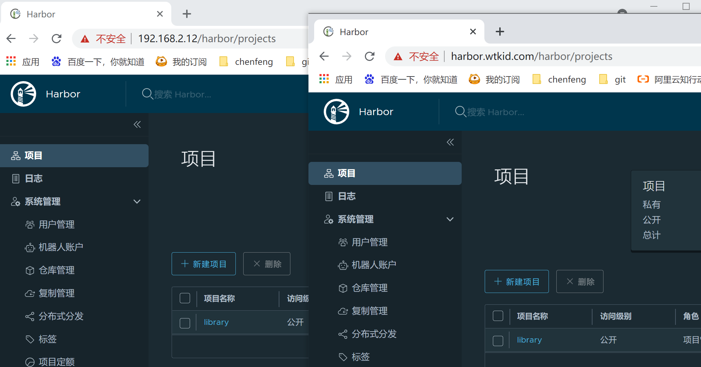
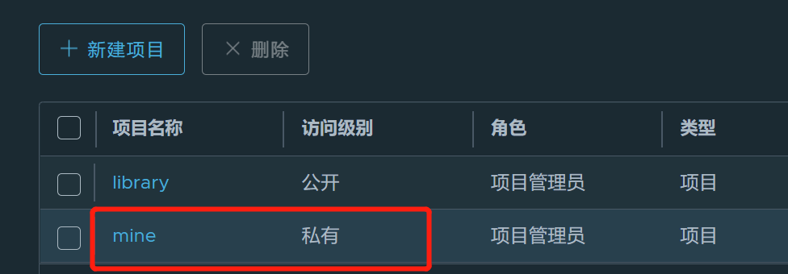
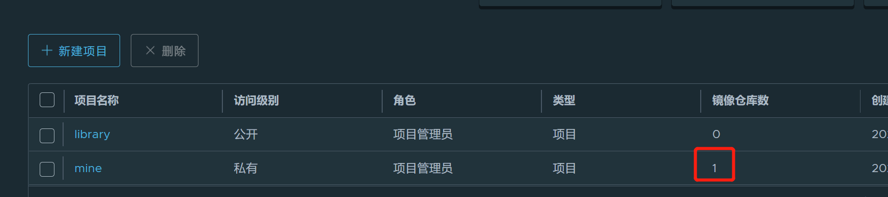
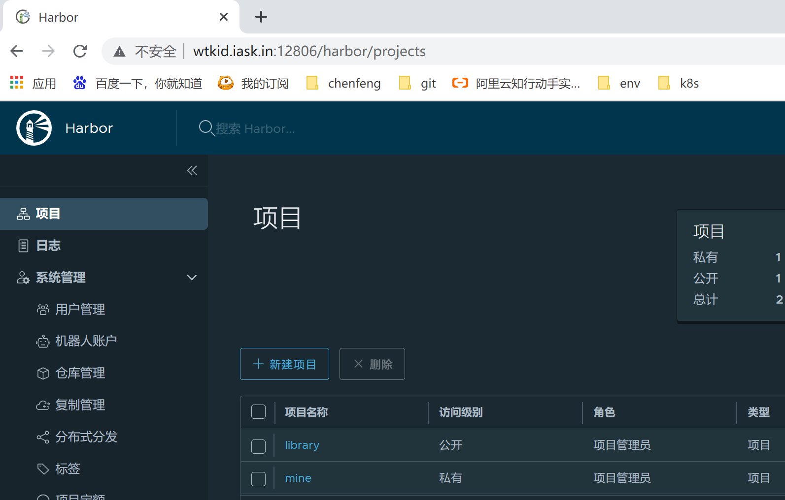

> # Harbor搭建

## Docker安装

几行命令，还是贴一下吧

```shell
## 安装yum-util
$ yum install -y yum-utils

## 添加yum源
$ yum-config-manager --add-repo https://download.docker.com/linux/centos/docker-ce.repo

## 安装docker
$ yum install -y docker-ce docker-ce-cli containerd.io

##启动docker守护进程
$ systemctl start docker

## 测试
$ docker run hello-world
```

## Docker-compose安装(必须)

随着容器化技术的成熟，作为docker部署应用越来越多，越来越难管理，部署一个项目，你可能需要部署与其相关的redis，mysql，kafka等一系列相关服务，你在部署一个服务的同时，还会牵扯一系列其他的服务。如果你只需要部署一个环境，那可能没有什么问题，如果时隔很久，你突然需要将老的服务，或者从别人手机接手的服务，重新部署到新的环境，我相信你会感觉很刺激。
为了实现docker的自动化，docker-compose出现了，你可以把所有需要的服务，牵扯的一系列需要部署的东西，都定义到一起，一个命令，全部搞定。你可以把它想象成Linux系统的yum工具，一键安装。只是我们需要自己去定义`docker-compose.yml`等相关文件。

### 安装

它，只是个写好了的工具！玩儿它你只需要四步。[官网安装文档地址在这里](https://docs.docker.com/compose/install/)

1. 下载

   ```shell
   $ sudo curl -L "https://github.com/docker/compose/releases/download/1.29.2/docker-compose-$(uname -s)-$(uname -m)" -o /usr/local/bin/docker-compose
   ```

2. `chmod +x`，添加全局可执行

   ```shell
   ## 加可执行权限
   $ sudo chmod +x /usr/local/bin/docker-compose
   ## 直接创建软链接，全局可执行
   $ sudo ln -s /usr/local/bin/docker-compose /usr/bin/docker-compose
   ```

3. 创建项目目录，编写对应的docker-compose.yml文件(不整了，harbor就是，等哈直接搞)

4. 在目录下执行docker-compose命令

`命令`

```shell
## 启动, -d表示后台
$ docker-compose up -d
## 停止
$ docker-compose down 
```

## Harbor安装

### 下载

直接去[官网](https://goharbor.io/)下载，[下载地址](https://github.com/goharbor/harbor/releases)，这是我下载的[版本2.3.2](https://github.com/goharbor/harbor/releases/tag/v2.3.2)，下载的很慢，喝杯茶先。

### 安装

```shell
## 解压
$ tar -zxvf harbor-offline-installer-v2.3.2.tgz -C /usr/local/app
## 查看解压后的文件
$ cd /usr/local/app/harbor && ls
common.sh  harbor.v2.3.2.tar.gz  harbor.yml.tmpl  install.sh  LICENSE  prepare
## 复制一份harbor.yml文件作为harbor启动的配置文件
$ cp harbor.yml.tmpl harbor.yml
```

### 修改对应的配置(harbor.yml)

hostname修改成自己喜欢的域名，http端口(可以不改)，暂时不需要https，注释掉这部分配置，修改存储目录和日志目录。以下是修改过的地方

```yaml
# The IP address or hostname to access admin UI and registry service.
# DO NOT use localhost or 127.0.0.1, because Harbor needs to be accessed by external clients.
hostname: harbor.wtkid.com

# 端口
http:
  port: 8888

## 注释掉https
# https related config
# https:
  # https port for harbor, default is 443
  # port: 443
  # The path of cert and key files for nginx
  # certificate: /your/certificate/path
  # private_key: /your/private/key/path
...
## 存储目录，改到harbor的目录，方便些
data_volume: /usr/local/app/harbor/data
...
## 日志存储目录
log:
  local:
    location: /usr/local/app/harbor/log/harbor
```

admin的默认密码也在这个文件中配置，默认是Harbor12345.

```yaml
# Remember Change the admin password from UI after launching Harbor.
harbor_admin_password: Harbor12345
```

### 启动

```shell
$ ./install.sh
```

执行目录下的`install.sh`文件，开始安装和启动harbor. 当看到以下信息的时候说明你安装和启动成功了。

```shell
[root@master1 harbor]# ./install.sh
...
[Step 5]: starting Harbor ...
Creating network "harbor_harbor" with the default driver
Creating harbor-log ... done
Creating harbor-portal ... done
Creating harbor-db     ... done
Creating registry      ... done
Creating registryctl   ... done
Creating redis         ... done
Creating harbor-core   ... done
Creating harbor-jobservice ... done
Creating nginx             ... done
✔ ----Harbor has been installed and started successfully.----
[root@master1 harbor]# 
```

启动成功后，再看看下，文件夹中多了`docker-compose.yml`文件。data目录和log目录也创建了，harbor是通过docker-compose启动的，后续就可以使用docker-compose来启动和停止harbor了。`docker ps`可以看到harbor服务所启动的所有容器。

```shell
[root@master1 harbor]# ls
common  common.sh  data  docker-compose.yml  harbor.v2.3.2.tar.gz  harbor.yml  harbor.yml.tmpl  install.sh  LICENSE  log  prepare
## 可以看到启动的docker容器
[root@master1 harbor]# docker ps
CONTAINER ID   IMAGE                
632a9226d519   goharbor/nginx-photon:v2.3.2         ...
f9d6ef2278d5   goharbor/harbor-jobservice:v2.3.2    ...
0519771eeab3   goharbor/harbor-core:v2.3.2          ...
b4e3b8ac1b13   goharbor/redis-photon:v2.3.2         ...
aa7a903c22ca   goharbor/harbor-registryctl:v2.3.2   ...
fe0d9880f488   goharbor/registry-photon:v2.3.2      ...
d242e4cf9843   goharbor/harbor-db:v2.3.2            ...
4e3c7bba970c   goharbor/harbor-portal:v2.3.2        ...
a93791fe83c0   goharbor/harbor-log:v2.3.2           ...
[root@master1 harbor]# 
```

### 访问首页

访问harbor服务，域名和IP都可以(域名要配hosts)，我就直接IP了，用amdin账户登录，截个小图庆祝一下




## Docker登录Harbor

新开一台机器，同样安装好docker(可以不装docker-compose)，测试仓库是否正常使用。

```shell
[root@master1 ~]# docker login -u admin -p Harbor12345 http://192.168.2.12:8888
WARNING! Using --password via the CLI is insecure. Use --password-stdin.
Error response from daemon: Get "https://192.168.2.12:8888/v2/": http: server gave HTTP response to HTTPS client
[root@master1 ~]# 
```

docker默认走https,我们直接输入http协议和ip登录也不得行，需要向docker添加harbor仓库。

### docker添加harbor仓库

```shell
$ vi /usr/lib/systemd/system/docker.service
## 在ExecStart行最后添加(别换行) --insecure-registry=http://192.168.2.12:8888
$ cat /usr/lib/systemd/system/docker.service
...
ExecStart=/usr/bin/dockerd -H fd:// --containerd=/run/containerd/containerd.sock --insecure-registry=http://192.168.2.12:8888
...
## 刷新配置文件
$ systemctl daemon-reload
## 重启docker
$ systemctl restart docker
```

### 登录

```shell
[root@master1 ~]# docker login -u admin -p Harbor12345 http://192.168.2.12:8888
WARNING! Using --password via the CLI is insecure. Use --password-stdin.
WARNING! Your password will be stored unencrypted in /root/.docker/config.json.
Configure a credential helper to remove this warning. See
https://docs.docker.com/engine/reference/commandline/login/#credentials-store

Login Succeeded
[root@master1 ~]# 
```

登陆成功就意味着可以向harbor仓库push和pull镜像了，正常的，已经测试过了，咱push的笔记留到https再写。

## Harbor仓库HTTPS配置

### openssl生成证书

在harbor目录下创建一个ca目录，后续的证书生成就都在这里面搞了。

#### 创建CA秘钥对和web服务秘钥对

```shell
## 创建CA秘钥对
$ openssl genrsa -out ca.key 4096
$ openssl req -x509 -new -nodes -sha512 -days 36500 \
 -subj "/C=SC/ST=CHENGDU/L=CHENGDU/O=example/OU=Personal/CN=harbor.wtkid.com" \
 -key ca.key \
 -out ca.crt
 
## 创建web服务器端秘钥对
$ openssl genrsa -out harbor.wtkid.com.key 4096
$ openssl req -sha512 -new \
 -subj "/C=SC/ST=CHENGDU/L=CHENGDU/O=example/OU=Personal/CN=harbor.wtkid.com" \
 -key harbor.wtkid.com.key \
 -out harbor.wtkid.com.csr

```

#### 签约

创建签约使用的文件`v3.ext`，注意`alt_names`换成自己的域名

```properties
authorityKeyIdentifier=keyid,issuer
basicConstraints=CA:FALSE
keyUsage = digitalSignature, nonRepudiation, keyEncipherment, dataEncipherment
extendedKeyUsage = serverAuth 
subjectAltName = @alt_names

[alt_names]
DNS.1=harbor.wtkid.com
DNS.2=harbor.wtkid
DNS.3=harbor
```

 web服务器到CA签约

```shell
## web服务器到CA签约
$ openssl x509 -req -sha512 -days 3650 \
    -extfile v3.ext \
    -CA ca.crt -CAkey ca.key -CAcreateserial \
    -in harbor.wtkid.com.csr \
    -out harbor.wtkid.com.crt
```

签约这步成功应该有如下输出

```shell
Signature ok
subject=/C=SC/ST=CHENGDU/L=CHENGDU/O=example/OU=Personal/CN=harbor.wtkid.com
Getting CA Private Key
[root@master1 xx]# 
```

#### 检查

所有步骤操作完之后，你应该有这些东西

```shell
[root@master1 ca]# ls
ca.crt  ca.key  ca.srl  harbor.wtkid.com.crt  harbor.wtkid.com.csr  harbor.wtkid.com.key  v3.ext
[root@master1 ca]# 
```

### 修改harbor配置`harbor.yml`

```yaml
## 注释掉http
# http related config
# http:
  # port for http, default is 80. If https enabled, this port will redirect to https port
  # port: 8888

## 放开https配置，并配置刚生成的证书
# https related config
https:
  # https port for harbor, default is 443
  port: 443
  # The path of cert and key files for nginx
  certificate: /usr/local/app/harbor/ca/harbor.wtkid.com.crt
  private_key: /usr/local/app/harbor/ca/harbor.wtkid.com.key
```

### 应用并重启

`harbor.yml`文件更新后，执行目录下`prerare`应用，然后重新执行`install.sh`，不用担心，老数据不会受影响的。

```shell
## 应用变更，可以看到输出重新生成了docker-compose.yml文件
[root@master1 harbor]# ./prepare
repare base dir is set to /usr/local/app/harbor
Generated configuration file: /config/portal/nginx.conf
Generated configuration file: /config/log/logrotate.conf
Generated configuration file: /config/log/rsyslog_docker.conf
Generated configuration file: /config/nginx/nginx.conf
Generated configuration file: /config/core/env
Generated configuration file: /config/core/app.conf
Generated configuration file: /config/registry/config.yml
Generated configuration file: /config/registryctl/env
Generated configuration file: /config/registryctl/config.yml
Generated configuration file: /config/db/env
Generated configuration file: /config/jobservice/env
Generated configuration file: /config/jobservice/config.yml
loaded secret from file: /data/secret/keys/secretkey
Generated configuration file: /compose_location/docker-compose.yml
Clean up the input dir
## 重新创建容器并启动
[root@master1 harbor]# ./install.sh
...
✔ ----Harbor has been installed and started successfully.----
[root@master1 harbor]#
```

### 访问首页

IP和域名都正常，截图留恋。



## Docker HTTPS登陆Harbor

### 创建docker机器使用的证书

进入harbor那台机器，进入之前生成证书的ca文件夹，执行如下命令，生成cert文件

```shell
$ openssl x509 -inform PEM -in harbor.wtkid.com.crt -out harbor.wtkid.com.cert
```

生成之后将`ca.crt`, `harbor.wtkid.com.cert`, `harbor.wtkid.com.key`三个文件弄到另一台docker所在的机器，生产直接scp，我本地直接lrzsz搞。

然后将文件这三个文件放到`/etc/docker/certs.d/harbor.wtkid.com/`文件夹下，文件夹不存在自己创建，最后的文件夹需要和你证书的域名一样，这个是docker的解析机制决定的。

### 还原配置

我们使用域名访问了，直接把之前修改的`/usr/lib/systemd/system/docker.service`文件还原回去，刷新，重启。

```shell
$ cat /usr/lib/systemd/system/docker.service
...
ExecStart=/usr/bin/dockerd -H fd:// --containerd=/run/containerd/containerd.sock
...
## 刷新，重启
$ systemctl daemon-reload
$ systemctl restart docker
```

### 登录harbor

先在`/etc/hosts`文件添加`harbor.wtkid.com`域名映射.然后进行登录.

```shell
[root@master1 harbor.wtkid.com]# docker login -u admin -p Harbor12345 harbor.wtkid.com
WARNING! Using --password via the CLI is insecure. Use --password-stdin.
WARNING! Your password will be stored unencrypted in /root/.docker/config.json.
Configure a credential helper to remove this warning. See
https://docs.docker.com/engine/reference/commandline/login/#credentials-store

Login Succeeded
[root@master1 harbor.wtkid.com]#
```

如果你依然想使用IP直接https登陆的话你会遇到如下的错误。

```shell
$ docker login -u admin -p Harbor12345 https:192.168.2.12
Error response from daemon: Get "https://192.168.2.12/v2/": x509: cannot validate certificate for 192.168.2.12 because it doesn't contain any IP SANs
```

此种情况像之前一样，编辑文件`/usr/lib/systemd/system/docker.service`，添加IP可以解决，记得写协议哦。

```shell
ExecStart=/usr/bin/dockerd -H fd:// --containerd=/run/containerd/containerd.sock --insecure-registry=https://192.168.2.12
```

## Push镜像到Harbor

新建一个 私有的仓库`mine`(名字随意)。



然后在docker那台测试机器上，找一个镜像，开始准备推送。我这里直接使用的已有的镜像，打tag推送，tag需要指明镜像推送的地址及仓库，版本等信息。

```shell
[root@master1 harbor.wtkid.com]# docker images
REPOSITORY                  TAG               IMAGE ID       ...
maven                      3-jdk-8           8cdb8ae3abd1    ...
## 打镜像tag
[root@master1 harbor.wtkid.com]# docker tag maven:3-jdk-8 harbor.wtkid.com/mine/maven:3-jdk-8
[root@master1 harbor.wtkid.com]# docker images
REPOSITORY                      TAG               IMAGE ID     ...
maven                          3-jdk-8           8cdb8ae3abd1  ...
harbor.wtkid.com/mine/maven    3-jdk-8           8cdb8ae3abd1  ...
## 刚才login过了，这里直接推送
[root@master1 harbor.wtkid.com]# docker push harbor.wtkid.com/mine/maven:3-jdk-8
The push refers to repository [harbor.wtkid.com/mine/maven]
3e126eee0ce1: Pushed 
d984dcf12578: Pushed 
6a48a9b67eb9: Pushed 
61ef3b3b77be: Pushed 
e63cb31c0354: Pushed 
c2e2307780ac: Pushed 
7d890913ab69: Pushed 
1235daf38153: Pushed 
62d14713f2e9: Pushed 
c2ddc1bc2645: Pushed 
3-jdk-8: digest: sha256:f8c0a1470e3b7cd5d7d817159d6c835dfc614423fe04af6f808be28cf40bf9ac size: 2419
[root@master1 harbor.wtkid.com]#
```

查看harbor仓库

镜像数量已经有了我们刚推进去的一个，进入可以查看到镜像.



## 内网穿透

仓库搭建好了，咱得用起来啊，说干咱就干，花生壳内网穿透他不香吗~~~

具体的花生壳穿透的我就不多说了，详细的去看gitlab安装那篇文章吧~~

### 安装和访问

一样的deepin，一样的配方，还是那个味道。唯一不足的是花生壳https内网穿透要出钱，所以。。。我直接用http，棒~

首先在deepin上安装好harbor，就不升级http说了，就以http的方式暴露就好了，端口自定义，能和花生壳对应上就行。

花生壳建立映射，另一台电脑通过暴露的域名直接访问。你可以发现访问是相对正常的，但是速度比较慢。



这个时候我们使用外网的docker进行访问，同样将registory配置好。

```shell
$ cat /usr/lib/systemd/system/docker.service
...
ExecStart=/usr/bin/dockerd -H fd:// --containerd=/run/containerd/containerd.sock --insecure-registry=http://wtkid.iask.in:12806
...
## 刷新，重启
$ systemctl daemon-reload
$ systemctl restart docker
```

你会发现你根本登陆不了。图就省略了,好难得贴啊， 反正你就是登陆不了~~

### 外网配置

修改`harbor.yml`,更改`external_url`的值为外网地址，以下是我的配置

```yaml
external_url: http://wtkid.iask.in:12806
```

日常应用并重启

```shell
$ sudo ./prepare
$ sudo ./install.sh
```

好了，重启之后，你会发现你外网访问简直快得一P~~~嗯...好吧，我承认有点心理作用，来看看日常登陆加push吧。

```shell
[root@master1 docker]# docker login -u admin -p Harbor12345 http://wtkid.iask.in:12806
WARNING! Using --password via the CLI is insecure. Use --password-stdin.
WARNING! Your password will be stored unencrypted in /root/.docker/config.json.
Configure a credential helper to remove this warning. See
https://docs.docker.com/engine/reference/commandline/login/#credentials-store

Login Succeeded
[root@master1 docker]# docker tag maven:3-jdk-8 wtkid.iask.in:12806/mine/maven:3-jdk-8
[root@master1 docker]# docker push wtkid.iask.in:12806/mine/maven:3-jdk-8
The push refers to repository [wtkid.iask.in:12806/mine/maven]
3e126eee0ce1: Pushed 
d984dcf12578: Pushed 
6a48a9b67eb9: Pushed 
61ef3b3b77be: Pushed 
e63cb31c0354: Pushed 
c2e2307780ac: Pushed 
7d890913ab69: Pushed 
1235daf38153: Pushed 
62d14713f2e9: Pushed 
c2ddc1bc2645: Pushed 
3-jdk-8: digest: sha256:f8c0a1470e3b7cd5d7d817159d6c835dfc614423fe04af6f808be28cf40bf9ac size: 2419
[root@master1 docker]#
```

## k8s接入

### 创建secret

`docker login -u admin -p Harbor12345 harbor.wtkid.com`登陆一次`harbor`，然后在使用文件`~/.docker/config.json`创建`secret`. 

#### 命令行

```shell
$ kubectl create secret generic harbor-secret \
--from-file=.dockerconfigjson=config.json \
--type=kubernetes.io/dockerconfigjson \
--namespace=kubia 
```

#### yaml文件

```shell
[root@master1 harbor]# cat config.json | base64 -w 0
ewoJImF1dGhzIjogewoJCSJoYXJib3Iud3RraWQuY29tIjogewoJCQkiYXV0aCI6ICJZV1J0YVc0NlNHRnlZbTl5TVRJek5EVT0iCgkJfQoJfSwKCSJIdHRwSGVhZGVycyI6IHsKCQkiVXNlci1BZ2VudCI6ICJEb2NrZXItQ2xpZW50LzE5LjAzLjAgKGxpbnV4KSIKCX0KfQ==
[root@master1 harbor]# 
```

> harbor-secret.yaml

```yaml
apiVersion: v1
kind: Secret
type: kubernetes.io/dockerconfigjson
metadata:
 name: harbor-registry-secret
data:
  .dockerconfigjson: ewoJImF1dGhzIjogewoJCSJoYXJib3Iud3RraWQuY29tIjogewoJCQkiYXV0aCI6ICJZV1J0YVc0NlNHRnlZbTl5TVRJek5EVT0iCgkJfQoJfSwKCSJIdHRwSGVhZGVycyI6IHsKCQkiVXNlci1BZ2VudCI6ICJEb2NrZXItQ2xpZW50LzE5LjAzLjAgKGxpbnV4KSIKCX0KfQ==
```

### 使用secret访问

以下yaml中使用的镜像`harbor.wtkid.com/mine/kubia:v1`我已经push到harbor了,请自行操作push.为了验证是否真正拉取，我在push后删除了本地的镜像`harbor.wtkid.com/mine/kubia:v1`.

> kubia-secret.yaml

```yaml
apiVersion: v1
kind: ReplicationController
metadata:
  name: harbor-test
spec:
  replicas: 1
  selector:
    app: harbor-test
  template:
    metadata:
      name: harbor-test
      labels:
        app: harbor-test
    spec:
      containers:
      - name: harbor-test
        image: harbor.wtkid.com/mine/kubia:v1
        imagePullPolicy: Always
        ports:
        - containerPort: 8080
      imagePullSecrets:
      - name: harbor-secret   ## 引用刚创建的secret，没有这个是拉不下来镜像的
```

> 拉取验证

```shell
[root@master1 harbor]# kubectl apply -f kubia-secret.yaml -n kubia
[root@master1 harbor]# kubectl get po -n kubia
NAME                 READY   STATUS    RESTARTS   AGE
harbor-test-llxv8    1/1     Running   0          21m
[root@master1 harbor]#
```

### 使用serviceAccount访问

#### 创建serviceAccount

> harbor-service-account.yaml

```yaml
apiVersion: v1
kind: ServiceAccount
metadata:
  name: harbor-service-account
imagePullSecrets:
- name: harbor-secret ## 引用之前创建的harbor的secret
```

> kubia-sa.yaml

```yaml
apiVersion: v1
kind: ReplicationController
metadata:
  name: harbor-sa
spec:
  replicas: 1
  selector:
    app: harbor-sa
  template:
    metadata:
      name: harbor-sa
      labels:
        app: harbor-sa
    spec:
      ## 引用创建的sa,使用这个就不需要配置imagePullSecrets了
      serviceAccountName: harbor-service-account
      containers:
      - name: harbor-sa
        image: harbor.wtkid.com/mine/kubia:v1
        imagePullPolicy: Always
        ports:
        - containerPort: 8080
```

> 拉取验证

```shell
[root@master1 harbor]# kubectl apply -f harbor-service-account.yaml -n kubia
[root@master1 harbor]# kubectl apply -f kubia-sa.yaml -n kubia
[root@master1 harbor]# kubectl get po -n kubia
harbor-sa-gsvjv      1/1     Running   0          18m
[root@master1 harbor]# 
```


好了，咱也有自己的私有仓库了, 祝玩儿得愉快~~

