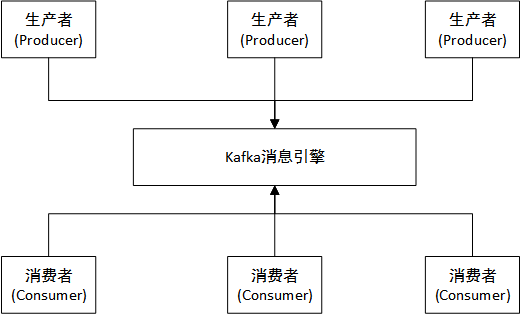
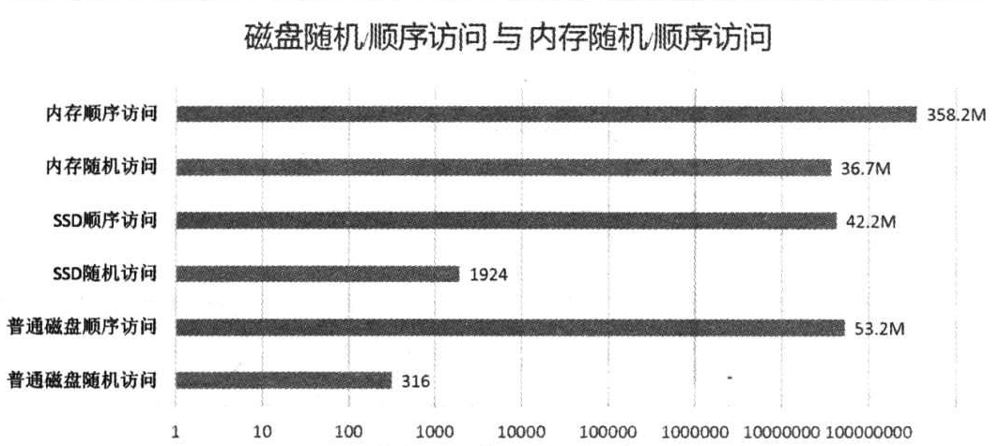
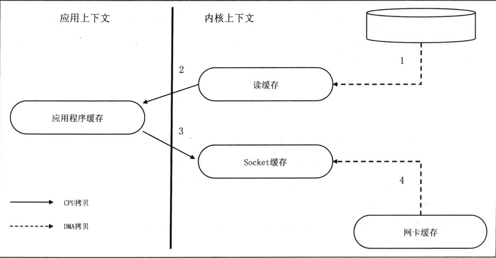
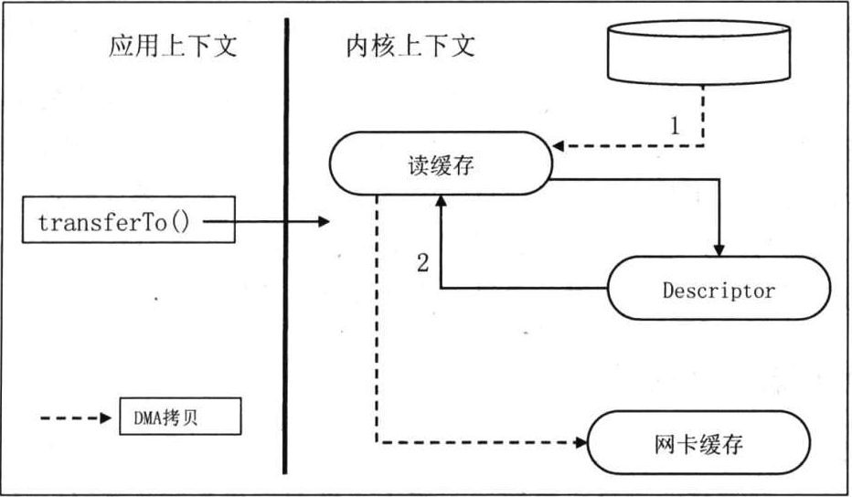
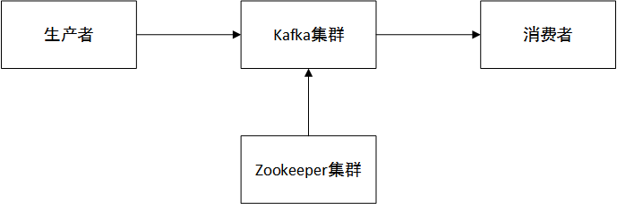
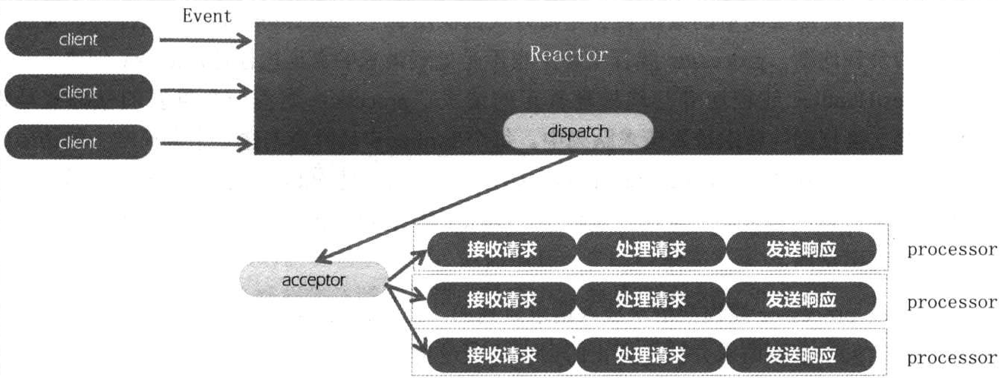
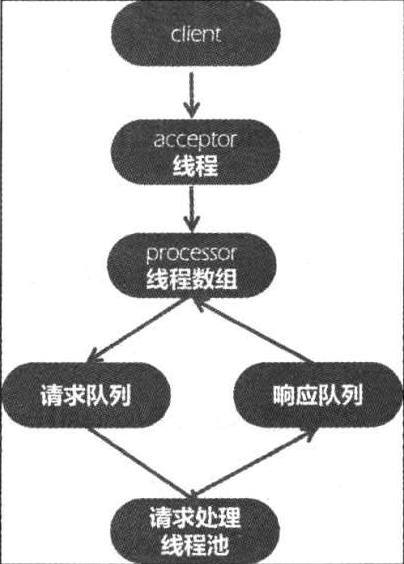
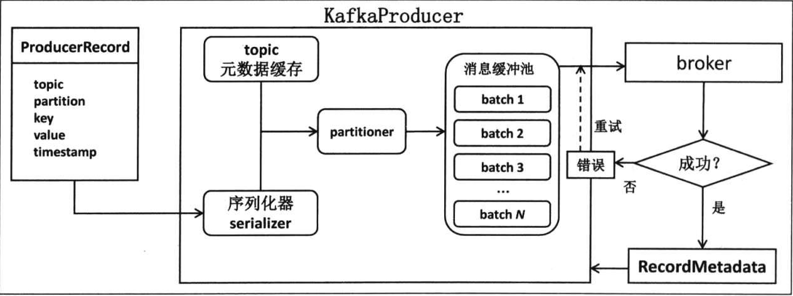
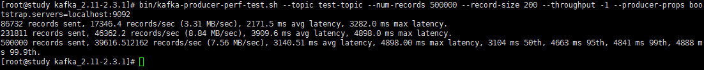
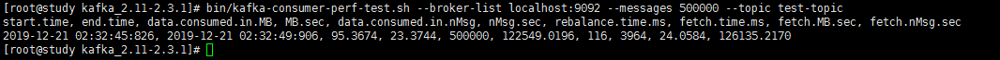

> ## Kafka

# 介绍

Kafka最早是由美国领英公司（LinkedIn）研发的，当时主要用于解决**数据管道(data pipeline)**的问题。当时在LinedIn内部有诸多子系统用于执行各种数据的收集与分析，主要包括业务系统和应用程序的性能监控指标数据和用户操作行为数据两大类。

由于使用开源框架来处理这些数据时存在的诸如扩展性不足，问题较多等一些难点，最终导致了Kafka出世。

Kafka设计之初就旨在提供3个方面的功能特性：

- 为生产者和消费者提供一套简单的API。
- 降低网络传输和磁盘存储开销。
- 具有高伸缩性架构。

在LinkedIn内部，Kafka既用于在线系统，也用于离线系统， 既从上游系统接收数据，也会给下游系统输送数据；既提供消息的流转服务，也用于数据的持久化存储。用Kafka来承接了大量的上下游子系统。

> 我们印象中的Kafka就是消息队列，也叫消息引擎。从以上可以知道Kafka用于充当系统与系统之间的消息传递的管道，中间件。这种消息引擎解耦了系统与系统之间的联系，给系统与系统之间提供了通过消息来通信，异步处理事件的能力。

系统图解：



# Kafka设计

## 吞吐量

对于任何一个消息引擎而言，**吞吐量**都是至关重要的性能指标。通常来讲**吞吐量是某种处理能力的最大值**对于Kafka而言，它的吞吐量就是每秒能够处理的消息数或者每秒能够处理的字节数。

除了吞吐量之外，消息系统还有一个叫**延时**的性能指标，它衡量的是一段时间间隔，可能是发出某个操作与接收到响应之间的时间。

这两个指标通常是一对矛盾体，即一个变好的同时另一个会变差，类似跷跷板。比如，Kafka处理一条消息需要2ms，那么计算其吞吐量不会操作1000/2=500条/s。但是如果我们采用批处理，假设我们在发送前先等待一段时间（假设是8ms），那么消息发送的延时变成了10ms（2+8），延时增加了4倍，但是如果我们在这8ms中我们总共累计了1000条消息，那么系统的吞吐量就变成了1000ms/10ms*1000=10w条/s,吞吐量提升了近200倍！

Kafka怎么做到高吞吐量，低延时的呢？首先Kafka的写入操作是很快的，这主要得益于它对磁盘的使用方法的不同。虽然Kafka会持久化所有数据到磁盘，但本质上每次写入操作其实都只是把数据写入到操作系统的**页缓存(page cache)**中，然后由操作系统决定什么时候将数据写回磁盘。这样设计的优势有：

- 操作系统的页缓存是在内存中分配的，所以写入速度非常快。
- Kafka不必直接与底层的文件系统打交道，所有繁琐的I/O操作都由操作系统来处理。
- Kafka写入操作采用追加写入（append）的方式，避免的磁盘随机写操作。

注意第三点，对于普通的物理磁盘而言，我们总是认为其读/写操作是很慢的，事实上，普通SAS磁盘读写吞吐量确实很慢，但是磁盘的顺序读写其实是非常快的，它的速度甚至可以匹敌内存的随机I/O速度。



因此，Kafka在设计时采用了追加写入消息的方式， 即只能在日志文件末尾追加，不允许修改已写入的消息，属于磁盘顺序访问型操作，所以Kafka消息发送的吞吐量是很高的。可以轻松达到每秒几万甚至几十万条消息。

Kafka在消费端是怎么做到高吞吐，低延时的？由于Kafka是吧消息写入操作系统的页缓存中，那么同样的，Kafka在读取消息时会首先尝试从OS的页缓存中读取，如果命中，就把消息从业缓存追发送到网络Socket上。这个过程就是Linux平台的sendfile系统调用做的，这种技术就是**零拷贝（Zero Copy）**技术。

> 关于零拷贝

传统的Linux操作系统中的I/O接口是依托于数据拷贝来实现的，数据在传输过程中会涉及内核态与用户态的上下文切换，CPU的开销非常大，我们把数据从缓存中读取出来和将数据放到Socket上发送出去这两个操作都是在内核态完成的我们正常的操作都是先从内核态将数据读取,然后拷贝进用户态，然后从用户态拷贝到socket缓存，再发送。零拷贝就是直接将数据从内核态读取，然后直接放到内核态Socket缓存，发送，减少了与用户态之间的拷贝。如图：

无零拷贝流程：




零拷贝流程：



除了零拷贝，Kafka由于大量使用页缓存，故读取时消息大部分很有可能依然保存在页缓存中，因此可以直接命中缓存，不用“穿透”到底层的物理磁盘上获取消息，从而极大的提升了消息读取的吞吐量。

总结一下，Kafka达到高吞吐量，低延时的设计目标使用到的点：

```
1. 大量使用操作系统页缓存，内存操作速度快且命中率高。
2. Kafka不直接参与物理I/O操作，而是交给擅长此事的操作系统来完成。
3. 采用追加写入方式，摒弃还盘的磁盘随机读写操作。
4. 使用以sendfile为代表的零拷贝技术加强网络间的数据传输效率。
```

## Kafka基本结构和术语



kafka核心架构如上图所示，总结起来三句话：

- 生产者发送消息给Kafka服务器。
- 消费者从Kafka读取消息。
- Kafka服务器依托zk集群进行服务的协调管理。

> 术语

```properties
broker: Kafka的服务器，每个节点我们称为broker;
controller: 在集群中，某个broker会被选举出来承担特殊的角色，即controller，它用來管理和协调kafka集群，具体就是管理所有分区的状态并执行相应的管理操作
producer: 上游系统，生产消息，并发送到kafka服务器；
consumer: 下游系统，消费kafka里面的消息；
topic: 主题，可以理解成用于保存消息的一个集合名称，用于区分消息类型；
partition: 每个topic又包含多个partition，每个partition都是有序，不可变的消息队列；
offset: 每个message在partition中的位移；
replica: 分区副本，partition会冗余存储到不同的broker上，用于防止数据丢失，副本分为leader replica和follower replica，每一个partition都会有多个副本，在这个分区的所有副本中（包含本身），总有一个是leader，其余是follower。
ISR: in-sync replica,与leader replica保持同步的replica集合。kafka为partition维护一个replica集合，该集合中的所有replica保存的消息日志都与leader replica保持同步，只有这个集合中的replica才能被选举为leader。
```

## zk

kafka在运行过程中，会依赖zookeeper，具体来讲kafka会将自身的一些状态信息，分区信息，controller信息等大部分信息存储在zookeeper上。

# Kafka设计原理

## broker请求处理

> Reactor模式

Kafka broker处理请求的模式就是Reactor设计模式。这是一种基于事件的处理模式，旨在处理多个输入源同时发送过来的请求。Reactor模式中的服务处理器（service handler）或分发器（dispatcher）将入站请求按照多路复用的方式分发到对应的请求处理器中。本质上这个和生产者-消费者模式很像。

Reactor模式中有两个最重要的组件acceptor线程和processor线程。accepor线程实时监听外部数据源发送过来的事件并执行分发任务，processor线程执行事件处理并将处理结果发送给client。



在Kafka中，每个broker都有一个acceptor线程和若干个processor线程。processor线程的数量可以通过num.network.threads配置。

processor线程其实也不是请求的真正执行者，Kafka创建了一个KafkaRequestHandler线程池专门处理真正的请求，processor线程的一个重要任务就是将socket俩街上接收到的请求放入请求队列中，队列大小由broker端参数queued.max.requests控制，一旦队列满了就会阻塞。

kafka处理流程：



## producer设计

> ProducerRecord

ProducerRecord封装了一条待发送的消息记录。它由五个字段构成。

```properties
topic: 该消息所属的topic;
partition: 该消息所属的分区;
key: 消息key;
value: 消息体;
timestamp: 消息时间戳;
```

> RecordMetadata

该数据结构表示kafka服务器返回给客户端的消息的元数据信息，包含以下内容。

```properties
offset: 消息在分区日志中的位移;
timestamp:消息时间戳;
topic/partition: 所属topic的分区;
checksum: 消息CRC32码;
serializedKeySize: 序列化后的消息key字节数;
serializedValueSize: 序列化后的消息value字节数;
```

> 工作流程

如果把producer看成一个盒子，那么整个流程可以如下所示：用户首先构建待发送的消息对象ProducerRecord，然后调用KafkaProducer.send方法发送。KafkaProducer接收到消息后先对其进行序列化，然后结合本地缓存的元数据信息一起发送诶partitioner去确认目标分区，最后追加写入内存中的消息缓冲池，此时KafkaProducer.send方法成功返回。



消息存到缓冲区之后，并没有真正发送出去，KafkaProducer中海油一个专门的Sender I/O线程负责将缓冲池中的消息分批次发送给对应的broker，完成真正的消息发送逻辑。

## consumer设计

consumer依赖于broker端的组协调者（coordinator）来管理组内的所有consumer实例，并负责把分配方案下发到每个consumer上。

每一个consumer在消费消息的时候，都有一个属于自己的位移offset，用来表征当前自己已经消费了哪条消息。这个位移由一个特殊的topic（__consumer_offsets）来管理，这个topic是由Kafka自行创建的。

## 精确一次处理语义

常见的三种交付语义：

- 最多一次（at most once）: 消息可能丢失也可能被处理，但最多只会被处理一次。
- 至少一次（at list once）: 消息不会丢失，但可能被处理多次。 
- 精确一次（exactly once）: 消息被处理且只会被处理一次。 

> 幂等性producer

幂等性producer的设计思路类似于TCP的工作方式。发送到broker端的每批消息都会被赋予一个序列号用于消息去重，单核TCP不同的是这个序列号不会被丢弃，相反会把他们保存在日志中，这样即使leader副本挂掉，新选出来的leader broker也能执行消息去重工作。

> 事务

Kafka为实现事务，要求应用程序必须提供一个唯一的id来表征事务，这个id被称为事务id（TransactionalId），**它必须在应用程序所有的会话上是唯一的。并且这个id必须由用户显示提供**。

# 管理Kafka集群

主要介绍一些常用的操作命令而已。

## 集群管理

> 启动

```properties
前台启动: bin/kafka-server-start.sh <path>/server.properties
后台启动: bin/kafka-server-start.sh -daemon <path>/server.properties
后台启动: nohup bin/kafka-server-start.sh <path>/server.properties &
```

> 关闭

```properties
前台启动的: ctrl+c
后台启动的: bin/kafka-server-stop.sh
# 不建议直接kill，因为kafka会做一些后续操作，容易造成broker状态的不一致
```

## topic管理

命令有很多参数，这里只有常用的，详细的--help吧。

> 创建

```
bin/kafka-topics.sh --create --zookeeper host1:2181,host2:2181 --topic <topicName> --partitions <分区数> --replication-factor <副本因子>
```

> 删除

```
bin/kafka-topics.sh --delete --zookeeper host1:2181,host2:2181 --topic <topicName>
```

> 列表

```
bin/kafka-topics.sh --zookeeper host1:2181,host2:2181 --list
```

> topic详情

```
bin/kafka-topics.sh --zookeeper host1:2181,host2:2181 --describe --topic <topicName>
```

> 吞吐量测试

producer: 

```
bin/kafka-producer-perf-test.sh --topic <topicName> --num-records <测试消息总数> 
--record-size <测试消息大小> --throughput -1 --producer-props 
bootstrap.servers=kafka1:9092,kafka2:9092
```



输出结果含义：

```
500000 records sent,39616 records/sec (7.56MB/sec) 3140 ms avg latency,4898 ms max latency.3104 ms 50th,4663 ms 95th,4841 ms 99th,4888 ms 99.9th.

500000条记录被发送,平均39616每秒，平均延时3140ms,最大延时4898ms. 50%的消息发送耗时<=3104ms,95%消息发送耗时<=4663ms,99%消息发送耗时<=4841ms,99.9%消息发送耗时<=4888ms.
```

consumer:

```
bin/kafka-consumer-perf-test.sh --broker-list kafka1:9092,kafka2:9092 
--messages <消息数量> --topic <topicName>
```



输出结果含义：

```
start.time: 2019-12-21 02:32:45:826
end.time: 2019-12-21 02:32:49:906
data.consumed.in.MB: 95.3674
MB.sec: 23.3744
data.consumed.in.nMsg: 500000
nMsg.sec: 122549.0196
rebalance.time.ms: 116
fetch.time.ms: 3964
fetch.MB.sec: 24.0584
fetch.nMsg.sec: 126135.2170

在4s的时间内消费了500000条消息，总共95M，平均消费速度每秒122549条，平均速度（吞吐量）23MB/s，23MB/s=23*8Mb/s=184Mb/s.(B=Byte,b=bit,1B=8bit).
```

内容较少，其实还有很多的 东西，比方说OS选择，磁盘选择，监控，调优，kakfa stream等，这些就不谈了，喜欢的朋友可以自己去看看《Apache kafka实战》这本书，讲得挺棒的！Good Luck~~~


over~~~