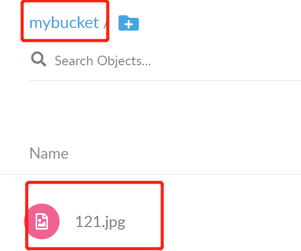

> # MINIO对象存储服务

## 说多了都是扯淡，简单得一P，贴个官方中文文档

```
http://docs.minio.org.cn/docs/
```

##  docker启动

```properties
# 拉镜像
docker pull minio/minio
# 启动
docker run -d -p 9000:9000 --name minio1 -v /mnt/data:/data -v /mnt/config:/root/.minio  minio/minio server /
## 官方的启动是前台，且容器消失之后存储的数据也就没了，简单解释下。
-d: 后台启动
-v: docker卷操作，/data是minio的对象存储目录，把宿主机/mnt/data挂载到容器的/data,这样保证容器丢失数据也不会丢失。
分布式: minio分布式，数据恢复，多磁盘就是一个命令的事，看文档吧。
```

启动后地址：http://ip:port/9000，初始用户都是minioadmin/minioadmin,如果你按照官方的启动方式，前台启动的话就会看到这个信息，如果你是像我一样后台启动的，就去看容器日志吧.

路径：宿主机 /var/lib/docker/containers/容器id/xxx.log

## AWS S3

```
解释一下Minio支持AWS S3是什么意思吧。毕竟一开始也差点懵逼了。
AWS S3 就是亚马逊Simple Storage Service, 提供标准的对象存储服务API接口，说白了就是一个规范，定义了API接口。
Minio支持AWS S3说的就是这个minio的客户端MinioClient支持对AWS S3服务的接口规范，你可以使用这个MinioClient来操作实现AWS S3的对象存储服务器。
再通俗点讲: 开发人员开发了mysql数据库，他需要提供一个mysql的驱动。现在AWS S3服务出来了，他也需要一个驱动，现在MinioClient就可以当做是他的驱动。
```

## MC

mc 就是一个minio的客户端，用来查看mino的桶，对象等信息的工具。

拿官方的话讲就是：

```
MinIO Client (mc)为ls，cat，cp，mirror，diff，find等UNIX命令提供了一种替代方案。它支持文件系统和兼容Amazon S3的云存储服务（AWS Signature v2和v4）。
```

上面这个v2和v4是等哈要用哦。来都来了还是随便说一下啊意思一下吧。

这个玩意儿就不用去搞啥容器了。Linux版直接下个mc的工具就行(文档也有,官方的)。

```
http://dl.minio.org.cn/client/mc/release/linux-amd64/mc
chmod +x mc
```

好了，你就可以用了。

先添加一个存储库

```
# 先添加一个存储库
mc config host add <ALIAS> <YOUR-S3-ENDPOINT> <YOUR-ACCESS-KEY> <YOUR-SECRET-KEY> [--api API-SIGNATURE]
# eg, s3v4,v4就是上面那个AWS Signature
mc config host add minio http://192.168.2.16 minioadmin minioadmin --api s3v4
```

配置之后就可以操作了。比如mc ls play，列出所有的的存储桶。剩下的--help吧，我也没操作过。

虽然有--help，还是贴个操作指令占占空间，嘻嘻。

```properties
ls       列出文件和文件夹。
mb       创建一个存储桶或一个文件夹。
cat      显示文件和对象内容。
pipe     将一个STDIN重定向到一个对象或者文件或者STDOUT。
share    生成用于共享的URL。
cp       拷贝文件和对象。
mirror   给存储桶和文件夹做镜像。
find     基于参数查找文件。
diff     对两个文件夹或者存储桶比较差异。
rm       删除文件和对象。
events   管理对象通知。
watch    监视文件和对象的事件。
policy   管理访问策略。
config   管理mc配置文件。
update   检查软件更新。
version  输出版本信息。
```

实际上如果用不到那么细，直接打开界面就看得到所有了，直接在页面上操作他不香吗？它香得一P。


服务搭建起来了就ok了，什么上传啊，下载啊啥的就那几个api，自己玩儿吧，官方也有demo，我就直接页面上操作上传啥的了。

## 图片访问

文件上传了，咋访问呢？

假如这是一个图片服务器，那我们再上传之后，需要一个能直接访问的url连接，页面上才能直接展示噻。

minio文件上传之后，由于我们挂载了容器卷，文件直接就在宿主机上。来嘛，给你看一下。

桶目录：

```
/mnt/data
   |-mybucket
   |-newbucket
## 桶下面就直接是文件
```


文件都找打了，直接搭建一个NG作为静态服务器它不香吗（minio支持压缩，压缩的这种不算哈）？

minio自生的访问方式，可以在页面上点击对应文件后面的三个点点分享，但是分享最多有效期只有7天。

直接通过minio访问方式如下，这个涉及到桶的存储策略。

```
http://ip:port/<bucketName>/<objectName>访问。
http://ip:port/mybucket/121.jpg
```

## 存储桶策略BucketPolicy

```
这个BucketPolicy是个什么玩意儿？我不晓得有没有人跟我一样，从最开始的懵逼到知道后觉得傻逼。记录一下吧，万一有小伙伴跟我一样呢。来吧，我直接操作完你就晓得了。
```

### 创建bucket并指定policy

> 创建并指定桶mybucket的策略为*/Read_Only


> 创建并指定桶newbucket的策略为12*/Read_Only


好了，现在我们上传几个文件到这两个桶里面。

> mybucket下121.jpg



> newbucket下121.jpg，131.jpg


好的，准备工作结束了，我们来捋一下我们都做了些啥。

|    桶     |  BokcetPolicy   |       文件       |
| :-------: | :-------------: | :--------------: |
| mybucket  |  * / Read_Only  |     121.jpg      |
| newbucket | 12* / Read_Only | 121.jpg, 131.jpg |

好了，现在打开新的浏览器，或者无痕窗口，保证你的minio是未登录状态。

现在依次打开连接查看三个文件。

```
http://192.168.2.16:9000/mybucket/121.jpg   能打开
http://192.168.2.16:9000/newbucket/121.jpg  能打开
http://192.168.2.16:9000/newbucket/131.jpg  不能打开，需要登录
```

这下知道存储桶的策略了噻。

### 总结

```
bucketPolicy
作用于当前bucket上，对当前bucket内的所有对象有效，实际上就是配置了当前桶内的对象的访问策略。

配置为*表示对所有对象有效，占位符，懂得都懂，不解释了。
newbucket配置了12*为只读，表示当前桶下只有12开头的对象是可以匿名访问的
，即直接访问http://ip:port/newbucket/121.jpg是可以显示的，
但是无法直接显示http://ip:port/newbucket/131.jpg
```


好了，其他的就自己玩儿了吧，官方有很多demo，API啥的代码我就不写了。


