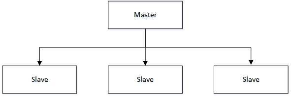
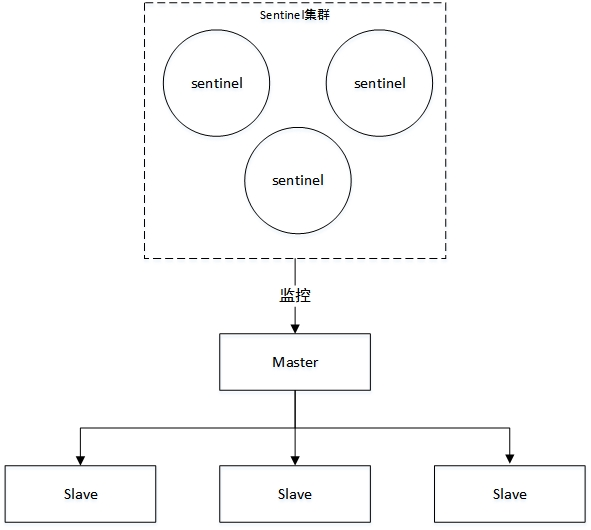
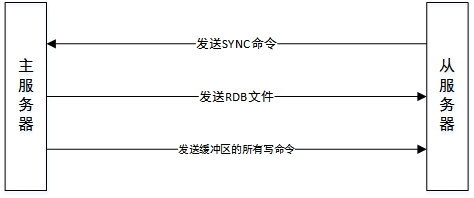
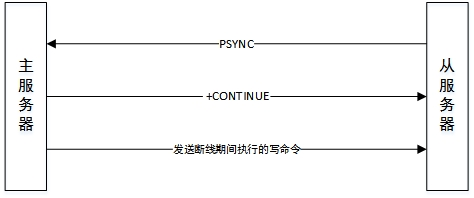

> # Redis Cluster

# 集群

redis集群有以下几种方式

- 普通一主多从
- 普通一主多从+哨兵
- cluster分片模式

## 一主多从



搭建方式网上很多，就不多描述了。

这种集群方式，一般master用作写，slave用做读，用来做读写分离，slave的数据从master同步。

这种情况下，由于master只有一个，所有容灾性不新，如果master挂掉之后，slave不能自动升级成master对外提供服务。而且master还是否挂掉， 这个问题也不好得知。

这个时候我们可能就需要获取master的状态，并且在master挂掉的情况下能够自动将其中一个slave自动升级成master，继续对外提供服务，因此哨兵就来了。

## 一主多从+哨兵（Sentinel）

哨兵是在一主多从的基础上，增加对redis服务器的监控，并在down机时自动将其中一个slave升级成master，这也就是哨兵的作用。



哨兵本质上只是一个运行在特殊模式下的Redis服务器。哨兵的启动

```
redis-sentinel /path/sentinel.conf
或者
redis-server /path/sentinel.conf --sentinel
```

- 初始化服务器
- 使用sentinel专用代码
- 初始化sentinel状态
- 初始化sentinel状态的masters属性
- 创建连向主服务器的网络连接

哨兵配置文件sentinel.conf中只用配置master服务器的信息就行了，哨兵服务器会发送INFO命令，从服务器的信息可以根据回复来获取。

如果哨兵是采用的集群模式的话，master挂掉之后，一开始是被标记为主观下线状态，当一般以上的哨兵都将master标记为主观下线状态的时候，这个时候maste就会别编辑成客观下线状态。

这个时候master就被认定是已经挂掉，然后Sentinel开始选举领头Sentinel（采用Raft算法，这个TM的没看过，哈哈），然后由这个sentinel对下线的主服务器执行故障转移操作。

在选举产生领头Sentinel之后，执行的故障转移操作包括：

1.  在已下线主服务器属下的所有从服务器中，挑选一个，并将其升级成主服务器。
2.  让已下线主服务器属下的所有从服务器改为复制新的主服务器。
3.  将已下线主服务器设置成新的主服务器的从服务器。

**哨兵之间通信通过订阅服务器消息来实现，当多个sentinel监视同一个master的时候，各个sentinel之间就可以通过订阅的消息知道其他的sentinel，这样来自动实现sentinel的集群。**

**Sentinel在连接主服务器或从服务器时，会创建命令连接和订阅连接，而在连接其他Sentinel时只会创建命令连接，因为Sentinel需要通过接受主服务或者从服务器发来的频道信息来来发现未知的Sentinel，而相互已知的Sentinel之间只使用命令连接来进行通信就够了。**

这种集群方式解决了down机自动切换，服务器监控的功能，但是也有缺点，就是这种方式的存储始终决定于最小内存的那台机器。

## cluster分片

Redis集群是Redis提供的分布式数据库解决方案，集群通过分片（sharding）来进行数据共享，并提供复制和故障转移功能。

### 启动节点

一个节点就是一个运行在集群模式下的Redis服务器，Redis服务器在启动时会根据cluster-enable配置选项的值来决定是否开启 集群模式。

默认情况下这个值是否no，这个时候redis服务器就是一台单机的普通redis服务器，如果要使其成为一个节点，我们需要将cluster-enable的值设置成true。

### 组成集群

一个集群包含多个节点，在刚开始的时候每个节点都是独立的，因此我们需要使用如下命令将其连接再一起，来构成一个包含多个几点的集群。

```
# 与其他节点进行握手
cluster meet <ip> <port>
# 移除其中某个节点
cluster forget <node_id>
# 显示所有的节点，节点的id等信息
cluster nodes
# 显示集群状态信息
cluster info
```

### 槽指派

刚启动的集群是没办法执行客户端set等命令的。

Redis集群通过分片的方式来保存数据库中的键值对，集群的整个数据库被分为16384个槽（slot），数据库中的每个键都属于16384个槽的其中一个，可以想成是hash表。

当所有的槽都有节点在处理的时候，集群处于上线状态（ok）;相反的，如果有任何一个槽未处理，那么集群处于下线状态（fail）。

```
redis> cluster info
cluster_state:fail
...
```

使用命令给节点指派槽:

```
# 示例，把0-5000的槽指派给指定机器负责
# 在连接到某个机器之后执行cluster addslots 1 2也可以将1和2两个槽指派给当前机器，但是不支持{0..5000}这种，所以没有使用这种方式。
redis-cli -h <ip> -p <port> cluster addslots {0..5000} 
```

当所有槽都指派完成之后。

```
# 状态变成了ok
redis> cluster info
cluster_state:ok
...
# 可以查看所有节点负责的槽信息。
redis> cluster nodes
4aaf1a3dc6318e9a5518747c145556f7ce9d70d3 127.0.0.1:6479@16479 master - 0 1567481752045 4 connected 0-5000
e46c0444ea0b40afb2e189ffdcf228d3be2844ae 127.0.0.1:26379@36379 master - 0 1567481753055 0 connected 5001-10000
b73d2aebb19e7dd6071e341bb49d97fcfec851c1 127.0.0.1:46379@56379 master - 0 1567481751035 2 connected 10001-16383
...
```

至于重新分片（当有新机器加入，需要重新指派槽）这种操作，这里就不介绍了，这个要靠Redis的集群管理软件redis-trib负责执行。这个。。。百度吧~~~

### 集群的连接

当所有的槽都有节点负责之后，redis集群就可以对外提供服务了。

这个时候如果我们以单机的形式连接到其中一台机器上。

```
redis-cli -p 6379
redis> set a a
(error) MOVED 15495 127.0.0.1:46379
```

返回了一个错误？？？这个MOVED错误表示当前的key由槽15496处理，负责这个槽的机器是127.0.0.1:46379。这个错误的意思是让我们切换到对应的机器上去处理这个命令。

计算key的所属槽的命令。

```
cluster keyslot <key>
redis> cluster keyslot a
(integer) 15495
```

虽然可以计算key所属的槽，但是总不能每set一个都计算一次吧。

这个时候我们就需要使用集群的方式来连接redis集群了。加上-c参数

```
redis -c -p 6379
127.0.0.1:6379> set a a
-> Redirected to slot [15495] located at 127.0.0.1:46379
OK
127.0.0.1:46379>
```

看到没，这个时候，返回了OK，也输出了熙熙located at127.0.0.1:46379，而且这个时候我们当前的节点直接从6379变成了46379这个节点。

**这种集群模式下redis里面并不是只有一个master，而是有很多的master，所有的master都叫主节点，所有主节点一起负责16384个槽。**

在这种情况下如果其中一个master挂掉之后岂不是GG？所所以我们需要为master配置slave，这样在，master挂掉之后，slave就可以顶上去，但是并不会使用sentinel了。

### 配置slave

设置从节点的命令：

```
# 让当前节点(接收命令的节点)成为node_id所指定的节点的丛节点，并开始对主节点进行复制
cluster replicate <node_id>
```

**执行这个命令之前要先使用cluster meet命令让这个节点加入集群，让其他节点看到这个节点的存在。**

连接到6379这台机器，执行命令，使其成为6479这台机器的从节点。是6479这台机器node_id=4aaf1a3dc6318e9a5518747c145556f7ce9d70d3（cluster nodes命令可以看）。

```
redis:6379> cluster replicate 4aaf1a3dc6318e9a5518747c145556f7ce9d70d3
redis: 6379> cluster nodes
7f719c0e0be6b68127f87a45ad59383305ee4e17 127.0.0.1:6379@16379 myself,slave 4aaf1a3dc6318e9a5518747c145556f7ce9d70d3 0 1567482156000 1 connected
4aaf1a3dc6318e9a5518747c145556f7ce9d70d3 127.0.0.1:6479@16479 master - 0 1567482155637 4 connected 0-5000
...
```

这个时候即使我们手动kill调6479这台机器，集群也不会挂掉，因为从节点6379会顶上去成为master。

kill掉6479这台master之后。

```
127.0.0.1:6379> cluster nodes
7f719c0e0be6b68127f87a45ad59383305ee4e17 127.0.0.1:6379@16379 myself,master - 0 1567483412000 5 connected 0-5000
4aaf1a3dc6318e9a5518747c145556f7ce9d70d3 127.0.0.1:6479@16479 master,fail - 1567483384335 1567483383427 4 disconnected
...
```

从cluster nodes输出中可看到，6379

这台机器变成了master，并且6479这台机器状态变成了master,fail.

然后我们重启6479这台机器。

```
127.0.0.1:6379> cluster nodes
7f719c0e0be6b68127f87a45ad59383305ee4e17 127.0.0.1:6379@16379 myself,master - 0 1567483600000 5 connected 0-5000
4aaf1a3dc6318e9a5518747c145556f7ce9d70d3 127.0.0.1:6479@16479 slave 7f719c0e0be6b68127f87a45ad59383305ee4e17 0 1567483603534 5 connected
...
```

可以看到6479这台机器变成了slave，master是6379这台机器。

## 优缺点总结

在 redis 中，实现 **高可用** 的技术主要包括 **持久化**、**复制**、**哨兵** 和 **集群**，下面简单说明它们的作用，以及解决了什么样的问题：

- **持久化**：持久化是 **最简单的** 高可用方法。它的主要作用是 **数据备份**，即将数据存储在 **硬盘**，保证数据不会因进程退出而丢失。
- **复制**：复制是高可用 Redis的基础，**哨兵** 和 **集群** 都是在 **复制基础** 上实现高可用的。复制主要实现了数据的多机备份以及对于读操作的负载均衡和简单的故障恢复。缺陷是故障恢复无法自动化、写操作无法负载均衡、存储能力受到单机的限制。
- **哨兵**：在复制的基础上，哨兵实现了 **自动化** 的 **故障恢复**。缺陷是 **写操作** 无法 **负载均衡**，**存储能力** 受到 **单机** 的限制。
- **集群**：通过集群，Redis 解决了 **写操作** 无法 **负载均衡** 以及 **存储能力** 受到 **单机限制** 的问题，实现了较为 **完善** 的 **高可用方案**。

# 复制

Redis当中，用户可以通过执行SLAVEOF命令或者设置slaveof选项，让一个服务器去复制另一个服务器。

```
redis> SLAVEOF 1217.0.0.1:6379
```

Redis的复制功能分为同步（sync）和命令传播（command propagate）两个操作：

- 同步操作作用于将从服务器的数据库状态更新至主服务器当前所处的数据库状态。
- 命令传播操作则用于在主服务器的数据库状态被修改，导致主从服务器的数据库状态不一致时，让主从服务器的数据库重新回到一致状态，命令由主服务发送给从服务。

## 主从服务器同步（SYNC）

1. 从服务器向主服务器发送SYNC命令。
2. 收到SYNC命令的主服务器执行BGSAVE指令，在后台生成RDB文件，并使用一个缓冲区记录从现在开始执行的所有写命令。
3. 当主服务的BGSAVE命令执行完毕时，主服务器会将BGSAVE命令生成的RDB文件发送给从服务器，从服务器接收并载入这个RDB文件，将自己的数据库状态更新至主服务器执行BGSAVE命令时的数据库状态。
4. 主服务器将记录在缓冲区里面的所有写命令发送给从服务器，从服务器执行这些写命令，将自己的数据库状态更新至主服务当前所处的状态。



| 时间 |                           主服务器                           |                       从服务器                        |
| :--: | :----------------------------------------------------------: | :---------------------------------------------------: |
|  T0  |                          服务器启动                          |                      服务器启动                       |
|  T1  |                          set k1 v1                           |                                                       |
|  T2  |                          set k2 v2                           |                                                       |
|  T3  |                          set k3 v3                           |                                                       |
|  T4  |                                                              |                     发送SYNC命令                      |
|  T5  | 接收到从服务器发来的SYNC命令，执行BGSAVE命令，创建包含键k1，k2，k3的RDB文件，并使用缓冲区记录接下来执行的所有写命令 |                                                       |
|  T6  |               set k4 v4，并将命令记录到缓冲区                |                                                       |
|  T7  |               set k5 v5，并将命令记录到缓冲区                |                                                       |
|  T8  |          BGSAVE命令执行完毕，向从服务器发送RDB文件           |                                                       |
|  T9  |                                                              | 接收并载入主服务器发来的RDB文件，会的k1，k2，k3三个键 |
| T10  |    向从服务器发送缓冲区中保存的写命令set k4 v4和set k5 v5    |                                                       |
| T11  |                                                              |  接收并执行主服务发来的两个set命令，得到k4和k5两个键  |
| T12  |      同步完成，现在主从服务器都包含了k1，k2，k3，k4，k5      |  同步完成，现在主从服务器都包含了k1，k2，k3，k4，k5   |

## 命令传播

当同步完成之后，主从服务器的数据库都达到了一致的状态，这个时候，如果主服务器接收到写命令，比如del k1，这个时候主服务执行完这个命令之后，与从服务器的数据库状态又不一致了。

这个时候主服务器需要对从服务执行**命令传播**操作，主服务器会将自己执行的写命令，也就是造成主从服务器不一致的那条命令，发送给从服务器执行，从服务器执行完之后，主从服务器数据库重新回到一致状态。

## SYNC缺陷

SYNC命令是非常耗时的，每次执行SYNC命令，主服务器都需要重新生成RDB文件，这个操作会耗费大量的CPU内存和磁盘I/O。生成的RDB文件又需要通过网络发送给从服务器，耗费大量的网络资源。

在旧版的实现当中，如果某台从服务器突然断线了，这个时候主服务器执行了某些写语句，导致了主从不一致。从服务器连上时，需要重新进行同步，又要进行SYNC了。

而实际上在这种情况下，我们从服务器绝大部分数据是和主服务器是一致的，我们只需要同步断线之后的写语句就行了，这样就可以节约很多资源，而且速度也很快。因此PSYNC就来了。

## PSYNC

新版复制功能PSYNC出现是为了解决旧版SYNC的复制低效的问题。

PSYNC命令具有**完整重同步**和**部分重同步**两种模式。

- 完整重同步执行的步骤和SYNC命令执行的步骤基本一样，他们都是通过生成并传送RDB文件，以及向从服务器发送保存在缓冲区的命令来实现同步。
- 部分重同步则用于处理断线后重复制的情况，当从服务器断线后重新连接主服务器时，如果条件允许，主服务器可以将主从服务器连接断开期间执行的写命令发送给从服务器，从服务器执行完这些写命令，就可以更新数据库到主服务器状态。



部分重同步主要有以下三个部分构成：

- 主服务器的复制偏移量和从服务器的复制偏移量
- 主服务器的复制积压缓冲区
- 服务器的运行ID

偏移量很好理解，服务器运行id用来确认从服务器是否是复制的自己，也很好理解，这里说一下复制积压缓冲区。

### 复制积压缓冲区

复制及压缓冲区是由主服务器维护的一个固定长度的**FIFO队列**，默认大小为1M。**存储的命令也是协议格式哦！**

当主服务器进行命令传播时，不仅会将命令发送给所有从服务器，还会讲命令入队到复制及压缓冲区。

**当从服务器重新连上主服务器时，从服务器会通过PSYNC命令将自己的复制偏移量offset发送给主服务器，主服务器会根据这个复制偏移量量来决定执行哪种同步。**

如果offset偏移量之后的数据还在复制积压缓冲区，那么执行部分重同步，否则执行完整重同步。

**复制积压缓冲区设置的默认大小为1M，如果主服务器执行大量写命令，1M可能就不够了。复制积压缓冲区大小可以根据公式second *  write_size_per_second来进行估算。**

- 其中second表示从服务器断线后重新连上的平均时间（秒）

- write_size_per_second表示主服务器平均每秒产生的写命令数据量（协议格式的写命令长度总和）

比如从服务器短线重连平均时间为5s，主服务器每秒产生式1M的写命令数据量，那么复制积压缓冲区大小就不能低于5M。**为了安全起见，可以将复制积压缓冲区设置为2 * second * write_size_per_second**

至于复制积压缓冲区大小修改方法，参考配置文件中repl-backlog-size选项说明。

```properties
repl-backlog-size 1m
repl-backlog-ttl 3600
```

在主服务器有一段时间没有连接副本后，将释放backlog。repl-backlog-ttl选项配置从最后一个副本断开连接开始释放backlog缓冲区所需的秒数。

**请注意，副本永远不会释放backlog以供超时使用，因为它们可能在以后升级为主副本，并且应该能够与副本正确地“部分重新同步”：因此它们应该始终累积backlog。**

# 心跳检测

在命令传播阶段，从服务器默认会以每秒一次的频率，向主服务器发送命令：

```
REPLCONF ACK <replication_offset>
```

其中replication_offset是当前从服务器的复制偏移量。

发送这个命令的作用有：

- 检测主服务器的网络连接状态
- 辅助实现min-replicas选项（低版本是min-slave）
- 检测命令丢失

检测网络状态就不用多说了，来说一下min-replicas和检测命令丢失。

## min-replicas

redis的以下两个配置可以防止主服务器在不安全的情况下执行写命令。

```properties
min-replicas-to-write 3
min-replicas-max-lag 10
```

这两个配置表示当从服务器的数量小于3个，或者三个从服务器的延迟（lag）值都大于或等于10秒时，主服务器将拒绝执行写命令，延迟值可以在主服务器上执行INFO replication命令，查看lag值。

```shell
redis> INFO replication
# Replication
role:master
connected_slaves:1
slave0:ip=127.0.0.1,port=6479,state=online,offset=43040,lag=1
...
```

## 检测命令丢失

如果因为网络故障，主服务器传播给从服务器的写命令在迷路了，没有到达从服务器，**那么在从服务想主服务器发送REPLCONF ACK命令时，主服务发现从服务当前的复制偏移量少于自己的复制偏移量。主服务器就会根据从服务器提交的复制偏移量，在复制积压缓冲区里找到缺少的数据，重新发送给从服务器**。


over~~~