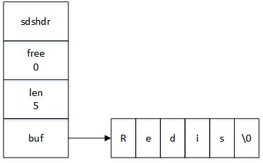
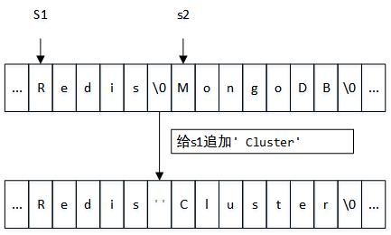
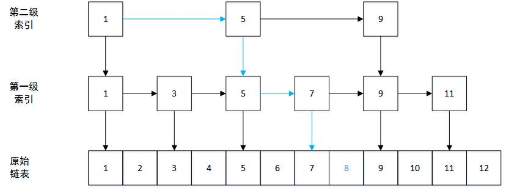
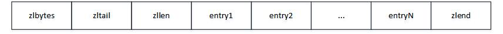
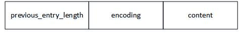
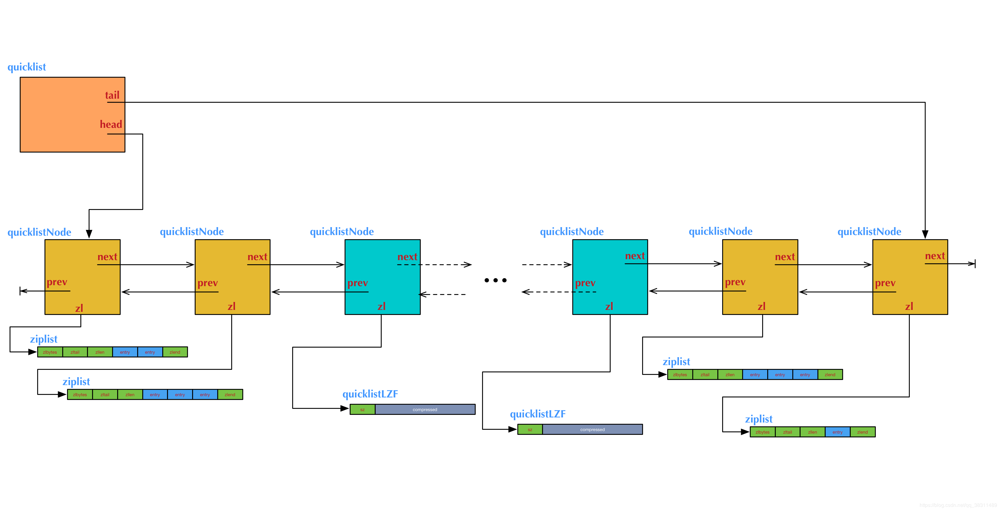

> # Redis数据结构

Redis作为内存数据库，被用于分布式缓存首选。作为一个coder，没有想必刚踏入职场第一天就了解了这玩意儿吧。这家伙是个单线程的，但是为什么很快？我们通常自定义缓存的时候，用map结构的比较多。那这玩意儿都用了什么数据结构来实现呢？这货的底层实现是c，对于c我们就不多解释了（不做源码分析，别想多了），开始来看看这货的数据结构吧。

# SDS(Simple Dynamic String)

Redis没有直接使用C语言的传统字符串表示，而是使用了自己构建的一种简单动态字符串SDS.那既然用了，肯定有其优势。

## 定义

```c
// sds.h/sdshdr
struct sdshdr {
    // 记录buf数组中已使用的字节数量
    // 也就是SDS已保存的字符串的长度
    int len;
    // 记录buf数组中未使用的字节数量
    int free;
    //字节数组，用于保存字符串
    char buf[];
}
```

## 优点1: 可以复用一部分C字符串库函数里面的函数

**c中以空字符'\0'表示字符串结束。SDS遵循C字符以空字符结尾的惯例，保存空字符的1字节空间不计算在SDS的len属性里面。使用这种惯例可以让SDS可以直接使用一部分C字符串函数库里面的函数。**



如图所示：Redis字符串长5个字节，len=5，free=0，空字符\0不会计入sds的len属性。

## 优点2: 常数时间获取字符串长度

C字符串不记录字符串长度，所以在获取c字符串长度的时候，程序必须变量整个字符串，对遇到的每个字符进行统计，直到遇到结尾空字符为止，复杂度O(N)。

而SDS的len属性直接记录了字符串的长度，在获取字符串的长度时，复杂度进位O(1)，而不用遍历字符串计算，所以也不会对性能造成影响。

## 优点3: 杜绝缓冲区溢出 

c除了获取字符串长度的复杂度高之外，还容易造成缓冲区溢出。比如我们在进行字符串拼接的时候。

```c
char *strcat(char *dest, cpnst char *src)
```

**因为c不记录长度，所有假定用户再执行strcat函数的时候，已经为dest分配足够多的的内存，可以容纳src字符串的所有内容，一旦假设不成立，就会产生缓冲区溢出。**

假设内存中紧挨着字符串s1和s2，其中s1=Redis，s2=MongoDB.那么当执行strcat函数，给s1追加" cluster"的时候，忘记了给s1分配足够的空间，那么将导致s2被意外的更改。



**SDS当中，当需要对其做更改时，程序会先检查SDS的空间是否满足修改所需的要求，如果不满足，将自动扩容，避免了产生缓冲区溢出的问题。**

## 优点4: 减少重分配次数

杜绝缓冲区溢出时，SDS会自动扩容。如果使用c，那每一次追加时都需要进行内存的重分配。而SDS不采用这种策略。SDS在扩容时重分配的大小和追加的字符串长度有关。

**SDS采用空间预分配策略。**其中额外分配的未使用的空间数量由以下约束决定：

- 如果对SDS进行修改之后，SDS的长度小于1MB,那么程序分配和len属性同样大小的未使用空间。这时SDS的len属性的值和free属性的值相同。比如某个SDS修改经过扩容之后，len变成了13个字节，那么程序也会分配13直接的未使用空间，即free=13.SDS实际的buf数组实际长度将变成27,13已使用+13未使用+1结束空字符。
- 如果SDS修改之后超过1M,那么只分配1M的未使用空间。

## 优点5: 二进制安全

C字符串中的字符必须符合某种编码(比如ASCII)，并且除了字符串的末尾之外，字符串不能报刊空字符，否则程序将误认为空字符是字符串结尾，这些限制是的C字符串只能保存文本数据。

比如我们使用空字符来分隔多个单词的特殊数据格式，这种格式就不能用C字符串来保存，因为遇到空字符之后，c就会认为字符串已经结束了。

**SDS来保存这类特殊格式数据就没有任何问题，因为SDS使用len属性而不是空字符来判断字符串是否结束**

## 总结

|                 C                  |                  SDS                   |
| :--------------------------------: | :------------------------------------: |
|         获取字符串长度O(N)         |           获取字符串长度O(1)           |
|         可能造成缓冲区溢出         |           不会造成缓冲区溢出           |
| 扩展字符串长度N次执行N次内存重分配 | 扩展字符串长度N次执行最多N次内存重分配 |
|          只能保存文本数据          |               二进制安全               |
|    可以使用<string.h>库中的函数    |   可以使用一部分<string.h>库中的函数   |

# 链表

链表这东西没啥好说的，我们来看一下定义吧。

```c
// adlist.h/listNode
typedef struct listNode {
    // 前节点
    struct listNode *prev;
    // 后节点
    struct listNode *next;
    // 节点的值
    void *value;
} listNode
```

链表的节点结构体如上所示，但是实际操作起来可能不是那么灵活，比如我们要获取头结点啊，尾节点啊啥的，总不能每次都慢慢遍历到头结点或者尾节点噻，这样的话我们就需要有一个玩意儿来持有这个东西，让我们操作起来更方便。

```c
// adlist.h/list
typedef struct list {
    // 表头节点
    listNode *head;
    // 表尾节点
    listNode *tail;
    //链表长度
    unsigned long len;
    //节点值复制函数
    void *(*dup)(void *ptr);
    //节点值释放函数
    void *(*free)(void *ptr);
    //节点值对比函数
    int (*match)(void *ptr, void *key);
} list
```

其他的就不说了，链表这东西很常见了。

链表这东西从3.2版本之后就换成了quicklist了，具体看后面。

# 字典(key-value)

字典，也就是我们说的键值对，hash表，跟java里面的map道理是一样一样的。

hash表这个也不多说了，数组+链表，不熟悉的去了解java的map吧，原理是一样的，实现语言不一样而已。

# 跳跃表

跳跃表，我们经常说的跳表就是这货了。

这货其实也是由链表实现的，只不过这货分了很多层，分这么多层的原因是为了加快查询速度。想像一下，链表查询是不是必须要遍历所有的节点，一个个比对？

跳表的作用就是可以跨层，说不清楚，来吧直接上图，我们来解释一下为啥跳表查询块。



注意图中蓝色的线为查找过程。

底层为我们的原始链表，比方说我们要查找8这个数据。

1. 我们首先会在最顶层的索引当中找，发现8>5 && 8<9，于是直接跳到下一层索引中5的位置；
2. 继续查找，发现8>7 && 8<9，于是跳到在下一层7的位置；
3. 继续往后查找，找到8，返回。

redis里面的跳表和这个原理是一样的，就不过多解释了。

# 整数集合

```
redis> SADD numbers 1 2 3
(integer) 5
redis> OBJECT ENCODING numbers
"intset"
```

OBJECT ENCODING key查看数据结构类型。

整数集合intset是Redis用于保存整数数值的集合抽象数据结构，他可以保存类型为int16_t、int32_t、int64_t的整数值，**并且保证集合中不会出现重复元素。**

```c
// intset.h/intset
typedef struct intset {
    // 编码方式
    uint32_t encoding;
    // 集合包含的元素数量
    uint32_t length;
    // 保存元素的数组
    int8_t contents[];
} intset;
```

contents数组是整数集合的底层实现，整数集合的每个元素都是contents数组的一个数组项，**各个想在数组中按从小到大有序排列，且不包含重复项。**

虽然contents属性声明为int8_t类型的数组，但实际上并不保存任何int8_t类型的值，contents数组的真正类型取决于encoding属性的值。

- 如果encoding值为INTSET_ENC_INT16/32/64,那么contents就是一个int16/32/64_t类型的数组，数组里的每一项都是int16/32/64_t的整数值。

## 升级

当我们最往整数集合中添加了int16_t类型的数据时，集合中每一项都是init16_t类型的数据，那么这个时候如果我们添加了一个int32_t类型的数据，怎么办呢？这个时候就要进行升级操作，**所谓升级操作，就是将所有的数据都变成int64_t类型的，然后再将数据添加到集合当中。**

来图解一下过程吧。

原始集合数据，每一个都占用了16位。

|  位  | 0-15位 | 16-31位 | 32-47位 |
| :--: | :----: | :-----: | :-----: |
| 元素 |   1    |    2    |    3    |

现在添加一个32位才能表示的数据65536.

第一步，根据新元素类型，扩展整数集合底层数组的空间大小，并未新元素分配空间。

|  位  | 0-15位 | 16-31位 | 32-47位 | 48-127位   |
| :--: | :----: | :-----: | :-----: | ---------- |
| 元素 |   1    |    2    |    3    | 新分配空间 |

第二步，将现有元素转换成与新元素相同的类型，并将类型转换后的元素放到正确的位上。放的时候从最后的元素开始放，因为如果从前面开始放的话，由于是大了位，可能会影响后边元素数据。也就是先放3，再放2，再放1...

|  位  | 0-31位 | 31-63位 | 64-95位 | 96-127位   |
| :--: | :----: | :-----: | :-----: | ---------- |
| 元素 |   1    |    2    |    3    | 新分配空间 |

第三步，将新元素添加到集合里面(新元素导致了升级，所以一定是最大的吗，直接放最后面)。

|  位  | 0-31位 | 31-63位 | 64-95位 | 96-127位 |
| :--: | :----: | :-----: | :-----: | -------- |
| 元素 |   1    |    2    |    3    | 65536    |

升级存在主要是为了提升整数集合的灵活性和尽可能的节约内存。

灵活性是指: 我们可以自动通过升级来升级来适应新元素，所以我们可以随意的将16,32,64位整数添加到集合中而不必担心类型错误。

节约内存是指: 我们就可以使用适合数据的32位或者16位来灵活的保存数据，而不是强制使用64位来保存而浪费掉多余的内存。

> 一单升级成功，不支持降级！！！

# 压缩列表

## 组成结构

压缩列表(ziplist)是列表建和hash键的底层实现之一。当一个列表键只包含少量列表项，并且每个列表项幺妹就是小整数值，要么就是长度比较短的字符串时，Redis就会使用压缩列表来做列表建底层的实现。

```
redis> RPUSH lst 1 3 5 10086 "hello" "world"
(integer) 6
redis> OBJECT ENCODING lst
"quicklist"
```

quicklist？？？不是ziplist吗？哈哈，我这里的版本是5.0，要在3.2之前的版本才是ziplist哦，quicklist将ziplist变成了双向链表，更6p了哦！

```
redis> hmset person "name" "wt" "age" "26"
OK
redis> OBJECT ENCODING person
"ziplist"
```

压缩列表是Redis为了节约内存而开发的，**是一系列由特殊编码的连续内存块组成的顺序型数据结构。**一个压缩列表可以包含任意多个节点（entry），每个节点可以保存一个字节数组或者一个整数值。

来看看他的结构



各部分组成说明

|  属性   |   类型   | 长度  |                             用途                             |
| :-----: | :------: | :---: | :----------------------------------------------------------: |
| zlbytes | uint32_t | 4字节 | 记录整个压缩列表占用的内存字节数：在对压缩列表进行内存重分配，或者计算zlend的位置时使用 |
| zltail  | uint32_t | 4字节 | 记录压缩列表表尾节点距离压缩列表的起始地址有多少个字节：通过这个偏移量，程序无需遍历整个压缩列表就可以确定表尾节点的地址 |
|  zllen  | uint16_t | 2字节 | 记录了压缩列表包含的节点数量：当这个属性的值小于UINT16_MAX(65535)时，这个属性的值就是压缩列表包含节点的数量；当这个值等于65535时，节点的真是数量需要遍历整个压缩列表才能计算得出 |
| entryN  | 列表节点 | 不定  |     压缩列表包含的各节点，节点的长度由节点保存的内容决定     |
|  zlend  | uint8_t  | 1字节 |              特殊值0xFF，用于标记压缩列表的末端              |

## 节点构成

每个压缩列表节点可以保存一个字节数组或者一个整数值，其中，

字节接数组可以是以下三种长度的一种：

- 长度小于等于63（2^6-1）字节的字节数组；
- 长度小于等于16383（2^14-1）字节的字节数组；
- 长度小于等于（2^32-1）字节的字节数组；

整数值可以是以下六种长度的其中一种：

- 4位长，介于0-12之间的**无符号整数**；
- 1字节长的**有符号整数**；
- 3字节长的**有符号整数**；
- int16_t类型的**整数**；
- int32_t类型的**整数**；
- int64_t类型的**整数**；

节点组成：



> previous_entry_length:

以字节为单位，记录了压缩列表中前一个节点的长度，属性长度可以是1字节或者5字节，如果前一个节点的长度小于254，那么previous_entry_length就是一个字节；大于或等于254就是5字节。

> encoding:

记录了节点的content属性所保存的类型以及长度

- 1字节，2字节或者5字节长，值的最高位为00,01或者10的似乎字节数组编码，这种编码表示节点的content属性保存着字节数组，数字的长度由编码除去最高两位之后的其他位记录；
- 1字节长，指的最高位以11开头的是整数编码，这种编码表示节点的content属性保存着整数值，整数值的类型和长度由编码除去最高位之后的其他位记录；

来个表格说明：（表格中的b，x代表实际的二进制数据，为了看起来方便）

字节数组编码

|                       编码                        | 编码长度 |     content属性保存的值     |
| :-----------------------------------------------: | :------: | :-------------------------: |
|                     00bbbbbb                      |  1字节   |  长度小于63字节的字节数组   |
|                 01bbbbbb xxxxxxxx                 |  2字节   | 长度小于16383字节的字节数组 |
| 10_ _ _ _ _ _ aaaaaaaa bbbbbbbb cccccccc dddddddd |  5字节   | 长度小于(2^32-1)的字节数组  |

整数编码

|   编码   | 编码长度 |                     content属性保存的值                      |
| :------: | :------: | :----------------------------------------------------------: |
| 11000000 |  1字节   |                      int16_t类型的整数                       |
| 11010000 |  1字节   |                      int32_t类型的整数                       |
| 11100000 |  1字节   |                      int64_t类型的整数                       |
| 11110000 |  1字节   |                        24位有符号整数                        |
| 11111110 |  1字节   |                        8位有符号整数                         |
| 1111xxxx |  1字节   | 使用这一编码的节点没有相应的content属性，因为编码本身的xxxx四位已经保存了一个介于0-12之前的值，所有它无需content属性 |

这里解释一下1111xxxx这种，保存了0-12之前的值编码。

**按理说4字节最大应该是15，为啥只有0-12，原因就是它没有content属性，encoding编码的1字节就已经确定了它的值，后四位就是他的值，当这个1字节的前4位是1111时，24位和8位整数占用了后四位0000和1110，所以，后四位实际保存的值只有0001-1101共13个值，起始是1，书上说是保存的0-12，那可以猜想redis在取出的时候是进行了减一操作的，很有可能是因为习惯从0开始吧，哈哈，至于剩下的1111应该就没有使用用了。** 

> content: 

content?这TM当然是保存整个内容咯。。。值的类型和长度由节点的encoding属性决定。

来嘛，给你搞个demo看一盘：

| previous_entry_length | encoding |    content    |
| :-------------------: | :------: | :-----------: |
|          ...          | 00001011 | "hello world" |

- 编码最高两位00表示节点保存的是一个字节数组；
- 编码的后6位001011记录了字节数组的长度时11；
- contetn属性保存着节点的值"hello world".

## 连锁更新

连锁更新产生的原因是因为每个节点的previous_entry_length属性，这个属性记录的是前一个节点的长度，前一节点长度小于254字节，就用1个字节来表示，大于等于254字节长度，就是用5个字节来保存这个长度。

现在考虑一种情况，在压缩列表中，有多个连续的，长度介于250-253直接的entry，如下图所示。


图中big节点总长度超过254，small总长度小于254，small之后e1，e2....的节点总长度都介于250-253，也就是说，small之后的节点的previous_entry_length长度都是1字节。

现在我们删除small节点。
这个时候big就变成了e1的前节点，e1需要使用5字节的previous_entry_length来表示big的长度，随着e1的改变，e1的长度超过了254，因此e2也需要使用5字节的previous_entry_length来表示e1节点的长度，同样的e3，e4...都会发生类似的连锁反应。

# quicklist

说完ziplist之后，来说说这个quicklist吧，这个是从3.2版本之后开始使用的。

## 定义

```c
typedef struct quicklistNode {
    struct quicklistNode *prev;
    struct quicklistNode *next;
    unsigned char *zl;
    unsigned int sz;             /* ziplist size in bytes */
    unsigned int count : 16;     /* count of items in ziplist */
    unsigned int encoding : 2;   /* RAW==1 or LZF==2 */
    unsigned int container : 2;  /* NONE==1 or ZIPLIST==2 */
    unsigned int recompress : 1; /* was this node previous compressed? */
    unsigned int attempted_compress : 1; /* node can't compress; too small */
    unsigned int extra : 10; /* more bits to steal for future usage */
} quicklistNode;
 
typedef struct quicklistLZF {
    unsigned int sz; /* LZF size in bytes*/
    char compressed[];
} quicklistLZF;
 
typedef struct quicklist {
    quicklistNode *head;
    quicklistNode *tail;
    unsigned long count;        /* total count of all entries in all ziplists */
    unsigned int len;           /* number of quicklistNodes */
    int fill : 16;              /* fill factor for individual nodes */
    unsigned int compress : 16; /* depth of end nodes not to compress;0=off */
} quicklist;
```

```properties
# 有关quicklist的配置
list-max-ziplist-size -2
list-compress-depth 0
```

## 介绍

**quicklist是一个双向链表，而且是一个ziplist的双向链表。**

ziplist本身也是一个能维持数据项先后顺序的列表（按插入位置），而且是一个内存紧缩的列表（各个数据项在内存上前后相邻）。比如，一个包含3个节点的quicklist，如果每个节点的ziplist又包含4个数据项，那么对外表现上，这个list就总共包含12个数据项。

quicklist的结构设计总结起来，大概又是一个空间和时间的折中：

- 双向链表便于在表的两端进行push和pop操作，但是它的内存开销比较大。首先，它在每个节点上除了要保存数据之外，还要额外保存两个指针；其次，双向链表的各个节点是单独的内存块，地址不连续，节点多了容易产生内存碎片。
- ziplist由于是一整块连续内存，所以存储效率很高。但是，它**不利于修改操作**，每次数据变动都会引发一次内存的realloc。特别是当ziplist长度很长的时候，一次realloc可能会导致大批量的数据拷贝，进一步降低性能。

于是，结合了双向链表和ziplist的优点，quicklist就应运而生了。

不过，这也带来了一个新问题：**到底一个quicklist节点包含多长的ziplist合适呢？比如，同样是存储12个数据项，既可以是一个quicklist包含3个节点，而每个节点的ziplist又包含4个数据项，也可以是一个quicklist包含6个节点，而每个节点的ziplist又包含2个数据项。**

这又是一个需要找平衡点的难题。这个时候只好从存储效率上分析一下了：

- 每个quicklist节点上的ziplist越短，则内存碎片越多。内存碎片多了，有可能在内存中产生很多无法被利用的小碎片，从而降低存储效率。这种情况的极端是每个quicklist节点上的ziplist只包含一个数据项，这就蜕化成一个普通的双向链表了。
- 每个quicklist节点上的ziplist越长，则为ziplist分配大块连续内存空间的难度就越大。有可能出现内存里有很多小块的空闲空间（它们加起来很多），但却找不到一块足够大的空闲空间分配给ziplist的情况。这同样会降低存储效率。这种情况的极端是整个quicklist只有一个节点，所有的数据项都分配在这仅有的一个节点的ziplist里面。这其实蜕化成一个ziplist了。

可见，一个quicklist节点上的ziplist要保持一个合理的长度。那到底多长合理呢？这可能取决于具体应用场景。实际上，Redis提供了一个配置参数list-max-ziplist-size，就是为了让使用者可以来根据自己的情况进行调整。

```properties
list-max-ziplist-size -2
```

它可以取正值，也可以取负值。

**当取正值的时候，表示按照数据项个数来限定每个quicklist节点上的ziplist长度。比如，当这个参数配置成5的时候，表示每个quicklist节点的ziplist最多包含5个数据项。**

**当取负值的时候，表示按照占用字节数来限定每个quicklist节点上的ziplist长度。这时，它只能取-1到-5这五个值，每个值含义如下：**

- -5: 每个quicklist节点上的ziplist大小不能超过64 Kb(2^6)。
- -4: 每个quicklist节点上的ziplist大小不能超过32 Kb(2^5)。
- -3: 每个quicklist节点上的ziplist大小不能超过16 Kb。
- -2: 每个quicklist节点上的ziplist大小不能超过8 Kb。（-2是Redis给出的默认值）
- -1: 每个quicklist节点上的ziplist大小不能超过4 Kb。

list的设计目标是能够用来存储很长的数据列表的,**当列表很长的时候，最容易被访问的很可能是两端的数据，中间的数据被访问的频率比较低（访问起来性能也很低）**。如果应用场景符合这个特点，那么list还提供了一个选项，能够把中间的数据节点进行压缩，从而进一步节省内存空间。Redis的配置参数list-compress-depth就是用来完成这个设置的。

```properties
list-compress-depth 0
```

**这个参数表示一个quicklist两端不被压缩的节点个数。这里的节点个数是指quicklist双向链表的节点个数，而不是指ziplist里面的数据项个数。**实际上，一个quicklist节点上的ziplist，如果被压缩，就是整体被压缩的。

参数list-compress-depth的取值含义如下：

- 0: 是个特殊值，表示都不压缩。这是Redis的默认值。
- 1: 表示quicklist两端各有1个节点不压缩，中间的节点压缩。
- 2: 表示quicklist两端各有2个节点不压缩，中间的节点压缩。
- ...

由于0是个特殊值，很容易看出quicklist的头节点和尾节点总是不被压缩的，以便于在表的两端进行快速存取。

**Redis对于quicklist内部节点采用的一种无损压缩算法LZF。**

## 图解

哈哈，网上找了个图，贼帅（我只是图的搬运工，感谢作图的人）。



# 对象

上面介绍了Redis当中的主要数据结构，但是Redis并没有直接使用这些数据结构来实现key-value数据库，而是基于这些数据结构创建了一个对象系统。

这个对象系统包含字符串，列表，hash，集合，有序集合这五种类型的对象，每种对象都用到了至少一种前面提到的数据结构。

通过对象，Redis可以再执行命令之前，根据对象的类型来判断是否可用执行给定的命令，而且可以针对不同的场景，使用不同的数据结构实现，优化使用效率。

举个例子，集合可以使用list或者quicklist来实现，如果数据比较少，就可以使用quicklist，节约内存。如果数据量大，就可以使用list来实现。不同的数据结构执行的函数式不一样的，虽然我们的命令是一样的，但是需要根据对象的类型来判断到底是调用list的方法还是quicklist的方法，对吧。

## 定义

```c
typede struct redisObject {
    // 类型
    unsigned type:4;
    // 编码
    unsiged encoding:4;
    // 指向底层实现数据结构的指针
    void *ptr;
    // 引用计数
    int refcount;
    // ...
} robj;
```

### type

对象的type属性记录了对象的类型，**type命令可以查看对象的类型。**

```
redis> SET msg "hello"
OK
redis> TYPE msg
string
```

```
redis> RPUSH num 1 2 3
(INTEGER) 3
redis> TYPE num
list
```

type属性的值如下。

|   类型常量   |   对象名称   | TYPE指令输出 |
| :----------: | :----------: | :----------: |
| REDIS_STRING |  字符串对象  |    string    |
|  REDIS_LIST  |   列表对象   |     list     |
|  REDIS_HASH  |   hash对象   |     hash     |
|  REDIS_SET   |   集合对象   |     set      |
|  REDIS_ZSET  | 有序集合对象 |     zset     |

### encoding

OBJECT ENCODING key可以查看key的底层数据结构实现，之前有用过。

## 内存回收

C语言不具备内存回收功能，所有Redis在自己的对象系统中构建了一个引用计数来实现内存回收机制，程序可以跟踪对象的引用计数信息，在适当的时候自动释放对象并进行内存回收，定义中的refcount属性。

## 对象空转时长

对象的lru属性，该属性记录了对象最后一次被命令程序访问的时间。

查看对象空转时长命令。

```
OBJECT IDLETIME key
```

空转时长的作用是，如果服务器打开了maxmemory选项，并且服务器用于回收内存的算法为volatile-lru或者allkeys-lru，那么当服务器占用的内存超过maxmemory选项设置的上限值是，空转时长较高的那部分键就会有先被服务器释放，从而回收内存。

> Tips:  LRU 是 Least Recently Used 的缩写，即最近最少使用，是内存管理的一种页面置换算法。 


   over ~~~