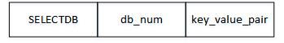

> # Redis数据库结构和持久化 

# 数据库

Redis服务器将所有的数据库都保存在服务器状态redis.h/redisServer结构的db数组中，每个项目都是一个redis.h/redisDb结构，每个redisDb结构代表一个数据库。

```c
struct redisServer {
    //...
    // 一个数组，保存这服务器中的所有数据库
    redisDb *db;
    // 服务器数据库数量
    int dbnum;
    // ...
}
```

服务器初始化的时候，程序会根据服务器状态的dbnum属性来决定创建多少个数据库，这个属性值由redis.conf中配置项database选项决定，值默认是16。

切换数据库使用select +数据库号来切换，默认是0号数据库。例如：select 9。

在服务器内部，客户端状态redisClient结构的db属性记录了客户端当前的目标数据库，这是个指向redisDb结构的指针。

```c
typedef struct redisClient {
    // ...
    // 记录客户端当前正在使用的数据库
    redisDb *db;
    // ...
} redisClient;
```

## 键空间

Redis是一个key-value数据库服务器，而每个数据库都有redis.h/redisDb结构表示，其中dict字典(hash表)保存了数据库中所有的键值对，我们将这个字典成为**键空间（key space）**。

```c
typedef struct redisDb {
	// ...
    // 数据库键空间，保存数据库中的所有键值对
    dict *dict;
    // ...
} redisDb;
```

键空间和用户所见的数据库是直接对应的：

键空间的键也就是数据库的键，每一个键都是一个字符串对象。

键空间的值也就是数据库的值，每个值都可以是字符串对象，列表对象，hash表对象，集合对象和有序对象中的其中一种。

图解：

```
redis> SET message "hello world"
OK
redis> RPUSH alphabet a b c
(integer) 3
redis> HMSET book name "Redis Book" author "xxx" publisher "yyy"
(integer) 3
```


## EXPIRE

- SETEX: 这个命令只能用于字符串对象，在设置值的时候一并设置过期时间。
- EXPIRE key ttl: 用于设置key存活时间ttl秒
- PEXPIRE key ttl: 用于设置key存活时间ttl毫秒
- EXPIREAT key timestamp: 设置key在timestamp所指定的秒数时间戳过期
- PEXPIREAT key timestamp: 设置key在timestamp所指定的毫秒数时间戳过期

命令有多种，但是最终的执行在底层都会全部转换成PEXPIRE命令，即设置key在多少时间戳的时候过期。

过期时间并没有直接维护在键空间dict字典中，想想，键过期之后，我们肯定需要清理内存，这个时候如果一个一个全部遍历所有的键，效率就太低了，因此redis采用了新的字典来保存过期时间。**redisDb结构的expires字典保存了数据库中所有键的过期时间。同样也是dict（hash表）结构**

```c
typedef struct redisDb {
    // ...
    // 过期字典，保存着键的过期时间
    dict *expires;
    // ...
} redisDb;
```

图解


## 过期键的删除策略

既然键会过期，那肯定需要将其移除，避免其一直占用到内存。那么对于怎么删除过期的键，这个问题可能存在以下几种不同的策略，我们先来看一看。

- 定时删除: 在设置键的过期时间的同时，创建一个定时器timer，让定时器在键的过期时间来临时，立即执行对键的删除操作。
- 惰性删除: 放任过期的键不管，但是每次从键空间中获取键时，都检查取得的键是否过期，如果过期的话就删除，如果没有过期就返回。
- 定期删除: 每隔一段时间，程序就对数据库进行一次检查，删除里面的过期键。至于删除多少过期键，以及要检查多少个数据库，由算法来决定。

### 定时删除

定时删除通过使用定时器，该策略可以保证过期键会尽可能快的被删除，并释放过期键所占用的内存。

但是缺点是它对CPU时间是最不友好的，在过期键比较多的情况下，删除键这一行为可能会占用相当一部分CPU时间，在内存不紧张但是CPU时间很紧张的情况下，将CPU时间用在删除和当前任务无关的过期键上，无疑是种浪费。

除此之外，创建一个定时器需要用到Redis服务器中的时间事件，而当前时间事件的实现方式是无需链表，因此并不能高效的处理大量的时间事件，而且还需要创建大量的定时器。

当过期键过多的时候，这种方式有点不太现实。

### 惰性删除

惰性删除策略对CPU时间来说是最又好的，程序只会在取出键时才对键进行过期检查，这可以保证删除过期键的操作只会在非做不可的情况下进行，并且删除的目标仅限于当前键，该策略不会在删除其他无关的过期键上话费任何CPU时间。

但是这种方式也有缺点，就是对内存是最不友好的。想想如果一个键已经过期，而这个键又仍然保存在数据库中，那么只要我们不访问这个键，那么这个键就永远不会被删除，它所占用的内存就不会释放（预防杠精，修正一下，down机等事故不算在内）。

使用此种策略时，如果数据库中存在非常多的过期键，而这些件又恰好没有被访问到，这时redis就呵呵了吧~~

### 定期删除

从上面定时删除和惰性删除来看，这两种方式在单一使用时都有明显的缺陷。

定时删除占用太多CPU时间，影响服务器的响应时间和吞吐量。

多想删除浪费太多内存，有内存泄漏的危险。

定期删除策略当然就是为了折中这俩东西，这种策略采用每隔一段时间执行一次删除过期键的操作，并限制删除操作执行的时长和频率来减少删除对CPU时间的影响。通过定期删除，有效的见啥过期键带来的内存浪费。

那么问题来了，每次执行时长多少合适，频率多少合适呢？如果执行的太频繁或者时间太长，是不是又退化成了定时删除。如果执行的太少，或者时间太短，那么也会出现内存浪费的情况。

因此这种情况，就需要很有经验的大佬来根据情况指定。接下来说说Redis的删除策略。

## Redis的过期键删除策略

Redis服务器在实际使用的是惰性删除和定期删除两种策略，通过配合使用，服务器可以很好的在合理使用CPU时间和避免浪费内存空间之间取得平衡。

其实就是在定期删除实现的同时，在取值的时候也加上过期验证而已，很好理解吧。

## 过期键对RDB、AOF、复制的影响

因为采用了定期删除的策略，因此肯定存在过期了但是还来不及删除的情况，这种情况对于Redis的持久化和主从复制有什么影响呢？呵呵，TM的当然没有影响，有影响就是bug了。

> RDB

如果开启了RDB功能

- 如果是master，载入RDB文件时程序会对文件保存的键进行检查，只载入未过期的键。
- 如果是slave: 载入所有，但是不影响，因为主从服务器在进行同步的时候，从服务器的数据库就会被清空。

> AOF

AOF模式持久化运行时，如果是数据库某个键已经过期，对AOF不会产生影响，AOF一样会将此键记录，当键被删除的时候，程序会向AOF文件追加一条DEL命令，来显示的记录该键已被删除。

AOF重写过程中，和生成RDB文件类似，过期的键不会保存到重写后的AOF文件中。

### 复制

当运行在复制模式下时：

- 主服务器在删除一个过期键之后，会显式的向所有从服务器发送一个DEL命令，告知从服务器删除这个过期键。
- 从服务器再执行客户端发送的读命令时，即使碰到过期键也不会将其删除，当然如果过期了，由于会判断，因此也不会向客户端返回。
- 从服务器只有在接到主服务发来的DEL命令之后，才会删除过期键。

**通过由主服务器来控制从服务器统一地删除过期键，可以保证主从服务器的数据一致性。**

# RDB持久化

生成RDB文件有两个命令。

SAVE: 阻塞服务器进程，阻塞期间不能处理任何命令请求，直到RDB文件创建完毕。

BGSAVE: 派生子进程，由子进程负责创建RDB文件，主进程继续处理命令请求。

RDB文件的载入是在服务器启动的时候自动执行的，所有Redis并没有专门用于载入RDB文件的命令，只要服务器再启动的时候检测到RDB文件存在，就会自动载入RDB文件（AOF未开启的情况下）。

看日志：

```
32188:M 25 Jun 2019 18:34:01.999 # Server initialized
32188:M 25 Jun 2019 18:34:01.999 * DB loaded from disk: 0.000 seconds
32188:M 25 Jun 2019 18:34:01.999 * Ready to accept connections
```

## 自动间隔保存

Redis允许用户通过配置服务器的save选项，让服务器每隔一点时间自动执行一次BGSAVE命令。

用户可以设置多个保存条件，只要其中任一满足，就会执行BGSAVE命令。

举例：

```properties
# 在900秒之内，对数据库至少进行了1次修改
save 900 1
# 在300秒之内，对数据库至少进行了10次修改
save 300 10
# 在60秒之内，对数据库至少进行了10000次修改
save 60 10000
```

服务器redisServer维护了dirty和lastsave属性，用来保存修改计数和上一次执行保存的时间。

```c
struct redisServer {
    // ...
    // 修改计数器
    long long dirty;
    // 上一次执行保存的时间
    time_t lastsave;
    // ...
}
```

每次服务器成功执行一个修改命令之后，程序就会读dirty计数器进行更新。

**为了检查保存条件是否满足，Redis的服务器周期性操作函数serverCron默认每隔100毫秒就会执行一次，该函数用于对正在运行的服务器进行维护，他的其中一项工作就是检查所设置的保存条件是否满足，如果满足，就执行BGSAVE命令。**

## RDB文件结构


- REDIS: 这部分长5个字节，保存着“REDIS” 5个字符，通过这5个字符，程序可以在载入文件时，快速检查所载入文件是否是RDB文件。
- db_version: 长4个字节，它的值是一个字符串表示的整数，记录了RDB的版本号。
- database: 这部分包含着0个或任意多个数据库以及各个数据库中的键值对数据，如果数据库为空，那么这个部分也为空，长度为0字节。
- EOF:  一个常量，长度为1字节，这个常量标志着RDB文件正文内容结束。
- check_sum:  一个8字节无符号整数，保存着一个校验和，通过对之前4个部分的内容进行计算得出的，用啦检查RDB文件是否有出错或者损坏的情况出现。

### databases部分

一个RDB文件的databases部分可以保存任意多个非空数据库。

比如0号和3号数据库非空，那么将创建如下一RDB文件，database 0代表0好数据库中的所有键值对数据，database 3代表3号数据库中的所有键值对数据。 


每个非空数据库database num在RDB文件都可以保存为SELECTDB、db_number、key_value_pair三个部分。



- SELECTDB: 常量，1字节，当程序遇到这个值的时候，就知道即将读入的是一个数据库号码。
- db_num: 保存着一个数据库号码，根据号码的大小不同，这个部分长度科可以是1个2个或5个字节。
- key_value_pair: 保存着所有的键值对。

当读入数据库号码之后，服务器就会调用SELECT命令切换数据库，使得之后读入的键值对可以载入到正确的数据库中。

日常贴个图：


#### key_value_pair

这个部分保存着所有的键值对，如果键值对带有过期时间，那么过期时间也会被保存在内。

不带过期时间的键值对在RDB文件中由TYPE、key、value三部分组成。

带有过期时间的键值对在RDB文件中由EXPIRETIME_MS、ms、TYPE、key、value五部分组成。

日常贴个图。


TYPE表明了当前key的类型（比如REDIS_RDB_TYPE_SET），决定了接下来redis如何读入和解释value数据。

key总是一个字符串对象。

value会根据TYPE类型的不同以及保存内容长度的不同而有所不同，这部分就不一一解释了，喜欢的自己去百度吧。

# AOF持久化

AOF持久化功能的实现可以分为追加（append）、文件写入、文件同步（sync）三个步骤。

## append

当AOF持久化功能打开时，服务器再执行完一个写命令之后，会以**协议的格式**将其追加到服务器状态的aof_buf缓冲区末尾。

```c
struct redisServer {
    // ...
    // AOF缓冲区
    sds aof_buf;
    // ...
}
```

比如：

```
redis> set mKey mValue
OK
```

那么服务器知性温婉之后会将其转成协议的格式，追加到aof_buf缓冲区末尾

```
协议格式
*3\r\n$3\r\nSET\r\n$4\r\nmKey\r\n$6\r\nmValue\r\n
```

## 文件写入和sync

Rdis的服务器进程就是一个事件循环，这个循环中的文件事件负责接收客户端的命令请求，以及向客户端发送命令回复，而时间事件则负责执行想serverCron函数这样需要定时运行的函数。

因为服务器在处理文件事件时可能会执行写命令，使得这些命令内容被追加到aof_buf缓冲区，所有在服务器每次结束一个事件循环之前，他都会调用相应函数（flushAppendOnlyFile），考虑是否需要将aof_buf缓冲区的内容写入和保存到AOF文件中。

**flushAppendOnlyFile函数的行为有服务器配置appendfsync选项的值来决定。**

| appendfsync值 |                           函数行为                           |
| :-----------: | :----------------------------------------------------------: |
|    always     |         将aof_buf缓冲区的所有内容写入并同步到AOF文件         |
|   everysec    | 【系统默认值】将aof_buf缓冲区中的内容写入到AOF文件，如果上次同步AOF文件的时间已经超过一秒钟，那么再次对AOF文件进行同步，并且这个同步操作是由一个线程专门负责执行的 |
|      no       | 将aof_buf缓冲区中的所有内容写入到AOF文件，单并不对AOF文件进行同步，合适同步由操作系统来决定 |

## 载入

**AOF的优先级比RDB高哦！**

因为AOF文件里面包含了重建数据库状态所需的所有写命令，所以服务器只要读入并重新执行一遍AOF文件里面保存的写命令，就可以还原服务器状态了。**因为redis的命令只能在客户端上下文中执行，所以这里需要使用一个伪客户端（fake client）。**

流程图：


## AOF重写

因为AOF持久化是通过保存被执行的写命令来记录数据库状态的，随着服务器运行时间的增加，AOF文件中的内容会越来越多，文件的体积也会越来越大，还原所需的时间也就越多。

比如说一些过期的键，在最开始会被写入，然后后续又会被DEL，又或者我们使用了很多条RPUSH命令来操作一个key的列表数据，等等之类的情况。

这个时候就需要重写AOF文件，使用新的文件替换掉旧的文件。文件的重写不需要对现有的AOF文件进行任何读取分析等操作，而是根据当前数据库状态来实现的。

**当然，如果列表，hash表，集合。，有序集合这四总可能会带有多个元素的键时，会先检查数量，如果过多的话，是会分成多条命令来记录的，而不是单单使用一条命令，REDIS_AOF_REWRITE_ITEMS_PRE_CMD常量的值(64)决定了这个数量，也就是说每条指令最多将写入64个元素，剩下的将继续判断并决定用几条指令来写入**

### 后台重写

AOF的重写也是有子程序执行，这样主程序可以继续执行命令请求。这个时候服务器接收的新的命令也有可能对数据库进行了修改，从而导致当前数据库状态和重写后的AOF文件所保存的数据库状态不一致。

因此Redis服务器设置了一个AOF重写缓冲区，这个缓冲区在服务器创建子进程之后开始使用，当执行完一个写命令之后，它会同时将这个写命令发送给AOF缓冲区和AOF重写缓冲区。

这样一来AOF缓冲区的内容会定期被写入和同步到AOF文件，对现有的AOF文件的处理工作照常进行。

当完成AOF重写工作后，子进程会向父进程发送一个信号，父进程接收到信号之后，调用一个信号函数处理器，并执行以下工作：

1. 将AOF重写缓冲区的所有内容写入到新AOF文件中，这是新AOF文件数据库状态和当前一致。
2. 对新的AOF文件进行重命名，原子的（atomic）覆盖现有的AOF文件，完成新旧AOF文件的替换。

日常流程：

| 时间 |                     服务器进程（父进程）                     |            子进程             |
| :--: | :----------------------------------------------------------: | :---------------------------: |
|  T1  |                          SET k1 v1                           |                               |
|  T2  |                          SET k1 v2                           |                               |
|  T3  |                          SET k1 v3                           |                               |
|  T4  |                 创建子进程，执行AOF文件重写                  |        开始AOF文件重写        |
|  T5  |                          SET k2 v2                           |         执行重写操作          |
|  T6  |                          SET k3 v3                           |         执行重写操作          |
|  T7  |                          SET k4 v4                           | 完成AOF重写，向父进程发送信号 |
|  T8  | 接收到子进程发来的信号，将命令SET k2 v2，SET k3 v3，SET k4 v4追加到新的AOF文件末尾 |                               |
|  T9  |                   用新AOF文件覆盖旧AOF文件                   |                               |


   over~~~