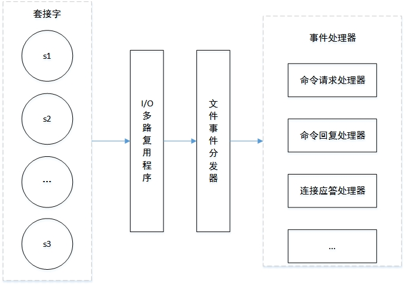
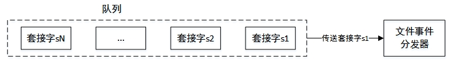
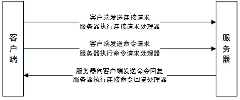
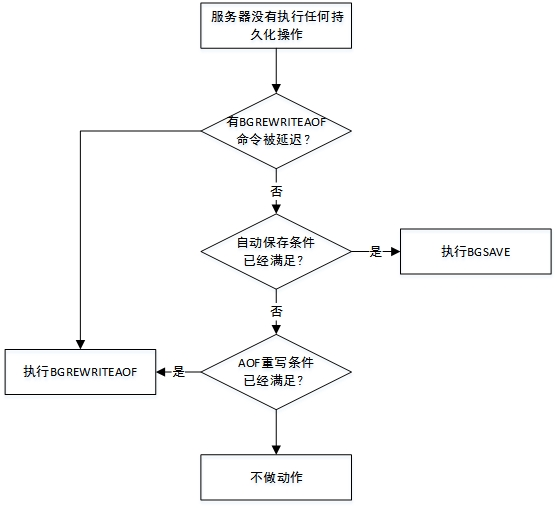

> # Redis事件和服务器

# 事件

Redis是个单线程的，但是速度非常快，其主要原因是因为它是基于事件的，是一个事件驱动程序，了解NIO的应该都知道这种方式。

Redis服务器需要处理两类事件。

- 文件事件(file event): Redis服务器通过套接字与客户端进行连接，而**文件事件就是服务器对套接字操作的抽象。**服务器与客户端的通信会产生相应的文件事件，而服务器通过监听并处理这些事件来完成一系列网络通信操作。
- 时间事件(file event): Redis服务器中的一些操作（比如serverCron函数）需要在给定的时间点执行，而时间事件就是服务器对这类定时操作的抽象。

## 文件事件

Redis基于Reactor模式开发了自己的网络事件处理器，则个处理器被称为文件时间处理器（file event handler）: 

- 文件事件处理器采用I/O多路复用（multiplexing）程序来同时监听多个套接字，并根据套接字目前崭新的任务来为套接字关联不同的事件处理器。
- 当被监听的套接字准备好连接应答（accept），读取（read），写入（write），关闭（close）等操作时，与操作对应的文件事件就会产生，这是文件时就处理器就会调用套接字之前关联号的事件处理器来处理这些事件。

### 构成

文件时间处理器由四个部分组成，分别是套接字。I/O多路复用程序，文件事件分发器（dispatcher）和事件处理器。



文件事件是对套接字操作的抽象，每当一个套接字准备好执行连接应答，写入，读取，关闭等操作时，就会产生一个文件时间。因为一个服务器会连接多个套接字，所有文件事件可能并发出现。

I/O多路复用程序负责监听多个套接字，并向文件事件分发器传送那些产生了时间的套接字。I/O多路复用程序总是将所有产生时间的套接字放到一个队列里面，然后通过这个队列，以有序，同步，每次一个套接字的方式向文件时间分发器传送套接字。



文件事件分发器接收I/O多路复用程序传来的套接字，并根据套接字产生的时间类型，调用相应的事件处理器。

服务器会为执行不同的任务的套接字关联不同的事件处理器，这些处理器是一个个函数，它们定义某个时间发生时，服务器应该执行的操作。

> Tips: Redis的I/O多路复用程序的所有功能都是通过包装常见的select，epoll，evport和kqueue这些I/O多路复用函数库来实现的，并且为每个多路复用函数库都实现了相同的API，因此底层是可以互换的。在编译的时候，会自动选择系统中性能最高的I/O多路复用函数库来作为底层实现。

客户端发起请求示例：



## 时间事件

Redis的时间事件也有两类：

- 定时事件: **让一段程序在指定的时间之后执行一次**。
- 周期性事件: **让一段程序每隔指定时间就执行一次。**

**所有的时间事件都放在一个无序链表中，每当事件执行器运行时，它就遍历整个链表，查找所有已到达的时间事件，并调用相应的事件处理器。（这里的无序是指事件到达时间无序）**

## serverCron函数

serverCron函数负责定期对Redis的资源和状态进行检查和调整，主要工作包括：

- 更新服务器的各类统计信息，比如时间，内存占用，数据库占用情况等。
- 清理数据库中的过期键值对。
- 关闭和清理连接失效的客户端。
- 尝试进行AOF或RDB持久化操作。
- 如果是master，那么对从服务进行定期同步。
- 如果处于cluster，对集群进行定期同步和连接测试。

**该函数默认执行时间是每秒10次，可以通过调整配置hz的值来改变，这个值代表的是每秒执行的次数哦！**

```properties
hz 10
```

> 更新服务器时间缓存

Redis服务器中有不少功能要获取系统当前时间，而每次获取都需要执行一次系统调用，为了减少系统调用次数，服务器状态中额unixtime属性和mstime被用作当前时间缓存。

```c
struct redisServer {
    // ...
    // 保存秒级进度的系统当前UNIX时间戳
    time_t unixtime;
    // 保存毫秒级进度的系统当前UNIX时间戳
    long long mstime;
    // ...
};
```

因为函数每秒运行10次，100毫秒一次，所以这两个属性的精确度不高。

- 服务器只会在打印日志，更细那服务器的LRU时钟，决定好似否执行持久化任务、计算服务器上线时间这类对时间精确度要求不高的功能上。
- 对于为键设置过期时间，添加慢查询日志这种需要高精确度时间的功能来说，服务器还是会再次执行系统调用，从而获得最准确的系统当前时间。

> 更新LRU时钟

服务器状态中的lruclock属性保存了服务器的LRU始终，这个属性也是服务器时间缓存的一种，用来计算对象空转时长。

```c
struct redisServer {
    // ...
    // 默认每秒更新一次
    unsigned lruclock:22;
    //...
}
```

每个redis对象有lru属性，这个属性保存了对象最后一次被命令访问的时间。

空转时间=lruclock - lru.

命令：

```
OBJECT IDLETIME key: 查看对象空转时长
INFO server: 可以输出server中lruclock的值
```

> 更新服务器每秒执行命令次数

```
redis> INFO stats
# Stats
...
instantaneous_ops_per_sec: 558
...
```

以上命令结果显示，在最近一秒之内，服务器大概处理了558个命令。

> 更新服务器内存峰值记录

服务器stat_peak_memory属性记录了服务器内存峰值大小。

```
redis> INFO memory
# Memory
...
used_memory_peak:6180016
used_memory_peak_human:5.89M
...
```

以上命令查看内存峰值大小。

> 处理SIGTERM信号

启动服务器时，Redis会为进程的SIGTERM信号关联处理器（一个函数），这个信号处理器负责在服务器接收到SIGTERM信号时，打开服务器状态的shutdown_asap标识。

每次serverCron函数运行时，程序都会对服务器状态的shutdown_asap属性进行检查，如果值为1，则服务器会先进行RDB持久化操作，然后关闭服务器。

> 管理客户端资源

主要是检查客户端：

- 如果客户端与服务器之间连接已经超时，则释放这个客户端。
- 如果客户端在上一次执行命令请求之后，输入缓冲区的大小超过了一定长度，那么程序或释放客户端当前的输入缓冲区，并重新创建一个默认大小的输入缓冲区，从而防止客户端你的输入缓冲区耗费过多的内存。

> 管理数据库资源

这个部分就主要是检查服务器中的一部分数据库，删除其中的过期键，并在有需要时，对字典（hash表）进行收缩操作。

> 执行被延迟的BGREWRTEAOF

在服务器执行BGSAVE命令期间，如果客户端向服务器发来BGREWRITEAOF命令，那么服务器会将BGREWRITEAOF命令的执行时间延迟到BGSAVE命令执行完毕之后。

服务器的aof_rewrite_scheduled属性记录了是否延迟了BGREWRITEAOF命令。

```c
struct redisServer {
    // ...
    // 值为1表示有BGREWRITEAOF命令被延迟了
    int aof_rewrite_scheduled;
    // ...
}
```

serverCron命令运行时都会检查BGSAVE和BGREWRITEAOF命令是否在执行，如果都没有执行，那么检查服务器的aof_rewrite_scheduled属性，如果值为1，那么就执行延迟的BGREWRITEAOF命令.

> 检查持久化操作的运行状态

服务器状态使用rdb_child_pid和aof_child_pid属性记录执行BGSAVE命令和BGREWRITEAOF命令的子进程ID，这两个属性也可以用于检查对应命令是否正在执行：

```c
struct redisServer {
    // ...
    // 记录执行BGSAVE命令的子进程ID
    // 如果没有执行，值为-1
    pid_t rdb_child_pid;
    // 记录执行BGREWRITEAOF命令的子进程ID
    // 如果没有执行，值为-1
    pid_t aof_child_pid;
    // ...
}
```

serverCron函数每次执行时，程序都会检查这两个属性的值，只要其中一个属性不为-1，程序就会检查子进程是否有信号发来服务器进程（调用其他函数）。

- 如果有信号到达，那么表示新的RDB文件已经生成完毕或者AOF文件已经重写完毕，服务器需要进行后续操作，比如新的AOF替换旧的AOF文件。
- 如果没有信号到达，表示持久化操作未完成，程序不做动作。

如果这两个属性的值都为-1，那么做三个检查：

- 检查是否有BGREWRITEAOF命令被延迟，如果有， 开始执行命令。
- 检查自动保存条件是否满足，如果满足，且服务器当前没有执行其他持久化操作，那么开始一次新的BGSAVE操作（因为上个检查可能会引发一次新的BGREWRITEAOF，所有这次检查中，程序会再次确认是否已经在执行持久化操作了）。
- 检查服务器设置的AOF重写条件是否满足，如果条件满足，并且服务器没有执行其他持久化操作，那么开始一次新的BGREWRITEAOF操作（也会挨次确认，因为上两个检查都可能会引发新的持久化操作）。

图解：



> 将AOF缓冲区的内容写入AOF文件

如果服务器开启了AOF持久化功能，并且AOF缓冲区里面还有待写入的数据，那么serverCron函数会调用相应的程序，将AOF缓冲区中的内容写入到AOF文件。

> 关闭异步客户端

这一步，服务器会关闭输出缓冲区大小超出限制的客户端。

客户端的输入缓冲区用于把醋你客户端发送的命令请求：

```c
typedef struct redisClient {
    // ...
    sds querybuf;
    // ...
}
```

这个缓冲区中保存的是协议的值。

```
set mKey mValue
querybuf的值为
*3\r\n$3\r\nSET\r\n$4\r\nmKey\r\n$6\r\nmValue\r\n
```

输入缓冲区的大小会根据内容动态的缩小或者扩大，但它的值不能超过1G，否则服务器将关闭这个客户端。

> 增加cronloops计数器的值

服务器状态的cronloops属性记录了serverCron函数执行的次数

```c
struct redisServer {
    // ...
    // serverCron函数没执行一次，值就加1
    int cronloops;
    // ...
}
```

这个属性目前在服务器中的唯一作用，就是在复制模块中实现没执行N次就执行一次指定代码的功能。

```c
if (cronloops % n == 0) {
    // 指定代码，这个指定的代码应该是服务器处理的一些事了，每隔多少次就处理一次
}
```

# 服务器

## 命令请求过程

命令请求的时候，在客户端输入命令的时候，客户端会将这个命令转换成协议，然后将协议内容发送给服务器。

### 协议格式

```
*<参数数量> CR LF
$<参数 1 的字节数量> CR LF
<参数 1 的数据> CR LF
...
$<参数 N 的字节数量> CR LF
<参数 N 的数据> CR LF

注意：CRLF就是换行 \r\n
```

### socket发送协议

我们先来试试：

```
cmd:
set mKey mValue
protocal:
*3\r\n$3\r\nSET\r\n$4\r\nmKey\r\n$6\r\nmValue\r\n
```

然后我们直接用java socket来发送协议给服务器。

```java
public static void main(String[] args) throws Exception {
	Socket socket = new Socket("192.168.2.11", 16379);
	//获取输出流，向socket写数据
	OutputStream outputStream = socket.getOutputStream();
	PrintWriter printWriter = new PrintWriter(outputStream);
	printWriter.print("*3\r\n$3\r\nSET\r\n$4\r\nmKey\r\n$6\r\nmValue\r\n");
	printWriter.flush();
	//关闭输出流
	socket.shutdownOutput();

	//读取服务器返回的socket的数据
	InputStream inputStream = socket.getInputStream();
	InputStreamReader inputStreamReader = new InputStreamReader(inputStream);
	BufferedReader bufferedReader = new BufferedReader(inputStreamReader);
	String info = "";
	String temp = null;
	while ((temp = bufferedReader.readLine()) != null) {
		info += temp;
		System.out.println("客户端接收服务端发送信息：" + info);
	}

	//关闭相对应的资源
	bufferedReader.close();
	inputStream.close();
	printWriter.close();
	outputStream.close();
	socket.close();
}
```

执行结果：

```
客户端接收服务端发送信息：+OK

Process finished with exit code 0
```

上服务器检查是否有值：

```
redis> get mKey
"mValue"
```

## 服务器初始化过程

### 初始化服务器状态

第一步就是创建一个strct redisServer类型的实例变量作为服务器状态，并为结构中的各个属性设置默认值。主要包括以下部分：

- 设置服务器的运行ID。
- 设置服务器的默认运行频率。
- 设置服务器的默认配置文件路径。
- 设置服务器的运行架构。
- 设置服务器的默认端口号。
- 设置服务器的默认RDB持久化条件和AOF持久化条件。
- 初始化服务器的LRU时钟。
- 创建命令表。

当初始化之后，就进入下一步，载入配置项。

### 载入配置项

在启动服务器时，用户可以通过给定配置参数或者指定配置文件来修改服务器的默认配置，比如

redis-server --port 16379

那么我们就通过给定配置参数的方式修改了服务器的运行端口号，当然也可以在配置文件中配置。

**如果用户为某些属性设置了新值，那么服务器就使用用户指定的值来更新相应的属性，如果没有设置新值，那么就是用上一步初始化的默认值。**

载入配置后，进入下一步，初始化服务器数据结构。

### 初始化服务器数据结构

在第一步的时候，服务器只创建了命令表一个数据结构，除了命令表之外，服务器还包括其他数据结构，比如server.clients链表，server.db数组等。

除了初始化这些数据结构之外，还需要做一些重要的设置操作，包括：

- 为服务器设置进程信号处理器。
- 创建共享对象，比如包含"OK"，"ERR"回复的字符串对象。
- 打开服务器的监听端口，并未监听套接字关联连接应答处理器，等待服务器正式运行时接受客户端的连接。
- 为serverCron函数创建时间事件，等待服务器正式运行时执行serverCron函数。
- 如果AOF持久化功能打开，那么打开现有的AOF文件，如果不存在，那么创建一个新的AOF文件，并未AOF写入做好准备。
- 初始化服务器的后台I/O模块，为将来的I/O操作做好准备。

这步操作完成之后，进入下一步，还原数据库状态。

### 还原数据库状态

在完成率server变量的初始化之后，服务器还需要载入RDB文件或者AOF文件，并根据文件记录的内容来还原服务器的数据库状态。**RDB文件的优先级没有AOF文件高！有AOF文件的话RDB文件就不会被使用了。**

- 如果启用了AOF持久化功能，那么服务器使用AOF文件来还原数据库状态。
- 如果没有启用AOF持久化功能，那么使用RDB文件来还原数据库状态。

数据库状态还原之后，开始执行最后一步，执行事件循环。

### 执行事件循环

这是初始化的最后一步，服务器开始执行服务器的事件循环（loop），这个时候服务器的初始化就完成了，可以开始接受客户端的连接请求，并处理客户端发来的命令请求了。


over~~~

