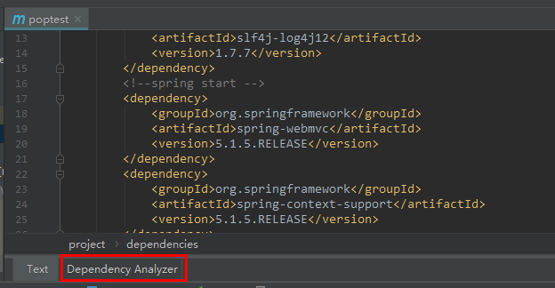

>  ***IDEA插件，内容来源于各个网络内容的综合选取，各插件的使用方式和功能都可以在setting->plugins里面找到插件看介绍或者自行百度吧***
>
>  ****

# 1. activate-power-mode 和 Power mode II

根据Atom的插件activate-power-mode的效果移植到IDEA上，写代码的时候有特效，整个屏幕都在抖动，activate-power-mode是白的的，Power mode II色彩更酷炫点，个人感觉除了装X没啥卵用（主要是我TM电脑带不动啊，操蛋。。。）。代码特效如图：


# 2.Background Image Plus +

idea背景修改插件，让你的idea与众不同，可以设置自己喜欢的图片作为code背景。
安装成功之后重启，菜单栏的VIew标签>点击Set Background Image(没安装插件是没有这个标签的)，在弹框中路由选择到本地图片，点击OK即可。（图片来源于网络，我TM有点懒，不想去改，因为原版黑色很骚气。）


# 3.Grep console

自定义日志颜色，idea控制台可以彩色显示各种级别的log，安装完成后，在console中右键就能打开，可以选择指定的内容添加高亮，显示样式。


也可以设置不同的日志级别的显示样式，等操作。（其实就是指定关键字设置而已，跟选择关键词添加高亮效果是一样的，只不过日志级别这种它给你预设了而已，看图中红框框着的，就是我上一个图中选择指定内容添加的高亮）。


可以直接根据关键字搜索你想要的，搜索条件是支持正则表达式的。


# 4.Free Mybatis plugin

mybatis 插件，让你的mybatis.xml像java代码一样编辑。我们开发中使用mybatis时时长需要通过mapper接口查找对应的xml中的sql语句，该插件方便了我们的操作。
安装完成重启IDEA之后，我们会看到code左侧或多出一列南瓜(本来应该是绿色的箭头，南瓜是我自己改的），点击它我们就可以直接在xml和mapper之间来回切换。
mapper


xml


# 5.MyBatis Log Plugin

Mybatis现在是java中操作数据库的首选，在开发的时候，我们都会把Mybatis的脚本直接输出在console中，但是默认的情况下，输出的脚本不是一个可以直接执行的，参数是用问号表示的，如果我们想直接执行，还需要在手动转化一下。


MyBatis Log Plugin 这款插件是直接将Mybatis执行的sql脚本显示出来，无需处理，我们可以很清晰的看到我们执行了哪些sql脚本，而且脚本可以直接复制出来执行的，如图：（能够被提取的sql是有要求的，自行看该插件的介绍）


# 6.String Manipulation

强大的字符串转换工具。使用快捷键，Alt+m。

```
切换样式（camelCase, hyphen-lowercase, HYPHEN-UPPERCASE, snake_case, SCREAMING_SNAKE_CASE, dot.case, words lowercase, Words Capitalized, PascalCase）
转换为SCREAMING_SNAKE_CASE (或转换为camelCase)
转换为 snake_case (或转换为camelCase)
转换为dot.case (或转换为camelCase)
转换为hyphen-case (或转换为camelCase)
转换为hyphen-case (或转换为snake_case)
转换为camelCase (或转换为Words)
转换为camelCase (或转换为lowercase words)
转换为PascalCase (或转换为camelCase)
选定文本大写
样式反转
```

# 7.Alibaba Java Coding Guidelines

阿里巴巴代码规范检查插件，当然规范可以参考《阿里巴巴Java开发手册》。

# 8.Lombok

去看我另一篇lombok分组下的的博客吧！不介绍了。

安装完成之后，在应用Lombok的时候注意别忘了需要添加依，maven为例：

```xml
<dependency>  
          <groupId>org.projectlombok</groupId>  
          <artifactId>lombok</artifactId>   
</dependency>
```

```java
@Setter
@Getter
@ToString
@EqualsAndHashCode
public class People {
    private String name;
    private int age;
    private String male;
}
```

# 9.Key promoter X

Key promoter X是IntelliJ IDEA的快捷键提示插件，会统计你鼠标点击某个功能的次数，右下角会提示你应该用什么快捷键，帮助记忆快捷键，等熟悉了之后可以关闭掉这个插件。


# 10.Gsonformat

可根据json数据快速生成java实体类。

自定义个javaBean(无任何内容，就一个空的类)，复制你要解析的Json，然后按get/set的快捷键弹出如下界面或者直接使用快捷键 Alt+S，在里面粘贴刚刚复制的Json，点击OK即可。此操作不会覆盖类里面原有的属性。


# 11.Restfultookit

Spring MVC网页开发的时候，我们都是通过requestmapping的方式来定义页面的URL地址的，为了找到这个地址我们一般都是cmd+shift+F的方式进行查找，大家都知道，我们URL的命名一个是类requestmapping+方法requestmapping，查找的时候还是有那么一点不方便的，restfultookit就能很方便的帮忙进行查找。

例如：我要找到/user/add 对应的controller,那么只要Ctrl+反斜杠或者ctrl+alt+N（这俩是默认快捷键） ,


就能直接定位到我们想要的controller。这个也是真心方便，当然restfultookit还为我们提供的其他的功能（具体可以去setting->plugin里面看该插件的介绍和使用）。（右侧restServices菜单）根据我们的controller帮我们生成默认的测试数据，还能直接调用测试，这个可以是解决了我们每次postman调试数据时，自己傻傻的组装数据的的操作，这个更加清晰，比在console找数据包要方便多了，如图：。


# 12.maven Helper

分析依赖冲突插件 

此插件可用来方便显示maven的依赖树，在没有此插件时，如果想看maven的依赖树需要输入命令行： mvn dependency:tree  才可查看依赖。如果想看是否有依赖包冲突的话也需要输入命令行等等的操作。而如果安装Maven Helper插件就可免去命令行困扰。通过界面即可操作完成。  

使用方式：  打开项目中的pom文件，在底部会显示一个“Dependency Analyzer”




# 12.JRebel

JRebel是一种热部署生产力工具，修改代码后不用重新启动程序，所有的更改便可以生效。它跳过了Java开发中常见的重建、重新启动和重新部署周期。
使用自己百度吧，我TM都没用过，这条是复制过来的。(￣_￣)

# 13.常用插件推荐

|插件名称|插件介绍|官网地址|
|------|------|------|
|Gitee|开源中国的码云插件|https://plugins.jetbrains.com/plugin/8383-gitee|
|AlibabaJavaCodingGuidelines|阿里巴巴出的代码规范检查插件|https://plugins.jetbrains.com/plugin/10046-alibaba-java-coding-guidelines|
|IDEFeaturesTrainer|IntelliJIDEA官方出的学习辅助插件|https://plugins.jetbrains.com/plugin/8554?pr=idea|
|Keypromoter|快捷键提示|https://plugins.jetbrains.com/plugin/4455?pr=idea|
|GrepConsole|自定义设置控制台输出颜色|https://plugins.jetbrains.com/idea/plugin/7125-grep-console|
|StringManipulation|驼峰式命名和下划线命名交替变化|https://plugins.jetbrains.com/plugin/2162?pr=idea|
|CheckStyle-IDEA|代码规范检查|https://plugins.jetbrains.com/plugin/1065?pr=idea|
|FindBugs-IDEA|潜在Bug检查|https://plugins.jetbrains.com/plugin/3847?pr=idea|
|MetricsReloaded|代码复杂度检查|https://plugins.jetbrains.com/plugin/93?pr=idea|
|Statistic|代码统计|https://plugins.jetbrains.com/plugin/4509?pr=idea|
|JRebelPlugin|热部署|https://plugins.jetbrains.com/plugin/?id=4441|
|CodeGlance|在编辑代码最右侧，显示一块代码小地图|https://plugins.jetbrains.com/plugin/7275?pr=idea|
|GsonFormat|把JSON字符串直接实例化成类|https://plugins.jetbrains.com/plugin/7654?pr=idea|
|MarkdownNavigator|书写Markdown文章|https://plugins.jetbrains.com/plugin/7896?pr=idea|
|EclipseCodeFormatter|使用Eclipse的代码格式化风格，在一个团队中如果公司有规定格式化风格，这个可以使用。|https://plugins.jetbrains.com/plugin/6546?pr=idea|
|Jindent-SourceCodeFormatter|自定义类、方法、doc、变量注释模板|http://plugins.jetbrains.com/plugin/2170?pr=idea|
|Translation|翻译插件|https://github.com/YiiGuxing/TranslationPlugin|
|MavenHelper|Maven辅助插件|https://plugins.jetbrains.com/plugin/7179-maven-helper|
|PropertiestoYAMLConverter|把Properties的配置格式改为YAML格式|https://plugins.jetbrains.com/plugin/8000-properties-to-yaml-converter|
|GitFlowIntegration|GitFlow的图形界面操作|https://plugins.jetbrains.com/plugin/7315-git-flow-integration|
|RainbowBrackets|对各个对称括号进行着色，方便查看|https://github.com/izhangzhihao/intellij-rainbow-brackets|
|MybatisX|mybatis框架辅助（免费）|https://plugins.jetbrains.com/plugin/10119-mybatisx|
|LombokPlugin|Lombok功能辅助插件|https://plugins.jetbrains.com/plugin/6317-lombok-plugin|
|.ignore|各类版本控制忽略文件生成工具|https://plugins.jetbrains.com/plugin/7495--ignore|
|mongo4idea|mongo客户端|https://github.com/dboissier/mongo4idea|
|iedis|redis客户端|https://plugins.jetbrains.com/plugin/9228-iedis|
|GenerateAllSetter|newPOJO类的快速生成set方法|https://plugins.jetbrains.com/plugin/9360-generateallsetter|
|SonarLint|sonar插件|https://plugins.jetbrains.com/plugin/7973-sonarlint|
